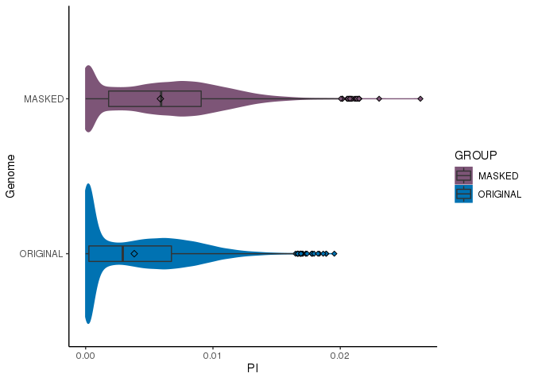
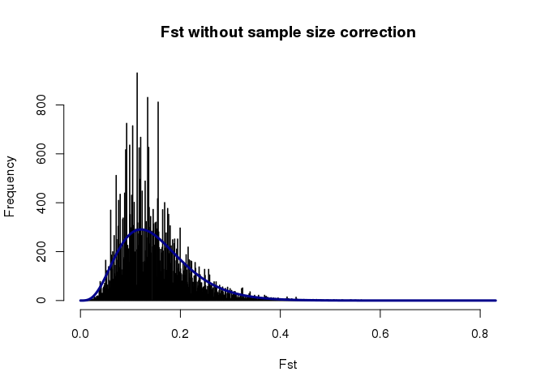

Oyster_Genone_Comparative_Analysis
================
Jon Puritz
8/1/2022

## Initial Setup

Clone Repo

``` bash
git clone https://github.com/The-Eastern-Oyster-Genome-Project/2022_Eastern_Oyster_Haplotig_Masked_Genome.git
```

Change into repo directory

``` bash
cd 2022_Eastern_Oyster_Haplotig_Masked_Genome
mkdir -p Masked
mkdir -p Original
cd Original
```

Download original genome

``` bash
source activate HMASK
wget https://ftp.ncbi.nlm.nih.gov/genomes/all/GCF/002/022/765/GCF_002022765.2_C_virginica-3.0/GCF_002022765.2_C_virginica-3.0_genomic.fna.gz
gunzip GCF_002022765.2_C_virginica-3.0_genomic.fna.gz 

sed 's/NC_035789.1/NC_035779.1/' GCF_002022765.2_C_virginica-3.0_genomic.fna | seqkit sort -N - -w0 | seqkit seq -u -w 0 | sed 's/NC_035779.1/NC_035789.1/' > reference.fasta
cd ../Masked
```

Download the masked genome

``` bash
wget https://github.com/The-Eastern-Oyster-Genome-Project/2022_Eastern_Oyster_Haplotig_Masked_Genome/raw/main/Haplotig_Masking/Output/Masked_Genome/reference.masked.fasta.gz
gunzip -c reference.masked.fasta.gz > reference.fasta
cd ..
```

## BUSCO Evaluation

Create Conda environment

``` bash
conda create --name busco --file ../other_files/busco_env.txt
```

Break reference genome into its original contigs

``` bash
cd Original
wget https://ftp.ncbi.nlm.nih.gov/genomes/all/GCF/002/022/765/GCF_002022765.2_C_virginica-3.0/GCF_002022765.2_C_virginica-3.0_genomic_gaps.txt.gz
gunzip GCF_002022765.2_C_virginica-3.0_genomic_gaps.txt.gz

mawk '{new=$2-1;print $1 "\t" new "\t" $3}' GCF_002022765.2_C_virginica-3.0_genomic_gaps.txt | mawk '!/#/' > gaps.bed

samtools faidx /reference.fasta
mawk -v OFS='\t' {'print $1,$2'} reference.fasta.fai > genome.file
mawk '{print $1 "\t" "0" "\t" $2-1}' genome.file > genome.bed
bedtools subtract -b gaps.bed -a genome.bed > contigs.bed
bedtools getfasta -fi reference.fasta -bed contigs.bed | sed 's/-/./g' | sed 's/:/./g ' > contigs.fasta
cd ..
```

Download the primary contigs from the masked genome

``` bash
cd Masked
wget https://github.com/The-Eastern-Oyster-Genome-Project/2022_Eastern_Oyster_Haplotig_Masked_Genome/raw/main/Haplotig_Masking/Output/primary.contigs.fasta.gz
gunzip primary.contigs.fasta.gz
cd ..
```

Download the two latest version of the *C. gigas* genome for comparison

``` bash
mkdir -p Gigas
cd Gigas
wget -O - https://ftp.ncbi.nlm.nih.gov/genomes/all/GCA/011/032/805/GCA_011032805.1_ASM1103280v1/GCA_011032805.1_ASM1103280v1_genomic.fna.gz | gunzip -c  > gigas_IOCAS.fasta
wget -O - https://ftp.ncbi.nlm.nih.gov/genomes/all/GCA/902/806/645/GCA_902806645.1_cgigas_uk_roslin_v1/GCA_902806645.1_cgigas_uk_roslin_v1_genomic.fna.gz | gunzip -c  > gigas_roslin.fasta
cd ..
```

Run BUSCO

``` bash
source activate busco
cd Output/BUSCO
export BUSCO_CONFIG_FILE=../../../other_files/myconfig.ini
busco -m genome -i ../../../Original/contigs.fasta -o original_contigs -l mollusca_odb10 --cpu 48
busco -m genome -i ../../../Original/reference.fasta -o original_reference -l mollusca_odb10 --cpu 48
busco -m genome -i ../../../Masked/reference.fasta -o masked_genome -l mollusca_odb10 --cpu 48
busco -m genome -i ../../../Masked/primary.contigs.fasta -o masked_primary_contigs -l mollusca_odb10 --cpu 48

busco -m genome -i ../../../Gigas/gigas_IOCAS.fasta -o ASM1103280v1 -l mollusca_odb10 --cpu 48
busco -m genome -i ../../../Gigas/gigas_roslin.fasta -o cgigas_uk_roslin_v1 -l mollusca_odb10 --cpu 48
cd ..
cd ..
```

``` bash
mkdir -p Output/BUSCO/Summaries
cd Output/BUSCO
cp original_reference/short_summary.*txt ./Summaries
cp original_contigs/short_summary.*txt ./Summaries
cp masked_genome/short_summary.*txt ./Summaries
cp masked_primary_contigs/short_summary.*txt ./Summaries
mkdir -p Gigas_Comparison
cp ASM1103280v1/short_summary.*txt ./Gigas_Comparison
cp cgigas_uk_roslin_v1/short_summary.*txt ./Gigas_Comparison
cp masked_genome/short_summary.*txt ./Gigas_Comparison
cp original_reference/short_summary.*txt ./Gigas_Comparison
```

``` bash
source activate busco
cd Output/BUSCO
python ~/miniconda3/envs/busco/bin/generate_plot.py -wd Summaries
sed -i 's/original_contigs/Original Contigs/g' ./Summaries/busco_figure.R
sed -i 's/original_reference/Original Genome/g' ./Summaries/busco_figure.R
sed -i 's/masked_genome/Masked Genome/g' ./Summaries/busco_figure.R
sed -i 's/masked_primary_contigs/Masked Primary (Non-haplotig) Contigs/g' ./Summaries/busco_figure.R
Rscript ./Summaries/busco_figure.R
cp ./Summaries/busco_figure.png ../Figures/Supplemental/Figure.S2.BUSCO.png
```

Output figure from `BUSCO` 

``` bash
source activate busco
cd Output/BUSCO
python ~/miniconda3/envs/busco/bin/generate_plot.py -wd Gigas_Comparison
sed -i 's/ASM1103280v1/C. gigas (Qi et al. 2021)/g' ./Gigas_Comparison/busco_figure.R
sed -i 's/original_reference/C. virginica Original Genome/g' ./Gigas_Comparison/busco_figure.R
sed -i 's/masked_genome/C. virginica Masked Genome/g' ./Gigas_Comparison/busco_figure.R
sed -i 's/cgigas_uk_roslin_v1/C. gigas (Peñaloza et al. 2021)/g' ./Gigas_Comparison/busco_figure.R
Rscript ./Gigas_Comparison/busco_figure.R
cp ./Gigas_Comparison/busco_figure.png ../Figures/Supplemental/Figure.S3.Gigas_BUSCO.png
```

Output figure from `BUSCO`  \## Download
sequence files

### Create environment for sra-tools

``` bash
cd ../../../
conda create --name sra-tools --file ../other_files/sra-env.txt
```

### Download files from SRA

``` bash
source activate sra-tools
cd ./Masked
for i in `cut -f1 ../other_files/SRA_Metadata.tsv | grep -v acce`;
do
fasterq-dump $i -p -e 16 --qual-defline "+"
gzip ${i}_1.fastq
gzip ${i}_2.fastq
done
```

Rename files

``` bash
NAMES=( `cut -f6  ../other_files/SRA_Metadata.tsv | grep -v sample_name `)
NAMES2=( `cut -f1 ../other_files/SRA_Metadata.tsv | grep -v acce`)
LEN=( `grep -v acce ../other_files/SRA_Metadata.tsv | wc -l `)
LEN=$(($LEN - 1))

for ((i = 0; i <= $LEN; i++));
do
mv ${NAMES2[$i]}_1.fastq.gz ${NAMES[$i]}.F.fq.gz
mv ${NAMES2[$i]}_2.fastq.gz ${NAMES[$i]}.R.fq.gz
done
```

## Run variant calling

Run modified dDocent pipeline **but make sure to change number of
processors to match your machine and your email address**

``` bash
source activate HMASK
bash ../scripts/dDocent_ngs ../other_files/config
```

Wait for code to finsh (will take a few days)

## Filter variant calls **Note** 40 is the number of processors

``` bash
source activate HMASK
cd raw.vcf
bash ../../../scripts/PVCF_filter.sh MASKED 40 
```

## Run and filter original

``` bash
source activate HMASK
cd ../Original
ln -s ../Masked/*.fq.gz .
bash ../scripts/dDocent_ngs ../other_files/config
cd raw.vcf
bash ../../../scripts/PVCF_filter.sh ORIG 40 
```

## Structural Variant Calling

``` bash
conda create --name delly --file ../other_files/delly.txt
cd Masked
source activate delly
ls *-RGmd.bam | sed 's/-RGmd.bam//g'| parallel -j 40 "delly call -x repeats.bed -o {}.bcf -g reference.fasta {}-RGmd.bam"
delly merge -o sites.bcf *.bcf
ls *-RGmd.bam | sed 's/-RGmd.bam//g'| parallel "delly call -x repeats.bed -o {}.geno.bcf -g reference.fasta -v sites.bcf {}-RGmd.bam"
bcftools merge --threads 40 -m id -O b -o merged.bcf *_*.geno.bcf

bcftools view --threads 40 -S ../other_files/filter.set merged.bcf -o no.inbred.sv.bcf -O b
bcftools index --threads 40 no.inbred.sv.bcf

delly filter -f germline -o germline.sv.bcf no.inbred.sv.bcf

bcftools view --threads 40 germline.sv.bcf -i 'FILTER == "PASS" & SVTYPE == "INV" ' | bcftools query -f '%CHROM\t%POS\t%END\t%ID\n' | mawk '{print $1 "\t" $2-1 "\t" $3-1 "\t" $4}' > delly.inversions.masked.bed

bedtools merge -i delly.inversions.masked.bed > delly.merged.inversions.masked.bed

bcftools view -f "PASS" -i 'F_MISSING==0'  germline.sv.bcf |bcftools +setGT -- -t q -n . -i 'FORMAT/FT="LowQual"'  | bcftools +fill-tags| bcftools view -i 'F_MISSING==0' |bcftools query -f '%CHROM\t%POS\t%END\t%ID\t%SVTYPE\n' | mawk '{print $1 "\t" $2-1 "\t" $3-1 "\t" $4 "\t" $5 "\t" $3 - $2}' > sv.full.nomissing.bed

bcftools view -f "PASS" germline.sv.bcf | bcftools query -f '%CHROM\t%POS\t%END\t%ID\t%SVTYPE\n' | mawk '{print $1 "\t" $2-1 "\t" $3-1 "\t" $4 "\t" $5 "\t" $3 - $2}' > sv.full.bed

bcftools view -f "PASS" -i 'F_MISSING==0'  germline.sv.bcf | bcftools +setGT -- -t q -n . -i 'FORMAT/FT="LowQual"' | bcftools +fill-tags| bcftools view -i 'F_MISSING==0' | bcftools query -f '%ID\n' > filtered.sv.sites

bcftools view --threads 40 -i "ID=@filtered.sv.sites" merged.bcf -O b -o filtered.sv.bcf

bcftools view -f "PASS" -i 'SVTYPE == "DEL" || SVTYPE == "DUP" ' filtered.sv.bcf | bcftools query -f '%CHROM\t%POS\t%ID\t[%RDCN\t]\n' > masked.cnv.tab

bcftools view -f "PASS" -i 'SVTYPE == "DEL" || SVTYPE == "DUP" ' filtered.sv.bcf | bcftools query -f '%CHROM\t%POS\t%END\t%ID\n' | mawk '{print $1 "\t" $2-1 "\t" $3-1 "\t" $4}' > delly.cnv.masked.bed

cp delly.inversions.masked.bed delly.merged.inversions.masked.bed masked.cnv.tab delly.cnv.masked.bed sv.full.bed sv.full.nomissing.bed ../Comparative_Analysis

mkdir -p SV_calls

mv *.bcf ./SV_calls
cd ..

cd Original

ls *-RGmd.bam | sed 's/-RGmd.bam//g'| parallel -j 40 "delly call -x repeats.bed -o {}.bcf -g reference.fasta {}-RGmd.bam"
delly merge -o sites.bcf *.bcf
ls *-RGmd.bam | sed 's/-RGmd.bam//g'| parallel "delly call -x repeats.bed -o {}.geno.bcf -g reference.fasta -v sites.bcf {}-RGmd.bam"
bcftools merge --threads 40 -m id -O b -o merged.bcf *_*.geno.bcf

bcftools view --threads 40 -S ../other_files/filter.set merged.bcf -o no.inbred.sv.bcf -O b
bcftools index --threads 40 no.inbred.sv.bcf

delly filter -f germline -o germline.sv.bcf no.inbred.sv.bcf

bcftools view --threads 40 germline.sv.bcf -i 'FILTER == "PASS" & SVTYPE == "INV" ' | bcftools query -f '%CHROM\t%POS\t%END\t%ID\n' | mawk '{print $1 "\t" $2-1 "\t" $3-1 "\t" $4}' > delly.inversions.original.bed

bedtools merge -i delly.inversions.original.bed > delly.merged.inversions.original.bed

bcftools view -f "PASS" -i 'F_MISSING==0'  germline.sv.bcf |bcftools +setGT -- -t q -n . -i 'FORMAT/FT="LowQual"'  | bcftools +fill-tags| bcftools view -i 'F_MISSING==0' |bcftools query -f '%CHROM\t%POS\t%END\t%ID\t%SVTYPE\n' | mawk '{print $1 "\t" $2-1 "\t" $3-1 "\t" $4 "\t" $5 "\t" $3 - $2}' > sv.full.nomissing.bed

bcftools view -f "PASS" -i 'F_MISSING==0'  germline.sv.bcf | bcftools +setGT -- -t q -n . -i 'FORMAT/FT="LowQual"' | bcftools +fill-tags| bcftools view -i 'F_MISSING==0' | bcftools query -f '%ID\n' > filtered.sv.sites

bcftools view --threads 40 -i "ID=@filtered.sv.sites" merged.bcf -O b -o filtered.sv.bcf
bcftools view -f "PASS" germline.sv.bcf | bcftools query -f '%CHROM\t%POS\t%END\t%ID\t%SVTYPE\n' | mawk '{print $1 "\t" $2-1 "\t" $3-1 "\t" $4 "\t" $5 "\t" $3 - $2}' > sv.full.original.bed
bcftools view -f "PASS" -i 'SVTYPE == "DEL" || SVTYPE == "DUP" ' filtered.sv.bcf | bcftools query -f '%CHROM\t%POS\t%ID\t[%RDCN\t]\n' > original.cnv.tab

bcftools view -f "PASS" -i 'SVTYPE == "DEL" || SVTYPE == "DUP" ' filtered.sv.bcf | bcftools query -f '%CHROM\t%POS\t%END\t%ID\n' | mawk '{print $1 "\t" $2-1 "\t" $3-1 "\t" $4}' > delly.cnv.original.bed

cp delly.inversions.original.bed delly.merged.inversions.original.bed original.cnv.tab delly.cnv.original.bed sv.full.bed sv.full.original.nomissing.bed ../Comparative_Analysis

mkdir -p SV_calls

mv *.bcf ./SV_calls
cd ..
```

## Setup Analyses

``` bash
ln -s ../Masked/raw.vcf/filtered/*.vcf.gz .
ln -s ../Original/raw.vcf/filtered/*.vcf.gz .
```

### Setup R Environment, Colors, and plotting set

``` r
library("plyr")
library("dplyr")
library("ggplot2")
library(R.utils)
library(gghighlight)
library(ggman)
library(ggtext)
library(patchwork)
library(plotrix)
library(qqman)
library(qvalue)
library(reshape2)
library(tidyr)
library(zoo)
library(infer)
options(dplyr.summarise.inform = FALSE)
library(bigsnpr)
library("wesanderson")
library("directlabels")
library(OutFLANK)
library(adegenet)
library(poppr)
library(vcfR)
library(stringr)
library(matrixStats)
```

### Setup

``` r
pops <- read.table("../other_files/population_coordinates.full.tab", header = TRUE)
popind <- read.table("../other_files/popmap", header=TRUE)

popmap <-join(pops,popind,type = "inner")
popmap <- popmap[order(popmap$IND),]
popmap$Type <- factor(popmap$Type, levels=c("Inbred","Selected","Wild"))

popmap$POP <- factor(popmap$POP, levels=c("HI","SM","UMFS","NEH","NG", "HG","HC","CS","DEBY" ,"CLP","HC-VA","LOLA","CL","SL","OBOYS","LM"))

popmap.ni <- droplevels(subset(popmap, POP != "NG" & POP !="HG" & POP != "LM"))

p_noinbred <- c("#FF7F00","#FDBF6F","#fda56f","#871a1a","#E31A1c","#FB9A99","#8a584a" ,"#33A02C","#B2DF8A","#86a395","#1F78B4","#A6CEE3","#A6CEE3")
chroms <- c("1","2","3","4","5","6","7","8","9","10")
ncbis <- c("NC_035780.1","NC_035781.1","NC_035782.1","NC_035783.1","NC_035784.1","NC_035785.1","NC_035786.1","NC_035787.1","NC_035788.1","NC_035789.1")
popmap.wild <- droplevels(subset(popmap.ni, POP != "DEBY" & POP !="LOLA" & POP != "NEH" & POP != "OBOYS" & POP != "UMFS"))
popmap.wildAE <- droplevels(subset(popmap.wild, POP != "CL" & POP !="SL" ))
```

## Comparisons

### Coverage

``` bash
source activate HMASK
mkdir -p Masked_GI
cd Masked_GI
ln -s ../Masked/reference.fasta* .
ln -s ../Haplotig_Masking/dDocent_ngs.sh .
ln -s ../other_files/dDocent.config .
ln -s ../Haplotig_Masking/GI*fq.gz .
bash ./dDocent_ngs.sh dDocent.config

picard MarkDuplicates I=GI_01-RG.bam O=GI_01-RGmd.bam M=GI_01_dup_metrics.txt OPTICAL_DUPLICATE_PIXEL_DISTANCE=2500 TAGGING_POLICY=OpticalOnly &> md.GI_01.log
samtools view -h -@32 -F 0x400 -F 0x100 GI_01-RGmd.bam | mawk '$5 <1' |samtools view -@32 - -SbT reference.fasta > GI_01.multmappers.bam
samtools view -@32 -h -q10 -F 0x400 -F 0x100 GI_01-RGmd.bam | mawk '$6 !~/[8-9].[SH]/ && $6 !~ /[1-9][0-9].[SH]/' | samtools view -@32 - -SbT reference.fasta > GI_01-RG.F.bam
samtools view -@32 -bF 0x400 -F 0x100 GI_01-RGmd.bam > GI_01-RGnd.bam


mawk -v OFS='\t' {'print $1,$2'} reference.fasta.fai > genome.file
bedtools makewindows -g genome.file -w 10000 | mawk '!/NC_007175.2/' > 10kb.bed
bedtools coverage -a 10kb.bed -b GI_01.multmappers.bam -mean -sorted -g genome.file > GI.10kb.multi.cov.bed &
bedtools coverage -a 10kb.bed -b GI_01-RGnd.bam -mean -sorted -g genome.file > GI.10kb.cov.bed &
bedtools coverage -a 10kb.bed -b GI_01-RG.F.bam -mean -sorted -g genome.file > GI.10kb.fil.cov.bed
```

``` bash
cd Masked_GI

cat <(echo -e "chrom \t start \t end \t counts \t dataset") <(mawk '{print $1 "\t" $2 "\t" $3 "\t" $4 "\tFiltered"}' GI.10kb.fil.cov.bed ) <(mawk '{print $0 "\tMulti"}' GI.10kb.multi.cov.bed ) <(mawk '{print $0 "\tTotal"}' GI.10kb.cov.bed ) > ../masked.coverage.bed


paste <(cut -f1,2,3,4 GI.10kb.cov.bed) <(cut -f4 GI.10kb.fil.cov.bed) <(cut -f4 GI.10kb.multi.cov.bed) > GI.masked.bed

cat <(echo -e "chrom\tstart\tend\tTotal\tFiltered\tMulti\tdataset") <(mawk '{print $0 "\tMasked"}' GI.masked.bed) <(mawk '{print $0 "\tOriginal"}' ../../Haplotig_Masking/GI.original.bed) > ../dataframehm.bed
```


``` bash
cd ../Masked 
bedtools coverage -a 10kb.bed -b filter.merged.bam -mean -sorted -g genome.file > ../Comparative_Analysis/10kb.masked.cov.bed
cd ../Original/
bedtools coverage -a 10kb.bed -b filter.merged.bam -mean -sorted -g genome.file > ../Comparative_Analysis/10kb.original.cov.bed
```

### Create New Diplotig Windows

``` bash
paste 10kb.original.cov.bed <(cut -f4 10kb.masked.cov.bed ) | mawk '$5 > 1.5 * $4' > new_diplotigs.bed
bedtools merge -i new_diplotigs.bed > merged.diplotig.windows.bed
```

``` bash
cat <(echo -e "chrom \t start \t end \t counts \t dataset") ../Haplotig_Masking/haplotigs.bed ../Haplotig_Masking/primary.bed <(mawk '{print $1 "\t" $2 "\t" $3 "\t0\tdiplotig"}' merged.diplotig.windows.bed) > contigs.marked.bed
mawk '{print $1 "\t" $2 "\t" $3 "\t0\toriginal"}' ../Haplotig_Masking/contigs.bed > contigs.original.bed
cat contigs.marked.bed contigs.original.bed > contigs.marked.bed.txt
```

``` r
tidymis <- read.table("contigs.marked.bed.txt", sep="\t", header=T)

tidymis1 <- subset(tidymis, chrom == "NC_035781.1", select=c(chrom, start, end, counts, dataset))
tidymis2 <- subset(tidymis1, dataset == "primary", select=c(chrom, start, end, counts, dataset))
tidymis3 <- subset(tidymis1, dataset == "haplotig", select=c(chrom, start, end, counts, dataset))
tidymis4 <- subset(tidymis1, dataset == "original", select=c(chrom, start, end, counts, dataset))

tidy1 <- read.table("masked.coverage.bed", sep="\t", header=T)
tidy1 <- subset(tidy1, chrom == "NC_035781.1", select=c(chrom, start, end, counts, dataset))
tidy2 <- read.table("original.coverage.bed", sep="\t", header=T)
tidy2 <- subset(tidy2, chrom == "NC_035781.1", select=c(chrom, start, end, counts, dataset))

graph.breaks <- c("Filtered", "Multi", "Total")
graph.labels <- c("Filtered Reads", "Multimapping reads", "All reads")

cbPalette1 <- c("#D55E00","#E69F00","#7d5577", "white", "light blue")


j2 <- ggplot(tidy1, aes(x=start, y= counts, fill=dataset, col=dataset, shape=dataset,alpha=dataset)) +
    geom_rect(data=tidymis2, aes(ymin=0,ymax=150,xmin=start,xmax=end), color="dark gray", fill= "transparent", alpha=0.5) +
    geom_rect(data=tidymis3, aes(ymin=0,ymax=150,xmin=start,xmax=end), color="dark gray", fill="#9e3c3c", alpha=0.5) +
    geom_rect(data=tidymis4, aes(ymin=0,ymax=150,xmin=start,xmax=end), color="black", fill= "transparent", alpha=0.25, size=0.25,linetype=2) 


j2 <- j2 + geom_line(aes(y=rollmean(counts, 3, na.pad=TRUE)),size=0.5) +
  geom_point(aes(size=dataset)) +
  scale_size_manual(values=c(0.5,0.25,0.25,1,0.25,0.25), breaks = graph.breaks, labels=graph.labels) +
  scale_shape_manual(values=c(21,21,21,21,21,21,21), breaks = graph.breaks, labels=graph.labels) +
  scale_alpha_manual(values=c(0.8,0.8,0.8,0.8,0.8), breaks = graph.breaks, labels=graph.labels) +
  scale_x_continuous(expand=c(0,0))+
  scale_color_manual(values=cbPalette1, breaks = graph.breaks, labels=graph.labels)+
  scale_fill_manual(values=cbPalette1, breaks = graph.breaks,labels=graph.labels)+
  scale_y_sqrt(breaks=c(1,10,20,30,40,50,100,150,200)) +
  coord_cartesian(ylim=c(0,150), expand=c(0,0))+
  theme_classic() +
  ylab("Mean Coverage per 10kb window")+
  ggtitle("Haplotig-Masked")+ 
  theme(axis.title.x=element_blank(),axis.text.x=element_blank(),axis.ticks.x=element_blank()) 
  

j2a <- ggplot(tidy2, aes(x=start, y= counts, fill=dataset, col=dataset, shape=dataset,alpha=dataset)) +
    geom_rect(data=tidymis2, aes(ymin=0,ymax=150,xmin=start,xmax=end), color="dark gray", fill= "transparent", alpha=0.5) +
    geom_rect(data=tidymis3, aes(ymin=0,ymax=150,xmin=start,xmax=end), color="dark gray", fill="#9e3c3c", alpha=0.5) +
    geom_rect(data=tidymis4, aes(ymin=0,ymax=150,xmin=start,xmax=end), color="black", fill= "transparent", alpha=0.25, size=0.25,linetype=2) 
j2a <- j2a + geom_line(aes(y=rollmean(counts, 3, na.pad=TRUE)),size=0.5) +
  geom_point(aes(size=dataset)) +
  scale_size_manual(values=c(0.5,0.25,0.25,1,0.25,0.25), breaks = graph.breaks, labels=graph.labels) +
  scale_shape_manual(values=c(21,21,21,21,21,21,21), breaks = graph.breaks, labels=graph.labels) +
  scale_alpha_manual(values=c(0.8,0.8,0.8,0.8,0.8), breaks = graph.breaks, labels=graph.labels) +
  scale_x_continuous(expand=c(0,0))+
  scale_color_manual(values=cbPalette1, breaks = graph.breaks, labels=graph.labels)+
  scale_fill_manual(values=cbPalette1, breaks = graph.breaks,labels=graph.labels)+
  scale_y_sqrt(breaks=c(1,10,20,30,40,50,100,150,200)) +
  coord_cartesian(ylim=c(0,150), expand=c(0,0))+
  theme_classic() +
  ylab("Mean Coverage per 10kb window")+
  ggtitle("Original")+ 
  theme(axis.title.x=element_blank(),axis.text.x=element_blank(),axis.ticks.x=element_blank()) 

png(filename="./Output/Figures/Supplemental/Figure.S1.CoverageChromosome2.png", type="cairo",units="px", width=5600, height=3000, res=300, bg="transparent")
j2a  / j2 + plot_layout(heights = c(1.5,1.5), guides = "collect") + plot_annotation(tag_levels = 'A') 
null <- dev.off()
```


\# Sequencing and Mapping Statistics

``` bash
cd ../Masked
for i in `cat namelist` 
do 
READS=$(mawk '/total reads:/' ./logfiles/$i.trim.log | head -1 | cut -f3 -d" ")
READS=$(($READS * 2))
FILREADS=$(mawk '/reads passed filter/' ./logfiles/$i.trim.log | cut -f4 -d " ")
paste <(echo -e $i "\t" $READS "\t" $FILREADS) <(samtools view -@64 -F 0x100 -F 0x800 -F0x4 -c $i-RGmd.bam) <(samtools view -@64 -f 0x400 -c $i-RGmd.bam) <(samtools view -@64 -F 0x100 -F 0x800 -c $i.F.bam); done > sequencing.mapping.counts

cat <(echo -e "SAMPLE\tRAW_READS\tTRIMMED_READS\tTOTAL_MAPPINGS\tDUPLICATES_DETECTED\tMAPPINGS_POST_FILTERING\tPOP") <(paste sequencing.mapping.counts <(cut -f2 ../other_files/popmap | mawk '!/POP/')) > sequencing.mapping.counts.masked.txt

mv sequencing.mapping.counts sequencing.mapping.counts.masked.txt ../Comparative_Analysis/Coverage/Masked

cat bamlist.list | parallel -j 8 "samtools coverage {} > {}.coverage"
rm seq.mean.coverage
for i in *.bam.coverage; do mawk '!/NC_007175.2/ && !/#/' $i | mawk -v x=${i%.F.bam.coverage} '{sum=sum+$6} END {print sum/NR "\t"x}'; done >> seq.mean.coverage
mv seq.mean.coverage ../Comparative_Analysis/Coverage/Masked
ls *-RGmd.bam | parallel -j 8 "samtools coverage {} > {}.coverage.full"
rm seq.mean.coverage.full
for i in *_*.coverage.full; do mawk '!/NC_007175.2/ && !/#/' $i | mawk -v x=${i%.coverage.full} '{sum=sum+$6} END {print sum/NR "\t"x}'; done >> seq.mean.coverage.full
mv seq.mean.coverage.full ../Comparative_Analysis/Coverage/Masked
mkdir -p Coverage
mv *.coverage *.coverage.full ./Coverage/
cd ../Comparative_Analysis/Coverage/Masked
paste <(mawk '{new=$1*684741128/(684741128-106558067); print new "\t" $2}' seq.mean.coverage | cut -f1) <(mawk '{new=$1*684741128/(684741128-106558067); print new "\t" $2}' seq.mean.coverage.full) <(cut -f2 ../../../other_files/popmap | mawk '!/POP/' ) > total.seq.coverage.masked
cat <(echo -e "Mean_Filtered_Coverage\tMean_Unfiltered_Coverage\tSample\tPOP")  total.seq.coverage.masked > seq.mean.coverage.masked.txt
mkdir -p ../../Output/Coverage_Statistics/
cp seq.mean.coverage.masked.txt sequencing.mapping.counts.masked.txt ../../Output/Coverage_Statistics/
```

``` bash
cd ../Original
for i in `cat namelist` 
do 
READS=$(mawk '/total reads:/' ./logfiles/$i.trim.log | head -1 | cut -f3 -d" ")
READS=$(($READS * 2))
FILREADS=$(mawk '/reads passed filter/' ./logfiles/$i.trim.log | cut -f4 -d " ")
paste <(echo -e $i "\t" $READS "\t" $FILREADS) <(samtools view -@64 -F 0x100 -F 0x800 -F0x4 -c $i-RGmd.bam) <(samtools view -@64 -f 0x400 -c $i-RGmd.bam) <(samtools view -@64 -F 0x100 -F 0x800 -c $i.F.bam); done > sequencing.mapping.counts

cat <(echo -e "SAMPLE\tRAW_READS\tTRIMMED_READS\tTOTAL_MAPPINGS\tDUPLICATES_DETECTED\tMAPPINGS_POST_FILTERING\tPOP") <(paste sequencing.mapping.counts <(cut -f2 ../other_files/popmap | mawk '!/POP/')) > sequencing.mapping.counts.original.txt

mv sequencing.mapping.counts sequencing.mapping.counts.original.txt ../Comparative_Analysis/Coverage/Original

cat bamlist.list | parallel -j 8 "samtools coverage {} > {}.coverage"
rm seq.mean.coverage
for i in *.bam.coverage; do mawk '!/NC_007175.2/ && !/#/' $i | mawk -v x=${i%.F.bam.coverage} '{sum=sum+$6} END {print sum/NR "\t"x}'; done >> seq.mean.coverage
mv seq.mean.coverage ../Comparative_Analysis/Coverage/Original
ls *-RGmd.bam | parallel -j 8 "samtools coverage {} > {}.coverage.full"
rm seq.mean.coverage.full
for i in *_*.coverage.full; do mawk '!/NC_007175.2/ && !/#/' $i | mawk -v x=${i%.coverage.full} '{sum=sum+$6} END {print sum/NR "\t"x}'; done >> seq.mean.coverage.full
mv seq.mean.coverage.full ../Comparative_Analysis/Coverage/Original
mkdir -p Coverage
mv *.coverage *.coverage.full ./Coverage/
cd ../Comparative_Analysis/Coverage/Original
paste <(cut -f1 seq.mean.coverage) seq.mean.coverage.full <(cut -f2 ../../../other_files/popmap | mawk '!/POP/' ) > total.seq.coverage.original
cat <(echo -e "Mean_Filtered_Coverage\tMean_Unfiltered_Coverage\tSample\tPOP")  total.seq.coverage.original > seq.mean.coverage.original.txt

cp -f seq.mean.coverage.original.txt sequencing.mapping.counts.original.txt ../../Output/Coverage_Statistics/
```

``` r
seq.map.results <-read.table("./Output/Coverage_Statistics/sequencing.mapping.counts.masked.txt", sep="\t", header=T)

seq.table <-rbind(seq.map.results[,2:6] %>% dplyr::summarise(dplyr::across(everything(), mean)), seq.map.results[,2:6] %>% dplyr::summarise(dplyr::across(everything(), std.error)))
row.names(seq.table) <- c("Mean","Stanard Error")
seq.table
```

    ##               RAW_READS TRIMMED_READS TOTAL_MAPPINGS DUPLICATES_DETECTED
    ## Mean           79071288      76812419       74318475           4954759.9
    ## Stanard Error   2036262       1968176        1904303            132522.5
    ##               MAPPINGS_POST_FILTERING
    ## Mean                         54201810
    ## Stanard Error                 1368984

``` r
seq.cov.results <-read.table("./Output/Coverage_Statistics/seq.mean.coverage.masked.txt", sep="\t", header=T)
cov.table <- rbind(seq.cov.results[,1:2] %>% dplyr::summarise(dplyr::across(everything(), mean)), seq.cov.results[,1:2] %>% dplyr::summarise(dplyr::across(everything(), std.error)))

row.names(cov.table) <- c("Mean","Stanard Error")
cov.table
```

    ##               Mean_Filtered_Coverage Mean_Unfiltered_Coverage
    ## Mean                      80.4515689                87.816874
    ## Stanard Error              0.3228894                 0.293752

``` r
seq.map.results <-read.table("./Output/Coverage_Statistics/sequencing.mapping.counts.original.txt", sep="\t", header=T)

seq.table <-rbind(seq.map.results[,2:6] %>% dplyr::summarise(dplyr::across(everything(), mean)), seq.map.results[,2:6] %>% dplyr::summarise(dplyr::across(everything(), std.error)))
row.names(seq.table) <- c("Mean","Stanard Error")
seq.table
```

    ##               RAW_READS TRIMMED_READS TOTAL_MAPPINGS DUPLICATES_DETECTED
    ## Mean           79071288      76812419       74523374           4863155.9
    ## Stanard Error   2036262       1968176        1909458            129404.5
    ##               MAPPINGS_POST_FILTERING
    ## Mean                         52693942
    ## Stanard Error                 1333702

``` r
seq.cov.results <-read.table("./Output/Coverage_Statistics/seq.mean.coverage.original.txt", sep="\t", header=T)
cov.table <- rbind(seq.cov.results[,1:2] %>% dplyr::summarise(dplyr::across(everything(), mean)), seq.cov.results[,1:2] %>% dplyr::summarise(dplyr::across(everything(), std.error)))

row.names(cov.table) <- c("Mean","Stanard Error")
cov.table
```

    ##               Mean_Filtered_Coverage Mean_Unfiltered_Coverage
    ## Mean                      76.3946200               84.9143189
    ## Stanard Error              0.3623776                0.2588214

### SNPS

``` bash
bcftools view  --threads 40 -S ../other_files/filter.set SNP.ORIG.TRSdp5g75.nDNA.g1.maf05.max2alleles.FIL.vcf.gz |  bcftools +fill-tags| bcftools view -i 'F_MISSING==0 & MAF > 0.05'  -O z -o SNP.ORIG.noinbred.TRSdp5g75.nDNA.g1.maf05.max2alleles.nomissing.FIL.vcf.gz

bcftools view  --threads 40 -S ../other_files/filter.set SNP.MASKED.TRSdp5g75.nDNA.g1.maf05.max2alleles.FIL.vcf.gz |  bcftools +fill-tags| bcftools view -i 'F_MISSING==0 & MAF > 0.05'  -O z -o SNP.MASKED.noinbred.TRSdp5g75.nDNA.g1.maf05.max2alleles.nomissing.FIL.vcf.gz

bcftools view  --threads 40 -S ../other_files/filter.set SNP.ORIG.TRSdp5g75.nDNA.g1.maf01.max2alleles.FIL.vcf.gz |  bcftools +fill-tags| bcftools view -i 'F_MISSING==0 & MAF > 0.01'  -O z -o SNP.ORIG.noinbred.TRSdp5g75.nDNA.g1.maf01.max2alleles.nomissing.FIL.vcf.gz

bcftools view  --threads 40 -S ../other_files/filter.set SNP.MASKED.TRSdp5g75.nDNA.g1.maf01.max2alleles.FIL.vcf.gz |  bcftools +fill-tags| bcftools view -i 'F_MISSING==0 & MAF > 0.01'  -O z -o SNP.MASKED.noinbred.TRSdp5g75.nDNA.g1.maf01.max2alleles.nomissing.FIL.vcf.gz

bcftools view --threads 40 -S ../other_files/wildAE.pop SNP.MASKED.TRSdp5g75.nDNA.g1.maf05.max2alleles.FIL.vcf.gz | bcftools +fill-tags|bcftools view -i 'F_MISSING==0 & MAF > 0.05' -O z -o SNP.MASKED.wildAE.g1.maf05.max2alleles.FIL.vcf.gz

bcftools view --threads 40 -S ../other_files/wildAE.pop SNP.ORIG.TRSdp5g75.nDNA.g1.maf05.max2alleles.FIL.vcf.gz | bcftools +fill-tags|bcftools view -i 'F_MISSING==0 & MAF > 0.05' -O z -o SNP.ORIGINAL.wildAE.g1.maf05.max2alleles.FIL.vcf.gz

ls SNP*.vcf.gz | parallel "paste <(echo {}) <(bcftools stats --threads 12 {} | grep ^SN | cut -f3- | grep SNPs | cut -f2 -d ":")" | grep g1 | sort > Output/SNP.list.table
```

``` bash
column -t Output/SNP.list.table
```

    ## SNP.MASKED.noinbred.TRSdp5g75.nDNA.g1.maf01.max2alleles.nomissing.FIL.vcf.gz  12149052
    ## SNP.MASKED.noinbred.TRSdp5g75.nDNA.g1.maf05.max2alleles.nomissing.FIL.vcf.gz  5574080
    ## SNP.MASKED.TRSdp5g75.nDNA.g1.maf01.FIL.vcf.gz                                 14103332
    ## SNP.MASKED.TRSdp5g75.nDNA.g1.maf01.max2alleles.FIL.vcf.gz                     12149052
    ## SNP.MASKED.TRSdp5g75.nDNA.g1.maf05.FIL.vcf.gz                                 6699719
    ## SNP.MASKED.TRSdp5g75.nDNA.g1.maf05.max2alleles.FIL.vcf.gz                     5574080
    ## SNP.MASKED.wildAE.g1.maf05.max2alleles.FIL.vcf.gz                             4482328
    ## SNP.ORIGINAL.wildAE.g1.maf05.max2alleles.FIL.vcf.gz                           2872577
    ## SNP.ORIG.noinbred.TRSdp5g75.nDNA.g1.maf01.max2alleles.nomissing.FIL.vcf.gz    7674518
    ## SNP.ORIG.noinbred.TRSdp5g75.nDNA.g1.maf05.max2alleles.nomissing.FIL.vcf.gz    3580098
    ## SNP.ORIG.TRSdp5g75.nDNA.g1.maf01.FIL.vcf.gz                                   8910740
    ## SNP.ORIG.TRSdp5g75.nDNA.g1.maf01.max2alleles.FIL.vcf.gz                       7674518
    ## SNP.ORIG.TRSdp5g75.nDNA.g1.maf05.FIL.vcf.gz                                   4299397
    ## SNP.ORIG.TRSdp5g75.nDNA.g1.maf05.max2alleles.FIL.vcf.gz                       3580098

``` bash
bcftools query -f '%CHROM\t%POS\n' SNP.MASKED.TRSdp5g75.nDNA.g1.maf01.FIL.vcf.gz | mawk '{print $1 "\t" $2-1 "\t" $2}' > MASKED.SNP.MAF01.bed
bcftools query -f '%CHROM\t%POS\n' SNP.ORIG.TRSdp5g75.nDNA.g1.maf01.FIL.vcf.gz | mawk '{print $1 "\t" $2-1 "\t" $2}' > ORIGINAL.SNP.MAF01.bed
```

``` bash
bedtools intersect -b <(sort -k 1,1 -k2,2n ORIGINAL.SNP.MAF01.bed) -a <(sort -k 1,1 -k2,2n 10kb.bed) -c -sorted > ORIG.snps.maf01.per.10kb.bed
bedtools intersect -b <(sort -k 1,1 -k2,2n  MASKED.SNP.MAF01.bed) -a <(sort -k 1,1 -k2,2n 10kb.bed) -c -sorted > MASKED.snps.maf01.per.10kb.bed
```

For consistency with the manuscript, Figure 2 is printed here. Code is
below, as more parameter calculations are needed to create it.


``` bash
vcftools --gzvcf SNP.MASKED.TRSdp5g75.nDNA.g1.maf01.FIL.vcf.gz --diff-site-discordance --gzdiff SNP.ORIG.TRSdp5g75.nDNA.g1.maf01.FIL.vcf.gz --out maf01.concordance

bedtools subtract -a MASKED.SNP.MAF01.bed -b ORIGINAL.SNP.MAF01.bed > masked.only.SNP.MAF01.bed

bedtools subtract -a ORIGINAL.SNP.MAF01.bed -b MASKED.SNP.MAF01.bed | wc -l

bedtools subtract -a ORIGINAL.SNP.MAF01.bed -b MASKED.SNP.MAF01.bed | bedtools intersect -a - -b ../Haplotig_Masking/haplotigs.bed

bedtools intersect -a masked.only.SNP.MAF01.bed -b new_diplotigs.bed > masked.only.new.SNPs.diplotigs.bed
bedtools intersect -a ORIGINAL.SNP.MAF01.bed -b new_diplotigs.bed > ORIGINAL.SNP.new_diplotigs.bed 
bedtools intersect -a MASKED.SNP.MAF01.bed -b new_diplotigs.bed > MASKED.SNP.new_diplotigs.bed 

mawk '$3 == "B"' maf01.concordance.diff.sites | mawk '{print $1 "\t" $2 -1 "\t" $2 "\t" $7}' > MvO.concordance.bed


cat <(head -1 maf01.concordance.diff.sites) <(mawk '$3 == "B"' maf01.concordance.diff.sites) > MvO.concordance
mkdir -p ./Output/SNP_Concordance
cp MvO.concordance.bed MvO.concordance ./Output/SNP_Concordance
```

``` bash
bedtools intersect -a MvO.concordance.bed -b new_diplotigs.bed | mawk '{sum = sum +$4} END {print 1 - sum/NR}'

bedtools subtract -a MvO.concordance.bed -b new_diplotigs.bed | mawk '{sum = sum +$4} END {print 1 - sum/NR}'
```

    ## 0.989721
    ## 0.999704

``` r
countLines("MASKED.SNP.new_diplotigs.bed")
```

    ## [1] 3381377
    ## attr(,"lastLineHasNewline")
    ## [1] TRUE

``` r
countLines("ORIGINAL.SNP.new_diplotigs.bed")
```

    ## [1] 95667
    ## attr(,"lastLineHasNewline")
    ## [1] TRUE

``` r
countLines("masked.only.new.SNPs.diplotigs.bed")
```

    ## [1] 3306188
    ## attr(,"lastLineHasNewline")
    ## [1] TRUE

``` r
mvo.con <- read.table("MvO.concordance", sep="\t", header=T)

summary(mvo.con)
```

    ##          CHROM              POS            FILES       MATCHING_ALLELES
    ##  NC_035784.1:2223804   Min.   :     3466   B:8735612   Min.   :0.0000  
    ##  NC_035781.1:1193709   1st Qu.: 20608960               1st Qu.:1.0000  
    ##  NC_035780.1:1150868   Median : 39078488               Median :1.0000  
    ##  NC_035782.1:1138542   Mean   : 39402341               Mean   :0.9988  
    ##  NC_035783.1:1100666   3rd Qu.: 56055413               3rd Qu.:1.0000  
    ##  NC_035788.1: 598546   Max.   :104078134               Max.   :1.0000  
    ##  (Other)    :1329477                                                   
    ##  N_COMMON_CALLED   N_DISCORD         DISCORDANCE       
    ##  Min.   :79.00   Min.   : 0.00000   Min.   :0.0000000  
    ##  1st Qu.:90.00   1st Qu.: 0.00000   1st Qu.:0.0000000  
    ##  Median :90.00   Median : 0.00000   Median :0.0000000  
    ##  Mean   :89.54   Mean   : 0.03394   Mean   :0.0003821  
    ##  3rd Qu.:90.00   3rd Qu.: 0.00000   3rd Qu.:0.0000000  
    ##  Max.   :90.00   Max.   :74.00000   Max.   :0.8222220  
    ## 

### PI

``` bash
bcftools view --threads 40 -S ../other_files/no_inbred.pop SNP.MASKED.TRSdp5g75.nDNA.g1.maf01.FIL.vcf.gz | vcftools --vcf -  --window-pi 10000 --out masked.all.pi &
bcftools view --threads 40 -S ../other_files/no_inbred.pop SNP.ORIG.TRSdp5g75.nDNA.g1.maf01.FIL.vcf.gz | vcftools --vcf -  --window-pi 10000 --out original.all.pi

cat <(mawk '{print $0 "\tMASKED"}' masked.all.pi.windowed.pi) <(mawk '{if (NR>1)print $0 "\tORIGINAL"}' original.all.pi.windowed.pi) > total.all.pi
sed -i '1 s/MASKED/GROUP/' total.all.pi


bedtools intersect -a <(mawk '!/CHRO/' total.all.pi ) -b new_diplotigs.bed -wa > total.all.d.pi
cat <(head -1 total.all.pi) total.all.d.pi > total.diplo.pi

mawk '!/CH/' masked.all.pi.windowed.pi | mawk '{print $1 "\t" $2-1 "\t" $3-1 "\t" $4 "\t" $5}' > masked.pi.10kb.bed
mawk '!/CH/' original.all.pi.windowed.pi | mawk '{print $1 "\t" $2-1 "\t" $3-1 "\t" $4 "\t" $5}' > original.pi.10kb.bed
```

``` r
pi.all.dataframe<-read.table("total.all.pi", sep="\t", header=T)
pi.all.dataframe$GROUP <- factor(pi.all.dataframe$GROUP, levels=c("MASKED", "ORIGINAL" ))
```

``` r
ggplot(pi.all.dataframe, aes(x=PI,y = reorder(GROUP, desc(GROUP))))+
  geom_violin(aes(color=GROUP,fill= GROUP)) +
  geom_boxplot(aes(fill=GROUP), width=0.1,outlier.shape = 23, outlier.color = "black")+
  stat_summary(fun=mean, geom="point", shape=23, size=2)+
  scale_fill_manual(values=c("#7d5577", "#0072B2"))+
  scale_color_manual(values=c("#7d5577", "#0072B2"))+
  ylab("Genome")+
  theme_classic() 
```

<!-- -->

``` r
bd <-ggplot(pi.all.dataframe, aes(y=PI,x = reorder(GROUP, desc(GROUP))))+
  geom_violin(aes(color=GROUP,fill= GROUP)) +
  geom_boxplot(aes(fill=GROUP), width=0.1,outlier.shape = 23, outlier.color = "black")+
  stat_summary(fun=mean, geom="point", shape=23, size=2)+
  scale_fill_manual(values=c("#7d5577", "#0072B2"))+
  scale_color_manual(values=c("#7d5577", "#0072B2"))+
  xlab("Genome")+ guides(color = "none", fill="none")+ 
  theme_classic() +
  labs(y=expression(pi)) 
```

``` r
pi.all.dataframe %>% t_test(formula = PI ~ GROUP, alternative = "two.sided",order = c("MASKED", "ORIGINAL"))
```

    ## # A tibble: 1 × 7
    ##   statistic   t_df p_value alternative estimate lower_ci upper_ci
    ##       <dbl>  <dbl>   <dbl> <chr>          <dbl>    <dbl>    <dbl>
    ## 1      70.2 74574.       0 two.sided    0.00205  0.00200  0.00211

``` r
pi.all.dataframe %>% t_test(formula = PI ~ GROUP, alternative = "greater", order = c("MASKED", "ORIGINAL"))
```

    ## # A tibble: 1 × 7
    ##   statistic   t_df p_value alternative estimate lower_ci upper_ci
    ##       <dbl>  <dbl>   <dbl> <chr>          <dbl>    <dbl>    <dbl>
    ## 1      70.2 74574.       0 greater      0.00205  0.00201      Inf

``` r
group_by(pi.all.dataframe, GROUP) %>%
  dplyr::summarise(
    count = n(),
    mean = mean(PI, na.rm = TRUE),
    sd = sd(PI, na.rm = TRUE),
    se=std.error(PI, na.rm = TRUE) )
```

    ## # A tibble: 2 × 5
    ##   GROUP    count    mean      sd        se
    ##   <fct>    <int>   <dbl>   <dbl>     <dbl>
    ## 1 MASKED   38092 0.00587 0.00430 0.0000220
    ## 2 ORIGINAL 37663 0.00382 0.00374 0.0000193

``` r
mudp <- ddply(pi.all.dataframe, "GROUP", summarise, grp.mean=mean(PI))
```

``` r
mvpi <- read.table("masked.all.pi.windowed.pi", header = TRUE)
ovpi <- read.table("original.all.pi.windowed.pi", header = TRUE)

mvpi <- mvpi %>% dplyr::rename(MASK_PI= PI)
ovpi <- ovpi %>% dplyr::rename(ORIG_PI= PI)
o.m.pi <- join(mvpi,ovpi, by =c("CHROM", "BIN_START"),type="full")


o.m.pi$DIFF <- o.m.pi$ORIG_PI - o.m.pi$MASK_PI
```

``` r
SNP<-c(1:(nrow(o.m.pi)))
mydf<-data.frame(SNP,o.m.pi)
mydf$CHR <- mydf$CHROM
mydf %>% 
  mutate(CHR = str_replace(CHR, "NC_035780.1", "1")) %>% 
  mutate(CHR = str_replace(CHR, "NC_035781.1", "2")) %>% 
  mutate(CHR = str_replace(CHR, "NC_035782.1", "3")) %>% 
  mutate(CHR = str_replace(CHR, "NC_035783.1", "4")) %>% 
  mutate(CHR = str_replace(CHR, "NC_035784.1", "5")) %>% 
  mutate(CHR = str_replace(CHR, "NC_035785.1", "6")) %>% 
  mutate(CHR = str_replace(CHR, "NC_035786.1", "7")) %>% 
  mutate(CHR = str_replace(CHR, "NC_035787.1", "8")) %>%
  mutate(CHR = str_replace(CHR, "NC_035788.1", "9")) %>% 
  mutate(CHR = str_replace(CHR, "NC_035789.1", "10"))  -> mydf
mydf$CHR <- as.numeric(mydf$CHR)  

m2 <-ggman(mydf,chrom="CHR",bp="BIN_START",pvalue="MASK_PI",snp="SNP",logTransform=FALSE,sigLine=NA, relative.positions = TRUE)

dfm <- m2[[1]]
dfm$chrom_alt <- factor(dfm$chrom_alt, levels=c(0,1))

dfmsplit <- split(dfm, dfm$chrom)
xbreaks <- sapply(dfmsplit,function(x) {
    midpoint <- length(x$index)/2
    if(midpoint <1) midpoint <- 1
    return(x$index[midpoint])
})

m2.total <- ggplot(dfm, aes(x= index, y=marker, colour = as.factor(chrom_alt)))+
  geom_point(size=0.5, aes(alpha=0.33))+  
  scale_x_continuous(breaks = xbreaks, labels = names(xbreaks),expand = c(0,0),limits = c(0,max(dfm$index)+10)) +
  guides(colour = FALSE,alpha=FALSE) +
  scale_y_continuous(expand = c(0,0),limits=c(0,max(dfm$marker+0.001,na.rm=TRUE)))+
  labs(x = "Chromosome") +
  ggtitle("Masked") +theme_classic()+
  labs(y=expression(pi)) +
  scale_color_manual(values=c("#7d5577", "#52374e")) 

m2 <-m2.total

m3 <-ggman(mydf,chrom="CHR",bp="BIN_START",pvalue="ORIG_PI",snp="SNP",logTransform=FALSE,sigLine=NA, ymax=1, relative.positions = TRUE)

dfm <- m3[[1]]
dfm$chrom_alt <- factor(dfm$chrom_alt, levels=c(0,1))

dfmsplit <- split(dfm, dfm$chrom)
xbreaks <- sapply(dfmsplit,function(x) {
    midpoint <- length(x$index)/2
    if(midpoint <1) midpoint <- 1
    return(x$index[midpoint])
})

m3.total <- ggplot(dfm, aes(x= index, y=marker, colour = as.factor(chrom_alt)))+
  geom_point(size=0.5, aes(alpha=0.33))+  
  scale_x_continuous(breaks = xbreaks, labels = names(xbreaks),expand = c(0,0),limits = c(0,max(dfm$index)+10)) +
  guides(colour = FALSE,alpha=FALSE) +
  scale_y_continuous(expand = c(0,0),limits=c(0,max(dfm$marker+0.001,na.rm=TRUE)))+
  #scale_alpha_continuous(range=c(0.1,0.95))+
  labs(x = "Chromosome") +
  ggtitle("Original") +theme_classic()+
  labs(y=expression(pi)) + 
  scale_color_manual(values=c("#0072B2", "#005280"))

m3 <-m3.total


md4 <-ggman(mydf,chrom="CHR",bp="BIN_START",pvalue="DIFF",snp="SNP",logTransform=FALSE,sigLine=NA, relative.positions = TRUE)

dfm <- md4[[1]]
dfm$chrom_alt <- factor(dfm$chrom_alt, levels=c(0,1))

dfmsplit <- split(dfm, dfm$chrom)
xbreaks <- sapply(dfmsplit,function(x) {
    midpoint <- length(x$index)/2
    if(midpoint <1) midpoint <- 1
    return(x$index[midpoint])
})

md4 <- ggplot(dfm, aes(x= index, y=marker, colour = as.factor(chrom_alt),size=(0.1+ abs(marker))^2))+
  geom_point(alpha=0.85)+  
  scale_size_continuous(range=c(0.01,1.5))+
  scale_x_continuous(breaks = xbreaks, labels = names(xbreaks),expand = c(0,0),limits = c(0,max(dfm$index)+10)) +
  guides(colour = FALSE,alpha=FALSE,size=FALSE) +
  scale_y_continuous(expand = c(0,0),limits=c(-0.025,0.005))+
  #scale_alpha_continuous(range=c(0.1,0.95))+
  labs(x = "Chromosome") +
  ggtitle("Original - Masked") +theme_classic()+
  labs(y=expression(Delta*" "*pi)) +
  scale_color_manual(values=c("#a59cb5", "#574f66"))


png(filename="Output/Figures/Figure.3.nucleotide.diversity.png", type="cairo",units="px", width=5600, height=3000, res=300, bg="transparent")
(m3/m2/md4 | bd) +plot_layout(widths = c(4, 1)) + plot_annotation(tag_levels = 'A') 
null <- dev.off()
```


#### Nucleotide Diversity in Diplotig Regions

``` r
pi.diplo.dataframe<-read.table("total.diplo.pi", sep="\t", header=T)
summary(pi.diplo.dataframe)
```

    ##          CHROM        BIN_START            BIN_END            N_VARIANTS  
    ##  NC_035782.1:1887   Min.   :        1   Min.   :    10000   Min.   :   1  
    ##  NC_035783.1:1650   1st Qu.: 15260001   1st Qu.: 15270000   1st Qu.:  17  
    ##  NC_035781.1:1543   Median : 30850001   Median : 30860000   Median : 239  
    ##  NC_035787.1:1427   Mean   : 33306251   Mean   : 33316250   Mean   : 296  
    ##  NC_035780.1:1321   3rd Qu.: 47700001   3rd Qu.: 47710000   3rd Qu.: 538  
    ##  NC_035788.1:1119   Max.   :104040001   Max.   :104050000   Max.   :1481  
    ##  (Other)    :2800                                                         
    ##        PI                 GROUP     
    ##  Min.   :2.548e-06   MASKED  :7463  
    ##  1st Qu.:2.480e-04   ORIGINAL:4284  
    ##  Median :3.685e-03                  
    ##  Mean   :4.694e-03                  
    ##  3rd Qu.:8.525e-03                  
    ##  Max.   :2.629e-02                  
    ## 

``` r
pi.diplo.dataframe$GROUP <- factor(pi.diplo.dataframe$GROUP, levels=c("MASKED", "ORIGINAL" ))
```

``` r
bd <-ggplot(pi.diplo.dataframe, aes(y=PI,x = reorder(GROUP, desc(GROUP))))+
  geom_boxplot(aes(fill=GROUP), width=0.1, outlier.shape = 18)+
  stat_summary(fun=mean, geom="point", shape=23, size=3)+
  scale_fill_manual(values=c("#7d5577", "#0072B2"))+
  scale_color_manual(values=c("#7d5577", "#0072B2"))+
  #scale_y_discrete(limits = rev(levels(GROUP)))+
  #scale_y_continuous(limit=c(0,1))+
  xlab("Genome")+ guides(color = "none", fill="none")+ 
  theme_classic() +
  labs(y=expression(pi)) 
```

``` r
pi.diplo.dataframe %>% t_test(formula = PI ~ GROUP, alternative = "two.sided",order = c("MASKED", "ORIGINAL"))
```

    ## # A tibble: 1 × 7
    ##   statistic  t_df p_value alternative estimate lower_ci upper_ci
    ##       <dbl> <dbl>   <dbl> <chr>          <dbl>    <dbl>    <dbl>
    ## 1      145. 7794.       0 two.sided    0.00688  0.00679  0.00698

``` r
pi.diplo.dataframe %>% t_test(formula = PI ~ GROUP, alternative = "greater", order = c("MASKED", "ORIGINAL"))
```

    ## # A tibble: 1 × 7
    ##   statistic  t_df p_value alternative estimate lower_ci upper_ci
    ##       <dbl> <dbl>   <dbl> <chr>          <dbl>    <dbl>    <dbl>
    ## 1      145. 7794.       0 greater      0.00688  0.00681      Inf

``` r
group_by(pi.diplo.dataframe, GROUP) %>%
  dplyr::summarise(
    count = n(),
    mean = mean(PI, na.rm = TRUE),
    sd = sd(PI, na.rm = TRUE),
    se=std.error(PI, na.rm = TRUE) )
```

    ## # A tibble: 2 × 5
    ##   GROUP    count     mean       sd         se
    ##   <fct>    <int>    <dbl>    <dbl>      <dbl>
    ## 1 MASKED    7463 0.00720  0.00405  0.0000468 
    ## 2 ORIGINAL  4284 0.000321 0.000460 0.00000702

``` r
mvpi.d <- pi.diplo.dataframe[which(pi.diplo.dataframe$GROUP == "MASKED" ),]
ovpi.d <- pi.diplo.dataframe[which(pi.diplo.dataframe$GROUP == "ORIGINAL" ),]

mvpi.d <- mvpi.d %>% dplyr::rename(MASK_PI= PI)
ovpi.d <- ovpi.d %>% dplyr::rename(ORIG_PI= PI)
o.m.pi.d <- join(mvpi.d,ovpi.d, by =c("CHROM", "BIN_START"),type="full")


o.m.pi.d$DIFF <- o.m.pi.d$ORIG_PI - o.m.pi.d$MASK_PI
```

``` r
SNP<-c(1:(nrow(o.m.pi.d)))
mydf<-data.frame(SNP,o.m.pi.d)
mydf$CHR <- mydf$CHROM
mydf %>% 
  mutate(CHR = str_replace(CHR, "NC_035780.1", "1")) %>% 
  mutate(CHR = str_replace(CHR, "NC_035781.1", "2")) %>% 
  mutate(CHR = str_replace(CHR, "NC_035782.1", "3")) %>% 
  mutate(CHR = str_replace(CHR, "NC_035783.1", "4")) %>% 
  mutate(CHR = str_replace(CHR, "NC_035784.1", "5")) %>% 
  mutate(CHR = str_replace(CHR, "NC_035785.1", "6")) %>% 
  mutate(CHR = str_replace(CHR, "NC_035786.1", "7")) %>% 
  mutate(CHR = str_replace(CHR, "NC_035787.1", "8")) %>%
  mutate(CHR = str_replace(CHR, "NC_035788.1", "9")) %>% 
  mutate(CHR = str_replace(CHR, "NC_035789.1", "10"))  -> mydf
mydf$CHR <- as.numeric(mydf$CHR)  

m2 <-ggman(mydf,chrom="CHR",bp="BIN_START",pvalue="MASK_PI",snp="SNP",logTransform=FALSE,sigLine=NA, relative.positions = TRUE)

dfm <- m2[[1]]
dfm$chrom_alt <- factor(dfm$chrom_alt, levels=c(0,1))

dfmsplit <- split(dfm, dfm$chrom)
xbreaks <- sapply(dfmsplit,function(x) {
    midpoint <- length(x$index)/2
    if(midpoint <1) midpoint <- 1
    return(x$index[midpoint])
})

m2.total <- ggplot(dfm, aes(x= index, y=marker, colour = as.factor(chrom_alt)))+
  geom_point(size=0.5, aes(alpha=0.33))+  
  scale_x_continuous(breaks = xbreaks, labels = names(xbreaks),expand = c(0,0),limits = c(0,max(dfm$index)+10)) +
  guides(colour = FALSE,alpha=FALSE) +
  scale_y_continuous(expand = c(0,0),limits=c(0,0.0263))+
  labs(x = "Chromosome") +
  ggtitle("Masked") +theme_classic()+ 
  labs(y=expression(pi)) +
  scale_color_manual(values=c("#7d5577", "#52374e")) 


m2 <-m2.total


m3 <-ggman(mydf,chrom="CHR",bp="BIN_START",pvalue="ORIG_PI",snp="SNP",logTransform=FALSE,sigLine=NA, ymax=1, relative.positions = TRUE)

dfm <- m3[[1]]
dfm$chrom_alt <- factor(dfm$chrom_alt, levels=c(0,1))

dfmsplit <- split(dfm, dfm$chrom)
xbreaks <- sapply(dfmsplit,function(x) {
    midpoint <- length(x$index)/2
    if(midpoint <1) midpoint <- 1
    return(x$index[midpoint])
})

m3.total <- ggplot(dfm, aes(x= index, y=marker, colour = as.factor(chrom_alt)))+
  geom_point(size=0.5, aes(alpha=0.33))+  
  scale_x_continuous(breaks = xbreaks, labels = names(xbreaks),expand = c(0,0),limits = c(0,max(dfm$index)+10)) +
  guides(colour = FALSE,alpha=FALSE) +
  scale_y_continuous(expand = c(0,0),limits=c(0,0.0263))+
  #scale_alpha_continuous(range=c(0.1,0.95))+
  labs(x = "Chromosome") +
  ggtitle("Original") +theme_classic()+
  labs(y=expression(pi)) +
  scale_color_manual(values=c("#0072B2", "#005280"))

m3 <-m3.total


md4 <-ggman(mydf,chrom="CHR",bp="BIN_START",pvalue="DIFF",snp="SNP",logTransform=FALSE,sigLine=NA, relative.positions = TRUE)

dfm <- md4[[1]]
dfm$chrom_alt <- factor(dfm$chrom_alt, levels=c(0,1))

dfmsplit <- split(dfm, dfm$chrom)
xbreaks <- sapply(dfmsplit,function(x) {
    midpoint <- length(x$index)/2
    if(midpoint <1) midpoint <- 1
    return(x$index[midpoint])
})

md4 <- ggplot(dfm, aes(x= index, y=marker, colour = as.factor(chrom_alt),size=(0.1+ abs(marker))^2))+
  geom_point(alpha=0.85)+  
  scale_size_continuous(range=c(0.01,1.5))+
  scale_x_continuous(breaks = xbreaks, labels = names(xbreaks),expand = c(0,0),limits = c(0,max(dfm$index)+10)) +
  guides(colour = FALSE,alpha=FALSE,size=FALSE) +
  scale_y_continuous(expand = c(0,0),limits=c(-0.027,0.002))+
  #scale_alpha_continuous(range=c(0.1,0.95))+
  labs(x = "Chromosome") +
  ggtitle("Original - Masked") +theme_classic()+
  labs(y=expression(Delta*" "*pi)) + 
  scale_color_manual(values=c("#a59cb5", "#574f66"))


png(filename="Output/Figures/Figure.4.Nucleotide.Diversity.Diplotigs.png", type="cairo",units="px", width=5600, height=3000, res=300, bg="transparent")
(m3/m2/md4 | bd) +plot_layout(widths = c(4, 1)) + plot_annotation(tag_levels = 'A') 
null <- dev.off()
```


### Heterozygosity Masked vs. Original

``` bash
bcftools index -f --threads 40 SNP.MASKED.TRSdp5g75.nDNA.g1.maf01.max2alleles.FIL.vcf.gz
bcftools index -f --threads 40 SNP.ORIG.TRSdp5g75.nDNA.g1.maf01.max2alleles.FIL.vcf.gz

INDS=$(paste -d, <(seq -s, 0 35) <(seq -s, 39 44) <(seq -s, 50 61) <(seq -s, 66 89 ))
popStats -y GT --file <( bcftools view --threads 40 SNP.ORIG.TRSdp5g75.nDNA.g1.maf01.FIL.vcf.gz) -t $INDS > ORIG.maf01.popstats
popStats -y GT --file <( bcftools view --threads 40 SNP.MASKED.TRSdp5g75.nDNA.g1.maf01.FIL.vcf.gz) -t $INDS > MASKED.maf01.popstats

cut -f1,2,4,5 ORIG.maf01.popstats | mawk '{print $1 "\t" $2-1 "\t" $2 "\t" $3 "\t" $4}' > ORIG.het.01.bed
cut -f1,2,4,5 MASKED.maf01.popstats | mawk '{print $1 "\t" $2-1 "\t" $2 "\t" $3 "\t" $4}' > MASK.het.01.bed

bedtools intersect -b ORIG.het.01.bed -a 10kb.bed -wa -wb | bedtools merge -d -1 -c 7,8 -o mean > ORIG.het.01.per10kb.bed
bedtools intersect -b MASK.het.01.bed  -a 10kb.bed -wa -wb | bedtools merge -d -1 -c 7,8 -o mean > MASK.het.01.per10kb.bed

cat <(echo -e "CHROM\tBIN_START\tBIN_END\tEXP_HET\tOBS_HET\tGROUP") <(mawk '{print $0 "\tMASKED"}' MASK.het.01.per10kb.bed) > MASK.het.01.per10kb.text

cat <(echo -e "CHROM\tBIN_START\tBIN_END\tEXP_HET\tOBS_HET\tGROUP") <(mawk '{print $0 "\tORIGINAL"}' ORIG.het.01.per10kb.bed) > ORIG.het.01.per10kb.text


cat <(echo -e "CHROM\tBIN_START\tBIN_END\tEXP_HET\tOBS_HET\tGROUP") <(mawk '{print $0 "\tMASKED"}' MASK.het.01.per10kb.bed) <(mawk '{print $0 "\tORIGINAL"}' ORIG.het.01.per10kb.bed) > total.all.per10kb.het
```

``` r
het.all.dataframe <- read.table("total.all.per10kb.het", sep="\t", header=T)
summary(het.all.dataframe)
```

    ##          CHROM         BIN_START            BIN_END             EXP_HET       
    ##  NC_035784.1:14701   Min.   :        0   Min.   :    10000   Min.   :0.02531  
    ##  NC_035782.1: 9934   1st Qu.: 18470000   1st Qu.: 18480000   1st Qu.:0.12441  
    ##  NC_035780.1: 9208   Median : 36700000   Median : 36710000   Median :0.14613  
    ##  NC_035783.1: 9054   Mean   : 38017597   Mean   : 38027597   Mean   :0.14837  
    ##  NC_035781.1: 8838   3rd Qu.: 54735000   3rd Qu.: 54745000   3rd Qu.:0.16925  
    ##  NC_035788.1: 7213   Max.   :104140000   Max.   :104150000   Max.   :0.50000  
    ##  (Other)    :16535                                                            
    ##     OBS_HET            GROUP      
    ##  Min.   :0.0000   MASKED  :37984  
    ##  1st Qu.:0.1125   ORIGINAL:37499  
    ##  Median :0.1332                   
    ##  Mean   :0.1378                   
    ##  3rd Qu.:0.1556                   
    ##  Max.   :0.8205                   
    ## 

``` r
het.all.dataframe$GROUP <- factor(het.all.dataframe$GROUP, levels=c("MASKED", "ORIGINAL" ))
```

``` r
b2 <-ggplot(het.all.dataframe, aes(y=OBS_HET,x = reorder(GROUP, desc(GROUP))))+
  geom_violin(aes(color=GROUP),alpha=0.75) +
  #stat_summary(fun=mean, geom="point", shape=23, size=4)+
  #geom_dotplot(binaxis='y', stackdir='center', dotsize=0.005)+
  geom_boxplot(aes(fill=GROUP), width=0.25, outlier.shape = NA)+
  stat_summary(fun=mean, geom="point", shape=23, size=3)+
  scale_fill_manual(values=c("#7d5577", "#0072B2"))+
  scale_color_manual(values=c("#7d5577", "#0072B2"))+
  #scale_y_discrete(limits = rev(levels(GROUP)))+
  scale_y_continuous(limit=c(0,1))+
  xlab("Genome")+ guides(color = "none", fill="none")+ 
  theme_classic() +
  labs(y="Heterozygosity") +theme(axis.title.y = element_markdown())
b2
```

<!-- -->

``` r
mvhet <- read.table("MASK.het.01.per10kb.text", header = TRUE)
ovhet <- read.table("ORIG.het.01.per10kb.text", header = TRUE)


mvhet <- mvhet %>% dplyr::rename(MASK_HET= OBS_HET)
ovhet <- ovhet %>% dplyr::rename(ORIG_HET= OBS_HET)
o.m.het <- join(mvhet,ovhet, by =c("CHROM", "BIN_START"),type="full")

o.m.het$DIFF <- o.m.het$ORIG_HET - o.m.het$MASK_HET

het.all.dataframe %>% t_test(formula = OBS_HET ~ GROUP, alternative = "two.sided",order = c("MASKED", "ORIGINAL"))
```

    ## # A tibble: 1 × 7
    ##   statistic   t_df  p_value alternative estimate lower_ci upper_ci
    ##       <dbl>  <dbl>    <dbl> <chr>          <dbl>    <dbl>    <dbl>
    ## 1      10.5 74517. 5.47e-26 two.sided    0.00393  0.00320  0.00466

``` r
het.all.dataframe %>% t_test(formula = OBS_HET ~ GROUP, alternative = "greater", order = c("MASKED", "ORIGINAL"))
```

    ## # A tibble: 1 × 7
    ##   statistic   t_df  p_value alternative estimate lower_ci upper_ci
    ##       <dbl>  <dbl>    <dbl> <chr>          <dbl>    <dbl>    <dbl>
    ## 1      10.5 74517. 2.74e-26 greater      0.00393  0.00332      Inf

``` r
group_by(het.all.dataframe, GROUP) %>%
  dplyr::summarise(
    count = n(),
    mean = mean(OBS_HET, na.rm = TRUE),
    sd = sd(OBS_HET, na.rm = TRUE),
    se=std.error(OBS_HET, na.rm = TRUE) )
```

    ## # A tibble: 2 × 5
    ##   GROUP    count  mean     sd       se
    ##   <fct>    <int> <dbl>  <dbl>    <dbl>
    ## 1 MASKED   37984 0.140 0.0485 0.000249
    ## 2 ORIGINAL 37499 0.136 0.0537 0.000277

``` r
SNP<-c(1:(nrow(o.m.het)))
mydf<-data.frame(SNP,o.m.het)
mydf$CHR <- mydf$CHROM
mydf %>% 
  mutate(CHR = str_replace(CHR, "NC_035780.1", "1")) %>% 
  mutate(CHR = str_replace(CHR, "NC_035781.1", "2")) %>% 
  mutate(CHR = str_replace(CHR, "NC_035782.1", "3")) %>% 
  mutate(CHR = str_replace(CHR, "NC_035783.1", "4")) %>% 
  mutate(CHR = str_replace(CHR, "NC_035784.1", "5")) %>% 
  mutate(CHR = str_replace(CHR, "NC_035785.1", "6")) %>% 
  mutate(CHR = str_replace(CHR, "NC_035786.1", "7")) %>% 
  mutate(CHR = str_replace(CHR, "NC_035787.1", "8")) %>%
  mutate(CHR = str_replace(CHR, "NC_035788.1", "9")) %>% 
  mutate(CHR = str_replace(CHR, "NC_035789.1", "10"))  -> mydf
mydf$CHR <- as.numeric(mydf$CHR)  

m2 <-ggman(mydf,chrom="CHR",bp="BIN_START",pvalue="MASK_HET",snp="SNP",logTransform=FALSE,sigLine=NA, ymax=1, relative.positions = TRUE)

dfm <- m2[[1]]
dfm$chrom_alt <- factor(dfm$chrom_alt, levels=c(0,1))

dfmsplit <- split(dfm, dfm$chrom)
xbreaks <- sapply(dfmsplit,function(x) {
    midpoint <- length(x$index)/2
    if(midpoint <1) midpoint <- 1
    return(x$index[midpoint])
})

m2.total <- ggplot(dfm, aes(x= index, y=marker, colour = as.factor(chrom_alt)))+
  geom_point(size=0.5, aes(alpha=0.33))+  
  scale_x_continuous(breaks = xbreaks, labels = names(xbreaks),expand = c(0,0),limits = c(0,max(dfm$index)+10)) +
  guides(colour = FALSE,alpha=FALSE) +
  scale_y_continuous(expand = c(0,0),limits=c(min(dfm$marker),1))+
  labs(x = "Chromosome") +
  ggtitle("Masked") +theme_classic()+
  labs(y="Observed Heterozygosity") +theme(axis.title.y = element_markdown())+ 
  scale_color_manual(values=c("#7d5577", "#52374e")) 

mydf.sig <- mydf[mydf$MASK_HET>quantile(mydf$MASK_HET, 0.999,na.rm=TRUE) ,]
mydf.sig$snp <- mydf.sig$SNP
dfm.sub <- merge(dfm,mydf.sig, by = "snp")


m2 <-m2.total


m3 <-ggman(mydf,chrom="CHR",bp="BIN_START",pvalue="ORIG_HET",snp="SNP",logTransform=FALSE,sigLine=NA, ymax=1, relative.positions = TRUE)

dfm <- m3[[1]]
dfm$chrom_alt <- factor(dfm$chrom_alt, levels=c(0,1))

dfmsplit <- split(dfm, dfm$chrom)
xbreaks <- sapply(dfmsplit,function(x) {
    midpoint <- length(x$index)/2
    if(midpoint <1) midpoint <- 1
    return(x$index[midpoint])
})

m3.total <- ggplot(dfm, aes(x= index, y=marker, colour = as.factor(chrom_alt)))+
  geom_point(size=0.5, aes(alpha=0.33))+  
  scale_x_continuous(breaks = xbreaks, labels = names(xbreaks),expand = c(0,0),limits = c(0,max(dfm$index)+10)) +
  guides(colour = FALSE,alpha=FALSE) +
  scale_y_continuous(expand = c(0,0),limits=c(min(dfm$marker),1))+
  #scale_alpha_continuous(range=c(0.1,0.95))+
  labs(x = "Chromosome") +
  ggtitle("Original") +theme_classic()+
  labs(y="Observed Heterozygosity") +theme(axis.title.y = element_markdown())+ 
  scale_color_manual(values=c("#0072B2", "#005280"))

mydf1.sig <- mydf[mydf$ORIG_HET>quantile(mydf$ORIG_HET, 0.999, na.rm = TRUE) ,]
mydf1.sig$snp <- mydf1.sig$SNP
dfm.sub <- merge(dfm,mydf1.sig, by = "snp")
#m3 <-m3.total+geom_point(data=dfm.sub,shape = 17,alpha=1,size=1.5)
m3 <-m3.total


md4 <-ggman(mydf,chrom="CHR",bp="BIN_START",pvalue="DIFF",snp="SNP",logTransform=FALSE,sigLine=NA, relative.positions = TRUE)

dfm <- md4[[1]]
dfm$chrom_alt <- factor(dfm$chrom_alt, levels=c(0,1))

dfmsplit <- split(dfm, dfm$chrom)
xbreaks <- sapply(dfmsplit,function(x) {
    midpoint <- length(x$index)/2
    if(midpoint <1) midpoint <- 1
    return(x$index[midpoint])
})

md4 <- ggplot(dfm, aes(x= index, y=marker, colour = as.factor(chrom_alt),size=(0.1+ abs(marker))^2))+
  geom_point(alpha=0.85)+  
  scale_size_continuous(range=c(0.01,1.5))+
  scale_x_continuous(breaks = xbreaks, labels = names(xbreaks),expand = c(0,0),limits = c(0,max(dfm$index)+10)) +
  guides(colour = FALSE,alpha=FALSE,size=FALSE) +
  scale_y_continuous(expand = c(0,0),limits=c(-0.75,0.65))+
  #scale_alpha_continuous(range=c(0.1,0.95))+
  labs(x = "Chromosome") +
  ggtitle("Original - Masked") +theme_classic()+
  labs(y="Difference in Heterozygosity") +theme(axis.title.y = element_markdown())+ 
  scale_color_manual(values=c("#a59cb5", "#574f66"))


png(filename="Output/Figures/Supplemental/Figure.S4.Heterozygosity.man.png", type="cairo",units="px", width=5600, height=3000, res=300, bg="transparent")
(m3/m2/md4 | b2) +plot_layout(widths = c(4, 1)) + plot_annotation(tag_levels = 'A') 
null <- dev.off()
```


### Heterozygosity Masked vs. Original in Diplotigs

``` bash

bedtools intersect -a <(mawk '!/CHRO/' total.all.per10kb.het ) -b new_diplotigs.bed -wa > total.all.d.het
cat <(head -1 total.all.per10kb.het) total.all.d.het > total.diplo.hets
```

``` r
het.all.diplo.dataframe <- read.table("total.diplo.hets", sep="\t", header=T)
summary(het.all.diplo.dataframe)
```

    ##          CHROM        BIN_START            BIN_END             EXP_HET       
    ##  NC_035782.1:1881   Min.   :        0   Min.   :    10000   Min.   :0.02531  
    ##  NC_035783.1:1647   1st Qu.: 15260000   1st Qu.: 15270000   1st Qu.:0.11969  
    ##  NC_035781.1:1537   Median : 30840000   Median : 30850000   Median :0.14269  
    ##  NC_035787.1:1424   Mean   : 33297527   Mean   : 33307527   Mean   :0.14420  
    ##  NC_035780.1:1320   3rd Qu.: 47700000   3rd Qu.: 47710000   3rd Qu.:0.16626  
    ##  NC_035788.1:1114   Max.   :104040000   Max.   :104050000   Max.   :0.49926  
    ##  (Other)    :2786                                                            
    ##     OBS_HET            GROUP     
    ##  Min.   :0.0000   MASKED  :7453  
    ##  1st Qu.:0.1089   ORIGINAL:4256  
    ##  Median :0.1313                  
    ##  Mean   :0.1342                  
    ##  3rd Qu.:0.1538                  
    ##  Max.   :0.8077                  
    ## 

``` r
het.all.diplo.dataframe$GROUP <- factor(het.all.diplo.dataframe$GROUP, levels=c("MASKED", "ORIGINAL" ))
```

``` r
b2 <-ggplot(het.all.diplo.dataframe, aes(y=OBS_HET,x = reorder(GROUP, desc(GROUP))))+
  geom_violin(aes(color=GROUP),alpha=0.75) +
  #stat_summary(fun=mean, geom="point", shape=23, size=4)+
  #geom_dotplot(binaxis='y', stackdir='center', dotsize=0.005)+
  geom_boxplot(aes(fill=GROUP), width=0.25, outlier.shape = NA)+
  stat_summary(fun=mean, geom="point", shape=23, size=3)+
  scale_fill_manual(values=c("#7d5577", "#0072B2"))+
  scale_color_manual(values=c("#7d5577", "#0072B2"))+
  #scale_y_discrete(limits = rev(levels(GROUP)))+
  scale_y_continuous(limit=c(0,1))+
  xlab("Genome")+ guides(color = "none", fill="none")+ 
  theme_classic() +
  labs(y="Heterozygosity") +theme(axis.title.y = element_markdown())
```

``` r
mvhet.d <- het.all.diplo.dataframe[which(het.all.diplo.dataframe$GROUP == "MASKED" ),]
ovhet.d <- het.all.diplo.dataframe[which(het.all.diplo.dataframe$GROUP == "ORIGINAL" ),]
mvhet.d <- mvhet.d %>% dplyr::rename(MASK_HET= OBS_HET)
ovhet.d <- ovhet.d %>% dplyr::rename(ORIG_HET= OBS_HET)

o.m.het.d <- join(mvhet.d,ovhet.d, by =c("CHROM", "BIN_START"),type="full")


o.m.het.d$DIFF <- o.m.het.d$ORIG_HET - o.m.het.d$MASK_HET

het.all.diplo.dataframe %>% t_test(formula = OBS_HET ~ GROUP, alternative = "two.sided",order = c("MASKED", "ORIGINAL"))
```

    ## # A tibble: 1 × 7
    ##   statistic  t_df  p_value alternative estimate lower_ci upper_ci
    ##       <dbl> <dbl>    <dbl> <chr>          <dbl>    <dbl>    <dbl>
    ## 1      18.1 5980. 1.47e-71 two.sided     0.0203   0.0181   0.0225

``` r
het.all.diplo.dataframe %>% t_test(formula = OBS_HET ~ GROUP, alternative = "greater", order = c("MASKED", "ORIGINAL"))
```

    ## # A tibble: 1 × 7
    ##   statistic  t_df  p_value alternative estimate lower_ci upper_ci
    ##       <dbl> <dbl>    <dbl> <chr>          <dbl>    <dbl>    <dbl>
    ## 1      18.1 5980. 7.36e-72 greater       0.0203   0.0185      Inf

``` r
group_by(het.all.diplo.dataframe, GROUP) %>%
  dplyr::summarise(
    count = n(),
    mean = mean(OBS_HET, na.rm = TRUE),
    sd = sd(OBS_HET, na.rm = TRUE),
    se=std.error(OBS_HET, na.rm = TRUE) )
```

    ## # A tibble: 2 × 5
    ##   GROUP    count  mean     sd       se
    ##   <fct>    <int> <dbl>  <dbl>    <dbl>
    ## 1 MASKED    7453 0.142 0.0394 0.000456
    ## 2 ORIGINAL  4256 0.121 0.0668 0.00102

``` r
SNP<-c(1:(nrow(o.m.het.d)))
mydf<-data.frame(SNP,o.m.het.d)
mydf$CHR <- mydf$CHROM
mydf %>% 
  mutate(CHR = str_replace(CHR, "NC_035780.1", "1")) %>% 
  mutate(CHR = str_replace(CHR, "NC_035781.1", "2")) %>% 
  mutate(CHR = str_replace(CHR, "NC_035782.1", "3")) %>% 
  mutate(CHR = str_replace(CHR, "NC_035783.1", "4")) %>% 
  mutate(CHR = str_replace(CHR, "NC_035784.1", "5")) %>% 
  mutate(CHR = str_replace(CHR, "NC_035785.1", "6")) %>% 
  mutate(CHR = str_replace(CHR, "NC_035786.1", "7")) %>% 
  mutate(CHR = str_replace(CHR, "NC_035787.1", "8")) %>%
  mutate(CHR = str_replace(CHR, "NC_035788.1", "9")) %>% 
  mutate(CHR = str_replace(CHR, "NC_035789.1", "10"))  -> mydf
mydf$CHR <- as.numeric(mydf$CHR)  

m2 <-ggman(mydf,chrom="CHR",bp="BIN_START",pvalue="MASK_HET",snp="SNP",logTransform=FALSE,sigLine=NA, ymax=1, relative.positions = TRUE)

dfm <- m2[[1]]
dfm$chrom_alt <- factor(dfm$chrom_alt, levels=c(0,1))

dfmsplit <- split(dfm, dfm$chrom)
xbreaks <- sapply(dfmsplit,function(x) {
    midpoint <- length(x$index)/2
    if(midpoint <1) midpoint <- 1
    return(x$index[midpoint])
})

m2.total <- ggplot(dfm, aes(x= index, y=marker, colour = as.factor(chrom_alt)))+
  geom_point(size=0.5, aes(alpha=0.33))+  
  scale_x_continuous(breaks = xbreaks, labels = names(xbreaks),expand = c(0,0),limits = c(0,max(dfm$index)+10)) +
  guides(colour = FALSE,alpha=FALSE) +
  scale_y_continuous(expand = c(0,0),limits=c(min(dfm$marker),1))+
  labs(x = "Chromosome") +
  ggtitle("Masked") +theme_classic()+
  labs(y="Observed Heterozygosity") +theme(axis.title.y = element_markdown())+ 
  scale_color_manual(values=c("#7d5577", "#52374e")) 

mydf.sig <- mydf[mydf$MASK_HET>quantile(mydf$MASK_HET, 0.999,na.rm=TRUE) ,]
mydf.sig$snp <- mydf.sig$SNP
dfm.sub <- merge(dfm,mydf.sig, by = "snp")


#m2 <-m2.total+geom_point(data=dfm.sub,shape = 17,alpha=1,size=1.5)
m2 <-m2.total


m3 <-ggman(mydf,chrom="CHR",bp="BIN_START",pvalue="ORIG_HET",snp="SNP",logTransform=FALSE,sigLine=NA, ymax=1, relative.positions = TRUE)

dfm <- m3[[1]]
dfm$chrom_alt <- factor(dfm$chrom_alt, levels=c(0,1))

dfmsplit <- split(dfm, dfm$chrom)
xbreaks <- sapply(dfmsplit,function(x) {
    midpoint <- length(x$index)/2
    if(midpoint <1) midpoint <- 1
    return(x$index[midpoint])
})

m3.total <- ggplot(dfm, aes(x= index, y=marker, colour = as.factor(chrom_alt)))+
  geom_point(size=0.5, aes(alpha=0.33))+  
  scale_x_continuous(breaks = xbreaks, labels = names(xbreaks),expand = c(0,0),limits = c(0,max(dfm$index)+10)) +
  guides(colour = FALSE,alpha=FALSE) +
  scale_y_continuous(expand = c(0,0),limits=c(min(dfm$marker),1))+
  #scale_alpha_continuous(range=c(0.1,0.95))+
  labs(x = "Chromosome") +
  ggtitle("Original") +theme_classic()+
  labs(y="Observed Heterozygosity") +theme(axis.title.y = element_markdown())+ 
  scale_color_manual(values=c("#0072B2", "#005280"))

mydf1.sig <- mydf[mydf$ORIG_HET>quantile(mydf$ORIG_HET, 0.999, na.rm = TRUE) ,]
mydf1.sig$snp <- mydf1.sig$SNP
dfm.sub <- merge(dfm,mydf1.sig, by = "snp")
#m3 <-m3.total+geom_point(data=dfm.sub,shape = 17,alpha=1,size=1.5)
m3 <-m3.total


md4 <-ggman(mydf,chrom="CHR",bp="BIN_START",pvalue="DIFF",snp="SNP",logTransform=FALSE,sigLine=NA, relative.positions = TRUE)

dfm <- md4[[1]]
dfm$chrom_alt <- factor(dfm$chrom_alt, levels=c(0,1))

dfmsplit <- split(dfm, dfm$chrom)
xbreaks <- sapply(dfmsplit,function(x) {
    midpoint <- length(x$index)/2
    if(midpoint <1) midpoint <- 1
    return(x$index[midpoint])
})

md4 <- ggplot(dfm, aes(x= index, y=marker, colour = as.factor(chrom_alt),size=(0.1+ abs(marker))^2))+
  geom_point(alpha=0.85)+  
  scale_size_continuous(range=c(0.01,1.5))+
  scale_x_continuous(breaks = xbreaks, labels = names(xbreaks),expand = c(0,0),limits = c(0,max(dfm$index)+10)) +
  guides(colour = FALSE,alpha=FALSE,size=FALSE) +
  scale_y_continuous(expand = c(0,0),limits=c(-0.42,0.51))+
  #scale_alpha_continuous(range=c(0.1,0.95))+
  labs(x = "Chromosome") +
  ggtitle("Original - Masked") +theme_classic()+
  labs(y="Difference in Heterozygosity") +theme(axis.title.y = element_markdown())+ 
  scale_color_manual(values=c("#a59cb5", "#574f66"))


png(filename="./Output/Figures/Supplemental/Figure.S5.HeterozygosityDiplotigs.png", type="cairo",units="px", width=5600, height=3000, res=300, bg="transparent")
(m3/m2/md4 | b2) +plot_layout(widths = c(4, 1)) + plot_annotation(tag_levels = 'A') 
null <- dev.off()
```


\### Calculate *F<sub>ST</sub>*

#### OutFlank

``` bash

plink2 --vcf SNP.ORIG.noinbred.TRSdp5g75.nDNA.g1.maf05.max2alleles.nomissing.FIL.vcf.gz --make-bed --out Original.NoInbred --allow-extra-chr
plink2 --vcf SNP.MASKED.noinbred.TRSdp5g75.nDNA.g1.maf05.max2alleles.nomissing.FIL.vcf.gz --make-bed --out Masked.NoInbred --allow-extra-chr

plink2 --vcf SNP.MASKED.wildAE.g1.maf05.max2alleles.FIL.vcf.gz --make-bed --out MASKED.wildAE --allow-extra-chr
plink2 --vcf SNP.ORIGINAL.wildAE.g1.maf05.max2alleles.FIL.vcf.gz --make-bed --out ORIGINAL.wildAE --allow-extra-chr
```

``` r
rds.m.ni <- snp_readBed("Masked.NoInbred.bed", backingfile = tempfile())
rds.o.ni <- snp_readBed("Original.NoInbred.bed", backingfile = tempfile())
# Atlantic Wild Subset
rds.o.wae <- snp_readBed("ORIGINAL.wildAE.bed", backingfile = tempfile())
rds.m.wae <- snp_readBed("MASKED.wildAE.bed", backingfile = tempfile())
```

``` r
masked_all.m.ni<- snp_attach(rds.m.ni)
G.m.ni <- masked_all.m.ni$genotypes
CHR.m.ni <- masked_all.m.ni$map$chromosome
POS.m.ni <- masked_all.m.ni$map$physical.pos
NCORES <- nb_cores()

masked_all.o.ni <- snp_attach(rds.o.ni)
G.o.ni <- masked_all.o.ni$genotypes
CHR.o.ni <- masked_all.o.ni$map$chromosome
POS.o.ni <- masked_all.o.ni$map$physical.pos

# Atlantic Wild Subset
masked_all.m.wae <- snp_attach(rds.m.wae)
G.m.wae <- masked_all.m.wae$genotypes
CHR.m.wae <- masked_all.m.wae$map$chromosome
POS.m.wae <- masked_all.m.wae$map$physical.pos

original_wildAE <- snp_attach(rds.o.wae)
G.o.wae <- original_wildAE$genotypes
CHR.o.wae <- original_wildAE$map$chromosome
POS.o.wae <- original_wildAE$map$physical.pos
```

``` r
svd.m.ni <- snp_autoSVD(G.m.ni, as.integer(factor(CHR.m.ni)), POS.m.ni, ncores = NCORES,min.mac = 7, size=10)
```

    ## 
    ## Phase of clumping (on MAF) at r^2 > 0.2.. keep 1049202 SNPs.
    ## Discarding 0 variant with MAC < 7.
    ## 
    ## Iteration 1:
    ## Computing SVD..
    ## 0 outlier variant detected..
    ## 
    ## Converged!

``` r
svd.o.ni <- snp_autoSVD(G.o.ni, as.integer(factor(CHR.o.ni)), POS.o.ni, ncores = NCORES, min.mac = 7, size=10)
```

    ## 
    ## Phase of clumping (on MAF) at r^2 > 0.2.. keep 722108 SNPs.
    ## Discarding 0 variant with MAC < 7.
    ## 
    ## Iteration 1:
    ## Computing SVD..
    ## 0 outlier variant detected..
    ## 
    ## Converged!

``` r
# Atlantic Wild Subset
svd.m.wildae <- snp_autoSVD(G.m.wae, as.integer(factor(CHR.m.wae)), POS.m.wae, ncores = NCORES, min.mac =4,size=10)
```

    ## 
    ## Phase of clumping (on MAF) at r^2 > 0.2.. keep 635067 SNPs.
    ## Discarding 0 variant with MAC < 4.
    ## 
    ## Iteration 1:
    ## Computing SVD..
    ## 2982 outlier variants detected..
    ## 49 long-range LD regions detected..
    ## 
    ## Iteration 2:
    ## Computing SVD..
    ## 15 outlier variants detected..
    ## 0 long-range LD region detected..
    ## 
    ## Iteration 3:
    ## Computing SVD..
    ## 0 outlier variant detected..
    ## 
    ## Converged!

``` r
svd.o.wae <- snp_autoSVD(G.o.wae, as.integer(factor(CHR.o.wae)), POS.o.wae, ncores = NCORES, min.mac =4,size=10)
```

    ## 
    ## Phase of clumping (on MAF) at r^2 > 0.2.. keep 446955 SNPs.
    ## Discarding 0 variant with MAC < 4.
    ## 
    ## Iteration 1:
    ## Computing SVD..
    ## 2437 outlier variants detected..
    ## 39 long-range LD regions detected..
    ## 
    ## Iteration 2:
    ## Computing SVD..
    ## 25 outlier variants detected..
    ## 0 long-range LD region detected..
    ## 
    ## Iteration 3:
    ## Computing SVD..
    ## 0 outlier variant detected..
    ## 
    ## Converged!

```
write(paste(CHR.m.ni[attr(svd.m.ni, "subset")],
            POS.m.ni[attr(svd.m.ni, "subset")], sep='\t'),
      "NoInbredLociLocationsAfterThinning.maskedPCs.txt")
write(paste(CHR.o.ni[attr(svd.o.ni, "subset")],POS.o.ni[attr(svd.o.ni, "subset")], sep='\t'), "Original.NoInbredLociLocationsAfterThinning.maskedPCs.txt")

write(paste(CHR.m.wae[attr(svd.m.wildae, "subset")],
            POS.m.wae[attr(svd.m.wildae, "subset")], sep='\t'),
      "WildAELociLocationsAfterThinningmaskedPCs.txt")
write(paste(CHR.o.wae[attr(svd.o.wae, "subset")],
            POS.o.wae[attr(svd.o.wae, "subset")], sep='\t'),
      "WildAELociLocationsAfterThinningOriginalPCs.txt")

```

``` bash

cut -f1 NoInbredLociLocationsAfterThinning.maskedPCs.txt| uniq | parallel "grep {} NoInbredLociLocationsAfterThinning.maskedPCs.txt | shuf  2>/dev/null | shuf 2>/dev/null | shuf 2>/dev/null| head -5000" >> random.50k.masked.snps

cut -f1 Original.NoInbredLociLocationsAfterThinning.maskedPCs.txt | grep -v NA| uniq | parallel "grep {} Original.NoInbredLociLocationsAfterThinning.maskedPCs.txt | shuf  2>/dev/null | shuf 2>/dev/null | shuf 2>/dev/null| head -5000" >> random.50k.original.snps

cut -f1 WildAELociLocationsAfterThinningmaskedPCs.txt| uniq | parallel "grep {} WildAELociLocationsAfterThinningmaskedPCs.txt | shuf  2>/dev/null | shuf 2>/dev/null | shuf 2>/dev/null| head -5000" >> random.50k.wildAE.snps

cut -f1 WildAELociLocationsAfterThinningOriginalPCs.txt| uniq | parallel "grep {} WildAELociLocationsAfterThinningOriginalPCs.txt | shuf  2>/dev/null | shuf 2>/dev/null | shuf 2>/dev/null| head -5000" >> random.50k.wildAE.o.snps

bcftools index --threads 40 SNP.MASKED.noinbred.TRSdp5g75.nDNA.g1.maf05.max2alleles.nomissing.FIL.vcf.gz
bcftools index --threads 40 SNP.ORIG.noinbred.TRSdp5g75.nDNA.g1.maf05.max2alleles.nomissing.FIL.vcf.gz

bcftools index --threads 40 SNP.MASKED.wildAE.g1.maf05.max2alleles.FIL.vcf.gz
bcftools index --threads 40 SNP.ORIGINAL.wildAE.g1.maf05.max2alleles.FIL.vcf.gz

bcftools index --threads 40 masked.random100k.vcf.gz
bcftools index --threads 40 original.random100k.vcf.gz

bcftools view --threads 40 -R <(sort random.50k.masked.snps) SNP.MASKED.noinbred.TRSdp5g75.nDNA.g1.maf05.max2alleles.nomissing.FIL.vcf.gz -O z -o Random.50k.SNP.MASKED.noinbred.g1.maf05.max2alleles.FIL.vcf.gz
bcftools view --threads 40 -R <( sort random.50k.original.snps) SNP.ORIG.noinbred.TRSdp5g75.nDNA.g1.maf05.max2alleles.nomissing.FIL.vcf.gz -O z -o Random.50k.SNP.ORIGINAL.noinbred.g1.maf05.max2alleles.FIL.vcf.gz

bcftools view --threads 40 -R <(sort random.50k.wildAE.snps) SNP.MASKED.wildAE.g1.maf05.max2alleles.FIL.vcf.gz -O z -o Random.50k.SNP.MASKED.wildAE.g1.maf05.max2alleles.FIL.vcf.gz
bcftools view --threads 40 -R <(sort random.50k.wildAE.o.snps) SNP.ORIGINAL.wildAE.g1.maf05.max2alleles.FIL.vcf.gz -O z -o Random.50k.SNP.ORIGINAL.wildAE.g1.maf05.max2alleles.FIL.vcf.gz

plink2 --vcf Random.50k.SNP.MASKED.noinbred.g1.maf05.max2alleles.FIL.vcf.gz --make-bed --out Random.50k.masked --allow-extra-chr
plink2 --vcf Random.50k.SNP.ORIGINAL.noinbred.g1.maf05.max2alleles.FIL.vcf.gz --make-bed --out Random.50k.original --allow-extra-chr

plink2 --vcf Random.50k.SNP.MASKED.wildAE.g1.maf05.max2alleles.FIL.vcf.gz --make-bed --out Random.50k.Masked.WildAE --allow-extra-chr
plink2 --vcf Random.50k.SNP.ORIGINAL.wildAE.g1.maf05.max2alleles.FIL.vcf.gz --make-bed --out Random.50k.Original.WildAE --allow-extra-chr
```

The code below runs the *FST* calculations. This takes some time, so
only run once and save the data. It can be loaded for subsequent use and
sessions.

``` r
rds.comp.m.random <- snp_readBed("Random.50k.masked.bed", backingfile = tempfile())
rds.comp.o.random <- snp_readBed("Random.50k.original.bed", backingfile = tempfile())
rds.wildAE.m.random <- snp_readBed("Random.50k.Masked.WildAE.bed", backingfile = tempfile())
rds.wildAE.o.random <- snp_readBed("Random.50k.Original.WildAE.bed", backingfile = tempfile())


masked_comp.m.r <- snp_attach(rds.comp.m.random)
G.comp.m.r <- masked_comp.m.r$genotypes
CHR.comp.m.r <- masked_comp.m.r$map$chromosome
POS.comp.m.r <- masked_comp.m.r$map$physical.pos

masked_comp.o.r <- snp_attach(rds.comp.o.random)
G.comp.o.r <- masked_comp.o.r$genotypes
CHR.comp.o.r <- masked_comp.o.r$map$chromosome
POS.comp.o.r <- masked_comp.o.r$map$physical.pos

masked_wildAE.m.r <- snp_attach(rds.wildAE.m.random)
G.wildAE.m.r <- masked_wildAE.m.r$genotypes
CHR.wildAE.m.r <- masked_wildAE.m.r$map$chromosome
POS.wildAE.m.r <- masked_wildAE.m.r$map$physical.pos

masked_wildAE.o.r <- snp_attach(rds.wildAE.o.random)
G.wildAE.o.r <- masked_wildAE.o.r$genotypes
CHR.wildAE.o.r <- masked_wildAE.o.r$map$chromosome
POS.wildAE.o.r <- masked_wildAE.o.r$map$physical.pos

my_fst.comp.m <- MakeDiploidFSTMat(G.m.ni[], locusNames = paste0(CHR.m.ni,"_", POS.m.ni), popNames = popmap.ni$POP)

my_fst.comp.m.r <- MakeDiploidFSTMat(G.comp.m.r[], locusNames = paste0(CHR.comp.m.r,"_", POS.comp.m.r), popNames = popmap.ni$POP)

my_fst.comp.o <- MakeDiploidFSTMat(G.o.ni[], locusNames = paste0(CHR.o.ni,"_", POS.o.ni), popNames = popmap.ni$POP)

my_fst.comp.o.r <- MakeDiploidFSTMat(G.comp.o.r[], locusNames = paste0(CHR.comp.o.r,"_", POS.comp.o.r), popNames = popmap.ni$POP)


my_fst.wildae.m <- MakeDiploidFSTMat(G.m.wae[], locusNames = paste0(CHR.m.wae,"_", POS.m.wae), popNames = popmap.wildAE$POP)

my_fst.wildae.m.r <- MakeDiploidFSTMat(G.wildAE.m.r[], locusNames = paste0(CHR.wildAE.m.r,"_", POS.wildAE.m.r), popNames = popmap.wildAE$POP)


my_fst.wildae.o <- MakeDiploidFSTMat(G.o.wae[], locusNames = paste0(CHR.o.wae,"_", POS.o.wae), popNames = popmap.wildAE$POP)

my_fst.wildae.o.r <- MakeDiploidFSTMat(G.wildAE.o.r[], locusNames = paste0(CHR.wildAE.o.r,"_", POS.wildAE.o.r), popNames = popmap.wildAE$POP)


save(my_fst.comp.m, my_fst.comp.m.r, my_fst.comp.o, my_fst.comp.o.r, my_fst.wildae.m, my_fst.wildae.m.r,my_fst.wildae.o, my_fst.wildae.o.r,  file = "FST_data.RData")
```

Load FST Data if needed

``` r
# To load the data again
load("FST_data.RData")
```

``` r
out_trim.m <- OutFLANK(my_fst.comp.m.r, NumberOfSamples=13, qthreshold = 0.05, Hmin = 0.1)

OutFLANKResultsPlotter(out_trim.m, withOutliers = TRUE,
                       NoCorr = TRUE, Hmin = 0.1, binwidth = 0.001, Zoom =
                         FALSE, RightZoomFraction = 0.05, titletext = NULL)
```

<!-- -->

``` r
hist(out_trim.m$results$pvaluesRightTail)
```

<!-- -->

``` r
out_trim.o <- OutFLANK(my_fst.comp.o.r, NumberOfSamples=13, qthreshold = 0.05, Hmin = 0.1)

OutFLANKResultsPlotter(out_trim.o, withOutliers = TRUE,
                       NoCorr = TRUE, Hmin = 0.1, binwidth = 0.001, Zoom =
                         FALSE, RightZoomFraction = 0.05, titletext = NULL)
```

<!-- -->

``` r
hist(out_trim.o$results$pvaluesRightTail)
```

<!-- -->

``` r
out_trim.m.wae <- OutFLANK(my_fst.wildae.m.r, NumberOfSamples=6, qthreshold = 0.05, Hmin = 0.1)

OutFLANKResultsPlotter(out_trim.m.wae, withOutliers = TRUE,
                       NoCorr = TRUE, Hmin = 0.2, binwidth = 0.001, Zoom =
                         FALSE, RightZoomFraction = 0.05, titletext = NULL)
```

<!-- -->

``` r
hist(out_trim.m.wae$results$pvaluesRightTail)
```

<!-- -->

``` r
out_trim.o.wae <- OutFLANK(my_fst.wildae.o.r, NumberOfSamples=6, qthreshold = 0.05, Hmin = 0.1)

OutFLANKResultsPlotter(out_trim.o.wae, withOutliers = TRUE,
                       NoCorr = TRUE, Hmin = 0.2, binwidth = 0.001, Zoom =
                         FALSE, RightZoomFraction = 0.05, titletext = NULL)
```

<!-- -->

``` r
hist(out_trim.o.wae$results$pvaluesRightTail)
```

<!-- -->

``` r
qthres <- 0.05

P1.m <- pOutlierFinderChiSqNoCorr(my_fst.comp.m, Fstbar = out_trim.m$FSTNoCorrbar, 
                                   dfInferred = out_trim.m$dfInferred, qthreshold = qthres, Hmin=0.1)

P1.m <- P1.m[order(as.numeric(rownames(P1.m))),,drop=FALSE]                  
hist(P1.m$pvaluesRightTail)
```

<!-- -->

``` r
P1.o <- pOutlierFinderChiSqNoCorr(my_fst.comp.o, Fstbar = out_trim.o$FSTNoCorrbar, 
                                   dfInferred = out_trim.o$dfInferred, qthreshold = qthres, Hmin=0.1)

P1.o <- P1.o[order(as.numeric(rownames(P1.o))),,drop=FALSE]                  
hist(P1.o$pvaluesRightTail)
```

<!-- -->

``` r
P1.m.wae <- pOutlierFinderChiSqNoCorr(my_fst.wildae.m, Fstbar = out_trim.m.wae$FSTNoCorrbar, 
                                   dfInferred = out_trim.m.wae$dfInferred, qthreshold = qthres, Hmin=0.1)

P1.m.wae <- P1.m.wae[order(as.numeric(rownames(P1.m.wae))),,drop=FALSE]                  
hist(P1.m.wae$pvaluesRightTail)
```

<!-- -->

``` r
P1.o.wae <- pOutlierFinderChiSqNoCorr(my_fst.wildae.o, Fstbar = out_trim.o.wae$FSTNoCorrbar, dfInferred = out_trim.o.wae$dfInferred, qthreshold = qthres, Hmin=0.1)

P1.o.wae <- P1.o.wae[order(as.numeric(rownames(P1.o.wae))),,drop=FALSE]                  
hist(P1.o.wae$pvaluesRightTail)
```

<!-- -->

``` r
m.plot.df<- setNames(data.frame(matrix(ncol = 7, nrow = length(my_fst.comp.m$LocusName))), c("CHR", "CHRR", "BP", "SNP", "P", "Q", "Outlier"))
m.plot.df$CHR <-as.integer(as.factor(CHR.m.ni))
m.plot.df$CHRR <- CHR.m.ni
m.plot.df$SNP <-P1.m$LocusName
m.plot.df$BP <- POS.m.ni
m.plot.df$P <- P1.m$pvalues
m.plot.df$Q <- P1.m$qvalues
m.plot.df$F <- P1.m$FST
m.plot.df$Outlier <- P1.m$OutlierFlag
m.plot.df <- m.plot.df[which(m.plot.df$Outlier == TRUE | m.plot.df$Outlier == FALSE),]

o.plot.df<- setNames(data.frame(matrix(ncol = 7, nrow = length(my_fst.comp.o$LocusName))), c("CHR", "CHRR", "BP", "SNP", "P", "Q", "Outlier"))
o.plot.df$CHR <-as.integer(as.factor(CHR.o.ni))
o.plot.df$CHRR <- CHR.o.ni
o.plot.df$SNP <-P1.o$LocusName
o.plot.df$BP <- POS.o.ni
o.plot.df$P <- P1.o$pvalues
o.plot.df$Q <- P1.o$qvalues
o.plot.df$F <- P1.o$FST
o.plot.df$Outlier <- P1.o$OutlierFlag
o.plot.df <- o.plot.df[which(o.plot.df$Outlier == TRUE | o.plot.df$Outlier == FALSE),]


m.wae.plot.df<- setNames(data.frame(matrix(ncol = 7, nrow = length(my_fst.wildae.m$LocusName))), c("CHR", "CHRR", "BP", "SNP", "P", "Q", "Outlier"))
m.wae.plot.df$CHR <-as.integer(as.factor(CHR.m.wae))
m.wae.plot.df$CHRR <- CHR.m.wae
m.wae.plot.df$SNP <-P1.m.wae$LocusName
m.wae.plot.df$BP <- POS.m.wae
m.wae.plot.df$P <- P1.m.wae$pvalues
m.wae.plot.df$Q <- P1.m.wae$qvalues
m.wae.plot.df$F <- P1.m.wae$FST
m.wae.plot.df$Outlier <- P1.m.wae$OutlierFlag
m.wae.plot.df <- m.wae.plot.df[which(m.wae.plot.df$Outlier == TRUE | m.wae.plot.df$Outlier == FALSE),]

o.wae.plot.df<- setNames(data.frame(matrix(ncol = 7, nrow = length(my_fst.wildae.o$LocusName))), c("CHR", "CHRR", "BP", "SNP", "P", "Q", "Outlier"))
o.wae.plot.df$CHR <-as.integer(as.factor(CHR.o.wae))
o.wae.plot.df$CHRR <- CHR.o.wae
o.wae.plot.df$SNP <-P1.o.wae$LocusName
o.wae.plot.df$BP <- POS.o.wae
o.wae.plot.df$P <- P1.o.wae$pvalues
o.wae.plot.df$Q <- P1.o.wae$qvalues
o.wae.plot.df$F <- P1.o.wae$FST
o.wae.plot.df$Outlier <- P1.o.wae$OutlierFlag
o.wae.plot.df <- o.wae.plot.df[which(o.wae.plot.df$Outlier == TRUE | o.wae.plot.df$Outlier == FALSE),]
```

``` r
withr::with_options(c(scipen = 10), write(paste(m.plot.df$CHRR,m.plot.df$BP-1,m.plot.df$BP,m.plot.df$F,m.plot.df$Outlier, sep='\t'),
      "Masked_NoInbred_FST_Outflank.bed"))

withr::with_options(c(scipen = 10),write(paste(o.plot.df$CHRR,o.plot.df$BP-1,o.plot.df$BP,o.plot.df$F,o.plot.df$Outlier, sep='\t'),
      "Original_NoInbred_FST_Outflank.bed"))


withr::with_options(c(scipen = 10),write(paste(m.wae.plot.df$CHRR,m.wae.plot.df$BP-1,m.wae.plot.df$BP,m.wae.plot.df$F,m.wae.plot.df$Outlier, sep='\t'),
      "Masked_WildAE_FST_Outflank.bed"))

withr::with_options(c(scipen = 10),write(paste(o.wae.plot.df$CHRR,o.wae.plot.df$BP-1,o.wae.plot.df$BP,o.wae.plot.df$F,o.wae.plot.df$Outlier, sep='\t'),
      "Original_WildAE_FST_Outflank.bed"))
```

``` bash
bedtools intersect -b <(sort -k 1,1 -k2,2n Masked_NoInbred_FST_Outflank.bed) -a <(sort -k 1,1 -k2,2n 10kb.bed) -wa -wb -sorted  |bedtools merge -d -1 -c 7,8 -o mean,distinct | mawk '{ if ($0 ~ /TRUE/) {print $1 "\t" $2 "\t" $3 "\t" $4 "\tTRUE"} else {print $0}}' > masked.OF_fst.10kb.bed


bedtools intersect -b <(sort -k 1,1 -k2,2n Original_NoInbred_FST_Outflank.bed) -a <(sort -k 1,1 -k2,2n 10kb.bed) -wa -wb -sorted  |bedtools merge -d -1 -c 7,8 -o mean,distinct | mawk '{ if ($0 ~ /TRUE/) {print $1 "\t" $2 "\t" $3 "\t" $4 "\tTRUE"} else {print $0}}' > original.OF_fst.10kb.bed

bedtools intersect -b <(sort -k 1,1 -k2,2n Masked_WildAE_FST_Outflank.bed) -a <(sort -k 1,1 -k2,2n 10kb.bed) -wa -wb -sorted  |bedtools merge -d -1 -c 7,8 -o mean,distinct | mawk '{ if ($0 ~ /TRUE/) {print $1 "\t" $2 "\t" $3 "\t" $4 "\tTRUE"} else {print $0}}' > masked.wildae.OF_fst.10kb.bed

bedtools intersect -b <(sort -k 1,1 -k2,2n Original_WildAE_FST_Outflank.bed) -a <(sort -k 1,1 -k2,2n 10kb.bed) -wa -wb -sorted  |bedtools merge -d -1 -c 7,8 -o mean,distinct | mawk '{ if ($0 ~ /TRUE/) {print $1 "\t" $2 "\t" $3 "\t" $4 "\tTRUE"} else {print $0}}' > original.wildae.OF_fst.10kb.bed


cat <(echo -e "CHROM\tBIN_START\tBIN_END\tWEIGHTED_FST\tOUTLIER") masked.OF_fst.10kb.bed > masked.OF_fst.10kb.txt
cat <(echo -e "CHROM\tBIN_START\tBIN_END\tWEIGHTED_FST\tOUTLIER") original.OF_fst.10kb.bed > original.OF_fst.10kb.bed.txt
cat <(echo -e "CHROM\tBIN_START\tBIN_END\tWEIGHTED_FST\tOUTLIER") masked.wildae.OF_fst.10kb.bed > masked.wildae.OF_fst.10kb.bed.txt
cat <(echo -e "CHROM\tBIN_START\tBIN_END\tWEIGHTED_FST\tOUTLIER") original.wildae.OF_fst.10kb.bed > original.wildae.OF_fst.10kb.bed.txt

cat <(echo -e "CHROM\tBIN_START\tBIN_END\tWEIGHTED_FST\tOUTLIER") Masked_NoInbred_FST_Outflank.bed > Masked_NoInbred_FST_Outflank.bed.txt
cat <(echo -e "CHROM\tBIN_START\tBIN_END\tWEIGHTED_FST\tOUTLIER") Original_NoInbred_FST_Outflank.bed > Original_NoInbred_FST_Outflank.bed.txt
cat <(echo -e "CHROM\tBIN_START\tBIN_END\tWEIGHTED_FST\tOUTLIER") Masked_WildAE_FST_Outflank.bed > Masked_WildAE_FST_Outflank.bed.txt
cat <(echo -e "CHROM\tBIN_START\tBIN_END\tWEIGHTED_FST\tOUTLIER") Original_WildAE_FST_Outflank.bed > Original_WildAE_FST_Outflank.bed.txt


cat <(mawk '{print $0 "\tMASKED"}' masked.OF_fst.10kb.txt) <(mawk '{if (NR>1)print $0 "\tORIGINAL"}' original.OF_fst.10kb.bed.txt) > total.all.OF.10kb.fsts
sed -i '1 s/MASKED/GROUP/' total.all.OF.10kb.fsts

cat <(mawk '{print $0 "\tMASKED"}' masked.wildae.OF_fst.10kb.bed.txt) <(mawk '{if (NR>1)print $0 "\tORIGINAL"}' original.wildae.OF_fst.10kb.bed.txt) > total.wildae.OF.10kb.fsts
sed -i '1 s/MASKED/GROUP/' total.wildae.OF.10kb.fsts

cat <(mawk '{print $0 "\tMASKED"}' Masked_NoInbred_FST_Outflank.bed.txt) <(mawk '{if (NR>1)print $0 "\tORIGINAL"}' Original_NoInbred_FST_Outflank.bed.txt) > total.all.OF.fsts
sed -i '1 s/MASKED/GROUP/' total.all.OF.fsts

cat <(mawk '{print $0 "\tMASKED"}' Masked_WildAE_FST_Outflank.bed.txt) <(mawk '{if (NR>1)print $0 "\tORIGINAL"}' Original_WildAE_FST_Outflank.bed.txt) > total.wildae.OF.fsts
sed -i '1 s/MASKED/GROUP/' total.wildae.OF.fsts
```

``` bash
grep TRUE Original_NoInbred_FST_Outflank.bed > Orig.outlier.bed
echo "Number of Original Outliers"
cat Orig.outlier.bed | wc -l
echo "Number of Masked Genome Outliers"
cat Masked_NoInbred_FST_Outflank.bed | grep TRUE | wc -l
echo "Outliers from orginal genome present in masked genome"
bedtools intersect -a Orig.outlier.bed -b Masked_NoInbred_FST_Outflank.bed -wb | wc -l
echo "Outliers from orginal genome not present in masked genome"
bedtools subtract -a Orig.outlier.bed -b Masked_NoInbred_FST_Outflank.bed | wc -l
echo "Outliers from orginal genome present in masked haplotigs"
bedtools intersect -a Orig.outlier.bed -b ../Haplotig_Masking/haplotigs.bed | wc -l
echo "Outliers from orginal genome that are no longer significant in Masked"
bedtools intersect -a Orig.outlier.bed -b Masked_NoInbred_FST_Outflank.bed -wb | grep FALSE | wc -l

grep TRUE Original_WildAE_FST_Outflank.bed > original.wildae.outliers.bed
echo "Number of Original Wild AE Outliers"
cat original.wildae.outliers.bed | wc -l
echo "Number of Masked Wild AE Outliers"
cat Masked_WildAE_FST_Outflank.bed| grep TRUE | wc -l
echo "Wild AE Outliers from orginal genome present in masked genome"
bedtools intersect -a original.wildae.outliers.bed -b Masked_WildAE_FST_Outflank.bed -wb | wc -l
echo "Wild AE Outliers from orginal genome not present in masked genome"
bedtools subtract -a original.wildae.outliers.bed -b Masked_WildAE_FST_Outflank.bed | wc -l
echo "Wild AE Outliers from orginal genome present in masked haplotigs"
bedtools intersect -a original.wildae.outliers.bed -b ../Haplotig_Masking/haplotigs.bed | wc -l
echo "Wild AE Outliers from orginal genome that are no longer significant in Masked"
bedtools intersect -a original.wildae.outliers.bed -b Masked_WildAE_FST_Outflank.bed -wb | grep FALSE | wc -l
```

    ## Number of Original Outliers
    ## 158057
    ## Number of Masked Genome Outliers
    ## 257823
    ## Outliers from orginal genome present in masked genome
    ## 156025
    ## Outliers from orginal genome not present in masked genome
    ## 2032
    ## Outliers from orginal genome present in masked haplotigs
    ## 1249
    ## Outliers from orginal genome that are no longer significant in Masked
    ## 234
    ## Number of Original Wild AE Outliers
    ## 27721
    ## Number of Masked Wild AE Outliers
    ## 38712
    ## Wild AE Outliers from orginal genome present in masked genome
    ## 27461
    ## Wild AE Outliers from orginal genome not present in masked genome
    ## 260
    ## Wild AE Outliers from orginal genome present in masked haplotigs
    ## 122
    ## Wild AE Outliers from orginal genome that are no longer significant in Masked
    ## 58

### Compare Fst

``` r
fst.all.dataframe<-read.table("total.all.OF.fsts", sep="\t", header=T)
fst.all.dataframe$GROUP <- factor(fst.all.dataframe$GROUP, levels=c("MASKED", "ORIGINAL" ))
mfst <- read.table("masked.OF_fst.10kb.txt", header = TRUE)
ofst <- read.table("original.OF_fst.10kb.bed.txt", header = TRUE)
mfst <- mfst %>% dplyr::rename(MASK_FST= WEIGHTED_FST)
mfst <- mfst %>% dplyr::rename(MASK_OUTLIER= OUTLIER)
ofst <- ofst %>% dplyr::rename(ORIG_FST= WEIGHTED_FST)
ofst <- ofst %>% dplyr::rename(ORIG_OUTLIER= OUTLIER)
o.m.fst <- join(mfst,ofst, by =c("CHROM", "BIN_START"),type="full")
#o.m.fst[is.na(o.m.fst)] <- 0
#o.m.diplo[ORIG_FST %in% "NA"] <- 0
o.m.fst$DIFF <- o.m.fst$ORIG_FST - o.m.fst$MASK_FST
```

``` r
b2 <-ggplot(read.table("total.all.OF.10kb.fsts", sep="\t", header=T), aes(y=WEIGHTED_FST,x = reorder(GROUP, desc(GROUP))))+
  geom_violin(aes(color=GROUP,fill= GROUP)) +
  geom_boxplot(aes(fill=GROUP), width=0.25, outlier.shape = 21)+
  stat_summary(fun=mean, geom="point", shape=23, size=3)+
  scale_fill_manual(values=c("#7d5577", "#0072B2"))+
  scale_color_manual(values=c("#7d5577", "#0072B2"))+
  xlab("Genome")+ guides(color = "none", fill="none")+
  theme_classic() + 
  labs(y="*F<sub>ST</sub>*") +theme(axis.title.y = element_markdown())
```

``` r
fst.all.dataframe %>% t_test(formula = WEIGHTED_FST ~ GROUP, alternative = "two-sided", order = c("MASKED", "ORIGINAL"))
```

    ## # A tibble: 1 × 7
    ##   statistic     t_df p_value alternative estimate lower_ci upper_ci
    ##       <dbl>    <dbl>   <dbl> <chr>          <dbl>    <dbl>    <dbl>
    ## 1     -49.2 6995427.       0 two.sided   -0.00416 -0.00433 -0.00400

``` r
fst.all.dataframe %>% t_test(formula = WEIGHTED_FST ~ GROUP, alternative = "less", order = c("MASKED", "ORIGINAL"))
```

    ## # A tibble: 1 × 7
    ##   statistic     t_df p_value alternative estimate lower_ci upper_ci
    ##       <dbl>    <dbl>   <dbl> <chr>          <dbl>    <dbl>    <dbl>
    ## 1     -49.2 6995427.       0 less        -0.00416     -Inf -0.00402

``` r
group_by(fst.all.dataframe, GROUP) %>%
  dplyr::summarise(
    count = n(),
    mean = mean(WEIGHTED_FST, na.rm = TRUE),
    sd = sd(WEIGHTED_FST, na.rm = TRUE),
    se=std.error(WEIGHTED_FST, na.rm = TRUE) )
```

    ## # A tibble: 2 × 5
    ##   GROUP      count  mean    sd        se
    ##   <fct>      <int> <dbl> <dbl>     <dbl>
    ## 1 MASKED   5196255 0.120 0.119 0.0000521
    ## 2 ORIGINAL 3343100 0.124 0.122 0.0000667

``` r
SNP<-c(1:(nrow(o.m.fst)))
mydf<-data.frame(SNP,o.m.fst)
mydf$CHR <- mydf$CHROM
mydf %>% 
  mutate(CHR = str_replace(CHR, "NC_035780.1", "1")) %>% 
  mutate(CHR = str_replace(CHR, "NC_035781.1", "2")) %>% 
  mutate(CHR = str_replace(CHR, "NC_035782.1", "3")) %>% 
  mutate(CHR = str_replace(CHR, "NC_035783.1", "4")) %>% 
  mutate(CHR = str_replace(CHR, "NC_035784.1", "5")) %>% 
  mutate(CHR = str_replace(CHR, "NC_035785.1", "6")) %>% 
  mutate(CHR = str_replace(CHR, "NC_035786.1", "7")) %>% 
  mutate(CHR = str_replace(CHR, "NC_035787.1", "8")) %>%
  mutate(CHR = str_replace(CHR, "NC_035788.1", "9")) %>% 
  mutate(CHR = str_replace(CHR, "NC_035789.1", "10"))  -> mydf
mydf$CHR <- as.numeric(mydf$CHR)  

m2 <-ggman(mydf,chrom="CHR",bp="BIN_START",pvalue="MASK_FST",snp="SNP",logTransform=FALSE,sigLine=NA, relative.positions = TRUE)

dfm <- m2[[1]]
dfm$chrom_alt <- factor(dfm$chrom_alt, levels=c(0,1))

dfmsplit <- split(dfm, dfm$chrom)
xbreaks <- sapply(dfmsplit,function(x) {
    midpoint <- length(x$index)/2
    if(midpoint <1) midpoint <- 1
    return(x$index[midpoint])
})

m2.total <- ggplot(dfm, aes(x= index, y=marker, colour = as.factor(chrom_alt)))+
  geom_point(size=0.5, aes(alpha=0.33))+  
  scale_x_continuous(breaks = xbreaks, labels = names(xbreaks),expand = c(0,0),limits = c(0,max(dfm$index)+10)) +
  guides(colour = "none",alpha="none", fill="none") +
  scale_y_continuous(expand = c(0,0),limits=c(min(dfm$marker-0.001,na.rm=TRUE),1))+
  labs(x = "Chromosome") +
  ggtitle("Masked") +theme_classic()+
  labs(y="*F<sub>ST</sub>*") +theme(axis.title.y = element_markdown())+ 
  scale_color_manual(values=c("#7d5577", "#52374e")) 

mydf.sig <- mydf[which(mydf$MASK_OUTLIER == TRUE),]
mydf.sig$snp <- mydf.sig$SNP
dfm.sub <- merge(dfm,mydf.sig, by = "snp")

cat("Number of Significant 10kb windows in Masked Genome")
```

    ## Number of Significant 10kb windows in Masked Genome

``` r
nrow(mydf.sig)
```

    ## [1] 22182

``` r
m2 <-m2.total+geom_point(data=dfm.sub,shape = 17,alpha=1,size=1.5)

mydf.sig1 <- mydf[which(mydf$ORIG_OUTLIER == TRUE & mydf$MASK_OUTLIER != TRUE),]
mydf.sig1$snp <- mydf.sig1$SNP
dfm.sub1 <- merge(dfm,mydf.sig1, by = "snp")

m2 <-m2+geom_point(data=dfm.sub1,shape = 25,alpha=1,size=2, aes(fill=as.factor(chrom_alt)))+scale_fill_manual(values=c("#0072B2", "#005280"))


m3 <-ggman(mydf,chrom="CHR",bp="BIN_START",pvalue="ORIG_FST",snp="SNP",logTransform=FALSE,sigLine=NA, ymax=1, relative.positions = TRUE)

dfm <- m3[[1]]
dfm$chrom_alt <- factor(dfm$chrom_alt, levels=c(0,1))

dfmsplit <- split(dfm, dfm$chrom)
xbreaks <- sapply(dfmsplit,function(x) {
    midpoint <- length(x$index)/2
    if(midpoint <1) midpoint <- 1
    return(x$index[midpoint])
})

m3.total <- ggplot(dfm, aes(x= index, y=marker, colour = as.factor(chrom_alt)))+
  geom_point(size=0.5, aes(alpha=0.33))+  
  scale_x_continuous(breaks = xbreaks, labels = names(xbreaks),expand = c(0,0),limits = c(0,max(dfm$index)+10)) +
  guides(colour = FALSE,alpha=FALSE) +
  scale_y_continuous(expand = c(0,0),limits=c(min(dfm$marker-0.001,na.rm=TRUE),1))+
  #scale_alpha_continuous(range=c(0.1,0.95))+
  labs(x = "Chromosome") +
  ggtitle("Original") +theme_classic()+
  labs(y="*F<sub>ST</sub>*") +theme(axis.title.y = element_markdown())+ 
  scale_color_manual(values=c("#0072B2", "#005280"))

mydf.sig <- mydf[which(mydf$ORIG_OUTLIER == TRUE),]
mydf.sig$snp <- mydf.sig$SNP
dfm.sub <- merge(dfm,mydf.sig, by = "snp")

cat("Number of Significant 10kb windows in Original Genome")
```

    ## Number of Significant 10kb windows in Original Genome

``` r
nrow(mydf.sig)
```

    ## [1] 16864

``` r
m3 <-m3.total+geom_point(data=dfm.sub,shape = 17,alpha=1,size=1.5)


md4 <-ggman(mydf,chrom="CHR",bp="BIN_START",pvalue="DIFF",snp="SNP",logTransform=FALSE,sigLine=NA, relative.positions = TRUE)

dfm <- md4[[1]]
dfm$chrom_alt <- factor(dfm$chrom_alt, levels=c(0,1))

dfmsplit <- split(dfm, dfm$chrom)
xbreaks <- sapply(dfmsplit,function(x) {
    midpoint <- length(x$index)/2
    if(midpoint <1) midpoint <- 1
    return(x$index[midpoint])
})

md4 <- ggplot(dfm, aes(x= index, y=marker, colour = as.factor(chrom_alt),size=(0.1+ abs(marker))^2))+
  geom_point(alpha=0.85)+  
  scale_size_continuous(range=c(0.01,1.5))+
  scale_x_continuous(breaks = xbreaks, labels = names(xbreaks),expand = c(0,0),limits = c(0,max(dfm$index)+10)) +
  guides(colour = "none",alpha="none", fill="none", size="none") +
  scale_y_continuous(expand = c(0,0),limits=c(-0.51,0.65))+
  #scale_alpha_continuous(range=c(0.1,0.95))+
  labs(x = "Chromosome") +
  ggtitle("Original - Masked") +theme_classic()+
  labs(y="Difference in *F<sub>ST</sub>*") +theme(axis.title.y = element_markdown())+ 
  scale_color_manual(values=c("#a59cb5", "#574f66"))

mydf.sig2 <- mydf[which(mydf$ORIG_OUTLIER == TRUE & mydf$MASK_OUTLIER != TRUE),]
mydf.sig2$snp <- mydf.sig2$SNP
dfm.sub2 <- merge(dfm,mydf.sig2, by = "snp")

cat("Number of Significant 10kb windows in Original Genome that are no longer significant in Masked Genome")
```

    ## Number of Significant 10kb windows in Original Genome that are no longer significant in Masked Genome

``` r
length(dfm.sub2$snp)
```

    ## [1] 39

``` r
md4 <-md4+geom_point(data=dfm.sub2,shape = 25,alpha=1,size=3, aes(fill=as.factor(chrom_alt)))+scale_fill_manual(values=c("#0072B2", "#005280"))


png(filename="Output/Figures/Figure.5.FST.man.png", type="cairo",units="px", width=5600, height=3000, res=300, bg="transparent")
(m3/m2/md4 | b2) +plot_layout(widths = c(4, 1)) + plot_annotation(tag_levels = 'A') 
null <- dev.off()
```


#### Low Structure Subset (LSS)

``` r
fst.wildAE.dataframe<-read.table("total.wildae.OF.fsts", sep="\t", header=T)
fst.wildAE.dataframe$GROUP <- factor(fst.wildAE.dataframe$GROUP, levels=c("MASKED", "ORIGINAL" ))
```

``` r
b2wae <-ggplot(read.table("total.wildae.OF.10kb.fsts", sep="\t", header=T), aes(y=WEIGHTED_FST,x = reorder(GROUP, desc(GROUP))))+
  geom_violin(aes(color=GROUP,fill= GROUP)) +
  geom_boxplot(aes(fill=GROUP), width=0.25, outlier.shape = 21)+
  stat_summary(fun=mean, geom="point", shape=23, size=3)+
  scale_fill_manual(values=c("#7d5577", "#0072B2"))+
  scale_color_manual(values=c("#7d5577", "#0072B2"))+
  labs(y="*F<sub>ST</sub>*") + 
  xlab("Genome")+ guides(color = "none", fill="none")+ 
  theme_classic() +theme(axis.title.y = element_markdown())
```

``` r
mfst.wae <- read.table("masked.wildae.OF_fst.10kb.bed.txt", header = TRUE)
ofst.wae <- read.table("original.wildae.OF_fst.10kb.bed.txt", header = TRUE)
mfst.wae <- mfst.wae %>% dplyr::rename(MASK_FST= WEIGHTED_FST)
mfst.wae <- mfst.wae %>% dplyr::rename(MASK_OUTLIER= OUTLIER)
ofst.wae <- ofst.wae %>% dplyr::rename(ORIG_FST= WEIGHTED_FST)
ofst.wae <- ofst.wae %>% dplyr::rename(ORIG_OUTLIER= OUTLIER)
o.m.fst.wae <- join(mfst.wae,ofst.wae, by =c("CHROM", "BIN_START"),type="full")

o.m.fst.wae$DIFF <- o.m.fst.wae$ORIG_FST - o.m.fst.wae$MASK_FST


fst.wildAE.dataframe %>% t_test(formula = WEIGHTED_FST ~ GROUP, alternative = "two-sided", order = c("MASKED", "ORIGINAL"))
```

    ## # A tibble: 1 × 7
    ##   statistic     t_df   p_value alternative estimate lower_ci upper_ci
    ##       <dbl>    <dbl>     <dbl> <chr>          <dbl>    <dbl>    <dbl>
    ## 1     -35.6 5980814. 1.51e-277 two.sided   -0.00218 -0.00230 -0.00206

``` r
fst.wildAE.dataframe %>% t_test(formula = WEIGHTED_FST ~ GROUP, alternative = "less", order = c("MASKED", "ORIGINAL"))
```

    ## # A tibble: 1 × 7
    ##   statistic     t_df   p_value alternative estimate lower_ci upper_ci
    ##       <dbl>    <dbl>     <dbl> <chr>          <dbl>    <dbl>    <dbl>
    ## 1     -35.6 5980814. 7.55e-278 less        -0.00218     -Inf -0.00208

``` r
group_by(fst.wildAE.dataframe, GROUP) %>%
  dplyr::summarise(
    count = n(),
    mean = mean(WEIGHTED_FST, na.rm = TRUE),
    sd = sd(WEIGHTED_FST, na.rm = TRUE),
    se=std.error(WEIGHTED_FST, na.rm = TRUE) )
```

    ## # A tibble: 2 × 5
    ##   GROUP      count   mean     sd        se
    ##   <fct>      <int>  <dbl>  <dbl>     <dbl>
    ## 1 MASKED   4478201 0.0257 0.0793 0.0000375
    ## 2 ORIGINAL 2870064 0.0278 0.0818 0.0000483

``` r
SNP<-c(1:(nrow(o.m.fst.wae)))
mydf<-data.frame(SNP,o.m.fst.wae)
mydf$CHR <- mydf$CHROM
mydf %>% 
  mutate(CHR = str_replace(CHR, "NC_035780.1", "1")) %>% 
  mutate(CHR = str_replace(CHR, "NC_035781.1", "2")) %>% 
  mutate(CHR = str_replace(CHR, "NC_035782.1", "3")) %>% 
  mutate(CHR = str_replace(CHR, "NC_035783.1", "4")) %>% 
  mutate(CHR = str_replace(CHR, "NC_035784.1", "5")) %>% 
  mutate(CHR = str_replace(CHR, "NC_035785.1", "6")) %>% 
  mutate(CHR = str_replace(CHR, "NC_035786.1", "7")) %>% 
  mutate(CHR = str_replace(CHR, "NC_035787.1", "8")) %>%
  mutate(CHR = str_replace(CHR, "NC_035788.1", "9")) %>% 
  mutate(CHR = str_replace(CHR, "NC_035789.1", "10"))  -> mydf
mydf$CHR <- as.numeric(mydf$CHR)  

m2.wae <-ggman(mydf,chrom="CHR",bp="BIN_START",pvalue="MASK_FST",snp="SNP",logTransform=FALSE,sigLine=NA, relative.positions = TRUE)

dfm <- m2.wae [[1]]
dfm$chrom_alt <- factor(dfm$chrom_alt, levels=c(0,1))

dfmsplit <- split(dfm, dfm$chrom)
xbreaks <- sapply(dfmsplit,function(x) {
    midpoint <- length(x$index)/2
    if(midpoint <1) midpoint <- 1
    return(x$index[midpoint])
})

m2.wae.total <- ggplot(dfm, aes(x= index, y=marker, colour = as.factor(chrom_alt)))+
  geom_point(size=0.5, aes(alpha=0.33))+  
  scale_x_continuous(breaks = xbreaks, labels = names(xbreaks),expand = c(0,0),limits = c(0,max(dfm$index)+10)) +
  guides(colour = "none",alpha="none", fill="none") +
  scale_y_continuous(expand = c(0,0),limits=c(min(dfm$marker-0.001,na.rm=TRUE),1))+
  labs(x = "Chromosome") +
  ggtitle("Masked") +theme_classic()+
  labs(y="*F<sub>ST</sub>*") +theme(axis.title.y = element_markdown())+ 
  scale_color_manual(values=c("#7d5577", "#52374e")) 

mydf.sig <- mydf[which(mydf$MASK_OUTLIER == TRUE),]
mydf.sig$snp <- mydf.sig$SNP
dfm.sub <- merge(dfm,mydf.sig, by = "snp")

cat("Number of Significant 10kb windows in Masked Genome")
```

    ## Number of Significant 10kb windows in Masked Genome

``` r
nrow(mydf.sig)
```

    ## [1] 4993

``` r
m2.wae <-m2.wae.total+geom_point(data=dfm.sub,shape = 17,alpha=1,size=1.5)

mydf.sig1 <- mydf[which(mydf$ORIG_OUTLIER == TRUE & mydf$MASK_OUTLIER != TRUE),]
mydf.sig1$snp <- mydf.sig1$SNP
dfm.sub1 <- merge(dfm,mydf.sig1, by = "snp")

m2.wae <-m2.wae+geom_point(data=dfm.sub1,shape = 25,alpha=1,size=2, aes(fill=as.factor(chrom_alt)))+scale_fill_manual(values=c("#0072B2", "#005280"))


m3.wae <-ggman(mydf,chrom="CHR",bp="BIN_START",pvalue="ORIG_FST",snp="SNP",logTransform=FALSE,sigLine=NA, ymax=1, relative.positions = TRUE)

dfm <- m3.wae[[1]]
dfm$chrom_alt <- factor(dfm$chrom_alt, levels=c(0,1))

dfmsplit <- split(dfm, dfm$chrom)
xbreaks <- sapply(dfmsplit,function(x) {
    midpoint <- length(x$index)/2
    if(midpoint <1) midpoint <- 1
    return(x$index[midpoint])
})

m3.wae.total <- ggplot(dfm, aes(x= index, y=marker, colour = as.factor(chrom_alt)))+
  geom_point(size=0.5, aes(alpha=0.33))+  
  scale_x_continuous(breaks = xbreaks, labels = names(xbreaks),expand = c(0,0),limits = c(0,max(dfm$index)+10)) +
  guides(colour = FALSE,alpha=FALSE) +
  scale_y_continuous(expand = c(0,0),limits=c(min(dfm$marker-0.001,na.rm=TRUE),1))+
  #scale_alpha_continuous(range=c(0.1,0.95))+
  labs(x = "Chromosome") +
  ggtitle("Original") +theme_classic()+
  labs(y="*F<sub>ST</sub>*") +theme(axis.title.y = element_markdown())+ 
  scale_color_manual(values=c("#0072B2", "#005280"))

mydf.sig <- mydf[which(mydf$ORIG_OUTLIER == TRUE),]
mydf.sig$snp <- mydf.sig$SNP
dfm.sub <- merge(dfm,mydf.sig, by = "snp")

cat("Number of Significant 10kb windows in Original Genome")
```

    ## Number of Significant 10kb windows in Original Genome

``` r
nrow(mydf.sig)
```

    ## [1] 3825

``` r
m3.wae <-m3.wae.total+geom_point(data=dfm.sub,shape = 17,alpha=1,size=1.5)


md4.wae <-ggman(mydf,chrom="CHR",bp="BIN_START",pvalue="DIFF",snp="SNP",logTransform=FALSE,sigLine=NA, relative.positions = TRUE)

dfm <- md4.wae[[1]]
dfm$chrom_alt <- factor(dfm$chrom_alt, levels=c(0,1))

dfmsplit <- split(dfm, dfm$chrom)
xbreaks <- sapply(dfmsplit,function(x) {
    midpoint <- length(x$index)/2
    if(midpoint <1) midpoint <- 1
    return(x$index[midpoint])
})

md4.wae <- ggplot(dfm, aes(x= index, y=marker, colour = as.factor(chrom_alt),size=(0.1+ abs(marker))^2))+
  geom_point(alpha=0.85)+  
  scale_size_continuous(range=c(0.01,1.5))+
  scale_x_continuous(breaks = xbreaks, labels = names(xbreaks),expand = c(0,0),limits = c(0,max(dfm$index)+10)) +
  guides(colour = "none",alpha="none", fill="none", size="none") +
  scale_y_continuous(expand = c(0,0),limits=c(-0.3,0.3))+
  #scale_alpha_continuous(range=c(0.1,0.95))+
  labs(x = "Chromosome") +
  ggtitle("Original - Masked") +theme_classic()+
  labs(y="Difference in *F<sub>ST</sub>*") +theme(axis.title.y = element_markdown())+ 
  scale_color_manual(values=c("#a59cb5", "#574f66"))

mydf.sig2 <- mydf[which(mydf$ORIG_OUTLIER == TRUE & mydf$MASK_OUTLIER != TRUE),]
mydf.sig2$snp <- mydf.sig2$SNP
dfm.sub2 <- merge(dfm,mydf.sig2, by = "snp")

cat("Number of Significant 10kb windows in Original Genome that are no longer significant in Masked Genome")
```

    ## Number of Significant 10kb windows in Original Genome that are no longer significant in Masked Genome

``` r
length(dfm.sub2$snp)
```

    ## [1] 31

``` r
md4.wae <-md4.wae+geom_point(data=dfm.sub2,shape = 25,alpha=1,size=3, aes(fill=as.factor(chrom_alt)))+scale_fill_manual(values=c("#0072B2", "#005280"))


png(filename="Output/Figures/Figure.6.MvO.LSS.FST.man.png", type="cairo",units="px", width=5600, height=3000, res=300, bg="transparent")
(m3.wae/m2.wae/md4.wae | b2wae) +plot_layout(widths = c(4, 1)) + plot_annotation(tag_levels = 'A') 
null <- dev.off()
```


#### diplotig Fst

``` bash
bedtools intersect -a Masked_NoInbred_FST_Outflank.bed -b new_diplotigs.bed -wa > masked.OF_fst.diplo.bed
bedtools intersect -a Original_NoInbred_FST_Outflank.bed -b new_diplotigs.bed -wa > original.OF_fst.diplo.bed

cat <(echo -e "CHROM\tBIN_START\tBIN_END\tWEIGHTED_FST\tOUTLIER") masked.OF_fst.diplo.bed > masked.OF_fst.diplo.bed.txt
cat <(echo -e "CHROM\tBIN_START\tBIN_END\tWEIGHTED_FST\tOUTLIER") original.OF_fst.diplo.bed > original.OF_fst.diplo.bed.txt

cat <(mawk '{print $0 "\tMASKED"}' masked.OF_fst.diplo.bed.txt) <(mawk '{if (NR>1)print $0 "\tORIGINAL"}' original.OF_fst.diplo.bed.txt) > total.all.OF.diplo.fsts
sed -i '1 s/MASKED/GROUP/' total.all.OF.diplo.fsts

bedtools intersect -a masked.OF_fst.10kb.bed -b new_diplotigs.bed -wa > masked.OF_fst.10kb.diplo.bed
bedtools intersect -a original.OF_fst.10kb.bed -b new_diplotigs.bed -wa > original.OF_fst.10kb.diplo.bed

cat <(echo -e "CHROM\tBIN_START\tBIN_END\tWEIGHTED_FST\tOUTLIER") masked.OF_fst.10kb.diplo.bed > masked.OF_fst.10kb.diplo.bed.txt
cat <(echo -e "CHROM\tBIN_START\tBIN_END\tWEIGHTED_FST\tOUTLIER") original.OF_fst.10kb.diplo.bed > original.OF_fst.10kb.diplo.bed.txt

cat <(mawk '{print $0 "\tMASKED"}' masked.OF_fst.10kb.diplo.bed.txt) <(mawk '{if (NR>1)print $0 "\tORIGINAL"}' original.OF_fst.10kb.diplo.bed.txt) > total.all.OF.diplo.10kb.fsts
sed -i '1 s/MASKED/GROUP/' total.all.OF.diplo.10kb.fsts


# Wild AE
bedtools intersect -a Masked_WildAE_FST_Outflank.bed -b new_diplotigs.bed -wa > masked.OF_fst.wae.diplo.bed
bedtools intersect -a Original_WildAE_FST_Outflank.bed -b new_diplotigs.bed -wa > original.OF_fst.wae.diplo.bed

cat <(echo -e "CHROM\tBIN_START\tBIN_END\tWEIGHTED_FST\tOUTLIER") masked.OF_fst.wae.diplo.bed > masked.OF_fst.wae.diplo.bed.txt
cat <(echo -e "CHROM\tBIN_START\tBIN_END\tWEIGHTED_FST\tOUTLIER") original.OF_fst.wae.diplo.bed > original.OF_fst.wae.diplo.bed.txt

cat <(mawk '{print $0 "\tMASKED"}' masked.OF_fst.wae.diplo.bed.txt) <(mawk '{if (NR>1)print $0 "\tORIGINAL"}' original.OF_fst.wae.diplo.bed.txt) > total.all.OF.wae.diplo.fsts
sed -i '1 s/MASKED/GROUP/' total.all.OF.wae.diplo.fsts

bedtools intersect -a masked.wildae.OF_fst.10kb.bed -b new_diplotigs.bed -wa > masked.OF_fst.10kb.wae.diplo.bed
bedtools intersect -a original.wildae.OF_fst.10kb.bed -b new_diplotigs.bed -wa > original.OF_fst.10kb.wae.diplo.bed

cat <(echo -e "CHROM\tBIN_START\tBIN_END\tWEIGHTED_FST\tOUTLIER") masked.OF_fst.10kb.wae.diplo.bed > masked.OF_fst.10kb.wae.diplo.bed.txt
cat <(echo -e "CHROM\tBIN_START\tBIN_END\tWEIGHTED_FST\tOUTLIER") original.OF_fst.10kb.wae.diplo.bed > original.OF_fst.10kb.wae.diplo.bed.txt

cat <(mawk '{print $0 "\tMASKED"}' masked.OF_fst.10kb.wae.diplo.bed.txt) <(mawk '{if (NR>1)print $0 "\tORIGINAL"}' original.OF_fst.10kb.wae.diplo.bed.txt) > total.all.OF.wae.diplo.10kb.fsts
sed -i '1 s/MASKED/GROUP/' total.all.OF.wae.diplo.10kb.fsts
```

``` r
fst.diplo.dataframe<-read.table("total.all.OF.diplo.fsts", sep="\t", header=T)
fst.diplo.dataframe$GROUP <- factor(fst.diplo.dataframe$GROUP, levels=c("MASKED", "ORIGINAL" ))
```

``` r
b2 <-ggplot(read.table("total.all.OF.diplo.10kb.fsts", sep="\t", header=T), aes(y=WEIGHTED_FST,x = reorder(GROUP, desc(GROUP))))+
  geom_violin(aes(color=GROUP,fill= GROUP)) +
  geom_boxplot(aes(fill=GROUP), width=0.25, outlier.shape = 21)+
  stat_summary(fun=mean, geom="point", shape=23, size=3)+
  scale_fill_manual(values=c("#7d5577", "#0072B2"))+
  scale_color_manual(values=c("#7d5577", "#0072B2"))+
  labs(y="*F<sub>ST</sub>*") + 
  xlab("Genome")+ guides(color = "none", fill="none")+ 
  theme_classic() +theme(axis.title.y = element_markdown())
```

``` r
mfst <- read.table("masked.OF_fst.10kb.diplo.bed.txt", header = TRUE)
ofst <- read.table("original.OF_fst.10kb.diplo.bed.txt", header = TRUE)
mfst <- mfst %>% dplyr::rename(MASK_FST= WEIGHTED_FST)
mfst <- mfst %>% dplyr::rename(MASK_OUTLIER= OUTLIER)
ofst <- ofst %>% dplyr::rename(ORIG_FST= WEIGHTED_FST)
ofst <- ofst %>% dplyr::rename(ORIG_OUTLIER= OUTLIER)
o.m.diplo <- join(mfst,ofst, by =c("CHROM", "BIN_START"),type="full")

o.m.diplo$DIFF <- o.m.diplo$ORIG_FST - o.m.diplo$MASK_FST

fst.diplo.dataframe %>% t_test(formula = WEIGHTED_FST ~ GROUP, alternative = "two-sided", order = c("MASKED", "ORIGINAL"))
```

    ## # A tibble: 1 × 7
    ##   statistic   t_df    p_value alternative estimate lower_ci upper_ci
    ##       <dbl>  <dbl>      <dbl> <chr>          <dbl>    <dbl>    <dbl>
    ## 1      4.81 34218. 0.00000154 two.sided    0.00291  0.00173  0.00410

``` r
fst.diplo.dataframe %>% t_test(formula = WEIGHTED_FST ~ GROUP, alternative = "greater", order = c("MASKED", "ORIGINAL"))
```

    ## # A tibble: 1 × 7
    ##   statistic   t_df     p_value alternative estimate lower_ci upper_ci
    ##       <dbl>  <dbl>       <dbl> <chr>          <dbl>    <dbl>    <dbl>
    ## 1      4.81 34218. 0.000000771 greater      0.00291  0.00192      Inf

``` r
group_by(fst.diplo.dataframe, GROUP) %>%
  dplyr::summarise(
    count = n(),
    mean = mean(WEIGHTED_FST, na.rm = TRUE),
    sd = sd(WEIGHTED_FST, na.rm = TRUE),
    se=std.error(WEIGHTED_FST, na.rm = TRUE) )
```

    ## # A tibble: 2 × 5
    ##   GROUP      count  mean    sd        se
    ##   <fct>      <int> <dbl> <dbl>     <dbl>
    ## 1 MASKED   1239850 0.109 0.108 0.0000971
    ## 2 ORIGINAL   32488 0.106 0.108 0.000598

``` r
SNP<-c(1:(nrow(o.m.diplo)))
mydf<-data.frame(SNP,o.m.diplo)
mydf$CHR <- mydf$CHROM
mydf %>% 
  mutate(CHR = str_replace(CHR, "NC_035780.1", "1")) %>% 
  mutate(CHR = str_replace(CHR, "NC_035781.1", "2")) %>% 
  mutate(CHR = str_replace(CHR, "NC_035782.1", "3")) %>% 
  mutate(CHR = str_replace(CHR, "NC_035783.1", "4")) %>% 
  mutate(CHR = str_replace(CHR, "NC_035784.1", "5")) %>% 
  mutate(CHR = str_replace(CHR, "NC_035785.1", "6")) %>% 
  mutate(CHR = str_replace(CHR, "NC_035786.1", "7")) %>% 
  mutate(CHR = str_replace(CHR, "NC_035787.1", "8")) %>%
  mutate(CHR = str_replace(CHR, "NC_035788.1", "9")) %>% 
  mutate(CHR = str_replace(CHR, "NC_035789.1", "10"))  -> mydf
mydf$CHR <- as.numeric(mydf$CHR)  

m2 <-ggman(mydf,chrom="CHR",bp="BIN_START",pvalue="MASK_FST",snp="SNP",logTransform=FALSE,sigLine=NA, relative.positions = TRUE)

dfm <- m2[[1]]
dfm$chrom_alt <- factor(dfm$chrom_alt, levels=c(0,1))

dfmsplit <- split(dfm, dfm$chrom)
xbreaks <- sapply(dfmsplit,function(x) {
    midpoint <- length(x$index)/2
    if(midpoint <1) midpoint <- 1
    return(x$index[midpoint])
})

m2.total <- ggplot(dfm, aes(x= index, y=marker, colour = as.factor(chrom_alt)))+
  geom_point(size=0.5, aes(alpha=0.33))+  
  scale_x_continuous(breaks = xbreaks, labels = names(xbreaks),expand = c(0,0),limits = c(0,max(dfm$index)+10)) +
  guides(colour = "none",alpha="none", fill="none") +
  scale_y_continuous(expand = c(0,0),limits=c(min(dfm$marker-0.001,na.rm=TRUE),1))+
  labs(x = "Chromosome") +
  ggtitle("Masked") +theme_classic()+
  labs(y="*F<sub>ST</sub>*") +theme(axis.title.y = element_markdown())+ 
  scale_color_manual(values=c("#7d5577", "#52374e")) 

mydf.sig <- mydf[which(mydf$MASK_OUTLIER == TRUE),]
mydf.sig$snp <- mydf.sig$SNP
dfm.sub <- merge(dfm,mydf.sig, by = "snp")

nrow(mydf.sig)
```

    ## [1] 4527

``` r
m2 <-m2.total+geom_point(data=dfm.sub,shape = 17,alpha=1,size=1.5)

mydf.sig1 <- mydf[which(mydf$ORIG_OUTLIER == TRUE & mydf$MASK_OUTLIER != TRUE),]
mydf.sig1$snp <- mydf.sig1$SNP
dfm.sub1 <- merge(dfm,mydf.sig1, by = "snp")

m2 <-m2+geom_point(data=dfm.sub1,shape = 25,alpha=1,size=2, aes(fill=as.factor(chrom_alt)))+scale_fill_manual(values=c("#0072B2", "#005280"))


m3 <-ggman(mydf,chrom="CHR",bp="BIN_START",pvalue="ORIG_FST",snp="SNP",logTransform=FALSE,sigLine=NA, ymax=1, relative.positions = TRUE)

dfm <- m3[[1]]
dfm$chrom_alt <- factor(dfm$chrom_alt, levels=c(0,1))

dfmsplit <- split(dfm, dfm$chrom)
xbreaks <- sapply(dfmsplit,function(x) {
    midpoint <- length(x$index)/2
    if(midpoint <1) midpoint <- 1
    return(x$index[midpoint])
})

m3.total <- ggplot(dfm, aes(x= index, y=marker, colour = as.factor(chrom_alt)))+
  geom_point(size=0.5, aes(alpha=0.33))+  
  scale_x_continuous(breaks = xbreaks, labels = names(xbreaks),expand = c(0,0),limits = c(0,max(dfm$index)+10)) +
  guides(colour = FALSE,alpha=FALSE) +
  scale_y_continuous(expand = c(0,0),limits=c(min(dfm$marker-0.001,na.rm=TRUE),1))+
  #scale_alpha_continuous(range=c(0.1,0.95))+
  labs(x = "Chromosome") +
  ggtitle("Original") +theme_classic()+
  labs(y="*F<sub>ST</sub>*") +theme(axis.title.y = element_markdown())+ 
  scale_color_manual(values=c("#0072B2", "#005280"))

mydf.sig <- mydf[which(mydf$ORIG_OUTLIER == TRUE),]
mydf.sig$snp <- mydf.sig$SNP
dfm.sub <- merge(dfm,mydf.sig, by = "snp")

nrow(mydf.sig)
```

    ## [1] 483

``` r
m3 <-m3.total+geom_point(data=dfm.sub,shape = 17,alpha=1,size=1.5)


md4 <-ggman(mydf,chrom="CHR",bp="BIN_START",pvalue="DIFF",snp="SNP",logTransform=FALSE,sigLine=NA, relative.positions = TRUE)

dfm <- md4[[1]]
dfm$chrom_alt <- factor(dfm$chrom_alt, levels=c(0,1))

dfmsplit <- split(dfm, dfm$chrom)
xbreaks <- sapply(dfmsplit,function(x) {
    midpoint <- length(x$index)/2
    if(midpoint <1) midpoint <- 1
    return(x$index[midpoint])
})

md4 <- ggplot(dfm, aes(x= index, y=marker, colour = as.factor(chrom_alt),size=(0.1+ abs(marker))^2))+
  geom_point(alpha=0.85)+  
  scale_size_continuous(range=c(0.01,1.5))+
  scale_x_continuous(breaks = xbreaks, labels = names(xbreaks),expand = c(0,0),limits = c(0,max(dfm$index)+10)) +
  guides(colour = "none",alpha="none", fill="none", size="none") +
  scale_y_continuous(expand = c(0,0),limits=c(-0.55,0.65))+
  #scale_alpha_continuous(range=c(0.1,0.95))+
  labs(x = "Chromosome") +
  ggtitle("Original - Masked") +theme_classic()+
  labs(y="Difference in *F<sub>ST</sub>*") +theme(axis.title.y = element_markdown())+ 
  scale_color_manual(values=c("#a59cb5", "#574f66"))


mydf.sig2 <- mydf[which(mydf$ORIG_OUTLIER == TRUE & mydf$MASK_OUTLIER != TRUE),]
mydf.sig2$snp <- mydf.sig2$SNP
dfm.sub2 <- merge(dfm,mydf.sig2, by = "snp")


md4 <-md4+geom_point(data=dfm.sub2,shape = 25,alpha=1,size=2, aes(fill=as.factor(chrom_alt)))+scale_fill_manual(values=c("#0072B2", "#005280"))


png(filename="Output/Figures/Supplemental/Figure.S6.Full.FST.diplo.png", type="cairo",units="px", width=5600, height=3000, res=300, bg="transparent")
(m3/m2/md4 | b2) +plot_layout(widths = c(4, 1)) + plot_annotation(tag_levels = 'A') 
null<- dev.off()
```


#### LSS Diplo

``` r
fst.wae.diplo.dataframe<-read.table("total.all.OF.wae.diplo.fsts", sep="\t", header=T)
fst.wae.diplo.dataframe$GROUP <- factor(fst.wae.diplo.dataframe$GROUP, levels=c("MASKED", "ORIGINAL" ))
```

``` r
b2 <-ggplot(read.table("total.all.OF.wae.diplo.10kb.fsts", sep="\t", header=T), aes(y=WEIGHTED_FST,x = reorder(GROUP, desc(GROUP))))+
  geom_violin(aes(color=GROUP,fill= GROUP)) +
  geom_boxplot(aes(fill=GROUP), width=0.25, outlier.shape = 21)+
  stat_summary(fun=mean, geom="point", shape=23, size=3)+
  scale_fill_manual(values=c("#7d5577", "#0072B2"))+
  scale_color_manual(values=c("#7d5577", "#0072B2"))+
  labs(y="*F<sub>ST</sub>*") + 
  xlab("Genome")+ guides(color = "none", fill="none")+ 
  theme_classic() +theme(axis.title.y = element_markdown())
```

``` r
mfst <- read.table("masked.OF_fst.10kb.wae.diplo.bed.txt", header = TRUE)
ofst <- read.table("original.OF_fst.10kb.wae.diplo.bed.txt", header = TRUE)
mfst <- mfst %>% dplyr::rename(MASK_FST= WEIGHTED_FST)
mfst <- mfst %>% dplyr::rename(MASK_OUTLIER= OUTLIER)
ofst <- ofst %>% dplyr::rename(ORIG_FST= WEIGHTED_FST)
ofst <- ofst %>% dplyr::rename(ORIG_OUTLIER= OUTLIER)
o.m.wae.diplo <- join(mfst,ofst, by =c("CHROM", "BIN_START"),type="full")

o.m.wae.diplo$DIFF <- o.m.wae.diplo$ORIG_FST - o.m.wae.diplo$MASK_FST

fst.wae.diplo.dataframe %>% t_test(formula = WEIGHTED_FST ~ GROUP, alternative = "two-sided", order = c("MASKED", "ORIGINAL"))
```

    ## # A tibble: 1 × 7
    ##   statistic   t_df p_value alternative estimate  lower_ci upper_ci
    ##       <dbl>  <dbl>   <dbl> <chr>          <dbl>     <dbl>    <dbl>
    ## 1     0.779 29282.   0.436 two.sided   0.000336 -0.000510  0.00118

``` r
fst.wae.diplo.dataframe %>% t_test(formula = WEIGHTED_FST ~ GROUP, alternative = "greater", order = c("MASKED", "ORIGINAL"))
```

    ## # A tibble: 1 × 7
    ##   statistic   t_df p_value alternative estimate  lower_ci upper_ci
    ##       <dbl>  <dbl>   <dbl> <chr>          <dbl>     <dbl>    <dbl>
    ## 1     0.779 29282.   0.218 greater     0.000336 -0.000374      Inf

``` r
group_by(fst.wae.diplo.dataframe, GROUP) %>%
  dplyr::summarise(
    count = n(),
    mean = mean(WEIGHTED_FST, na.rm = TRUE),
    sd = sd(WEIGHTED_FST, na.rm = TRUE),
    se=std.error(WEIGHTED_FST, na.rm = TRUE) )
```

    ## # A tibble: 2 × 5
    ##   GROUP      count   mean     sd        se
    ##   <fct>      <int>  <dbl>  <dbl>     <dbl>
    ## 1 MASKED   1084517 0.0191 0.0706 0.0000678
    ## 2 ORIGINAL   27858 0.0187 0.0712 0.000427

``` r
SNP<-c(1:(nrow(o.m.wae.diplo)))
mydf<-data.frame(SNP,o.m.wae.diplo)
mydf$CHR <- mydf$CHROM
mydf %>% 
  mutate(CHR = str_replace(CHR, "NC_035780.1", "1")) %>% 
  mutate(CHR = str_replace(CHR, "NC_035781.1", "2")) %>% 
  mutate(CHR = str_replace(CHR, "NC_035782.1", "3")) %>% 
  mutate(CHR = str_replace(CHR, "NC_035783.1", "4")) %>% 
  mutate(CHR = str_replace(CHR, "NC_035784.1", "5")) %>% 
  mutate(CHR = str_replace(CHR, "NC_035785.1", "6")) %>% 
  mutate(CHR = str_replace(CHR, "NC_035786.1", "7")) %>% 
  mutate(CHR = str_replace(CHR, "NC_035787.1", "8")) %>%
  mutate(CHR = str_replace(CHR, "NC_035788.1", "9")) %>% 
  mutate(CHR = str_replace(CHR, "NC_035789.1", "10"))  -> mydf
mydf$CHR <- as.numeric(mydf$CHR)  

m2 <-ggman(mydf,chrom="CHR",bp="BIN_START",pvalue="MASK_FST",snp="SNP",logTransform=FALSE,sigLine=NA, relative.positions = TRUE)

dfm <- m2[[1]]
dfm$chrom_alt <- factor(dfm$chrom_alt, levels=c(0,1))

dfmsplit <- split(dfm, dfm$chrom)
xbreaks <- sapply(dfmsplit,function(x) {
    midpoint <- length(x$index)/2
    if(midpoint <1) midpoint <- 1
    return(x$index[midpoint])
})

m2.total <- ggplot(dfm, aes(x= index, y=marker, colour = as.factor(chrom_alt)))+
  geom_point(size=0.5, aes(alpha=0.33))+  
  scale_x_continuous(breaks = xbreaks, labels = names(xbreaks),expand = c(0,0),limits = c(0,max(dfm$index)+10)) +
  guides(colour = "none",alpha="none", fill="none") +
  scale_y_continuous(expand = c(0,0),limits=c(min(dfm$marker-0.001,na.rm=TRUE),1))+
  labs(x = "Chromosome") +
  ggtitle("Masked") +theme_classic()+
  labs(y="*F<sub>ST</sub>*") +theme(axis.title.y = element_markdown())+ 
  scale_color_manual(values=c("#7d5577", "#52374e")) 

mydf.sig <- mydf[which(mydf$MASK_OUTLIER == TRUE),]
mydf.sig$snp <- mydf.sig$SNP
dfm.sub <- merge(dfm,mydf.sig, by = "snp")

nrow(mydf.sig)
```

    ## [1] 860

``` r
m2 <-m2.total+geom_point(data=dfm.sub,shape = 17,alpha=1,size=1.5)

mydf.sig1 <- mydf[which(mydf$ORIG_OUTLIER == TRUE & mydf$MASK_OUTLIER != TRUE),]
mydf.sig1$snp <- mydf.sig1$SNP
dfm.sub1 <- merge(dfm,mydf.sig1, by = "snp")

m2 <-m2+geom_point(data=dfm.sub1,shape = 25,alpha=1,size=2, aes(fill=as.factor(chrom_alt)))+scale_fill_manual(values=c("#0072B2", "#005280"))


m3 <-ggman(mydf,chrom="CHR",bp="BIN_START",pvalue="ORIG_FST",snp="SNP",logTransform=FALSE,sigLine=NA, ymax=1, relative.positions = TRUE)

dfm <- m3[[1]]
dfm$chrom_alt <- factor(dfm$chrom_alt, levels=c(0,1))

dfmsplit <- split(dfm, dfm$chrom)
xbreaks <- sapply(dfmsplit,function(x) {
    midpoint <- length(x$index)/2
    if(midpoint <1) midpoint <- 1
    return(x$index[midpoint])
})

m3.total <- ggplot(dfm, aes(x= index, y=marker, colour = as.factor(chrom_alt)))+
  geom_point(size=0.5, aes(alpha=0.33))+  
  scale_x_continuous(breaks = xbreaks, labels = names(xbreaks),expand = c(0,0),limits = c(0,max(dfm$index)+10)) +
  guides(colour = FALSE,alpha=FALSE) +
  scale_y_continuous(expand = c(0,0),limits=c(min(dfm$marker-0.001,na.rm=TRUE),1))+
  #scale_alpha_continuous(range=c(0.1,0.95))+
  labs(x = "Chromosome") +
  ggtitle("Original") +theme_classic()+
  labs(y="*F<sub>ST</sub>*") +theme(axis.title.y = element_markdown())+ 
  scale_color_manual(values=c("#0072B2", "#005280"))

mydf.sig <- mydf[which(mydf$ORIG_OUTLIER == TRUE),]
mydf.sig$snp <- mydf.sig$SNP
dfm.sub <- merge(dfm,mydf.sig, by = "snp")

nrow(mydf.sig)
```

    ## [1] 55

``` r
m3 <-m3.total+geom_point(data=dfm.sub,shape = 17,alpha=1,size=1.5)


md4 <-ggman(mydf,chrom="CHR",bp="BIN_START",pvalue="DIFF",snp="SNP",logTransform=FALSE,sigLine=NA, relative.positions = TRUE)

dfm <- md4[[1]]
dfm$chrom_alt <- factor(dfm$chrom_alt, levels=c(0,1))

dfmsplit <- split(dfm, dfm$chrom)
xbreaks <- sapply(dfmsplit,function(x) {
    midpoint <- length(x$index)/2
    if(midpoint <1) midpoint <- 1
    return(x$index[midpoint])
})

md4 <- ggplot(dfm, aes(x= index, y=marker, colour = as.factor(chrom_alt),size=(0.1+ abs(marker))^2))+
  geom_point(alpha=0.85)+  
  scale_size_continuous(range=c(0.01,1.5))+
  scale_x_continuous(breaks = xbreaks, labels = names(xbreaks),expand = c(0,0),limits = c(0,max(dfm$index)+10)) +
  guides(colour = "none",alpha="none", fill="none", size="none") +
  scale_y_continuous(expand = c(0,0),limits=c(-0.55,0.65))+
  #scale_alpha_continuous(range=c(0.1,0.95))+
  labs(x = "Chromosome") +
  ggtitle("Original - Masked") +theme_classic()+
  labs(y="Difference in *F<sub>ST</sub>*") +theme(axis.title.y = element_markdown())+ 
  scale_color_manual(values=c("#a59cb5", "#574f66"))


mydf.sig2 <- mydf[which(mydf$ORIG_OUTLIER == TRUE & mydf$MASK_OUTLIER != TRUE),]
mydf.sig2$snp <- mydf.sig2$SNP
dfm.sub2 <- merge(dfm,mydf.sig2, by = "snp")


md4 <-md4+geom_point(data=dfm.sub2,shape = 25,alpha=1,size=2, aes(fill=as.factor(chrom_alt)))+scale_fill_manual(values=c("#0072B2", "#005280"))


png(filename="Output/Figures/Supplemental/Figure.S7.LSS.FST.diplotigs.png", type="cairo",units="px", width=5600, height=3000, res=300, bg="transparent")
(m3/m2/md4 | b2) +plot_layout(widths = c(4, 1)) + plot_annotation(tag_levels = 'A') 
null <- dev.off()
```


## Chromsome by Chromosome Plots

``` bash
paste ORIG.snps.maf01.per.10kb.bed MASKED.snps.maf01.per.10kb.bed | mawk '{print $1 "\t" $2 "\t" $3 "\t" $8 - $4 }' > Test.diff.01.bed
ln -s ../other_files/sorted.exons.per.10kb.bed .


cat <(echo -e "chrom \t start \t end \t counts \t dataset") <(mawk '{print $0 "\tORIG_SNPS"}' ORIG.snps.maf01.per.10kb.bed ) <(mawk '{print $0 "\tMASK_SNPS"}'  MASKED.snps.maf01.per.10kb.bed ) <(mawk '{print $0 "\texons"}' sorted.exons.per.10kb.bed ) <(mawk '{print $1 "\t" $2 "\t" $3 "\t" $4 "\tMASKCov"}'  10kb.masked.cov.bed ) <(mawk '{print $0 "\tORIGCov"}'  10kb.original.cov.bed )  <(mawk '{print $1 "\t" $2 "\t" $3 "\t" $5 "\tMASK_HET"}' MASK.het.01.per10kb.bed) <(mawk '{print $1 "\t" $2 "\t" $3 "\t" $5 "\tORIG_HET"}' ORIG.het.01.per10kb.bed) <(mawk '{print $1 "\t" $2 "\t" $3 "\t" $4 "\tORIG_FST"}'  original.OF_fst.10kb.bed ) <(mawk '{print $1 "\t" $2 "\t" $3 "\t" $4 "\tMASK_FST"}'  masked.OF_fst.10kb.bed ) <(mawk '{print $1 "\t" $2 "\t" $3 "\t" $4 "\tSNPDIFF"}'  Test.diff.01.bed ) <(mawk '{print $1 "\t" $2 "\t" $3 "\t" $5 "\tMASK_PI"}'  masked.pi.10kb.bed ) <(mawk '{print $1 "\t" $2 "\t" $3 "\t" $5 "\tORIG_PI"}'  original.pi.10kb.bed ) > tidyCOMP.bed
```

    ## ln: failed to create symbolic link ‘./sorted.exons.per.10kb.bed’: File exists

``` r
tidy1COMP<- read.table("tidyCOMP.bed", sep="\t", header=T)

summary(tidy1COMP)
```

    ##          chrom            start                end           
    ##  NC_035784.1:103105   Min.   :        0   Min.   :     9999  
    ##  NC_035788.1: 83773   1st Qu.: 17590000   1st Qu.: 17600000  
    ##  NC_035782.1: 75760   Median : 35320000   Median : 35330000  
    ##  NC_035780.1: 66804   Mean   : 37535072   Mean   : 37545071  
    ##  NC_035787.1: 64822   3rd Qu.: 54117500   3rd Qu.: 54127499  
    ##  NC_035781.1: 63365   Max.   :104160000   Max.   :104168038  
    ##  (Other)    :177329                                          
    ##      counts              dataset      
    ##  Min.   : -750.00   exons    : 68478  
    ##  1st Qu.:    0.00   MASK_SNPS: 68478  
    ##  Median :    0.17   MASKCov  : 68478  
    ##  Mean   :  263.66   ORIG_SNPS: 68478  
    ##  3rd Qu.:  318.52   ORIGCov  : 68478  
    ##  Max.   :70641.02   SNPDIFF  : 68478  
    ##                     (Other)  :224090

``` r
tidy1COMP$dataset <- factor(tidy1COMP$dataset, levels=c("ORIG_SNPS","MASK_SNPS", "ORIGCov" , "MASKCov", "ORIG_HET", "MASK_HET", "ORIG_FST","MASK_FST", "SNPDIFF" ,"ORIG_PI", "MASK_PI" ))

tidysnpsCOMP <- subset(tidy1COMP, dataset == "ORIG_SNPS" |dataset == "MASK_SNPS", select=c(chrom, start, end, counts, dataset))

tidyexonsCOMP <-subset(tidy1COMP, dataset == "exons", select=c(chrom, start, end, counts, dataset))
tidydiffsCOMP <-subset(tidy1COMP, dataset == "SNPDIFF", select=c(chrom, start, end, counts, dataset))
tidycovCOMP <-subset(tidy1COMP, dataset == "ORIGCov" | dataset == "MASKCov", select=c(chrom, start, end, counts, dataset))


tcc1 <-subset(tidy1COMP, dataset == "ORIGCov",select=c(chrom, start, end, counts))
tcc2 <-subset(tidy1COMP, dataset == "MASKCov",select=c(chrom, start, end, counts))

tcc1 <- tcc1 %>% dplyr::rename(ORIGCov= counts)
tcc2 <- tcc2 %>% dplyr::rename(MASKCov= counts)

tidycovCOMP <- join(tcc1,tcc2, by =c("chrom", "start", "end"),type="full")

tidycovCOMP <- reshape2::melt(tidycovCOMP, id.vars=c("chrom","start","end"), value.name=c("counts"))

tidycovCOMP <- tidycovCOMP %>% 
  dplyr::rename(dataset = variable)

tidycovCOMP$counts[tidycovCOMP$counts == 0] <- NA

tidycovCOMP$counts <- tidycovCOMP$counts/90


thc1 <-subset(tidy1COMP, dataset == "ORIG_HET",select=c(chrom, start, end, counts))
thc2 <-subset(tidy1COMP, dataset == "MASK_HET",select=c(chrom, start, end, counts))

thc1 <- thc1 %>% dplyr::rename(ORIG_HET= counts)
thc2 <- thc2 %>% dplyr::rename(MASK_HET= counts)

tidyhetCOMP <- join(thc1,thc2, by =c("chrom", "start", "end"),type="full")

tidyhetCOMP <- reshape2::melt(tidyhetCOMP, id.vars=c("chrom","start","end"), value.name=c("counts"))

tidyhetCOMP <- tidyhetCOMP %>% 
  dplyr::rename(dataset = variable)

tf1 <-subset(tidy1COMP, dataset == "ORIG_FST",select=c(chrom, start, end, counts))
tf2 <-subset(tidy1COMP, dataset == "MASK_FST",select=c(chrom, start, end, counts))

tf1 <- tf1 %>% dplyr::rename(ORIG_FST= counts)
tf2 <- tf2 %>% dplyr::rename(MASK_FST= counts)

tidyFSTCOMP <- join(tf1,tf2, by =c("chrom", "start", "end"),type="full")

tidyFSTCOMP <- reshape2::melt(tidyFSTCOMP, id.vars=c("chrom","start","end"), value.name=c("counts"))

tidyFSTCOMP <- tidyFSTCOMP %>% 
  dplyr::rename(dataset = variable)


tp1 <-subset(tidy1COMP, dataset == "ORIG_PI",select=c(chrom, start, end, counts))
tp2 <-subset(tidy1COMP, dataset == "MASK_PI",select=c(chrom, start, end, counts))

tp1 <- tp1 %>% dplyr::rename(ORIG_PI= counts)
tp2 <- tp2 %>% dplyr::rename(MASK_PI= counts)

tidyPICOMP <- join(tp1,tp2, by =c("chrom", "start", "end"),type="full")

tidyPICOMP <- reshape2::melt(tidyPICOMP, id.vars=c("chrom","start","end"), value.name=c("counts"))

tidyPICOMP <- tidyPICOMP %>% 
  dplyr::rename(dataset = variable)


tidyFSTCOMP$counts[tidyFSTCOMP$counts < 0] <- 0

tidymis <- read.table("contigs.marked.bed", sep="\t", header=T)
```

``` r
chromplotCOMP <- function(chrom,ncbi) {

Title <- "Output/Figures/Supplemental/ChromosomeComparisons/SNPsCovHetFST"
png <-".png"
Filename <- paste(Title,chrom,png,sep="")

ggTitle <- paste("Haplotig-masked vs. Original ", "Chrom ",chrom," (",ncbi,")",sep="")


png(filename=Filename, type="cairo",units="px", width=5600, height=3000, res=300, bg="transparent")
tidysnps1 <- subset(tidysnpsCOMP, chrom == ncbi, select=c(chrom, start, end, counts, dataset))
tidycov1 <- subset(tidycovCOMP, chrom == ncbi, select=c(chrom, start, end, counts, dataset))
tidyexons1 <- subset(tidyexonsCOMP, chrom == ncbi, select=c(chrom, start, end, counts, dataset))
tidydiffs1 <- subset(tidydiffsCOMP, chrom == ncbi, select=c(chrom, start, end, counts, dataset))
tidyhet1 <- subset(tidyhetCOMP, chrom == ncbi, select=c(chrom, start, end, counts, dataset))
tidyFST1<- subset(tidyFSTCOMP, chrom == ncbi, select=c(chrom, start, end, counts, dataset))
tidyPI1<- subset(tidyPICOMP, chrom == ncbi, select=c(chrom, start, end, counts, dataset))
tidymis1 <- subset(tidymis, chrom == ncbi, select=c(chrom, start, end, counts, dataset))
tidymis2 <- subset(tidymis1, dataset == "primary", select=c(chrom, start, end, counts, dataset))
tidymis3 <- subset(tidymis1, dataset == "haplotig", select=c(chrom, start, end, counts, dataset))
tidymis4 <- subset(tidymis1, dataset == "diplotig", select=c(chrom, start, end, counts, dataset))
graph.breaks <- c("ORIG_SNPS","MASK_SNPS", "exons","ORIGCov" , "MASKCov", "ORIG_HET", "MASK_HET", "ORIG_FST","MASK_FST", "SNPDIFF","ORIG_PI", "MASK_PI")
graph.labels <- c("Original SNPS","Masked SNPs","exons","Original Coverage", "Masked Coverage", "Original Heterozygosity", "Masked Heterozygosity", "Original FST", "Masked FST", "SNP Difference", "Original Nucleotide Diversity", "Masked Nucleotide Diversity")


cbPalette1 <- c("#0072B2","#7d5577","#999999","#0072B2","#7d5577","#0072B2","#7d5577","#0072B2","#7d5577", "#009E73","#0072B2","#7d5577" )


j1 <- ggplot(tidysnps1, aes(x=start, y= counts, fill= dataset, col=dataset, alpha=dataset )) +
    #if(nrow(tidymis1)!=0){geom_rect(data=tidymis1, aes(ymin=0,ymax=2000,xmin=start,xmax=end, fill=dataset), color="gray",  alpha=0.5)   } 
    geom_rect(data=tidymis2, aes(ymin=0,ymax=1500,xmin=start,xmax=end), color="dark gray",  fill= "transparent", alpha=0.5) +
    geom_rect(data=tidymis3, aes(ymin=0,ymax=1500,xmin=start,xmax=end), color="dark gray", fill="#999999", alpha=0.5) +
    geom_rect(data=tidymis4, aes(ymin=0,ymax=1500,xmin=start,xmax=end), color="dark gray",  fill="#ffe39c", alpha=0.5) 
j1 <- j1 +  geom_area(position = 'identity', size = 0.00)+
  scale_alpha_manual(values=c(0.85,0.65,0.65,1,1,1,1,1,1), breaks = graph.breaks, labels=graph.labels) +
  scale_color_manual(values=cbPalette1, breaks = graph.breaks, labels=graph.labels)+
  scale_fill_manual(values=cbPalette1, breaks = graph.breaks, labels=graph.labels)+
  scale_y_sqrt(breaks=c(1,10,50,100,500,1000,1500),expand = c(0, 0), limits = c(0,1500)) +
  scale_x_continuous(expand=c(0,0))+
  xlab(NULL)+
  ylab("Count per 10kb window")+
  theme_classic() +
  theme(axis.title.x=element_blank(),
        axis.text.x=element_blank(),
        axis.ticks.x=element_blank())

j2 <- ggplot(tidycov1, aes(x=start, y= counts, fill=dataset, col=dataset, shape=dataset,alpha=dataset)) +
    geom_rect(data=tidymis2, aes(ymin=0,ymax=60,xmin=start,xmax=end), color="dark gray",  fill= "transparent", alpha=0.5) +
    geom_rect(data=tidymis3, aes(ymin=0,ymax=60,xmin=start,xmax=end), color="dark gray", fill="#999999", alpha=0.5) +
    geom_rect(data=tidymis4, aes(ymin=0,ymax=60,xmin=start,xmax=end), color="dark gray",  fill="#ffe39c", alpha=0.5) 
j2 <- j2 + geom_line(aes(y=rollmean(counts, 3, fill=c("extend",NA, NA))),size=0.5) +
  geom_point(aes(size=dataset), alpha=0.5) +
  scale_size_manual(values=c(0.8,1,1,0.8,1,0.8,1,0.8,1), breaks = graph.breaks, labels=graph.labels) +
  scale_shape_manual(values=c(21,23,1,21,23,21,23,21,23), breaks = graph.breaks, labels=graph.labels) +
  scale_alpha_manual(values=c(0.8,1,1,0.8,1,0.8,1,0.8,1), breaks = graph.breaks, labels=graph.labels) +
  scale_x_continuous(expand=c(0,0))+
  scale_color_manual(values=cbPalette1, breaks = graph.breaks, labels=graph.labels)+
  scale_fill_manual(values=cbPalette1, breaks = graph.breaks,labels=graph.labels)+
  scale_y_sqrt(breaks=c(1,10,20,30,40,50,100)) +
  coord_cartesian(ylim=c(0,60), expand=c(0,0))+
  theme_classic() +
  ylab("Mean Coverage per 10kb window")+
  theme(axis.title.x=element_blank(),axis.text.x=element_blank(),axis.ticks.x=element_blank()) +
  ggtitle(ggTitle) 
  


j4 <- ggplot(tidyhet1, aes(x=start, y= counts, fill= dataset , col= dataset, shape =dataset, alpha=dataset)) +
  geom_rect(data=tidymis2, aes(ymin=0,ymax=0.75,xmin=start,xmax=end), color="dark gray",  fill= "transparent", alpha=0.5) +
  geom_rect(data=tidymis3, aes(ymin=0,ymax=0.75,xmin=start,xmax=end), color="gray", 
            fill="#999999", alpha=0.5) +
  geom_rect(data=tidymis4, aes(ymin=0,ymax=0.75,xmin=start,xmax=end), color="dark gray",  fill="#ffe39c", alpha=0.5) 
  #if(nrow(tidymis1)!=0){geom_rect(data=tidymis1, aes(ymin=0,ymax=1,xmin=start,xmax=end,fill=dataset, col=dataset),alpha=0.5) } 
if (chrom < 6 ) {
j4 <- j4 +
  #geom_area(alpha=0.75,position = 'identity', size = 0.05)+
  #geom_line(size = 0.15) +
  geom_point(size=0.5, alpha=0.45) +
  geom_line(aes(y=rollmean(counts, 3, fill=c("extend",NA, NA))), size=0.5) +
  scale_shape_manual(values=c(21,23,1,21,23,21,23,21,23), breaks = graph.breaks, labels=graph.labels) +
  scale_alpha_manual(values=c(0.8,1,1,0.8,1,0.8,1,0.8,1), breaks = graph.breaks, labels=graph.labels) +#geom_smooth(span = 0.0001) +
  scale_color_manual(values=cbPalette1, breaks = graph.breaks, labels=graph.labels)+
  scale_fill_manual(values=cbPalette1, breaks = graph.breaks, labels=graph.labels)+
  #scale_y_continuous(expand=c(0,0))+
  #geom_smooth(method = "lm", se = FALSE, aes(x=cnv, y=snps, col="black")) 
  #geom_point() +
  scale_x_continuous(expand=c(0,0))+ 
  #scale_y_sqrt(expand=c(0,0)) +
  #geom_smooth() +
  #scale_y_log10(expand=c(0,0)) +
  coord_cartesian( ylim=c(0.0,0.75),expand=c(0,0))+
  xlab(NULL)+
  ylab("Heterozygosity")+
  theme_classic() +
  theme(axis.title.x=element_blank(),axis.text.x=element_blank(),axis.ticks.x=element_blank())  
} else {
j4 <- j4 +
  #geom_area(alpha=0.75,position = 'identity', size = 0.05)+
  #geom_line(size = 0.15) +
  geom_point(size=0.5, alpha=0.45) +
  geom_line(aes(y=rollmean(counts, 3, na.pad=TRUE, size=0.5))) +
  scale_shape_manual(values=c(21,23,1,21,23,21,23,21,23), breaks = graph.breaks, labels=graph.labels) +
  scale_alpha_manual(values=c(0.8,1,1,0.8,1,0.8,1,0.8,1), breaks = graph.breaks, labels=graph.labels) +#geom_smooth(span = 0.0001) +
  scale_color_manual(values=cbPalette1, breaks = graph.breaks, labels=graph.labels)+
  scale_fill_manual(values=cbPalette1, breaks = graph.breaks, labels=graph.labels)+
  #scale_y_continuous(expand=c(0,0))+
  #geom_smooth(method = "lm", se = FALSE, aes(x=cnv, y=snps, col="black")) 
  #geom_point() +
  scale_x_continuous(expand=c(0,0))+ 
  #scale_y_sqrt(expand=c(0,0)) +
  #geom_smooth() +
  #scale_y_log10(expand=c(0,0)) +
  coord_cartesian( ylim=c(0.0,0.75),expand=c(0,0))+
  xlab(NULL)+
  ylab("Heterozygosity")+
  theme_classic() +
  theme(axis.title.x=element_blank(),axis.text.x=element_blank(),axis.ticks.x=element_blank())  
}


j5 <- ggplot(tidyFST1, aes(x=start, y= counts, fill= dataset , col= dataset, shape =dataset, alpha=dataset)) +
  geom_rect(data=tidymis2, aes(ymin=0,ymax=0.75,xmin=start,xmax=end), color="dark gray",  fill= "transparent", alpha=0.5) +
  geom_rect(data=tidymis3, aes(ymin=0,ymax=0.75,xmin=start,xmax=end), color="gray", 
            fill="#999999", alpha=0.5) +
  geom_rect(data=tidymis4, aes(ymin=0,ymax=0.75,xmin=start,xmax=end), color="dark gray",  fill="#ffe39c", alpha=0.5) 
  #if(nrow(tidymis1)!=0){geom_rect(data=tidymis1, aes(ymin=0,ymax=1,xmin=start,xmax=end,fill=dataset, col=dataset),alpha=0.5) } 

if (chrom < 6) {
j5 <- j5 +
  #geom_area(alpha=0.75,position = 'identity', size = 0.05)+
  #geom_line(size = 0.15) +
  geom_point(size=0.5, alpha=0.45) +
  geom_line(aes(y=rollmean(counts, 3, fill=c("extend",NA, NA))), size=0.5) +
  scale_shape_manual(values=c(21,23,1,21,23,21,23,21,23), breaks = graph.breaks, labels=graph.labels) +
  scale_alpha_manual(values=c(0.8,1,1,0.8,1,0.8,1,0.8,1), breaks = graph.breaks, labels=graph.labels) +
  #geom_smooth(span = 0.0001) +
  scale_color_manual(values=cbPalette1, breaks = graph.breaks, labels=graph.labels)+
  scale_fill_manual(values=cbPalette1, breaks = graph.breaks, labels=graph.labels)+
  #scale_y_continuous(expand=c(0,0))+
  #geom_smooth(method = "lm", se = FALSE, aes(x=cnv, y=snps, col="black")) 
  #geom_point() +
  scale_x_continuous(expand=c(0,0))+ 
  scale_y_sqrt(expand=c(0,0)) +
  #geom_smooth() +
  #scale_y_log10(expand=c(0,0)) +
  coord_cartesian( ylim=c(0,0.75),expand=c(0,0))+
  xlab(NULL)+
  ylab("*F<sub>ST</sub>*")+
  theme_classic() +
  theme(axis.title.x=element_blank(),axis.text.x=element_blank(),axis.ticks.x=element_blank(),axis.title.y = element_markdown())  
} else {
j5 <- j5 +
  #geom_area(alpha=0.75,position = 'identity', size = 0.05)+
  #geom_line(size = 0.15) +
  geom_point(size=0.5, alpha=0.45) +
  geom_line(aes(y=rollmean(counts, 3, na.pad=TRUE, size=0.5) ))+
  scale_shape_manual(values=c(21,23,1,21,23,21,23,21,23), breaks = graph.breaks, labels=graph.labels) +
  scale_alpha_manual(values=c(0.8,1,1,0.8,1,0.8,1,0.8,1), breaks = graph.breaks, labels=graph.labels) +
  #geom_smooth(span = 0.0001) +
  scale_color_manual(values=cbPalette1, breaks = graph.breaks, labels=graph.labels)+
  scale_fill_manual(values=cbPalette1, breaks = graph.breaks, labels=graph.labels)+
  #scale_y_continuous(expand=c(0,0))+
  #geom_smooth(method = "lm", se = FALSE, aes(x=cnv, y=snps, col="black")) 
  #geom_point() +
  scale_x_continuous(expand=c(0,0))+ 
  scale_y_sqrt(expand=c(0,0)) +
  #geom_smooth() +
  #scale_y_log10(expand=c(0,0)) +
  coord_cartesian( ylim=c(0,0.75),expand=c(0,0))+
  xlab(NULL)+
  ylab("*F<sub>ST</sub>*")+
  theme_classic() +
  theme(axis.title.x=element_blank(),axis.text.x=element_blank(),axis.ticks.x=element_blank(),axis.title.y = element_markdown())  
}


j6 <- ggplot(tidyPI1, aes(x=start, y= counts, fill= dataset , col= dataset, shape =dataset, alpha=dataset)) +
  geom_rect(data=tidymis2, aes(ymin=0,ymax=0.03,xmin=start,xmax=end), color="dark gray",  fill= "transparent", alpha=0.5)+
  geom_rect(data=tidymis3, aes(ymin=0,ymax=0.03,xmin=start,xmax=end), color="gray", fill="#999999", alpha=0.5) +
  geom_rect(data=tidymis4, aes(ymin=0,ymax=0.03,xmin=start,xmax=end), color="dark gray",  fill="#ffe39c", alpha=0.5) 
  #if(nrow(tidymis1)!=0){geom_rect(data=tidymis1, aes(ymin=0,ymax=1,xmin=start,xmax=end,fill=dataset, col=dataset),alpha=0.5) } 

if (chrom < 6) {
j6 <- j6 +
  #geom_area(alpha=0.75,position = 'identity', size = 0.05)+
  #geom_line(size = 0.15) +
  geom_point(size=0.5, alpha=0.45) +
  geom_line(aes(y=rollmean(counts, 3, fill=c("extend",NA, NA))), size=0.5) +
  scale_shape_manual(values=c(21,23,1,21,23,21,23,21,23,1,21,23), breaks = graph.breaks, labels=graph.labels) +
  scale_alpha_manual(values=c(0.8,1,5,0.8,1,0.8,1,0.8,1,5,0.8,1), breaks = graph.breaks, labels=graph.labels) +
  #geom_smooth(span = 0.0001) +
  scale_color_manual(values=cbPalette1, breaks = graph.breaks, labels=graph.labels)+
  scale_fill_manual(values=cbPalette1, breaks = graph.breaks, labels=graph.labels)+
  #scale_y_continuous(expand=c(0,0))+
  #geom_smooth(method = "lm", se = FALSE, aes(x=cnv, y=snps, col="black")) 
  #geom_point() +
  scale_x_continuous(expand=c(0,0))+ 
  scale_y_sqrt(expand=c(0,0)) +
  #geom_smooth() +
  #scale_y_log10(expand=c(0,0)) +
  coord_cartesian( ylim=c(0,0.03),expand=c(0,0))+
  labs(y=expression(pi), x=NULL) +
  theme_classic() +
  theme(axis.title.x=element_blank(),axis.text.x=element_blank(),axis.ticks.x=element_blank())  
} else {
j6 <- j6 +
  #geom_area(alpha=0.75,position = 'identity', size = 0.05)+
  #geom_line(size = 0.15) +
  geom_point(size=0.5, alpha=0.45) +
  geom_line(aes(y=rollmean(counts, 3, na.pad=TRUE, size=0.5) ))+
  scale_shape_manual(values=c(21,23,1,21,23,21,23,21,23,21,23), breaks = graph.breaks, labels=graph.labels) +
  scale_alpha_manual(values=c(0.8,1,1,0.8,1,0.8,1,0.8,1,0.8,1), breaks = graph.breaks, labels=graph.labels) +
  #geom_smooth(span = 0.0001) +
  scale_color_manual(values=cbPalette1, breaks = graph.breaks, labels=graph.labels)+
  scale_fill_manual(values=cbPalette1, breaks = graph.breaks, labels=graph.labels)+
  #scale_y_continuous(expand=c(0,0))+
  #geom_smooth(method = "lm", se = FALSE, aes(x=cnv, y=snps, col="black")) 
  #geom_point() +
  scale_x_continuous(expand=c(0,0))+ 
  scale_y_sqrt(expand=c(0,0)) +
  #geom_smooth() +
  #scale_y_log10(expand=c(0,0)) +
  coord_cartesian( ylim=c(0,0.03),expand=c(0,0))+
  labs(y=expression(pi), x=NULL) +
  theme_classic() +
  theme(axis.title.x=element_blank(),axis.text.x=element_blank(),axis.ticks.x=element_blank())  
}


print(j2  / j1/ j5 /j4 / j6 + plot_layout(heights = c(1.5,1.5,1.0,1.0, 1.0) ) + plot_annotation(tag_levels = 'A') & 
  theme(plot.tag.position = c(0, 0.95),
        plot.tag = element_text(size = 10, hjust = 0, vjust = 0))  ) 


dev.off()
}
```

``` r
for(i in 1:10){
  chromplotCOMP(chroms[i],ncbis[i])
}
```

``` bash
cp -u ./Output/Figures/Supplemental/ChromosomeComparisons/SNPsCovHetFST2.png Output/Figures/Figure.2.PopGenParametersChrom2.png
```


## Structural Variant Divergence

``` bash
cat <(echo -e "CHROM\tBIN_START\tBIN_END\tNAME\tTYPE\tLENGTH") sv.full.bed > sv.full.bed.txt
cat <(echo -e "CHROM\tBIN_START\tBIN_END\tNAME\tTYPE\tLENGTH") sv.full.original.bed > sv.full.original.bed.txt

cat <(echo -e "CHROM\tBIN_START\tBIN_END\tNAME\tTYPE\tLENGTH") sv.full.nomissing.bed > sv.full.nomissing.bed.txt
cat <(echo -e "CHROM\tBIN_START\tBIN_END\tNAME\tTYPE\tLENGTH") sv.full.original.nomissing.bed > sv.full.original.nomissing.bed.txt
```

``` r
sv_data <- read.table("sv.full.bed.txt",header = TRUE)
sv_data_nm <- read.table("sv.full.nomissing.bed.txt",header = TRUE)

group_by(sv_data, TYPE) %>%
  dplyr::summarise(
    count = n(),
    mean = mean(LENGTH, na.rm = TRUE),
    sd = sd(LENGTH, na.rm = TRUE),
    se=std.error(LENGTH, na.rm = TRUE) )%>% mutate_if(is.numeric, round, 0)
```

    ## # A tibble: 5 × 5
    ##   TYPE   count   mean     sd    se
    ##   <fct>  <dbl>  <dbl>  <dbl> <dbl>
    ## 1 BND    33012      1      0     0
    ## 2 DEL   216912    823  10412    22
    ## 3 DUP    15347  14784  57501   464
    ## 4 INS     7310     28      4     0
    ## 5 INV     6808 118478 235738  2857

``` r
group_by(sv_data_nm, TYPE) %>%
  dplyr::summarise(
    count = n(),
    mean = mean(LENGTH, na.rm = TRUE),
    sd = sd(LENGTH, na.rm = TRUE),
    se=std.error(LENGTH, na.rm = TRUE) )%>% mutate_if(is.numeric, round, 0)
```

    ## # A tibble: 5 × 5
    ##   TYPE  count  mean     sd    se
    ##   <fct> <dbl> <dbl>  <dbl> <dbl>
    ## 1 BND    1153     1      0     0
    ## 2 DEL   21158   354   5508    38
    ## 3 DUP    1611  5996  40036   997
    ## 4 INS     413    29      4     0
    ## 5 INV     519 52839 155339  6819

``` r
sv_data.o <- read.table("sv.full.original.bed.txt",header = TRUE)
sv_data_nm.o <- read.table("sv.full.original.nomissing.bed.txt",header = TRUE)

group_by(sv_data.o, TYPE) %>%
  dplyr::summarise(
    count = n(),
    mean = mean(LENGTH, na.rm = TRUE),
    sd = sd(LENGTH, na.rm = TRUE),
    se=std.error(LENGTH, na.rm = TRUE) )%>% mutate_if(is.numeric, round, 0)
```

    ## # A tibble: 5 × 5
    ##   TYPE   count   mean     sd    se
    ##   <fct>  <dbl>  <dbl>  <dbl> <dbl>
    ## 1 BND    27838      1      0     0
    ## 2 DEL   192011    796   9336    21
    ## 3 DUP    13155  17358  67122   585
    ## 4 INS     6351     28      4     0
    ## 5 INV     7992 243679 311938  3489

``` r
group_by(sv_data_nm.o, TYPE) %>%
  dplyr::summarise(
    count = n(),
    mean = mean(LENGTH, na.rm = TRUE),
    sd = sd(LENGTH, na.rm = TRUE),
    se=std.error(LENGTH, na.rm = TRUE) )%>% mutate_if(is.numeric, round, 0)
```

    ## # A tibble: 5 × 5
    ##   TYPE  count  mean     sd    se
    ##   <fct> <dbl> <dbl>  <dbl> <dbl>
    ## 1 BND     749     1      0     0
    ## 2 DEL   16953   355   5524    42
    ## 3 DUP    1269  5544  38971  1094
    ## 4 INS     336    29      4     0
    ## 5 INV     428 57553 165983  8023

``` r
pops <- read.table("../other_files/population_coordinates.full.tab", header = TRUE)
popind <- read.table("../other_files/popmap", header=TRUE)

popmap <-join(pops,popind,type = "inner")
popmap <- popmap[order(popmap$IND),]
popmap$Type <- factor(popmap$Type, levels=c("Inbred","Selected","Wild"))
popmap$POP <- factor(popmap$POP, levels=c("HI","SM","UMFS","NEH","NG", "HG","HC","CS","DEBY" ,"CLP","HC-VA","LOLA","CL","SL","OBOYS","LM"))
popmap.ni <- droplevels(subset(popmap, POP != "NG" & POP !="HG" & POP != "LM"))
group <- popmap.ni$POP

mask_cn1 <- read.table("masked.cnv.tab",header = FALSE)
orig_cn1 <- read.table("original.cnv.tab",header = FALSE)


mask_cn1 %>% 
  mutate(V1 = str_replace(V1, "NC_035780.1", "1")) %>% 
  mutate(V1 = str_replace(V1, "NC_035781.1", "2")) %>% 
  mutate(V1 = str_replace(V1, "NC_035782.1", "3")) %>% 
  mutate(V1 = str_replace(V1, "NC_035783.1", "4")) %>% 
  mutate(V1 = str_replace(V1, "NC_035784.1", "5")) %>% 
  mutate(V1 = str_replace(V1, "NC_035785.1", "6")) %>% 
  mutate(V1 = str_replace(V1, "NC_035786.1", "7")) %>% 
  mutate(V1 = str_replace(V1, "NC_035787.1", "8")) %>%
  mutate(V1 = str_replace(V1, "NC_035788.1", "9")) %>% 
  mutate(V1 = str_replace(V1, "NC_035789.1", "10"))  -> mask_cn1

orig_cn1 %>% 
  mutate(V1 = str_replace(V1, "NC_035780.1", "1")) %>% 
  mutate(V1 = str_replace(V1, "NC_035781.1", "2")) %>% 
  mutate(V1 = str_replace(V1, "NC_035782.1", "3")) %>% 
  mutate(V1 = str_replace(V1, "NC_035783.1", "4")) %>% 
  mutate(V1 = str_replace(V1, "NC_035784.1", "5")) %>% 
  mutate(V1 = str_replace(V1, "NC_035785.1", "6")) %>% 
  mutate(V1 = str_replace(V1, "NC_035786.1", "7")) %>% 
  mutate(V1 = str_replace(V1, "NC_035787.1", "8")) %>%
  mutate(V1 = str_replace(V1, "NC_035788.1", "9")) %>% 
  mutate(V1 = str_replace(V1, "NC_035789.1", "10"))  -> orig_cn1

mask_cnvs <- paste(mask_cn1$V1,mask_cn1$V2,mask_cn1$V3,sep="_")
orig_cnvs <- paste(orig_cn1$V1,orig_cn1$V2,orig_cn1$V3,sep="_")

mask_cnv_df <- t(mask_cn1[,4:93])
orig_cnv_df <- t(orig_cn1[,4:93])

rownames(mask_cnv_df) <- popmap$IND
rownames(orig_cnv_df) <- popmap$IND

colnames(mask_cnv_df) <- mask_cnvs
colnames(orig_cnv_df) <- orig_cnvs

mask_gen <-df2genind(mask_cnv_df,ploidy = 1)
orig_gen <-df2genind(orig_cnv_df,ploidy = 1)

pop(mask_gen) <- popmap$POP
pop(orig_gen) <- popmap$POP

MAF=0.05

mask_gen.ni <- popsub(mask_gen,c("CL","CLP","CS","DEBY","HC","HC-VA","HI","LOLA","NEH","OBOYS","SL","SM", "UMFS"))
orig_gen.ni <- popsub(orig_gen,c("CL","CLP","CS","DEBY","HC","HC-VA","HI","LOLA","NEH","OBOYS","SL","SM", "UMFS"))

m.freq.ni <- minorAllele(mask_gen.ni)
o.freq.ni <- minorAllele(orig_gen.ni)

m.freq.wildAE <- minorAllele(popsub(mask_gen.ni,c("CLP","CS","HC","HC-VA","HI","SM")))
o.freq.wildAE <- minorAllele(popsub(orig_gen.ni,c("CLP","CS","HC","HC-VA","HI","SM")))
```

``` r
mask_cn <- read.table("masked.cnv.tab",header = FALSE)
mask_cn <- mask_cn[which(m.freq.ni > 0.025),]
orig_cn <- read.table("original.cnv.tab",header = FALSE)
orig_cn <- orig_cn[which(o.freq.ni > 0.025),]


getVst <- function(dat, group1, group2) {
  groupLevels <- levels(droplevels(group2))
  j <- 0
  total_dat <-0
  for (i in levels(group2)){
  j <- j+1
  assign(paste("dat",j, sep=""), na.omit(dat[group1==groupLevels[groupLevels==i]]))
  total_dat <- cbind(total_dat,eval(as.name(paste("dat",j,sep=""))))
  
  }
  
  total_dat <- total_dat[,-1]

  Vtotal <- rowVars(as.matrix(total_dat))
  
  j <- 0
  Vgroup <- 0
  for (i in levels(droplevels(group2))){
  j <- j+1
  dat <- eval(as.name(paste("dat",j,sep="")))
  
  Vgroup <- Vgroup + rowVars(as.matrix(dat))*length(dat[1,])
  
  }
  Vgroup <- Vgroup / length(total_dat[1,])
 
  
  Vst <- (Vtotal-Vgroup) / Vtotal
  

  
  return(Vst)
}  
mask_cn$VST <- getVst(mask_cn[,-c(1,2,3)],popmap$POP,popmap.ni$POP)
orig_cn$VST <- getVst(orig_cn[,-c(1,2,3)],popmap$POP,popmap.ni$POP)

mask_cn$VSTWAE <- getVst(mask_cn[,-c(1,2,3,94,95)],popmap$POP,popmap.wildAE$POP)
orig_cn$VSTWAE <- getVst(orig_cn[,-c(1,2,3,94,95)],popmap$POP,popmap.wildAE$POP)
```

``` r
mask_cnVST <- mask_cn[complete.cases(mask_cn$VST),]
orig_cnVST <- orig_cn[complete.cases(orig_cn$VST),]

mask_cnWAEVST <- mask_cn[complete.cases(mask_cn$VSTWAE),]
orig_cnWAEVST <- orig_cn[complete.cases(orig_cn$VSTWAE),]

write(paste(mask_cnVST$V1,mask_cnVST$V2,mask_cnVST$VST, sep='\t'),"masked_vst.tab")
write(paste(orig_cnVST$V1,orig_cnVST$V2,orig_cnVST$VST, sep='\t'),"original_vst.tab")

write(paste(mask_cnWAEVST$V1,mask_cnWAEVST$V2,mask_cnWAEVST$VSTWAE, sep='\t'),"masked_wildAE_vst.tab")
write(paste(orig_cnWAEVST$V1,orig_cnWAEVST$V2,orig_cnWAEVST$VSTWAE, sep='\t'),"original_wildAE_vst.tab")


summary(mask_cnVST$VST)
```

    ##     Min.  1st Qu.   Median     Mean  3rd Qu.     Max. 
    ## -0.18462 -0.01316  0.03408  0.06632  0.11397  0.91913

``` r
summary(orig_cnVST$VST)
```

    ##     Min.  1st Qu.   Median     Mean  3rd Qu.     Max. 
    ## -0.18462 -0.01316  0.03441  0.06785  0.11494  0.91913

``` r
std.error(mask_cnVST$VST)
```

    ## [1] 0.0009162275

``` r
std.error(orig_cnVST$VST)
```

    ## [1] 0.001046909

``` bash
mawk '{print $1 "\t" $2-1 "\t" $2 "\t" $3}' masked_vst.tab > masked_vst.bed
mawk '{print $1 "\t" $2-1 "\t" $2 "\t" $3}' original_vst.tab > original_vst.bed

bedtools intersect -b <(sort -k 1,1 -k2,2n masked_vst.bed) -a <(sort -k 1,1 -k2,2n 10kb.bed) -wa -wb -sorted |bedtools merge -d -1 -c 7 -o mean > mask.vst.10kb.bed
bedtools intersect -b <(sort -k 1,1 -k2,2n original_vst.bed) -a <(sort -k 1,1 -k2,2n 10kb.bed) -wa -wb -sorted |bedtools merge -d -1 -c 7 -o mean > original.vst.10kb.bed

cat <(echo -e "CHROM\tBIN_START\tBIN_END\tWEIGHTED_VST") mask.vst.10kb.bed > masked.all.windowed.weir.vst
cat <(echo -e "CHROM\tBIN_START\tBIN_END\tWEIGHTED_VST") original.vst.10kb.bed > original.all.windowed.weir.vst

cat <(echo -e "CHROM\tBIN_START\tBIN_END\tWEIGHTED_VST") masked_vst.bed > masked_vst.bed.txt
cat <(echo -e "CHROM\tBIN_START\tBIN_END\tWEIGHTED_VST") original_vst.bed > original_vst.bed.txt

cat <(echo -e "CHROM\tBIN_START\tBIN_END\tWEIGHTED_VST\tGROUP") <(mawk '{print $0 "\tMASKED"}' masked_vst.bed) <(mawk '{if (NR>1)print $0 "\tORIGINAL"}' original_vst.bed) > total.all.vsts
```

``` r
vst.all.dataframe<-read.table("total.all.vsts", sep="\t", header=T)
#vst.all.dataframe<-read.table("total.wild.AE.vsts", sep="\t", header=T)
summary(vst.all.dataframe)
```

    ##          CHROM        BIN_START            BIN_END           WEIGHTED_VST     
    ##  NC_035784.1:7730   Min.   :    39607   Min.   :    39608   Min.   :-0.18462  
    ##  NC_035782.1:4976   1st Qu.: 18572722   1st Qu.: 18572723   1st Qu.:-0.01316  
    ##  NC_035783.1:4828   Median : 37724066   Median : 37724067   Median : 0.03415  
    ##  NC_035780.1:4376   Mean   : 38513896   Mean   : 38513897   Mean   : 0.06700  
    ##  NC_035781.1:4167   3rd Qu.: 55318746   3rd Qu.: 55318747   3rd Qu.: 0.11416  
    ##  NC_035788.1:2312   Max.   :102000759   Max.   :102000760   Max.   : 0.91913  
    ##  (Other)    :4310                                                             
    ##       GROUP      
    ##  MASKED  :18224  
    ##  ORIGINAL:14475  
    ##                  
    ##                  
    ##                  
    ##                  
    ## 

``` r
vst.all.dataframe$GROUP <- factor(vst.all.dataframe$GROUP, levels=c("MASKED", "ORIGINAL" ))
```

``` r
b2 <-ggplot(vst.all.dataframe, aes(y=WEIGHTED_VST,x = reorder(GROUP, desc(GROUP))))+
  geom_violin(aes(color=GROUP),alpha=0.75) +
  #stat_summary(fun=mean, geom="point", shape=23, size=4)+
  #geom_dotplot(binaxis='y', stackdir='center', dotsize=0.005)+
  geom_boxplot(aes(fill=GROUP), width=0.25, outlier.shape = NA)+
  stat_summary(fun=mean, geom="point", shape=23, size=3)+
  scale_fill_manual(values=c("#7d5577", "#0072B2"))+
  scale_color_manual(values=c("#7d5577", "#0072B2"))+
  #scale_y_discrete(limits = rev(levels(GROUP)))+
  scale_y_continuous(limit=c(-0.2,1))+
  xlab("Genome")+ guides(color = "none", fill="none")+
  theme_classic() +
  labs(y="*V<sub>ST</sub>*") +theme(axis.title.y = element_markdown())
```

``` r
mfvst <- read.table("masked.all.windowed.weir.vst", header = TRUE)
ofvst <- read.table("original.all.windowed.weir.vst", header = TRUE)
mfvst <- mfvst %>% dplyr::rename(MASK_VST= WEIGHTED_VST)
ofvst <- ofvst %>% dplyr::rename(ORIG_VST= WEIGHTED_VST)

o.m.vst <- join(mfvst,ofvst, by =c("CHROM", "BIN_START"),type="full")

o.m.vst$DIFF <- o.m.vst$ORIG_VST - o.m.vst$MASK_VST

vst.all.dataframe %>% t_test(formula = WEIGHTED_VST ~ GROUP, alternative = "two-sided", order = c("MASKED", "ORIGINAL"))
```

    ## # A tibble: 1 × 7
    ##   statistic   t_df p_value alternative estimate lower_ci upper_ci
    ##       <dbl>  <dbl>   <dbl> <chr>          <dbl>    <dbl>    <dbl>
    ## 1     -1.10 30789.   0.272 two.sided   -0.00153 -0.00426  0.00120

``` r
vst.all.dataframe %>% t_test(formula = WEIGHTED_VST ~ GROUP, alternative = "greater", order = c("MASKED", "ORIGINAL"))
```

    ## # A tibble: 1 × 7
    ##   statistic   t_df p_value alternative estimate lower_ci upper_ci
    ##       <dbl>  <dbl>   <dbl> <chr>          <dbl>    <dbl>    <dbl>
    ## 1     -1.10 30789.   0.864 greater     -0.00153 -0.00382      Inf

``` r
group_by(vst.all.dataframe, GROUP) %>%
  dplyr::summarise(
    count = n(),
    mean = mean(WEIGHTED_VST, na.rm = TRUE),
    sd = sd(WEIGHTED_VST, na.rm = TRUE),
    se=std.error(WEIGHTED_VST, na.rm = TRUE) )
```

    ## # A tibble: 2 × 5
    ##   GROUP    count   mean    sd       se
    ##   <fct>    <int>  <dbl> <dbl>    <dbl>
    ## 1 MASKED   18224 0.0663 0.124 0.000916
    ## 2 ORIGINAL 14475 0.0678 0.126 0.00105

``` r
SNP<-c(1:(nrow(o.m.vst)))
mydf<-data.frame(SNP,o.m.vst)
mydf$CHR <- mydf$CHROM
mydf %>% 
  mutate(CHR = str_replace(CHR, "NC_035780.1", "1")) %>% 
  mutate(CHR = str_replace(CHR, "NC_035781.1", "2")) %>% 
  mutate(CHR = str_replace(CHR, "NC_035782.1", "3")) %>% 
  mutate(CHR = str_replace(CHR, "NC_035783.1", "4")) %>% 
  mutate(CHR = str_replace(CHR, "NC_035784.1", "5")) %>% 
  mutate(CHR = str_replace(CHR, "NC_035785.1", "6")) %>% 
  mutate(CHR = str_replace(CHR, "NC_035786.1", "7")) %>% 
  mutate(CHR = str_replace(CHR, "NC_035787.1", "8")) %>%
  mutate(CHR = str_replace(CHR, "NC_035788.1", "9")) %>% 
  mutate(CHR = str_replace(CHR, "NC_035789.1", "10"))  -> mydf
mydf$CHR <- as.numeric(mydf$CHR)  

m2 <-ggman(mydf,chrom="CHR",bp="BIN_START",pvalue="MASK_VST",snp="SNP",logTransform=FALSE,sigLine=NA, ymax=1, relative.positions = TRUE)

dfm <- m2[[1]]
dfm$chrom_alt <- factor(dfm$chrom_alt, levels=c(0,1))

dfmsplit <- split(dfm, dfm$chrom)
xbreaks <- sapply(dfmsplit,function(x) {
    midpoint <- length(x$index)/2
    if(midpoint <1) midpoint <- 1
    return(x$index[midpoint])
})

m2.total <- ggplot(dfm, aes(x= index, y=marker, colour = as.factor(chrom_alt)))+
  geom_point(size=0.5, aes(alpha=0.33))+  
  scale_x_continuous(breaks = xbreaks, labels = names(xbreaks),expand = c(0,0),limits = c(0,max(dfm$index)+10)) +
  guides(colour = FALSE,alpha=FALSE) +
  scale_y_continuous(expand = c(0,0),limits=c(min(dfm$marker),1))+
  #scale_alpha_continuous(range=c(0.1,0.95))+
  labs(x = "Chromosome") +
  ggtitle("Masked") +theme_classic()+
  labs(y="*V<sub>ST</sub>*") +theme(axis.title.y = element_markdown())+ 
  #ylab(*bquote(V[ST])*)+
  #theme(axis.title.y = element_text(face = "italic"))+
  scale_color_manual(values=c("#7d5577", "#52374e")) 

mydf.sig <- mydf[mydf$MASK_VST>quantile(mydf$MASK_VST, 0.999,na.rm=TRUE) ,]
mydf.sig$snp <- mydf.sig$SNP
dfm.sub <- merge(dfm,mydf.sig, by = "snp")

nrow(mydf.sig)
```

    ## [1] 222

``` r
m2 <-m2.total+geom_point(data=dfm.sub,shape = 17,alpha=1,size=1.5)


m3 <-ggman(mydf,chrom="CHR",bp="BIN_START",pvalue="ORIG_VST",snp="SNP",logTransform=FALSE,sigLine=NA, ymax=1, relative.positions = TRUE)

dfm <- m3[[1]]
dfm$chrom_alt <- factor(dfm$chrom_alt, levels=c(0,1))

dfmsplit <- split(dfm, dfm$chrom)
xbreaks <- sapply(dfmsplit,function(x) {
    midpoint <- length(x$index)/2
    if(midpoint <1) midpoint <- 1
    return(x$index[midpoint])
})

m3.total <- ggplot(dfm, aes(x= index, y=marker, colour = as.factor(chrom_alt)))+
  geom_point(size=0.5, aes(alpha=0.33))+  
  scale_x_continuous(breaks = xbreaks, labels = names(xbreaks),expand = c(0,0),limits = c(0,max(dfm$index)+10)) +
  guides(colour = FALSE,alpha=FALSE) +
  scale_y_continuous(expand = c(0,0),limits=c(min(dfm$marker),1))+
  #scale_alpha_continuous(range=c(0.1,0.95))+
  labs(x = "Chromosome") +
  ggtitle("Original") +theme_classic()+
  labs(y="*V<sub>ST</sub>*") +theme(axis.title.y = element_markdown())+ 
  scale_color_manual(values=c("#0072B2", "#005280"))

mydf1.sig <- mydf[mydf$ORIG_VST>quantile(mydf$ORIG_VST, 0.999, na.rm = TRUE) ,]
mydf1.sig$snp <- mydf1.sig$SNP
dfm.sub <- merge(dfm,mydf1.sig, by = "snp")
m3 <-m3.total+geom_point(data=dfm.sub,shape = 17,alpha=1,size=1.5)

nrow(mydf1.sig)
```

    ## [1] 2744

``` r
md4 <-ggman(mydf,chrom="CHR",bp="BIN_START",pvalue="DIFF",snp="SNP",logTransform=FALSE,sigLine=NA, relative.positions = TRUE)

dfm <- md4[[1]]
dfm$chrom_alt <- factor(dfm$chrom_alt, levels=c(0,1))

dfmsplit <- split(dfm, dfm$chrom)
xbreaks <- sapply(dfmsplit,function(x) {
    midpoint <- length(x$index)/2
    if(midpoint <1) midpoint <- 1
    return(x$index[midpoint])
})

md4 <- ggplot(dfm, aes(x= index, y=marker, colour = as.factor(chrom_alt),size=(0.1+ abs(marker))^2))+
  geom_point(aes(alpha=0.25))+  
  scale_size_continuous(range=c(0.01,1.5))+
  scale_x_continuous(breaks = xbreaks, labels = names(xbreaks),expand = c(0,0),limits = c(0,max(dfm$index)+10)) +
  guides(colour = FALSE,alpha=FALSE,size=FALSE) +
  scale_y_continuous(expand = c(0,0),limits=c(-0.5,0.3))+
  #scale_alpha_continuous(range=c(0.1,0.95))+
  labs(x = "Chromosome") +
  ggtitle("Original - Masked") +theme_classic()+
  labs(y="Difference in *V<sub>ST</sub>*") +theme(axis.title.y = element_markdown())+ 
  scale_color_manual(values=c("#a59cb5", "#574f66"))


png(filename="Output/Figures/Supplemental/Figure.S8.all.VSTs.man.png", type="cairo",units="px", width=5600, height=3000, res=300, bg="transparent")
(m3/m2/md4 | b2) +plot_layout(widths = c(4, 1)) + plot_annotation(tag_levels = 'A')
null <- dev.off()
```


#### LSS

``` bash
mawk '{print $1 "\t" $2-1 "\t" $2 "\t" $3}' masked_wildAE_vst.tab > masked_wildae_vst.bed
mawk '{print $1 "\t" $2-1 "\t" $2 "\t" $3}' original_wildAE_vst.tab > original_wildae_vst.bed

bedtools intersect -b <(sort -k 1,1 -k2,2n masked_wildae_vst.bed) -a <(sort -k 1,1 -k2,2n 10kb.bed) -wa -wb -sorted |bedtools merge -d -1 -c 7 -o mean > mask.vst.wae.10kb.bed
bedtools intersect -b <(sort -k 1,1 -k2,2n original_wildae_vst.bed) -a <(sort -k 1,1 -k2,2n 10kb.bed) -wa -wb -sorted |bedtools merge -d -1 -c 7 -o mean > original.vst.wae.10kb.bed

cat <(echo -e "CHROM\tBIN_START\tBIN_END\tWEIGHTED_VST") mask.vst.wae.10kb.bed > masked.all.windowed.wae.weir.vst
cat <(echo -e "CHROM\tBIN_START\tBIN_END\tWEIGHTED_VST") original.vst.wae.10kb.bed > original.all.windowed.wae.weir.vst

cat <(echo -e "CHROM\tBIN_START\tBIN_END\tWEIGHTED_VST") masked_wildae_vst.bed > masked_wildae_vst.bed.txt
cat <(echo -e "CHROM\tBIN_START\tBIN_END\tWEIGHTED_VST") original_wildae_vst.bed > original_wildae_vst.bed.txt

cat <(echo -e "CHROM\tBIN_START\tBIN_END\tWEIGHTED_VST\tGROUP") <(mawk '{print $0 "\tMASKED"}' masked_wildae_vst.bed) <(mawk '{if (NR>1)print $0 "\tORIGINAL"}' original_wildae_vst.bed) > total.all.wae.vsts
```

``` r
vst.wae.all.dataframe<-read.table("total.all.wae.vsts", sep="\t", header=T)
summary(vst.wae.all.dataframe)
```

    ##          CHROM        BIN_START            BIN_END           WEIGHTED_VST     
    ##  NC_035784.1:6771   Min.   :    39607   Min.   :    39608   Min.   :-0.16667  
    ##  NC_035782.1:4333   1st Qu.: 18730694   1st Qu.: 18730695   1st Qu.:-0.04545  
    ##  NC_035783.1:4232   Median : 37846159   Median : 37846160   Median : 0.00000  
    ##  NC_035780.1:3917   Mean   : 38628702   Mean   : 38628703   Mean   : 0.01258  
    ##  NC_035781.1:3677   3rd Qu.: 55382584   3rd Qu.: 55382585   3rd Qu.: 0.05187  
    ##  NC_035788.1:2077   Max.   :102000759   Max.   :102000760   Max.   : 0.77419  
    ##  (Other)    :3901                                                             
    ##       GROUP      
    ##  MASKED  :16132  
    ##  ORIGINAL:12776  
    ##                  
    ##                  
    ##                  
    ##                  
    ## 

``` r
vst.wae.all.dataframe$GROUP <- factor(vst.wae.all.dataframe$GROUP, levels=c("MASKED", "ORIGINAL" ))
```

``` r
b2 <-ggplot(vst.wae.all.dataframe, aes(y=WEIGHTED_VST,x = reorder(GROUP, desc(GROUP))))+
  geom_violin(aes(color=GROUP),alpha=0.75) +
  #stat_summary(fun=mean, geom="point", shape=23, size=4)+
  #geom_dotplot(binaxis='y', stackdir='center', dotsize=0.005)+
  geom_boxplot(aes(fill=GROUP), width=0.25, outlier.shape = NA)+
  stat_summary(fun=mean, geom="point", shape=23, size=3)+
  scale_fill_manual(values=c("#7d5577", "#0072B2"))+
  scale_color_manual(values=c("#7d5577", "#0072B2"))+
  #scale_y_discrete(limits = rev(levels(GROUP)))+
  scale_y_continuous(limit=c(-0.2,1))+
  xlab("Genome")+ guides(color = "none", fill="none")+
  theme_classic() +
  labs(y="*V<sub>ST</sub>*") +theme(axis.title.y = element_markdown())
```

``` r
mfvst <- read.table("masked.all.windowed.wae.weir.vst", header = TRUE)
ofvst <- read.table("original.all.windowed.wae.weir.vst", header = TRUE)
mfvst <- mfvst %>% dplyr::rename(MASK_VST= WEIGHTED_VST)
ofvst <- ofvst %>% dplyr::rename(ORIG_VST= WEIGHTED_VST)

o.m.vst <- join(mfvst,ofvst, by =c("CHROM", "BIN_START"),type="full")

o.m.vst$DIFF <- o.m.vst$ORIG_VST - o.m.vst$MASK_VST

vst.wae.all.dataframe %>% t_test(formula = WEIGHTED_VST ~ GROUP, alternative = "two-sided", order = c("MASKED", "ORIGINAL"))
```

    ## # A tibble: 1 × 7
    ##   statistic   t_df p_value alternative  estimate lower_ci upper_ci
    ##       <dbl>  <dbl>   <dbl> <chr>           <dbl>    <dbl>    <dbl>
    ## 1    -0.830 27291.   0.406 two.sided   -0.000929 -0.00312  0.00126

``` r
vst.wae.all.dataframe %>% t_test(formula = WEIGHTED_VST ~ GROUP, alternative = "greater", order = c("MASKED", "ORIGINAL"))
```

    ## # A tibble: 1 × 7
    ##   statistic   t_df p_value alternative  estimate lower_ci upper_ci
    ##       <dbl>  <dbl>   <dbl> <chr>           <dbl>    <dbl>    <dbl>
    ## 1    -0.830 27291.   0.797 greater     -0.000929 -0.00277      Inf

``` r
group_by(vst.wae.all.dataframe, GROUP) %>%
  dplyr::summarise(
    count = n(),
    mean = mean(WEIGHTED_VST, na.rm = TRUE),
    sd = sd(WEIGHTED_VST, na.rm = TRUE),
    se=std.error(WEIGHTED_VST, na.rm = TRUE) )
```

    ## # A tibble: 2 × 5
    ##   GROUP    count   mean     sd       se
    ##   <fct>    <int>  <dbl>  <dbl>    <dbl>
    ## 1 MASKED   16132 0.0122 0.0940 0.000740
    ## 2 ORIGINAL 12776 0.0131 0.0949 0.000840

``` r
SNP<-c(1:(nrow(o.m.vst)))
mydf<-data.frame(SNP,o.m.vst)
mydf$CHR <- mydf$CHROM
mydf %>% 
  mutate(CHR = str_replace(CHR, "NC_035780.1", "1")) %>% 
  mutate(CHR = str_replace(CHR, "NC_035781.1", "2")) %>% 
  mutate(CHR = str_replace(CHR, "NC_035782.1", "3")) %>% 
  mutate(CHR = str_replace(CHR, "NC_035783.1", "4")) %>% 
  mutate(CHR = str_replace(CHR, "NC_035784.1", "5")) %>% 
  mutate(CHR = str_replace(CHR, "NC_035785.1", "6")) %>% 
  mutate(CHR = str_replace(CHR, "NC_035786.1", "7")) %>% 
  mutate(CHR = str_replace(CHR, "NC_035787.1", "8")) %>%
  mutate(CHR = str_replace(CHR, "NC_035788.1", "9")) %>% 
  mutate(CHR = str_replace(CHR, "NC_035789.1", "10"))  -> mydf
mydf$CHR <- as.numeric(mydf$CHR)  

m2 <-ggman(mydf,chrom="CHR",bp="BIN_START",pvalue="MASK_VST",snp="SNP",logTransform=FALSE,sigLine=NA, ymax=1, relative.positions = TRUE)

dfm <- m2[[1]]
dfm$chrom_alt <- factor(dfm$chrom_alt, levels=c(0,1))

dfmsplit <- split(dfm, dfm$chrom)
xbreaks <- sapply(dfmsplit,function(x) {
    midpoint <- length(x$index)/2
    if(midpoint <1) midpoint <- 1
    return(x$index[midpoint])
})

m2.total <- ggplot(dfm, aes(x= index, y=marker, colour = as.factor(chrom_alt)))+
  geom_point(size=0.5, aes(alpha=0.33))+  
  scale_x_continuous(breaks = xbreaks, labels = names(xbreaks),expand = c(0,0),limits = c(0,max(dfm$index)+10)) +
  guides(colour = FALSE,alpha=FALSE) +
  scale_y_continuous(expand = c(0,0),limits=c(min(dfm$marker),1))+
  #scale_alpha_continuous(range=c(0.1,0.95))+
  labs(x = "Chromosome") +
  ggtitle("Masked") +theme_classic()+
  labs(y="*V<sub>ST</sub>*") +theme(axis.title.y = element_markdown())+ 
  #ylab(*bquote(V[ST])*)+
  #theme(axis.title.y = element_text(face = "italic"))+
  scale_color_manual(values=c("#7d5577", "#52374e")) 

mydf.sig <- mydf[mydf$MASK_VST>quantile(mydf$MASK_VST, 0.999,na.rm=TRUE) ,]
mydf.sig$snp <- mydf.sig$SNP
dfm.sub <- merge(dfm,mydf.sig, by = "snp")

nrow(mydf.sig)
```

    ## [1] 211

``` r
m2 <-m2.total+geom_point(data=dfm.sub,shape = 17,alpha=1,size=1.5)


m3 <-ggman(mydf,chrom="CHR",bp="BIN_START",pvalue="ORIG_VST",snp="SNP",logTransform=FALSE,sigLine=NA, ymax=1, relative.positions = TRUE)

dfm <- m3[[1]]
dfm$chrom_alt <- factor(dfm$chrom_alt, levels=c(0,1))

dfmsplit <- split(dfm, dfm$chrom)
xbreaks <- sapply(dfmsplit,function(x) {
    midpoint <- length(x$index)/2
    if(midpoint <1) midpoint <- 1
    return(x$index[midpoint])
})

m3.total <- ggplot(dfm, aes(x= index, y=marker, colour = as.factor(chrom_alt)))+
  geom_point(size=0.5, aes(alpha=0.33))+  
  scale_x_continuous(breaks = xbreaks, labels = names(xbreaks),expand = c(0,0),limits = c(0,max(dfm$index)+10)) +
  guides(colour = FALSE,alpha=FALSE) +
  scale_y_continuous(expand = c(0,0),limits=c(min(dfm$marker),1))+
  #scale_alpha_continuous(range=c(0.1,0.95))+
  labs(x = "Chromosome") +
  ggtitle("Original") +theme_classic()+
  labs(y="*V<sub>ST</sub>*") +theme(axis.title.y = element_markdown())+ 
  scale_color_manual(values=c("#0072B2", "#005280"))

mydf1.sig <- mydf[mydf$ORIG_VST>quantile(mydf$ORIG_VST, 0.999, na.rm = TRUE) ,]
mydf1.sig$snp <- mydf1.sig$SNP
dfm.sub <- merge(dfm,mydf1.sig, by = "snp")
m3 <-m3.total+geom_point(data=dfm.sub,shape = 17,alpha=1,size=1.5)

nrow(mydf1.sig)
```

    ## [1] 2558

``` r
#vstsubset<-o.m.vst[complete.cases(o.m.vst),]

md4 <-ggman(mydf,chrom="CHR",bp="BIN_START",pvalue="DIFF",snp="SNP",logTransform=FALSE,sigLine=NA, relative.positions = TRUE)

dfm <- md4[[1]]
dfm$chrom_alt <- factor(dfm$chrom_alt, levels=c(0,1))

dfmsplit <- split(dfm, dfm$chrom)
xbreaks <- sapply(dfmsplit,function(x) {
    midpoint <- length(x$index)/2
    if(midpoint <1) midpoint <- 1
    return(x$index[midpoint])
})

md4 <- ggplot(dfm, aes(x= index, y=marker, colour = as.factor(chrom_alt),size=(0.1+ abs(marker))^2))+
  geom_point(aes(alpha=0.25))+  
  scale_size_continuous(range=c(0.01,1.5))+
  scale_x_continuous(breaks = xbreaks, labels = names(xbreaks),expand = c(0,0),limits = c(0,max(dfm$index)+10)) +
  guides(colour = FALSE,alpha=FALSE,size=FALSE) +
  scale_y_continuous(expand = c(0,0),limits=c(-0.3,0.3))+
  #scale_alpha_continuous(range=c(0.1,0.95))+
  labs(x = "Chromosome") +
  ggtitle("Original - Masked") +theme_classic()+
  labs(y="Difference in *V<sub>ST</sub>*") +theme(axis.title.y = element_markdown())+ 
  scale_color_manual(values=c("#a59cb5", "#574f66"))


png(filename="./Output/Figures/Supplemental/Figure.S9.VST.LSS.png", type="cairo",units="px", width=5600, height=3000, res=300, bg="transparent")
(m3/m2/md4 | b2) +plot_layout(widths = c(4, 1)) + plot_annotation(tag_levels = 'A')
null <- dev.off()
```


