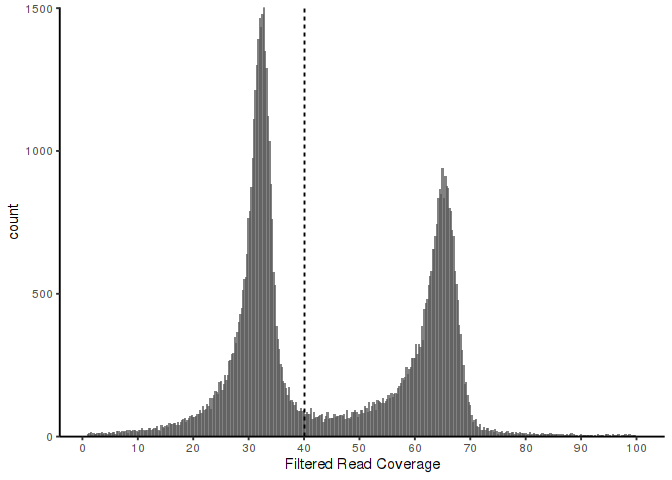

Haplotig_Masking
================
Jon Puritz
08/1/2022

## Initial Setup

Clone Repo

Change into repo directory

## Download original genome and gaps file

## Download raw Illumina files used for genome assembly

\*\*Note, you must have
[SRA-Toolkit](https://github.com/ncbi/sra-tools/wiki/02.-Installing-SRA-Toolkit)
installed properly on your system for this to work.

``` bash
fasterq-dump SRR6159074 -p -e 16
mv SRR6159074_1.fastq GI_01.F.fq
mv SRR6159074_2.fastq GI_01.R.fq
gzip *.fq
```

### Create computing environment

### Create contigs from the assembly

``` bash
source activate HMASK
sed 's/NC_035789.1/NC_035779.1/' GCF_002022765.2_C_virginica-3.0_genomic.fna | seqkit sort -N - -w0 | seqkit seq -u -w 0 | sed 's/NC_035779.1/NC_035789.1/' > reference.fasta


mawk '{new=$2-1;print $1 "\t" new "\t" $3}' GCF_002022765.2_C_virginica-3.0_genomic_gaps.txt | mawk '!/#/' > gaps.bed

samtools faidx reference.fasta
mawk -v OFS='\t' {'print $1,$2'} reference.fasta.fai > genome.file
mawk '{print $1 "\t" "0" "\t" $2-1}' genome.file > genome.bed
bedtools subtract -b gaps.bed -a genome.bed > contigs.bed
bedtools getfasta -fi reference.fasta -bed contigs.bed | sed 's/-/./g' | sed 's/:/./g ' > contigs.fasta
```

    ## [INFO] read sequences ...
    ## [INFO] 11 sequences loaded
    ## [INFO] sorting ...
    ## [INFO] output ...

## Masking

``` bash
conda activate HMASK
rm reference.fasta.fai
./dDocent_ngs.sh dDocent.config

picard MarkDuplicates I=GI_01-RG.bam O=GI_01-RGmd.bam M=GI_01_dup_metrics.txt OPTICAL_DUPLICATE_PIXEL_DISTANCE=2500 TAGGING_POLICY=OpticalOnly &> md.GI_01.log
samtools view -h -@32 -F 0x400 -F 0x100 GI_01-RGmd.bam | mawk '$5 <1' |samtools view -@32 - -SbT reference.fasta > GI_01.multmappers.bam
samtools view -@32 -h -q10 -F 0x400 -F 0x100 GI_01-RGmd.bam | mawk '$6 !~/[8-9].[SH]/ && $6 !~ /[1-9][0-9].[SH]/' | samtools view -@32 - -SbT reference.fasta > GI_01-RG.F.bam
samtools view -@32 -bF 0x400 -F 0x100 GI_01-RGmd.bam > GI_01-RGnd.bam
```

``` bash
source activate HMASK
mawk -v OFS='\t' {'print $1,$2'} reference.fasta.fai > genome.file
bedtools makewindows -g genome.file -w 10000 | mawk '!/NC_007175.2/' > 10kb.bed
bedtools coverage -a 10kb.bed -b GI_01.multmappers.bam -mean -sorted -g genome.file > GI.10kb.multi.cov.bed &
bedtools coverage -a 10kb.bed -b GI_01-RGnd.bam -mean -sorted -g genome.file > GI.10kb.cov.bed &
bedtools coverage -a 10kb.bed -b GI_01-RG.F.bam -mean -sorted -g genome.file > GI.10kb.fil.cov.bed
```

``` bash
#cat <(echo -e "chrom \t start \t end \t counts \t dataset") <(mawk '{print $1 "\t" $2 "\t" $3 "\t" $4 "\tFiltered"}' GI.10kb.fil.cov.bed ) <(mawk '{print $0 "\tMulti"}' GI.10kb.multi.cov.bed ) <(mawk '{print $0 "\tTotal"}' GI.10kb.cov.bed ) > original.coverage.bed

cat <(echo -e "chrom \t start \t end \t Filtered" ) GI.10kb.fil.cov.bed > GI.10kb.fil.cov.txt
```

``` r
library("ggplot2")
o.cov.df <- read.table("GI.10kb.fil.cov.txt", header=TRUE)

#png(filename="FilteredCoverageCOM.png", type="cairo",units="px", width=5600, height=3000, res=300, bg="transparent")
ggplot(o.cov.df[which(o.cov.df$Filtered > 1 & o.cov.df$Filtered < 100 ),]) +
  geom_histogram(aes(x=Filtered), binwidth = 0.25,size=0.025, position="identity", alpha= 0.75)+
  xlab("Filtered Read Coverage")+
  scale_x_continuous(breaks=c(0,10,20,30,40,50,60,70,80,90,100)) +
  scale_y_continuous(expand = c(0,0))+
  geom_vline(xintercept = 40, linetype="dashed")+
  theme_classic()
```

<!-- -->

``` r
#dev.off()
```

``` bash
source activate purge_haps
samtools faidx contigs.fasta
minimap2 -t 64 -ax sr contigs.fasta GI_01.R1.fq.gz GI_01.R2.fq.gz --secondary=no | samtools sort -m 10G -o aligned.contigs.bam -T tmp.ali
mawk -v OFS='\t' {'print $1,$2'} contigs.fasta.fai > genome.file
bedtools makewindows -g genome.file -w 100000 -s 50000 > 100kb.50kboverlap.bed
bedtools coverage -a 100kb.50kboverlap.bed -b aligned.contigs.bam -mean -sorted -g genome.file > GI.100kb.fil.cov.bed
mawk '$4 >= 40' GI.100kb.fil.cov.bed | bedtools merge -i - > high.cov.bed
mawk '$4 <= 40' GI.100kb.fil.cov.bed | bedtools merge -i - > low.cov.bed
mawk '{print $0 "\t" $3 -$2}' high.cov.bed | mawk '$4 < 150000' |cut -f1-3 > small.high.bed
mawk '{print $0 "\t" $3 -$2}' low.cov.bed | mawk '$4 < 150000' | cut -f1-3 > small.low.bed
cat high.cov.bed small.low.bed | sort -k1,1 -k2,2n > high.2.bed
bedtools merge -i high.2.bed > high.merged.2.bed
cat low.cov.bed small.high.bed | sort -k1,1 -k2,2n > low.2.bed
bedtools merge -i low.2.bed > low.merged.2.bed
bedtools subtract -a low.merged.2.bed -b high.merged.2.bed > low.merg.sub.bed
bedtools getfasta -fi contigs.fasta -bed high.merged.2.bed > high.fasta
bedtools getfasta -fi contigs.fasta -bed low.merg.sub.bed > low.fasta
cat low.fasta high.fasta | sed 's/-/./g' | sed 's/:/./g ' > manual.fasta
samtools faidx manual.fasta
```

``` bash
source activate purge_haps
minimap2 -t 64 -ax sr manual.fasta GI_01.R1.fq.gz GI_01.R2.fq.gz --secondary=no | samtools sort -m 10G -o aligned.bam -T tmp.ali
```

``` bash
source activate purge_haps
purge_haplotigs hist -b aligned.bam -g manual.fasta -t 64
```

**This does not knit properly on my machine, so here is a the output**

``` bash
cat tmp_purge_haplotigs/purge_haplotigs_hist.log
```

    ## [19-08-2022 11:33:13] Beginning read-depth histogram generation
    ## [19-08-2022 11:33:13] aligned.bam.gencov found, skipping bedtools genomecov step
    ## [19-08-2022 11:33:13] generating histogram
    ## [19-08-2022 11:33:13] generating png image
    ## [19-08-2022 11:33:14] 
    ## 
    ## Pipeline finished! Your histogram is saved to: aligned.bam.histogram.png
    ## 
    ## [19-08-2022 11:33:14] 
    ## Check your histogram to observe where your haploid and diploid peaks are
    ## and choose your low, midpoint, and high cutoffs (check the example histogram png 
    ## in the readme). You will need 'aligned.bam.gencov' and the cutoffs for the next 
    ## step: 'purge_haplotigs cov'

Output figure from `purge_haplotigs` 

``` bash
source activate purge_haps
purge_haplotigs cov -i aligned.bam.gencov -l 10 -m 56 -h 120
```

    ## 
    ## Analysis finished successfully! Contig coverage stats saved to 'coverage_stats.csv'.

#### Important note on reproducibility

The `purge_haplotigs` program is designed to run on **de novo**
assemblies, and it assumes that most contigs are different lengths.
Several steps of the program involve sorting the output of parallel
computational threads, and it does this not by conting name, but by
length.

For this application, several contigs (that were possible chimeras) are
of similar length. Six contigs in particular (identified below) have
high similarity and identical length, meaning that depending on the run,
one in the pair would be marked the haplotig and the other would be
marked to keep. The results of these differences are minor and only
involve with the placement of the haplotig masking. To ensure full
reproducibility, we alter one input file to secure consistent haplotig
marking. However, users are encouraged to explore multiple runs to see
the exact difference.

Similar contigs in identity and length:

    NC_035780.1.56494315.57556734.950000.1050000
    NC_035780.1.57597004.58436490.0.100000
    NC_035782.1.0.2889749.2650000.2750000
    NC_035782.1.5430213.7093902.750000.850000
    NC_035786.1.27961299.30492941.1700000.1850000
    NC_035786.1.31893473.34284637.400000.550000

Here we alter the coverage_stats.csv file to ensure the same contigs are
kept each time:

``` bash
sed -i 's/NC_035786.1.27961299.30492941.1700000.1850000,s,/NC_035786.1.27961299.30492941.1700000.1850000,,/g' coverage_stats.csv
sed -i 's/NC_035782.1.5430213.7093902.750000.850000,s,/NC_035782.1.5430213.7093902.750000.850000,,/g' coverage_stats.csv
sed -i 's/NC_035780.1.56494315.57556734.950000.1050000,s,/NC_035780.1.56494315.57556734.950000.1050000,,/g' coverage_stats.csv
```

Also, making this modification causes a contig to be marked a repeat, so
we alter that as well to ensure reproducibility across runs

``` bash
sed -i 's/NC_035782.1.0.2889749.2750000.2889749,s,/NC_035782.1.0.2889749.2750000.2889749,,/g' coverage_stats.csv  
```

``` bash
source activate purge_haps
purge_haplotigs purge -a 70 -g manual.fasta -c coverage_stats.csv -t 48 -d -b aligned.bam -o curated_contigs
```

**This does not knit properly on my machine, so here is a the output**

``` bash
cat ./tmp_purge_haplotigs/purge_haplotigs_purge.log
```

    ## [19-08-2022 11:35:25] 
    ## Beginning Pipeline
    ## 
    ## PARAMETERS:
    ## Genome fasta:           manual.fasta
    ## Coverage csv:           coverage_stats.csv
    ## Produce dotplots:       TRUE
    ## Bam file:               aligned.bam
    ## Min cov window len:     5000 bp
    ## max ctg cov windows:    200
    ## Falcon-style naming:    FALSE
    ## Threads:                48
    ## I/O intense jobs:       48
    ## Cutoff, alignment:      70 %
    ## Cutoff, repeat:         250 %
    ## Cutoff, suspect:        5 %
    ## Out prefix:             curated_contigs
    ## minimap2 parameters:    '-p 1e-5 -f 0.001 -N 100000'
    ## 
    ## Running using command:
    ## purge_haplotigs purge -a 70 -g manual.fasta -c coverage_stats.csv -t 48 -d -b aligned.bam -o curated_contigs
    ## 
    ## 
    ## [19-08-2022 11:35:25] 
    ## 
    ## PREPARATION
    ## 
    ## [19-08-2022 11:35:25] Reading manual.fasta.fai
    ## [19-08-2022 11:35:25] Reading coverage_stats.csv
    ## [19-08-2022 11:35:25] Scanning manual.fasta
    ## [19-08-2022 11:35:25] Reusing windowed read-depth from previous run
    ## [19-08-2022 11:35:25] Scanning tmp_purge_haplotigs/assembly.logcov.bed
    ## [19-08-2022 11:35:25] Reusing minimap2 alignments from previous run
    ## [19-08-2022 11:35:25] Reading index of minimap2 alignments
    ## [19-08-2022 11:35:25] Reusing hit summary file from previous run
    ## [19-08-2022 11:35:26] Reading contig hits from hit summary
    ## [19-08-2022 11:35:27] Performing pairwise comparisons on contig hits
    ## [19-08-2022 11:35:32] Checking contig assignments for conflicts
    ## [19-08-2022 11:35:32] CONFLICT: NC_035780.1.0.4051980.1150000.1200000 and it's match NC_035789.1.16914741.18028702.1000000.1113961 both flagged for reassignment
    ## [19-08-2022 11:35:32]    Keeping longer contig NC_035789.1.16914741.18028702.1000000.1113961
    ## [19-08-2022 11:35:32] CONFLICT: NC_035780.1.0.4051980.3650000.4051980 and it's match NC_035780.1.4052080.4712998.0.200000 both flagged for reassignment
    ## [19-08-2022 11:35:32]    Keeping longer contig NC_035780.1.0.4051980.3650000.4051980
    ## [19-08-2022 11:35:32] CONFLICT: NC_035780.1.10911822.13598501.1000000.1700000 and it's match NC_035780.1.9194719.10911722.0.1050000 both flagged for reassignment
    ## [19-08-2022 11:35:32]    Keeping longer contig NC_035780.1.9194719.10911722.0.1050000
    ## [19-08-2022 11:35:32] CONFLICT: NC_035780.1.10911822.13598501.500000.750000 and it's match NC_035780.1.9194719.10911722.1450000.1600000 both flagged for reassignment
    ## [19-08-2022 11:35:32]    Keeping longer contig NC_035780.1.10911822.13598501.500000.750000
    ## [19-08-2022 11:35:32] CONFLICT: NC_035780.1.10911822.13598501.750000.850000 and it's match NC_035780.1.9194719.10911722.1250000.1350000 both flagged for reassignment
    ## [19-08-2022 11:35:32]    Keeping longer contig NC_035780.1.9194719.10911722.1250000.1350000
    ## [19-08-2022 11:35:32] CONFLICT: NC_035780.1.10911822.13598501.850000.1000000 and it's match NC_035780.1.9194719.10911722.1050000.1250000 both flagged for reassignment
    ## [19-08-2022 11:35:32]    Keeping longer contig NC_035780.1.9194719.10911722.1050000.1250000
    ## [19-08-2022 11:35:32] CONFLICT: NC_035780.1.13986979.14404172.0.150000 and it's match NC_035780.1.14771257.14952735.0.181478 both flagged for reassignment
    ## [19-08-2022 11:35:32]    Keeping longer contig NC_035780.1.14771257.14952735.0.181478
    ## [19-08-2022 11:35:32] CONFLICT: NC_035780.1.13986979.14404172.150000.417193 and it's match NC_035780.1.14404272.14736561.0.332289 both flagged for reassignment
    ## [19-08-2022 11:35:32]    Keeping longer contig NC_035780.1.14404272.14736561.0.332289
    ## [19-08-2022 11:35:32] CONFLICT: NC_035780.1.37144569.37846193.100000.701624 and it's match NC_035780.1.37846293.41202932.900000.1400000 both flagged for reassignment
    ## [19-08-2022 11:35:32]    Keeping longer contig NC_035780.1.37144569.37846193.100000.701624
    ## [19-08-2022 11:35:32] CONFLICT: NC_035780.1.49249194.51680144.1750000.1800000 and it's match NC_035785.1.43308469.46030222.2650000.2721753 both flagged for reassignment
    ## [19-08-2022 11:35:32]    Keeping longer contig NC_035785.1.43308469.46030222.2650000.2721753
    ## [19-08-2022 11:35:32] CONFLICT: NC_035780.1.49249194.51680144.2300000.2430950 and it's match NC_035780.1.51680244.52033436.0.353192 both flagged for reassignment
    ## [19-08-2022 11:35:32]    Keeping longer contig NC_035780.1.51680244.52033436.0.353192
    ## [19-08-2022 11:35:32] CONFLICT: NC_035780.1.52033536.52935875.0.150000 and it's match NC_035780.1.52935975.53651186.450000.715211 both flagged for reassignment
    ## [19-08-2022 11:35:32]    Keeping longer contig NC_035780.1.52935975.53651186.450000.715211
    ## [19-08-2022 11:35:32] CONFLICT: NC_035780.1.52033536.52935875.400000.902339 and it's match NC_035780.1.52935975.53651186.0.450000 both flagged for reassignment
    ## [19-08-2022 11:35:32]    Keeping longer contig NC_035780.1.52033536.52935875.400000.902339
    ## [19-08-2022 11:35:32] CONFLICT: NC_035780.1.57556834.57596904.0.40070 and it's match NC_035784.1.52131394.52190276.0.58882 both flagged for reassignment
    ## [19-08-2022 11:35:32]    Keeping longer contig NC_035784.1.52131394.52190276.0.58882
    ## [19-08-2022 11:35:32] CONFLICT: NC_035780.1.61976163.64480672.2150000.2200000 and it's match NC_035780.1.64480772.64838252.0.200000 both flagged for reassignment
    ## [19-08-2022 11:35:32]    Keeping longer contig NC_035780.1.64480772.64838252.0.200000
    ## [19-08-2022 11:35:32] CONFLICT: NC_035780.1.64838352.65348238.350000.509886 and it's match NC_035780.1.65348338.65662540.0.314202 both flagged for reassignment
    ## [19-08-2022 11:35:32]    Keeping longer contig NC_035780.1.65348338.65662540.0.314202
    ## [19-08-2022 11:35:32] CONFLICT: NC_035780.1.9194719.10911722.1350000.1450000 and it's match NC_035780.1.10911822.13598501.750000.850000 both flagged for reassignment
    ## [19-08-2022 11:35:32]    Keeping longer contig NC_035780.1.10911822.13598501.750000.850000
    ## [19-08-2022 11:35:32] CONFLICT: NC_035781.1.1194956.1775956.300000.581000 and it's match NC_035781.1.1776056.2323160.150000.450000 both flagged for reassignment
    ## [19-08-2022 11:35:32]    Keeping longer contig NC_035781.1.1776056.2323160.150000.450000
    ## [19-08-2022 11:35:32] CONFLICT: NC_035781.1.14364084.17146551.1450000.2000000 and it's match NC_035781.1.61022066.61470268.0.448202 both flagged for reassignment
    ## [19-08-2022 11:35:32]    Keeping longer contig NC_035781.1.14364084.17146551.1450000.2000000
    ## [19-08-2022 11:35:32] CONFLICT: NC_035781.1.22606142.23657979.700000.850000 and it's match NC_035781.1.23658079.25251021.0.350000 both flagged for reassignment
    ## [19-08-2022 11:35:32]    Keeping longer contig NC_035781.1.23658079.25251021.0.350000
    ## [19-08-2022 11:35:32] CONFLICT: NC_035781.1.25251121.28047466.1850000.2050000 and it's match NC_035781.1.28047566.28419509.150000.371943 both flagged for reassignment
    ## [19-08-2022 11:35:32]    Keeping longer contig NC_035781.1.28047566.28419509.150000.371943
    ## [19-08-2022 11:35:32] CONFLICT: NC_035781.1.25251121.28047466.2600000.2700000 and it's match NC_035781.1.28883805.29508272.0.150000 both flagged for reassignment
    ## [19-08-2022 11:35:32]    Keeping longer contig NC_035781.1.28883805.29508272.0.150000
    ## [19-08-2022 11:35:32] CONFLICT: NC_035781.1.32702426.32718310.0.15884 and it's match NC_035781.1.32592218.32702326.0.110108 both flagged for reassignment
    ## [19-08-2022 11:35:32]    Keeping longer contig NC_035781.1.32592218.32702326.0.110108
    ## [19-08-2022 11:35:32] CONFLICT: NC_035781.1.33332158.34195967.400000.750000 and it's match NC_035781.1.34196067.34920114.200000.450000 both flagged for reassignment
    ## [19-08-2022 11:35:32]    Keeping longer contig NC_035781.1.33332158.34195967.400000.750000
    ## [19-08-2022 11:35:32] CONFLICT: NC_035781.1.38744485.39425076.400000.600000 and it's match NC_035781.1.39425176.41632516.0.200000 both flagged for reassignment
    ## [19-08-2022 11:35:32]    Keeping longer contig NC_035781.1.39425176.41632516.0.200000
    ## [19-08-2022 11:35:32] CONFLICT: NC_035781.1.39425176.41632516.200000.350000 and it's match NC_035781.1.38744485.39425076.400000.600000 both flagged for reassignment
    ## [19-08-2022 11:35:32]    Keeping longer contig NC_035781.1.38744485.39425076.400000.600000
    ## [19-08-2022 11:35:32] CONFLICT: NC_035781.1.41632616.44325987.2250000.2693371 and it's match NC_035781.1.44326087.45640377.100000.550000 both flagged for reassignment
    ## [19-08-2022 11:35:32]    Keeping longer contig NC_035781.1.44326087.45640377.100000.550000
    ## [19-08-2022 11:35:32] CONFLICT: NC_035781.1.45640477.46369816.600000.729339 and it's match NC_035781.1.46369916.46645362.150000.250000 both flagged for reassignment
    ## [19-08-2022 11:35:32]    Keeping longer contig NC_035781.1.45640477.46369816.600000.729339
    ## [19-08-2022 11:35:32] CONFLICT: NC_035781.1.46645462.48722255.1050000.1200000 and it's match NC_035781.1.48722355.51087666.1350000.1600000 both flagged for reassignment
    ## [19-08-2022 11:35:32]    Keeping longer contig NC_035781.1.48722355.51087666.1350000.1600000
    ## [19-08-2022 11:35:32] CONFLICT: NC_035781.1.46645462.48722255.1200000.2000000 and it's match NC_035781.1.48722355.51087666.950000.1350000 both flagged for reassignment
    ## [19-08-2022 11:35:32]    Keeping longer contig NC_035781.1.46645462.48722255.1200000.2000000
    ## [19-08-2022 11:35:32] CONFLICT: NC_035781.1.48722355.51087666.0.150000 and it's match NC_035781.1.51209815.51602155.100000.392340 both flagged for reassignment
    ## [19-08-2022 11:35:32]    Keeping longer contig NC_035781.1.51209815.51602155.100000.392340
    ## [19-08-2022 11:35:32] CONFLICT: NC_035781.1.54915747.56989726.900000.1500000 and it's match NC_035781.1.57746325.59243117.800000.1496792 both flagged for reassignment
    ## [19-08-2022 11:35:32]    Keeping longer contig NC_035781.1.57746325.59243117.800000.1496792
    ## [19-08-2022 11:35:32] CONFLICT: NC_035781.1.59291704.60714286.1350000.1422582 and it's match NC_035781.1.60714386.60950226.150000.235840 both flagged for reassignment
    ## [19-08-2022 11:35:32]    Keeping longer contig NC_035781.1.60714386.60950226.150000.235840
    ## [19-08-2022 11:35:32] CONFLICT: NC_035782.1.0.2889749.0.150000 and it's match NC_035782.1.4614814.5430113.300000.700000 both flagged for reassignment
    ## [19-08-2022 11:35:32]    Keeping longer contig NC_035782.1.4614814.5430113.300000.700000
    ## [19-08-2022 11:35:32] CONFLICT: NC_035782.1.0.2889749.2100000.2150000 and it's match NC_035782.1.5430213.7093902.150000.300000 both flagged for reassignment
    ## [19-08-2022 11:35:32]    Keeping longer contig NC_035782.1.5430213.7093902.150000.300000
    ## [19-08-2022 11:35:32] CONFLICT: NC_035782.1.0.2889749.2350000.2400000 and it's match NC_035782.1.5430213.7093902.300000.450000 both flagged for reassignment
    ## [19-08-2022 11:35:32]    Keeping longer contig NC_035782.1.5430213.7093902.300000.450000
    ## [19-08-2022 11:35:32] CONFLICT: NC_035782.1.0.2889749.2750000.2889749 and it's match NC_035782.1.5430213.7093902.750000.850000 both flagged for reassignment
    ## [19-08-2022 11:35:32]    Keeping longer contig NC_035782.1.0.2889749.2750000.2889749
    ## [19-08-2022 11:35:32] CONFLICT: NC_035782.1.11838141.12902791.750000.1050000 and it's match NC_035782.1.12902891.14948399.200000.450000 both flagged for reassignment
    ## [19-08-2022 11:35:32]    Keeping longer contig NC_035782.1.11838141.12902791.750000.1050000
    ## [19-08-2022 11:35:32] CONFLICT: NC_035782.1.16768264.17357716.550000.589452 and it's match NC_035782.1.17357816.17750055.0.392239 both flagged for reassignment
    ## [19-08-2022 11:35:32]    Keeping longer contig NC_035782.1.17357816.17750055.0.392239
    ## [19-08-2022 11:35:32] CONFLICT: NC_035782.1.19472637.20490017.0.200000 and it's match NC_035784.1.23724118.23887871.0.163753 both flagged for reassignment
    ## [19-08-2022 11:35:32]    Keeping longer contig NC_035782.1.19472637.20490017.0.200000
    ## [19-08-2022 11:35:32] CONFLICT: NC_035782.1.20490117.22017475.1350000.1450000 and it's match NC_035782.1.22017575.23279998.100000.250000 both flagged for reassignment
    ## [19-08-2022 11:35:32]    Keeping longer contig NC_035782.1.22017575.23279998.100000.250000
    ## [19-08-2022 11:35:32] CONFLICT: NC_035782.1.24123505.25379391.1000000.1150000 and it's match NC_035782.1.26313976.29848694.100000.250000 both flagged for reassignment
    ## [19-08-2022 11:35:32]    Keeping longer contig NC_035782.1.26313976.29848694.100000.250000
    ## [19-08-2022 11:35:32] CONFLICT: NC_035782.1.24123505.25379391.950000.1000000 and it's match NC_035782.1.26313976.29848694.0.100000 both flagged for reassignment
    ## [19-08-2022 11:35:32]    Keeping longer contig NC_035782.1.26313976.29848694.0.100000
    ## [19-08-2022 11:35:32] CONFLICT: NC_035782.1.25379491.26313876.100000.934385 and it's match NC_035782.1.26313976.29848694.1500000.2250000 both flagged for reassignment
    ## [19-08-2022 11:35:32]    Keeping longer contig NC_035782.1.25379491.26313876.100000.934385
    ## [19-08-2022 11:35:32] CONFLICT: NC_035782.1.26313976.29848694.250000.300000 and it's match NC_035782.1.24123505.25379391.1150000.1255886 both flagged for reassignment
    ## [19-08-2022 11:35:32]    Keeping longer contig NC_035782.1.24123505.25379391.1150000.1255886
    ## [19-08-2022 11:35:32] CONFLICT: NC_035782.1.26313976.29848694.3050000.3400000 and it's match NC_035782.1.29848794.30733026.0.500000 both flagged for reassignment
    ## [19-08-2022 11:35:32]    Keeping longer contig NC_035782.1.29848794.30733026.0.500000
    ## [19-08-2022 11:35:32] CONFLICT: NC_035782.1.3523515.3770089.0.246574 and it's match NC_035782.1.42062930.43870479.550000.700000 both flagged for reassignment
    ## [19-08-2022 11:35:32]    Keeping longer contig NC_035782.1.3523515.3770089.0.246574
    ## [19-08-2022 11:35:32] CONFLICT: NC_035782.1.36902366.38815924.1550000.1913558 and it's match NC_035782.1.38987407.40085872.150000.350000 both flagged for reassignment
    ## [19-08-2022 11:35:32]    Keeping longer contig NC_035782.1.36902366.38815924.1550000.1913558
    ## [19-08-2022 11:35:32] CONFLICT: NC_035782.1.38987407.40085872.1000000.1098465 and it's match NC_035782.1.40085972.42062830.0.250000 both flagged for reassignment
    ## [19-08-2022 11:35:32]    Keeping longer contig NC_035782.1.40085972.42062830.0.250000
    ## [19-08-2022 11:35:32] CONFLICT: NC_035782.1.42062930.43870479.850000.1700000 and it's match NC_035782.1.43870579.45262566.200000.1000000 both flagged for reassignment
    ## [19-08-2022 11:35:32]    Keeping longer contig NC_035782.1.42062930.43870479.850000.1700000
    ## [19-08-2022 11:35:32] CONFLICT: NC_035782.1.45262666.48517094.0.200000 and it's match NC_035783.1.8314458.10089778.800000.950000 both flagged for reassignment
    ## [19-08-2022 11:35:32]    Keeping longer contig NC_035782.1.45262666.48517094.0.200000
    ## [19-08-2022 11:35:32] CONFLICT: NC_035782.1.63853836.65692844.1700000.1839008 and it's match NC_035782.1.65692944.66074715.100000.150000 both flagged for reassignment
    ## [19-08-2022 11:35:32]    Keeping longer contig NC_035782.1.63853836.65692844.1700000.1839008
    ## [19-08-2022 11:35:32] CONFLICT: NC_035782.1.70548753.72091862.1000000.1200000 and it's match NC_035782.1.72091962.73155867.350000.550000 both flagged for reassignment
    ## [19-08-2022 11:35:32]    Keeping longer contig NC_035782.1.72091962.73155867.350000.550000
    ## [19-08-2022 11:35:32] CONFLICT: NC_035782.1.70548753.72091862.1200000.1350000 and it's match NC_035782.1.72091962.73155867.100000.350000 both flagged for reassignment
    ## [19-08-2022 11:35:32]    Keeping longer contig NC_035782.1.72091962.73155867.100000.350000
    ## [19-08-2022 11:35:32] CONFLICT: NC_035782.1.70548753.72091862.800000.1000000 and it's match NC_035782.1.72091962.73155867.650000.800000 both flagged for reassignment
    ## [19-08-2022 11:35:32]    Keeping longer contig NC_035782.1.70548753.72091862.800000.1000000
    ## [19-08-2022 11:35:32] CONFLICT: NC_035783.1.0.778878.100000.350000 and it's match NC_035783.1.54421554.58768925.4050000.4347371 both flagged for reassignment
    ## [19-08-2022 11:35:32]    Keeping longer contig NC_035783.1.54421554.58768925.4050000.4347371
    ## [19-08-2022 11:35:32] CONFLICT: NC_035783.1.21712720.23185325.400000.650000 and it's match NC_035783.1.32056401.33660199.1200000.1603798 both flagged for reassignment
    ## [19-08-2022 11:35:32]    Keeping longer contig NC_035783.1.32056401.33660199.1200000.1603798
    ## [19-08-2022 11:35:32] CONFLICT: NC_035783.1.25248436.26718206.600000.750000 and it's match NC_035783.1.26718306.27770885.700000.950000 both flagged for reassignment
    ## [19-08-2022 11:35:32]    Keeping longer contig NC_035783.1.26718306.27770885.700000.950000
    ## [19-08-2022 11:35:32] CONFLICT: NC_035783.1.25248436.26718206.750000.900000 and it's match NC_035783.1.26718306.27770885.500000.700000 both flagged for reassignment
    ## [19-08-2022 11:35:32]    Keeping longer contig NC_035783.1.26718306.27770885.500000.700000
    ## [19-08-2022 11:35:32] CONFLICT: NC_035783.1.25248436.26718206.900000.1250000 and it's match NC_035783.1.26718306.27770885.100000.500000 both flagged for reassignment
    ## [19-08-2022 11:35:32]    Keeping longer contig NC_035783.1.26718306.27770885.100000.500000
    ## [19-08-2022 11:35:32] CONFLICT: NC_035783.1.30938966.31421599.0.100000 and it's match NC_035783.1.31584350.32056301.0.100000 both flagged for reassignment
    ## [19-08-2022 11:35:32]    Keeping longer contig NC_035783.1.31584350.32056301.0.100000
    ## [19-08-2022 11:35:32] CONFLICT: NC_035783.1.31584350.32056301.100000.250000 and it's match NC_035783.1.32056401.33660199.0.250000 both flagged for reassignment
    ## [19-08-2022 11:35:32]    Keeping longer contig NC_035783.1.32056401.33660199.0.250000
    ## [19-08-2022 11:35:32] CONFLICT: NC_035783.1.32056401.33660199.1100000.1200000 and it's match NC_035783.1.21712720.23185325.650000.800000 both flagged for reassignment
    ## [19-08-2022 11:35:32]    Keeping longer contig NC_035783.1.21712720.23185325.650000.800000
    ## [19-08-2022 11:35:32] CONFLICT: NC_035783.1.33660299.34425936.300000.400000 and it's match NC_035783.1.43627288.47058769.0.100000 both flagged for reassignment
    ## [19-08-2022 11:35:32]    Keeping longer contig NC_035783.1.43627288.47058769.0.100000
    ## [19-08-2022 11:35:32] CONFLICT: NC_035783.1.33660299.34425936.400000.765637 and it's match NC_035783.1.43627288.47058769.100000.400000 both flagged for reassignment
    ## [19-08-2022 11:35:32]    Keeping longer contig NC_035783.1.33660299.34425936.400000.765637
    ## [19-08-2022 11:35:32] CONFLICT: NC_035783.1.34774021.37843704.2700000.3000000 and it's match NC_035783.1.37843804.38910726.550000.1066922 both flagged for reassignment
    ## [19-08-2022 11:35:32]    Keeping longer contig NC_035783.1.37843804.38910726.550000.1066922
    ## [19-08-2022 11:35:32] CONFLICT: NC_035783.1.3737953.3801752.0.63799 and it's match NC_035783.1.5119704.7670116.2150000.2350000 both flagged for reassignment
    ## [19-08-2022 11:35:32]    Keeping longer contig NC_035783.1.5119704.7670116.2150000.2350000
    ## [19-08-2022 11:35:32] CONFLICT: NC_035783.1.37843804.38910726.400000.550000 and it's match NC_035783.1.34774021.37843704.2700000.3000000 both flagged for reassignment
    ## [19-08-2022 11:35:32]    Keeping longer contig NC_035783.1.34774021.37843704.2700000.3000000
    ## [19-08-2022 11:35:32] CONFLICT: NC_035783.1.3801852.5119604.350000.500000 and it's match NC_035783.1.5119704.7670116.1650000.1850000 both flagged for reassignment
    ## [19-08-2022 11:35:32]    Keeping longer contig NC_035783.1.5119704.7670116.1650000.1850000
    ## [19-08-2022 11:35:32] CONFLICT: NC_035783.1.38910826.40973375.900000.1600000 and it's match NC_035783.1.40973475.42814522.100000.800000 both flagged for reassignment
    ## [19-08-2022 11:35:32]    Keeping longer contig NC_035783.1.40973475.42814522.100000.800000
    ## [19-08-2022 11:35:32] CONFLICT: NC_035783.1.40973475.42814522.800000.950000 and it's match NC_035783.1.38910826.40973375.900000.1600000 both flagged for reassignment
    ## [19-08-2022 11:35:32]    Keeping longer contig NC_035783.1.38910826.40973375.900000.1600000
    ## [19-08-2022 11:35:32] CONFLICT: NC_035783.1.5119704.7670116.0.200000 and it's match NC_035783.1.936306.3737853.2600000.2801547 both flagged for reassignment
    ## [19-08-2022 11:35:32]    Keeping longer contig NC_035783.1.936306.3737853.2600000.2801547
    ## [19-08-2022 11:35:32] CONFLICT: NC_035783.1.5119704.7670116.2100000.2150000 and it's match NC_035783.1.5119704.7670116.2000000.2100000 both flagged for reassignment
    ## [19-08-2022 11:35:32]    Keeping longer contig NC_035783.1.5119704.7670116.2000000.2100000
    ## [19-08-2022 11:35:32] CONFLICT: NC_035783.1.52108782.54296181.1200000.1450000 and it's match NC_035783.1.54421554.58768925.0.200000 both flagged for reassignment
    ## [19-08-2022 11:35:32]    Keeping longer contig NC_035783.1.52108782.54296181.1200000.1450000
    ## [19-08-2022 11:35:32] CONFLICT: NC_035783.1.52108782.54296181.1450000.1900000 and it's match NC_035783.1.54421554.58768925.200000.450000 both flagged for reassignment
    ## [19-08-2022 11:35:32]    Keeping longer contig NC_035783.1.52108782.54296181.1450000.1900000
    ## [19-08-2022 11:35:32] CONFLICT: NC_035783.1.52108782.54296181.1900000.2187399 and it's match NC_035783.1.54421554.58768925.450000.750000 both flagged for reassignment
    ## [19-08-2022 11:35:32]    Keeping longer contig NC_035783.1.54421554.58768925.450000.750000
    ## [19-08-2022 11:35:32] CONFLICT: NC_035783.1.936306.3737853.2550000.2600000 and it's match NC_035783.1.5119704.7670116.0.200000 both flagged for reassignment
    ## [19-08-2022 11:35:32]    Keeping longer contig NC_035783.1.5119704.7670116.0.200000
    ## [19-08-2022 11:35:32] CONFLICT: NC_035784.1.15767764.19033894.2700000.2950000 and it's match NC_035784.1.19033994.19438839.100000.300000 both flagged for reassignment
    ## [19-08-2022 11:35:32]    Keeping longer contig NC_035784.1.15767764.19033894.2700000.2950000
    ## [19-08-2022 11:35:32] CONFLICT: NC_035784.1.19438939.20108754.450000.669815 and it's match NC_035784.1.20108854.20585272.150000.476418 both flagged for reassignment
    ## [19-08-2022 11:35:32]    Keeping longer contig NC_035784.1.20108854.20585272.150000.476418
    ## [19-08-2022 11:35:32] CONFLICT: NC_035784.1.23887971.26780653.2600000.2892682 and it's match NC_035784.1.26780753.30369322.0.300000 both flagged for reassignment
    ## [19-08-2022 11:35:32]    Keeping longer contig NC_035784.1.26780753.30369322.0.300000
    ## [19-08-2022 11:35:32] CONFLICT: NC_035784.1.30369422.31325384.250000.400000 and it's match NC_035784.1.31325484.32527709.400000.700000 both flagged for reassignment
    ## [19-08-2022 11:35:32]    Keeping longer contig NC_035784.1.31325484.32527709.400000.700000
    ## [19-08-2022 11:35:32] CONFLICT: NC_035784.1.32527809.33330893.500000.650000 and it's match NC_035784.1.33464021.34426961.200000.400000 both flagged for reassignment
    ## [19-08-2022 11:35:32]    Keeping longer contig NC_035784.1.33464021.34426961.200000.400000
    ## [19-08-2022 11:35:32] CONFLICT: NC_035784.1.33464021.34426961.850000.900000 and it's match NC_035784.1.34427061.34756466.0.300000 both flagged for reassignment
    ## [19-08-2022 11:35:32]    Keeping longer contig NC_035784.1.34427061.34756466.0.300000
    ## [19-08-2022 11:35:32] CONFLICT: NC_035784.1.38942846.43434102.100000.200000 and it's match NC_035784.1.35640335.38942746.2850000.3302411 both flagged for reassignment
    ## [19-08-2022 11:35:32]    Keeping longer contig NC_035784.1.35640335.38942746.2850000.3302411
    ## [19-08-2022 11:35:32] CONFLICT: NC_035784.1.4705603.6226063.1200000.1500000 and it's match NC_035784.1.6765808.9455137.0.350000 both flagged for reassignment
    ## [19-08-2022 11:35:32]    Keeping longer contig NC_035784.1.6765808.9455137.0.350000
    ## [19-08-2022 11:35:32] CONFLICT: NC_035784.1.4705603.6226063.750000.1000000 and it's match NC_035784.1.6226163.6742970.100000.300000 both flagged for reassignment
    ## [19-08-2022 11:35:32]    Keeping longer contig NC_035784.1.4705603.6226063.750000.1000000
    ## [19-08-2022 11:35:32] CONFLICT: NC_035784.1.77254729.80728094.3050000.3473365 and it's match NC_035784.1.80728194.83927216.500000.850000 both flagged for reassignment
    ## [19-08-2022 11:35:32]    Keeping longer contig NC_035784.1.77254729.80728094.3050000.3473365
    ## [19-08-2022 11:35:32] CONFLICT: NC_035784.1.83927316.86480847.0.150000 and it's match NC_035786.1.47073400.48669444.700000.850000 both flagged for reassignment
    ## [19-08-2022 11:35:32]    Keeping longer contig NC_035786.1.47073400.48669444.700000.850000
    ## [19-08-2022 11:35:32] CONFLICT: NC_035785.1.22537486.24068989.1400000.1531503 and it's match NC_035785.1.46414354.48322701.1800000.1900000 both flagged for reassignment
    ## [19-08-2022 11:35:32]    Keeping longer contig NC_035785.1.22537486.24068989.1400000.1531503
    ## [19-08-2022 11:35:32] CONFLICT: NC_035785.1.32792979.34947496.1950000.2154517 and it's match NC_035788.1.14792808.16164437.150000.400000 both flagged for reassignment
    ## [19-08-2022 11:35:32]    Keeping longer contig NC_035788.1.14792808.16164437.150000.400000
    ## [19-08-2022 11:35:32] CONFLICT: NC_035785.1.34947596.41029412.4950000.5150000 and it's match NC_035785.1.48322801.51258097.2550000.2650000 both flagged for reassignment
    ## [19-08-2022 11:35:32]    Keeping longer contig NC_035785.1.34947596.41029412.4950000.5150000
    ## [19-08-2022 11:35:32] CONFLICT: NC_035785.1.42153106.42154598.0.1492 and it's match NC_035786.1.7671292.9277048.0.100000 both flagged for reassignment
    ## [19-08-2022 11:35:32]    Keeping longer contig NC_035786.1.7671292.9277048.0.100000
    ## [19-08-2022 11:35:32] CONFLICT: NC_035785.1.46414354.48322701.1550000.1600000 and it's match NC_035785.1.22537486.24068989.450000.1400000 both flagged for reassignment
    ## [19-08-2022 11:35:32]    Keeping longer contig NC_035785.1.22537486.24068989.450000.1400000
    ## [19-08-2022 11:35:32] CONFLICT: NC_035785.1.9132622.9927467.400000.450000 and it's match NC_035785.1.9013134.9132522.0.119388 both flagged for reassignment
    ## [19-08-2022 11:35:32]    Keeping longer contig NC_035785.1.9013134.9132522.0.119388
    ## [19-08-2022 11:35:32] CONFLICT: NC_035786.1.15342630.16854559.550000.1050000 and it's match NC_035786.1.17647199.18771757.250000.650000 both flagged for reassignment
    ## [19-08-2022 11:35:32]    Keeping longer contig NC_035786.1.15342630.16854559.550000.1050000
    ## [19-08-2022 11:35:32] CONFLICT: NC_035786.1.17030304.17033847.0.3543 and it's match NC_035789.1.12475399.12590211.0.114812 both flagged for reassignment
    ## [19-08-2022 11:35:32]    Keeping longer contig NC_035789.1.12475399.12590211.0.114812
    ## [19-08-2022 11:35:32] CONFLICT: NC_035786.1.1795285.3627985.1700000.1832700 and it's match NC_035786.1.3628085.5098954.0.200000 both flagged for reassignment
    ## [19-08-2022 11:35:32]    Keeping longer contig NC_035786.1.3628085.5098954.0.200000
    ## [19-08-2022 11:35:32] CONFLICT: NC_035786.1.22569511.23771672.900000.1050000 and it's match NC_035786.1.7671292.9277048.100000.200000 both flagged for reassignment
    ## [19-08-2022 11:35:32]    Keeping longer contig NC_035786.1.22569511.23771672.900000.1050000
    ## [19-08-2022 11:35:32] CONFLICT: NC_035786.1.25646913.27005082.1150000.1350000 and it's match NC_035786.1.27005182.27961199.450000.650000 both flagged for reassignment
    ## [19-08-2022 11:35:32]    Keeping longer contig NC_035786.1.27005182.27961199.450000.650000
    ## [19-08-2022 11:35:32] CONFLICT: NC_035786.1.27961299.30492941.1850000.2050000 and it's match NC_035786.1.31893473.34284637.550000.750000 both flagged for reassignment
    ## [19-08-2022 11:35:32]    Keeping longer contig NC_035786.1.31893473.34284637.550000.750000
    ## [19-08-2022 11:35:32] CONFLICT: NC_035786.1.27961299.30492941.500000.600000 and it's match NC_035786.1.30493041.31474020.0.200000 both flagged for reassignment
    ## [19-08-2022 11:35:32]    Keeping longer contig NC_035786.1.30493041.31474020.0.200000
    ## [19-08-2022 11:35:32] CONFLICT: NC_035786.1.31893473.34284637.400000.550000 and it's match NC_035786.1.27961299.30492941.1850000.2050000 both flagged for reassignment
    ## [19-08-2022 11:35:32]    Keeping longer contig NC_035786.1.27961299.30492941.1850000.2050000
    ## [19-08-2022 11:35:32] CONFLICT: NC_035786.1.353631.1126362.0.100000 and it's match NC_035788.1.0.1197569.650000.1100000 both flagged for reassignment
    ## [19-08-2022 11:35:32]    Keeping longer contig NC_035788.1.0.1197569.650000.1100000
    ## [19-08-2022 11:35:32] CONFLICT: NC_035786.1.35926018.36827621.600000.901603 and it's match NC_035786.1.39089764.41010890.1200000.1450000 both flagged for reassignment
    ## [19-08-2022 11:35:32]    Keeping longer contig NC_035786.1.35926018.36827621.600000.901603
    ## [19-08-2022 11:35:32] CONFLICT: NC_035786.1.36827721.38119759.150000.650000 and it's match NC_035786.1.39089764.41010890.350000.700000 both flagged for reassignment
    ## [19-08-2022 11:35:32]    Keeping longer contig NC_035786.1.36827721.38119759.150000.650000
    ## [19-08-2022 11:35:32] CONFLICT: NC_035786.1.36827721.38119759.650000.850000 and it's match NC_035786.1.38119859.39089664.0.100000 both flagged for reassignment
    ## [19-08-2022 11:35:32]    Keeping longer contig NC_035786.1.36827721.38119759.650000.850000
    ## [19-08-2022 11:35:32] CONFLICT: NC_035786.1.36827721.38119759.850000.950000 and it's match NC_035786.1.38119859.39089664.100000.150000 both flagged for reassignment
    ## [19-08-2022 11:35:32]    Keeping longer contig NC_035786.1.36827721.38119759.850000.950000
    ## [19-08-2022 11:35:32] CONFLICT: NC_035786.1.45769628.47073300.1150000.1303672 and it's match NC_035786.1.47073400.48669444.350000.700000 both flagged for reassignment
    ## [19-08-2022 11:35:32]    Keeping longer contig NC_035786.1.47073400.48669444.350000.700000
    ## [19-08-2022 11:35:32] CONFLICT: NC_035786.1.45769628.47073300.700000.1150000 and it's match NC_035786.1.47073400.48669444.0.350000 both flagged for reassignment
    ## [19-08-2022 11:35:32]    Keeping longer contig NC_035786.1.45769628.47073300.700000.1150000
    ## [19-08-2022 11:35:32] CONFLICT: NC_035786.1.47073400.48669444.850000.900000 and it's match NC_035784.1.83927316.86480847.0.150000 both flagged for reassignment
    ## [19-08-2022 11:35:32]    Keeping longer contig NC_035784.1.83927316.86480847.0.150000
    ## [19-08-2022 11:35:32] CONFLICT: NC_035786.1.49998504.52997868.200000.400000 and it's match NC_035786.1.49998504.52997868.650000.850000 both flagged for reassignment
    ## [19-08-2022 11:35:32]    Keeping longer contig NC_035786.1.49998504.52997868.650000.850000
    ## [19-08-2022 11:35:32] CONFLICT: NC_035786.1.54027893.54891013.0.100000 and it's match NC_035786.1.54891113.57830853.900000.1050000 both flagged for reassignment
    ## [19-08-2022 11:35:32]    Keeping longer contig NC_035786.1.54891113.57830853.900000.1050000
    ## [19-08-2022 11:35:32] CONFLICT: NC_035786.1.54027893.54891013.600000.863120 and it's match NC_035786.1.54891113.57830853.0.550000 both flagged for reassignment
    ## [19-08-2022 11:35:32]    Keeping longer contig NC_035786.1.54891113.57830853.0.550000
    ## [19-08-2022 11:35:32] CONFLICT: NC_035786.1.6358211.7671192.450000.550000 and it's match NC_035786.1.6358211.7671192.550000.750000 both flagged for reassignment
    ## [19-08-2022 11:35:32]    Keeping longer contig NC_035786.1.6358211.7671192.550000.750000
    ## [19-08-2022 11:35:32] CONFLICT: NC_035787.1.0.654944.0.300000 and it's match NC_035787.1.655044.3220765.900000.1150000 both flagged for reassignment
    ## [19-08-2022 11:35:32]    Keeping longer contig NC_035787.1.0.654944.0.300000
    ## [19-08-2022 11:35:32] CONFLICT: NC_035787.1.0.654944.300000.600000 and it's match NC_035787.1.655044.3220765.500000.900000 both flagged for reassignment
    ## [19-08-2022 11:35:32]    Keeping longer contig NC_035787.1.655044.3220765.500000.900000
    ## [19-08-2022 11:35:32] CONFLICT: NC_035787.1.10192166.12043599.500000.750000 and it's match NC_035787.1.8956822.10192066.950000.1235244 both flagged for reassignment
    ## [19-08-2022 11:35:32]    Keeping longer contig NC_035787.1.8956822.10192066.950000.1235244
    ## [19-08-2022 11:35:32] CONFLICT: NC_035787.1.12043699.12144382.0.100683 and it's match NC_035787.1.10192166.12043599.300000.500000 both flagged for reassignment
    ## [19-08-2022 11:35:32]    Keeping longer contig NC_035787.1.10192166.12043599.300000.500000
    ## [19-08-2022 11:35:32] CONFLICT: NC_035787.1.16543782.17844613.0.150000 and it's match NC_035787.1.18079996.18317008.0.237012 both flagged for reassignment
    ## [19-08-2022 11:35:32]    Keeping longer contig NC_035787.1.18079996.18317008.0.237012
    ## [19-08-2022 11:35:32] CONFLICT: NC_035787.1.20371612.21525816.600000.800000 and it's match NC_035787.1.30811329.32179661.400000.600000 both flagged for reassignment
    ## [19-08-2022 11:35:32]    Keeping longer contig NC_035787.1.30811329.32179661.400000.600000
    ## [19-08-2022 11:35:32] CONFLICT: NC_035787.1.20371612.21525816.800000.1000000 and it's match NC_035787.1.30811329.32179661.150000.250000 both flagged for reassignment
    ## [19-08-2022 11:35:32]    Keeping longer contig NC_035787.1.20371612.21525816.800000.1000000
    ## [19-08-2022 11:35:32] CONFLICT: NC_035787.1.21525916.21587858.0.61942 and it's match NC_035787.1.20371612.21525816.1000000.1154204 both flagged for reassignment
    ## [19-08-2022 11:35:32]    Keeping longer contig NC_035787.1.20371612.21525816.1000000.1154204
    ## [19-08-2022 11:35:32] CONFLICT: NC_035787.1.22942541.24817326.1050000.1250000 and it's match NC_035787.1.24817426.25261023.200000.443597 both flagged for reassignment
    ## [19-08-2022 11:35:32]    Keeping longer contig NC_035787.1.24817426.25261023.200000.443597
    ## [19-08-2022 11:35:32] CONFLICT: NC_035787.1.32179761.32986824.300000.600000 and it's match NC_035787.1.32986924.33487818.300000.500894 both flagged for reassignment
    ## [19-08-2022 11:35:32]    Keeping longer contig NC_035787.1.32179761.32986824.300000.600000
    ## [19-08-2022 11:35:32] CONFLICT: NC_035787.1.53925880.55897088.1050000.1300000 and it's match NC_035787.1.57339506.59544838.1500000.1700000 both flagged for reassignment
    ## [19-08-2022 11:35:32]    Keeping longer contig NC_035787.1.53925880.55897088.1050000.1300000
    ## [19-08-2022 11:35:32] CONFLICT: NC_035787.1.53925880.55897088.1450000.1700000 and it's match NC_035787.1.57339506.59544838.1800000.2050000 both flagged for reassignment
    ## [19-08-2022 11:35:32]    Keeping longer contig NC_035787.1.57339506.59544838.1800000.2050000
    ## [19-08-2022 11:35:32] CONFLICT: NC_035787.1.53925880.55897088.200000.400000 and it's match NC_035787.1.57339506.59544838.550000.700000 both flagged for reassignment
    ## [19-08-2022 11:35:32]    Keeping longer contig NC_035787.1.53925880.55897088.200000.400000
    ## [19-08-2022 11:35:32] CONFLICT: NC_035787.1.56592592.56606801.0.14209 and it's match NC_035787.1.56572725.56592492.0.19767 both flagged for reassignment
    ## [19-08-2022 11:35:32]    Keeping longer contig NC_035787.1.56572725.56592492.0.19767
    ## [19-08-2022 11:35:32] CONFLICT: NC_035787.1.62986200.63405218.0.150000 and it's match NC_035788.1.22101998.22770206.450000.668208 both flagged for reassignment
    ## [19-08-2022 11:35:32]    Keeping longer contig NC_035788.1.22101998.22770206.450000.668208
    ## [19-08-2022 11:35:32] CONFLICT: NC_035787.1.655044.3220765.2300000.2565721 and it's match NC_035787.1.73762932.75171851.0.250000 both flagged for reassignment
    ## [19-08-2022 11:35:32]    Keeping longer contig NC_035787.1.655044.3220765.2300000.2565721
    ## [19-08-2022 11:35:32] CONFLICT: NC_035787.1.66602854.70203944.3000000.3400000 and it's match NC_035787.1.71183199.72888548.500000.850000 both flagged for reassignment
    ## [19-08-2022 11:35:32]    Keeping longer contig NC_035787.1.66602854.70203944.3000000.3400000
    ## [19-08-2022 11:35:32] CONFLICT: NC_035787.1.70204044.71183099.500000.550000 and it's match NC_035787.1.70204044.71183099.550000.650000 both flagged for reassignment
    ## [19-08-2022 11:35:32]    Keeping longer contig NC_035787.1.70204044.71183099.550000.650000
    ## [19-08-2022 11:35:32] CONFLICT: NC_035788.1.10146436.14742197.0.400000 and it's match NC_035789.1.31612075.31828015.0.215940 both flagged for reassignment
    ## [19-08-2022 11:35:32]    Keeping longer contig NC_035788.1.10146436.14742197.0.400000
    ## [19-08-2022 11:35:32] CONFLICT: NC_035788.1.19642413.20488492.0.100000 and it's match NC_035788.1.91996153.94396348.0.250000 both flagged for reassignment
    ## [19-08-2022 11:35:32]    Keeping longer contig NC_035788.1.91996153.94396348.0.250000
    ## [19-08-2022 11:35:32] CONFLICT: NC_035788.1.19642413.20488492.800000.846079 and it's match NC_035788.1.19642413.20488492.100000.450000 both flagged for reassignment
    ## [19-08-2022 11:35:32]    Keeping longer contig NC_035788.1.19642413.20488492.100000.450000
    ## [19-08-2022 11:35:32] CONFLICT: NC_035788.1.22775542.23214641.200000.439099 and it's match NC_035788.1.23214741.24410995.400000.550000 both flagged for reassignment
    ## [19-08-2022 11:35:32]    Keeping longer contig NC_035788.1.22775542.23214641.200000.439099
    ## [19-08-2022 11:35:32] CONFLICT: NC_035788.1.30183303.30931689.0.100000 and it's match NC_035788.1.36186905.37544739.650000.800000 both flagged for reassignment
    ## [19-08-2022 11:35:32]    Keeping longer contig NC_035788.1.36186905.37544739.650000.800000
    ## [19-08-2022 11:35:32] CONFLICT: NC_035788.1.30931789.33237441.200000.300000 and it's match NC_035788.1.33919946.36186805.1650000.1950000 both flagged for reassignment
    ## [19-08-2022 11:35:32]    Keeping longer contig NC_035788.1.33919946.36186805.1650000.1950000
    ## [19-08-2022 11:35:32] CONFLICT: NC_035788.1.3404422.4036663.500000.632241 and it's match NC_035788.1.88842349.91280413.2300000.2400000 both flagged for reassignment
    ## [19-08-2022 11:35:32]    Keeping longer contig NC_035788.1.3404422.4036663.500000.632241
    ## [19-08-2022 11:35:32] CONFLICT: NC_035788.1.39933334.41994118.0.100000 and it's match NC_035788.1.42117322.43325813.1150000.1208491 both flagged for reassignment
    ## [19-08-2022 11:35:32]    Keeping longer contig NC_035788.1.39933334.41994118.0.100000
    ## [19-08-2022 11:35:32] CONFLICT: NC_035788.1.49387903.52490674.3000000.3050000 and it's match NC_035783.1.47821011.48234971.0.100000 both flagged for reassignment
    ## [19-08-2022 11:35:32]    Keeping longer contig NC_035783.1.47821011.48234971.0.100000
    ## [19-08-2022 11:35:32] CONFLICT: NC_035788.1.71864701.73865821.0.100000 and it's match NC_035788.1.74209072.78639035.3100000.3200000 both flagged for reassignment
    ## [19-08-2022 11:35:32]    Keeping longer contig NC_035788.1.74209072.78639035.3100000.3200000
    ## [19-08-2022 11:35:32] CONFLICT: NC_035788.1.71864701.73865821.650000.850000 and it's match NC_035788.1.74209072.78639035.2350000.2550000 both flagged for reassignment
    ## [19-08-2022 11:35:32]    Keeping longer contig NC_035788.1.74209072.78639035.2350000.2550000
    ## [19-08-2022 11:35:32] CONFLICT: NC_035788.1.74209072.78639035.2950000.3100000 and it's match NC_035788.1.71864701.73865821.200000.500000 both flagged for reassignment
    ## [19-08-2022 11:35:32]    Keeping longer contig NC_035788.1.71864701.73865821.200000.500000
    ## [19-08-2022 11:35:32] CONFLICT: NC_035788.1.80387019.82990412.2100000.2300000 and it's match NC_035788.1.84048666.84580526.150000.350000 both flagged for reassignment
    ## [19-08-2022 11:35:32]    Keeping longer contig NC_035788.1.84048666.84580526.150000.350000
    ## [19-08-2022 11:35:32] CONFLICT: NC_035788.1.8297864.9857936.1050000.1100000 and it's match NC_035789.1.22570795.27605638.2850000.3250000 both flagged for reassignment
    ## [19-08-2022 11:35:32]    Keeping longer contig NC_035789.1.22570795.27605638.2850000.3250000
    ## [19-08-2022 11:35:32] CONFLICT: NC_035788.1.8297864.9857936.1250000.1400000 and it's match NC_035789.1.28891057.31320270.1900000.2050000 both flagged for reassignment
    ## [19-08-2022 11:35:32]    Keeping longer contig NC_035789.1.28891057.31320270.1900000.2050000
    ## [19-08-2022 11:35:32] CONFLICT: NC_035788.1.84580626.84935542.350000.354916 and it's match NC_035788.1.80387019.82990412.2450000.2603393 both flagged for reassignment
    ## [19-08-2022 11:35:32]    Keeping longer contig NC_035788.1.80387019.82990412.2450000.2603393
    ## [19-08-2022 11:35:32] CONFLICT: NC_035788.1.84935642.85283338.0.347696 and it's match NC_035788.1.85283438.86201955.100000.350000 both flagged for reassignment
    ## [19-08-2022 11:35:32]    Keeping longer contig NC_035788.1.84935642.85283338.0.347696
    ## [19-08-2022 11:35:32] CONFLICT: NC_035788.1.86202055.87183031.0.100000 and it's match NC_035788.1.85283438.86201955.100000.350000 both flagged for reassignment
    ## [19-08-2022 11:35:32]    Keeping longer contig NC_035788.1.85283438.86201955.100000.350000
    ## [19-08-2022 11:35:32] CONFLICT: NC_035788.1.87183131.88842249.1350000.1650000 and it's match NC_035788.1.88842349.91280413.1150000.1400000 both flagged for reassignment
    ## [19-08-2022 11:35:32]    Keeping longer contig NC_035788.1.87183131.88842249.1350000.1650000
    ## [19-08-2022 11:35:32] CONFLICT: NC_035788.1.87183131.88842249.850000.1000000 and it's match NC_035788.1.88842349.91280413.700000.900000 both flagged for reassignment
    ## [19-08-2022 11:35:32]    Keeping longer contig NC_035788.1.88842349.91280413.700000.900000
    ## [19-08-2022 11:35:32] CONFLICT: NC_035788.1.95348296.96197982.0.100000 and it's match NC_035788.1.24411095.25688573.0.300000 both flagged for reassignment
    ## [19-08-2022 11:35:32]    Keeping longer contig NC_035788.1.24411095.25688573.0.300000
    ## [19-08-2022 11:35:32] CONFLICT: NC_035789.1.28891057.31320270.800000.900000 and it's match NC_035788.1.7333855.8229869.650000.896014 both flagged for reassignment
    ## [19-08-2022 11:35:32]    Keeping longer contig NC_035788.1.7333855.8229869.650000.896014
    ## [19-08-2022 11:35:32] CONFLICT: NC_035789.1.31828115.32650044.350000.450000 and it's match NC_035789.1.22570795.27605638.2500000.2850000 both flagged for reassignment
    ## [19-08-2022 11:35:32]    Keeping longer contig NC_035789.1.22570795.27605638.2500000.2850000
    ## [19-08-2022 11:35:32] Logging reassignments and checking for convergence
    ## [19-08-2022 11:35:32] Convergence not reached, more passes needed
    ## [19-08-2022 11:35:32] Reading contig hits from hit summary
    ## [19-08-2022 11:35:33] Performing pairwise comparisons on contig hits
    ## [19-08-2022 11:35:35] Checking contig assignments for conflicts
    ## [19-08-2022 11:35:35] CONFLICT: NC_035783.1.38910826.40973375.900000.1600000 and it's match NC_035783.1.40973475.42814522.100000.800000 both flagged for reassignment
    ## [19-08-2022 11:35:35]    Keeping longer contig NC_035783.1.40973475.42814522.100000.800000
    ## [19-08-2022 11:35:35] CONFLICT: NC_035783.1.5119704.7670116.0.200000 and it's match NC_035783.1.936306.3737853.2600000.2801547 both flagged for reassignment
    ## [19-08-2022 11:35:35]    Keeping longer contig NC_035783.1.936306.3737853.2600000.2801547
    ## [19-08-2022 11:35:35] CONFLICT: NC_035784.1.52104587.52131294.0.26707 and it's match NC_035784.1.52131394.52190276.0.58882 both flagged for reassignment
    ## [19-08-2022 11:35:35]    Keeping longer contig NC_035784.1.52131394.52190276.0.58882
    ## [19-08-2022 11:35:35] CONFLICT: NC_035788.1.30931789.33237441.300000.450000 and it's match NC_035788.1.33919946.36186805.1650000.1950000 both flagged for reassignment
    ## [19-08-2022 11:35:35]    Keeping longer contig NC_035788.1.33919946.36186805.1650000.1950000
    ## [19-08-2022 11:35:35] Logging reassignments and checking for convergence
    ## [19-08-2022 11:35:35] Convergence not reached, more passes needed
    ## [19-08-2022 11:35:35] Reading contig hits from hit summary
    ## [19-08-2022 11:35:35] Performing pairwise comparisons on contig hits
    ## [19-08-2022 11:35:36] Checking contig assignments for conflicts
    ## [19-08-2022 11:35:36] Logging reassignments and checking for convergence
    ## [19-08-2022 11:35:36] Convergence not reached, more passes needed
    ## [19-08-2022 11:35:36] Reading contig hits from hit summary
    ## [19-08-2022 11:35:37] Performing pairwise comparisons on contig hits
    ## [19-08-2022 11:35:37] Checking contig assignments for conflicts
    ## [19-08-2022 11:35:37] Logging reassignments and checking for convergence
    ## [19-08-2022 11:35:37] Convergence reached!
    ## [19-08-2022 11:35:37] Checking for over-purging
    ## [19-08-2022 11:36:03] Fixing over-purged contigs
    ## [19-08-2022 11:36:03]    Contig NC_035788.1.14792808.16164437.400000.650000 added back to primary assembly
    ## [19-08-2022 11:36:04]    Contig NC_035780.1.52033536.52935875.150000.400000 added back to primary assembly
    ## [19-08-2022 11:36:05]    Contig NC_035788.1.88842349.91280413.1150000.1400000 added back to primary assembly
    ## [19-08-2022 11:36:07]    Contig NC_035781.1.45640477.46369816.0.200000 added back to primary assembly
    ## [19-08-2022 11:36:09]    Contig NC_035787.1.57339506.59544838.2050000.2205332 added back to primary assembly
    ## [19-08-2022 11:36:10]    Contig NC_035784.1.31325484.32527709.1050000.1202225 added back to primary assembly
    ## [19-08-2022 11:36:11]    Contig NC_035781.1.31753068.32592118.0.150000 added back to primary assembly
    ## [19-08-2022 11:36:12]    Contig NC_035788.1.30931789.33237441.300000.450000 added back to primary assembly
    ## [19-08-2022 11:36:13]    Contig NC_035781.1.25251121.28047466.2050000.2200000 added back to primary assembly
    ## [19-08-2022 11:36:14]    Contig NC_035788.1.87183131.88842249.850000.1000000 added back to primary assembly
    ## [19-08-2022 11:36:14]    Contig NC_035783.1.31584350.32056301.100000.250000 added back to primary assembly
    ## [19-08-2022 11:36:15]    Contig NC_035786.1.27961299.30492941.1700000.1850000 added back to primary assembly
    ## [19-08-2022 11:36:16]    Contig NC_035783.1.40973475.42814522.800000.950000 added back to primary assembly
    ## [19-08-2022 11:36:17]    Contig NC_035781.1.48722355.51087666.0.150000 added back to primary assembly
    ## [19-08-2022 11:36:19]    Contig NC_035783.1.7670216.8314358.0.150000 added back to primary assembly
    ## [19-08-2022 11:36:20]    Contig NC_035781.1.28047566.28419509.0.150000 added back to primary assembly
    ## [19-08-2022 11:36:21]    Contig NC_035780.1.53651286.56494215.2700000.2842929 added back to primary assembly
    ## [19-08-2022 11:36:23]    Contig NC_035782.1.29848794.30733026.750000.884232 added back to primary assembly
    ## [19-08-2022 11:36:23]    Contig NC_035789.1.12590311.12706230.0.115919 added back to primary assembly
    ## [19-08-2022 11:36:24]    Contig NC_035784.1.11766561.15767664.3900000.4001103 added back to primary assembly
    ## [19-08-2022 11:36:25]    Contig NC_035783.1.33660299.34425936.300000.400000 added back to primary assembly
    ## [19-08-2022 11:36:26]    Contig NC_035780.1.57597004.58436490.0.100000 added back to primary assembly
    ## [19-08-2022 11:36:27]    Contig NC_035782.1.72091962.73155867.0.100000 added back to primary assembly
    ## [19-08-2022 11:36:29]    Contig NC_035783.1.40973475.42814522.950000.1050000 added back to primary assembly
    ## [19-08-2022 11:36:30]    Contig NC_035782.1.0.2889749.2650000.2750000 added back to primary assembly
    ## [19-08-2022 11:36:32]    Contig NC_035780.1.49249194.51680144.1550000.1650000 added back to primary assembly
    ## [19-08-2022 11:36:34]    Contig NC_035782.1.72091962.73155867.550000.650000 added back to primary assembly
    ## [19-08-2022 11:36:36]    Contig NC_035784.1.4705603.6226063.0.100000 added back to primary assembly
    ## [19-08-2022 11:36:37]    Contig NC_035782.1.38987407.40085872.1000000.1098465 added back to primary assembly
    ## [19-08-2022 11:36:38]    Contig NC_035782.1.73155967.74094408.850000.938441 added back to primary assembly
    ## [19-08-2022 11:36:38]    Contig NC_035783.1.34774021.37843704.3000000.3069683 added back to primary assembly
    ## [19-08-2022 11:36:39]    Contig NC_035784.1.33464021.34426961.900000.962940 added back to primary assembly
    ## [19-08-2022 11:36:40]    Contig NC_035788.1.73865921.73917444.0.51523 added back to primary assembly
    ## [19-08-2022 11:36:41]    Contig NC_035780.1.0.4051980.1150000.1200000 added back to primary assembly
    ## [19-08-2022 11:36:42]    Contig NC_035783.1.936306.3737853.2550000.2600000 added back to primary assembly
    ## [19-08-2022 11:36:43]    Contig NC_035788.1.88842349.91280413.1400000.1450000 added back to primary assembly
    ## [19-08-2022 11:36:44]    Contig NC_035784.1.33464021.34426961.850000.900000 added back to primary assembly
    ## [19-08-2022 11:36:44]    Contig NC_035780.1.15302403.15350428.0.48025 added back to primary assembly
    ## [19-08-2022 11:36:45]    Contig NC_035788.1.19642413.20488492.800000.846079 added back to primary assembly
    ## [19-08-2022 11:36:46]    Contig NC_035780.1.14736661.14771157.0.34496 added back to primary assembly
    ## [19-08-2022 11:36:47]    Contig NC_035781.1.32702426.32718310.0.15884 added back to primary assembly
    ## [19-08-2022 11:36:47] 
    ## 
    ## GENERATING OUTPUT
    ## 
    ## [19-08-2022 11:36:47] Writing contig associations
    ## [19-08-2022 11:36:47] Writing the reassignment table and new assembly files
    ## [19-08-2022 11:36:49] 
    ## 
    ## PURGE HAPLOTIGS HAS COMPLETED SUCCESSFULLY!

#### Important note on reproducibility

Again, the `purge_haplotigs` program is designed to run on **de novo**
assemblies, and it assumes that most contigs are different lengths.
Several steps of the program involve sorting the output of parallel
computational threads, and it does this not by conting name but by
length.

Because several contigs are the same length in this application, we need
to force a particular order for reproducibility

The `mask.ids` file in the `./other_files` directory included in the rep
contains the order of our original analysis. The code below sorts the
outputed fasta file to match that order.

``` bash
join -1 2 -2 1 -o "1.1 1.2 2.2" <(sort -k2 ./other_files/mask.ids) <(seqkit fx2tab curated_contigs.fasta | sort -k1) | sort -k1n | mawk '{print $2 "\t" $3}' | mawk '{print ">"$1"\n"$2}' > curated_contigs.fasta.sorted
mv curated_contigs.fasta.sorted curated_contigs.fasta
```

``` bash
source activate purge_haps
purge_haplotigs clip -p curated_contigs.fasta -h curated_contigs.haplotigs.fasta -t 48
```

**This does not knit properly on my machine, so here is a the output**

``` bash
cat ./tmp_purge_haplotigs/purge_haplotigs_clip.log
```

    ## [16-08-2022 17:51:32] minimap2 OK!
    ## [16-08-2022 17:51:32] samtools OK!
    ## [16-08-2022 17:51:32] bedtools OK!
    ## [16-08-2022 17:51:32] 
    ## 
    ## PARAMETERS:
    ## Primary Contigs         curated_contigs.fasta
    ## Haplotigs               curated_contigs.haplotigs.fasta
    ## Min length to clip      10000
    ## Threads                 48
    ## Minimap2:
    ## - minimiser drop        4G
    ## - alignment params      -f 0.001 -X -m 500 -g 10000 -r 10000
    ## 
    ## RUN COMMAND:
    ## purge_haplotigs clip -p curated_contigs.fasta -h curated_contigs.haplotigs.fasta -t 48
    ## 
    ## [16-08-2022 17:51:32] Reading genome indexes
    ## [16-08-2022 17:51:37] Running minimap2
    ## [16-08-2022 17:52:57] Indexing minimap2 alignments
    ## [16-08-2022 17:52:57] Reading index of minimap2 alignments
    ## [16-08-2022 17:52:57] Finding edge overlaps
    ## [16-08-2022 17:52:58] [CLIP] NC_035780.1.14736661.14771157.0.34496:0-13817 --> [KEEP] NC_035780.1.20059797.20944200.0.884403:872980-884264
    ## [16-08-2022 17:52:58] [CLIP] NC_035785.1.14893528.14934905.0.41377:23744-41377 --> [KEEP] NC_035789.1.22521584.22570695.0.49111:21826-39429
    ## [16-08-2022 17:52:58] [CLIP] NC_035780.1.0.4051980.1150000.1200000:31211-50000 --> [KEEP] NC_035789.1.16914741.18028702.0.1000000:979968-999993
    ## [16-08-2022 17:52:58] [CLIP] NC_035782.1.0.2889749.950000.1000000:37718-50000 --> [KEEP] NC_035782.1.65692944.66074715.150000.381771:214640-226388
    ## [16-08-2022 17:52:58] [CLIP] NC_035788.1.73865921.73917444.0.51523:0-17432 --> [KEEP] NC_035789.1.12590311.12706230.0.115919:2187-15653
    ## [16-08-2022 17:52:58] [CLIP] NC_035788.1.73865921.73917444.0.51523:0-17432 --> [KEEP] NC_035789.1.16014133.16914641.0.900508:879218-892674
    ## [16-08-2022 17:52:58] [CLIP] NC_035781.1.21644813.21708787.0.63974:53187-63974 --> [KEEP] NC_035781.1.21749439.21829140.0.79701:4436-14511
    ## [16-08-2022 17:52:58] [CLIP] NC_035781.1.21644813.21708787.0.63974:53187-63974 --> [KEEP] NC_035781.1.21749439.21829140.0.79701:1197-11154
    ## [16-08-2022 17:52:58] [CLIP] NC_035781.1.21644813.21708787.0.63974:53187-63974 --> [KEEP] NC_035781.1.21749439.21829140.0.79701:6500-16983
    ## [16-08-2022 17:52:58] [CLIP] NC_035781.1.21644813.21708787.0.63974:53320-63974 --> [KEEP] NC_035781.1.21749439.21829140.0.79701:7288-17675
    ## [16-08-2022 17:52:58] [CLIP] NC_035781.1.21644813.21708787.0.63974:53320-63974 --> [KEEP] NC_035781.1.21749439.21829140.0.79701:9000-19234
    ## [16-08-2022 17:52:58] [CLIP] NC_035781.1.21644813.21708787.0.63974:53320-63974 --> [KEEP] NC_035781.1.21749439.21829140.0.79701:9825-20094
    ## [16-08-2022 17:52:58] [CLIP] NC_035781.1.21644813.21708787.0.63974:53364-63974 --> [KEEP] NC_035781.1.21749439.21829140.0.79701:1726-12645
    ## [16-08-2022 17:52:58] [CLIP] NC_035781.1.21644813.21708787.0.63974:53364-63974 --> [KEEP] NC_035781.1.21749439.21829140.0.79701:5660-15928
    ## [16-08-2022 17:52:58] [CLIP] NC_035781.1.21644813.21708787.0.63974:53642-63974 --> [KEEP] NC_035781.1.21749439.21829140.0.79701:2565-13201
    ## [16-08-2022 17:52:58] [CLIP] NC_035781.1.21644813.21708787.0.63974:53746-63974 --> [KEEP] NC_035781.1.21749439.21829140.0.79701:8162-18095
    ## [16-08-2022 17:52:58] [CLIP] NC_035781.1.21644813.21708787.0.63974:53080-63974 --> [KEEP] NC_035781.1.21829240.22606042.0.776802:658-11393
    ## [16-08-2022 17:52:58] [CLIP] NC_035781.1.21644813.21708787.0.63974:53087-63974 --> [KEEP] NC_035781.1.21829240.22606042.0.776802:2355-12351
    ## [16-08-2022 17:52:58] [CLIP] NC_035781.1.21644813.21708787.0.63974:53080-63974 --> [KEEP] NC_035788.1.63134294.71864601.0.8730307:8712422-8723221
    ## [16-08-2022 17:52:58] [CLIP] NC_035781.1.21644813.21708787.0.63974:53526-63974 --> [KEEP] NC_035788.1.63134294.71864601.0.8730307:8713746-8724026
    ## [16-08-2022 17:52:58] [CLIP] NC_035781.1.21644813.21708787.0.63974:53526-63974 --> [KEEP] NC_035788.1.63134294.71864601.0.8730307:8715447-8725705
    ## [16-08-2022 17:52:58] [CLIP] NC_035781.1.21644813.21708787.0.63974:53526-63974 --> [KEEP] NC_035788.1.63134294.71864601.0.8730307:8717139-8727398
    ## [16-08-2022 17:52:58] [CLIP] NC_035781.1.21644813.21708787.0.63974:53526-63974 --> [KEEP] NC_035788.1.63134294.71864601.0.8730307:8718837-8729112
    ## [16-08-2022 17:52:58] [CLIP] NC_035781.1.21644813.21708787.0.63974:53526-63974 --> [KEEP] NC_035788.1.63134294.71864601.0.8730307:8719698-8729938
    ## [16-08-2022 17:52:58] [CLIP] NC_035781.1.21644813.21708787.0.63974:53526-63974 --> [KEEP] NC_035788.1.63134294.71864601.0.8730307:8714594-8724940
    ## [16-08-2022 17:52:58] [CLIP] NC_035781.1.21644813.21708787.0.63974:53526-63974 --> [KEEP] NC_035788.1.63134294.71864601.0.8730307:8712031-8722448
    ## [16-08-2022 17:52:58] [CLIP] NC_035781.1.21644813.21708787.0.63974:53526-63974 --> [KEEP] NC_035788.1.63134294.71864601.0.8730307:8717993-8728399
    ## [16-08-2022 17:52:58] [CLIP] NC_035781.1.21644813.21708787.0.63974:53532-63974 --> [KEEP] NC_035788.1.63134294.71864601.0.8730307:8711181-8721551
    ## [16-08-2022 17:52:58] [CLIP] NC_035781.1.21644813.21708787.0.63974:53536-63974 --> [KEEP] NC_035788.1.63134294.71864601.0.8730307:8716302-8726680
    ## [16-08-2022 17:52:58] [CLIP] NC_035786.1.41010990.41424971.350000.413981:52611-63981 --> [KEEP] NC_035788.1.95348296.96197982.600000.849686:235665-246752
    ## [16-08-2022 17:52:58] [CLIP] NC_035780.1.20944300.21019102.0.74802:45018-74802 --> [KEEP] NC_035787.1.21587958.22942441.800000.1354483:520910-547595
    ## [16-08-2022 17:52:58] [CLIP] NC_035780.1.20944300.21019102.0.74802:54134-74802 --> [KEEP] NC_035788.1.16164537.17437765.650000.1273228:602578-623203
    ## [16-08-2022 17:52:58] [CLIP] NC_035781.1.21749439.21829140.0.79701:0-12487 --> [KEEP] NC_035781.1.21829240.22606042.0.776802:272-11093
    ## [16-08-2022 17:52:58] [CLIP] NC_035781.1.21749439.21829140.0.79701:0-11849 --> [KEEP] NC_035781.1.21829240.22606042.0.776802:90-9703
    ## [16-08-2022 17:52:58] [CLIP] NC_035781.1.21749439.21829140.0.79701:0-14987 --> [KEEP] NC_035781.1.21829240.22606042.0.776802:272-9594
    ## [16-08-2022 17:52:58] [CLIP] NC_035781.1.21749439.21829140.0.79701:0-17675 --> [KEEP] NC_035781.1.21829240.22606042.0.776802:90-11925
    ## [16-08-2022 17:52:58] [CLIP] NC_035781.1.21749439.21829140.0.79701:0-20094 --> [KEEP] NC_035781.1.21829240.22606042.0.776802:90-12237
    ## [16-08-2022 17:52:58] [CLIP] NC_035781.1.21749439.21829140.0.79701:0-12299 --> [KEEP] NC_035788.1.63134294.71864601.0.8730307:8711385-8722251
    ## [16-08-2022 17:52:58] [CLIP] NC_035781.1.21749439.21829140.0.79701:0-13978 --> [KEEP] NC_035788.1.63134294.71864601.0.8730307:8711349-8723958
    ## [16-08-2022 17:52:58] [CLIP] NC_035781.1.21749439.21829140.0.79701:0-16413 --> [KEEP] NC_035788.1.63134294.71864601.0.8730307:8711385-8727330
    ## [16-08-2022 17:52:58] [CLIP] NC_035781.1.21749439.21829140.0.79701:0-20745 --> [KEEP] NC_035788.1.63134294.71864601.0.8730307:8711181-8729871
    ## [16-08-2022 17:52:58] [CLIP] NC_035781.1.21749439.21829140.0.79701:0-14863 --> [KEEP] NC_035788.1.63134294.71864601.0.8730307:8711301-8725250
    ## [16-08-2022 17:52:58] [CLIP] NC_035781.1.21749439.21829140.0.79701:0-18095 --> [KEEP] NC_035788.1.63134294.71864601.0.8730307:8711397-8723958
    ## [16-08-2022 17:52:58] [CLIP] NC_035781.1.21749439.21829140.0.79701:0-21394 --> [KEEP] NC_035788.1.63134294.71864601.0.8730307:8713098-8729044
    ## [16-08-2022 17:52:58] [CLIP] NC_035781.1.21749439.21829140.0.79701:0-21234 --> [KEEP] NC_035788.1.63134294.71864601.0.8730307:8714101-8730076
    ## [16-08-2022 17:52:58] [CLIP] NC_035788.1.6095208.6178857.0.83649:69138-83649 --> [KEEP] NC_035788.1.95348296.96197982.600000.849686:238418-247958
    ## [16-08-2022 17:52:58] [CLIP] NC_035788.1.6095208.6178857.0.83649:71209-83649 --> [KEEP] NC_035788.1.95348296.96197982.600000.849686:238746-248861
    ## [16-08-2022 17:52:58] [CLIP] NC_035781.1.60714386.60950226.150000.235840:70431-85840 --> [KEEP] NC_035781.1.77849.1194856.0.100000:1296-12733
    ## [16-08-2022 17:52:58] [CLIP] NC_035781.1.60714386.60950226.150000.235840:70770-85840 --> [KEEP] NC_035781.1.77849.1194856.0.100000:1207-16299
    ## [16-08-2022 17:52:58] [CLIP] NC_035781.1.60714386.60950226.150000.235840:74659-85840 --> [KEEP] NC_035781.1.77849.1194856.0.100000:5240-16288
    ## [16-08-2022 17:52:58] [CLIP] NC_035781.1.60714386.60950226.150000.235840:70228-85840 --> [KEEP] NC_035782.1.3794979.4614714.0.150000:2-10501
    ## [16-08-2022 17:52:58] [CLIP] NC_035781.1.60714386.60950226.150000.235840:70228-85840 --> [KEEP] NC_035782.1.3794979.4614714.0.150000:2-18304
    ## [16-08-2022 17:52:58] [CLIP] NC_035781.1.60714386.60950226.150000.235840:74130-85840 --> [KEEP] NC_035782.1.3794979.4614714.0.150000:6707-18288
    ## [16-08-2022 17:52:58] [CLIP] NC_035781.1.60714386.60950226.150000.235840:70278-85840 --> [KEEP] NC_035782.1.74094508.75920349.0.100000:0-11590
    ## [16-08-2022 17:52:58] [CLIP] NC_035781.1.60714386.60950226.150000.235840:73835-85840 --> [KEEP] NC_035782.1.74094508.75920349.0.100000:319-11909
    ## [16-08-2022 17:52:58] [CLIP] NC_035781.1.60714386.60950226.150000.235840:67068-85840 --> [KEEP] NC_035783.1.19264650.21712620.0.2447970:2431241-2447946
    ## [16-08-2022 17:52:58] [CLIP] NC_035781.1.60714386.60950226.150000.235840:74259-85840 --> [KEEP] NC_035783.1.19264650.21712620.0.2447970:2434695-2446255
    ## [16-08-2022 17:52:58] [CLIP] NC_035781.1.60714386.60950226.150000.235840:70142-85840 --> [KEEP] NC_035783.1.23219609.24138525.0.918916:1789-17426
    ## [16-08-2022 17:52:58] [CLIP] NC_035781.1.60714386.60950226.150000.235840:74259-85840 --> [KEEP] NC_035783.1.23219609.24138525.0.918916:5792-17236
    ## [16-08-2022 17:52:58] [CLIP] NC_035781.1.60714386.60950226.150000.235840:70556-85840 --> [KEEP] NC_035784.1.661595.3362072.0.450000:82-11960
    ## [16-08-2022 17:52:58] [CLIP] NC_035781.1.60714386.60950226.150000.235840:70142-85840 --> [KEEP] NC_035784.1.97058205.97401317.0.343112:3-11425
    ## [16-08-2022 17:52:58] [CLIP] NC_035781.1.60714386.60950226.150000.235840:70228-85840 --> [KEEP] NC_035788.1.44881403.47954312.0.3072909:3059000-3072903
    ## [16-08-2022 17:52:58] [CLIP] NC_035781.1.60714386.60950226.150000.235840:70248-85840 --> [KEEP] NC_035788.1.44881403.47954312.0.3072909:3055182-3070565
    ## [16-08-2022 17:52:58] [CLIP] NC_035781.1.60714386.60950226.150000.235840:70273-85840 --> [KEEP] NC_035788.1.44881403.47954312.0.3072909:3054098-3066707
    ## [16-08-2022 17:52:58] [CLIP] NC_035781.1.60714386.60950226.150000.235840:70228-85840 --> [KEEP] NC_035788.1.47954412.48248048.0.293636:3930-15601
    ## [16-08-2022 17:52:58] [CLIP] NC_035781.1.60714386.60950226.150000.235840:70228-85840 --> [KEEP] NC_035788.1.47954412.48248048.0.293636:3970-19461
    ## [16-08-2022 17:52:58] [CLIP] NC_035781.1.60714386.60950226.150000.235840:70228-85840 --> [KEEP] NC_035788.1.47954412.48248048.0.293636:7881-23331
    ## [16-08-2022 17:52:58] [CLIP] NC_035781.1.60714386.60950226.150000.235840:70278-85840 --> [KEEP] NC_035788.1.78639135.79389159.0.750024:2-16754
    ## [16-08-2022 17:52:58] [CLIP] NC_035781.1.60714386.60950226.150000.235840:72321-85840 --> [KEEP] NC_035788.1.78639135.79389159.0.750024:5251-18652
    ## [16-08-2022 17:52:58] [CLIP] NC_035789.1.21162888.21233770.0.70882:0-13744 --> [KEEP] NC_035781.1.60714386.60950226.150000.235840:70228-81762
    ## [16-08-2022 17:52:58] [CLIP] NC_035789.1.21162888.21233770.0.70882:0-17609 --> [KEEP] NC_035781.1.60714386.60950226.150000.235840:70228-85740
    ## [16-08-2022 17:52:58] [CLIP] NC_035789.1.21162888.21233770.0.70882:0-21465 --> [KEEP] NC_035781.1.60714386.60950226.150000.235840:70228-85740
    ## [16-08-2022 17:52:58] [CLIP] NC_035785.1.5750864.5840711.0.89847:0-11982 --> [KEEP] NC_035786.1.11029038.12668522.0.250000:3482-13863
    ## [16-08-2022 17:52:58] [CLIP] NC_035785.1.5750864.5840711.0.89847:0-11982 --> [KEEP] NC_035786.1.11029038.12668522.0.250000:6923-15205
    ## [16-08-2022 17:52:58] [CLIP] NC_035785.1.5750864.5840711.0.89847:61832-89847 --> [KEEP] NC_035788.1.95348296.96197982.600000.849686:225396-248284
    ## [16-08-2022 17:52:58] [CLIP] NC_035785.1.5750864.5840711.0.89847:61832-89847 --> [KEEP] NC_035788.1.95348296.96197982.600000.849686:212790-239746
    ## [16-08-2022 17:52:58] [CLIP] NC_035785.1.5750864.5840711.0.89847:63401-89847 --> [KEEP] NC_035788.1.95348296.96197982.600000.849686:215295-241286
    ## [16-08-2022 17:52:58] [CLIP] NC_035785.1.46035592.46279566.150000.243974:69509-93974 --> [KEEP] NC_035788.1.4036763.4808913.550000.772150:197581-222148
    ## [16-08-2022 17:52:58] [CLIP] NC_035782.1.38987407.40085872.1000000.1098465:51159-98465 --> [KEEP] NC_035782.1.40085972.42062830.250000.1976858:7-44104
    ## [16-08-2022 17:52:58] [CLIP] NC_035788.1.37544839.38187567.400000.500000:78458-100000 --> [KEEP] NC_035788.1.38187667.39612860.0.300000:277984-293225
    ## [16-08-2022 17:52:58] [CLIP] NC_035780.1.49249194.51680144.1400000.1450000:34305-50000 --> [KEEP] NC_035780.1.49249194.51680144.1300000.1400000:621-20765
    ## [16-08-2022 17:52:58] [CLIP] NC_035785.1.22537486.24068989.100000.200000:80837-100000 --> [KEEP] NC_035785.1.46414354.48322701.950000.1100000:23-18231
    ## [16-08-2022 17:52:58] [CLIP] NC_035782.1.74094508.75920349.0.100000:0-12692 --> [KEEP] NC_035783.1.19264650.21712620.0.2447970:2434695-2446585
    ## [16-08-2022 17:52:58] [CLIP] NC_035782.1.74094508.75920349.0.100000:0-12692 --> [KEEP] NC_035783.1.23219609.24138525.0.918916:5455-17236
    ## [16-08-2022 17:52:58] [CLIP] NC_035782.1.74094508.75920349.0.100000:0-12513 --> [KEEP] NC_035783.1.23219609.24138525.0.918916:1884-13189
    ## [16-08-2022 17:52:58] [CLIP] NC_035782.1.74094508.75920349.0.100000:0-12513 --> [KEEP] NC_035784.1.97058205.97401317.0.343112:3-11083
    ## [16-08-2022 17:52:58] [CLIP] NC_035782.1.74094508.75920349.0.100000:0-12513 --> [KEEP] NC_035788.1.44881403.47954312.0.3072909:3055449-3067005
    ## [16-08-2022 17:52:58] [CLIP] NC_035782.1.74094508.75920349.0.100000:0-12513 --> [KEEP] NC_035788.1.44881403.47954312.0.3072909:3059297-3070859
    ## [16-08-2022 17:52:58] [CLIP] NC_035782.1.74094508.75920349.0.100000:0-12513 --> [KEEP] NC_035788.1.44881403.47954312.0.3072909:3063160-3072903
    ## [16-08-2022 17:52:58] [CLIP] NC_035782.1.74094508.75920349.0.100000:0-12513 --> [KEEP] NC_035788.1.47954412.48248048.0.293636:7565-19157
    ## [16-08-2022 17:52:58] [CLIP] NC_035782.1.74094508.75920349.0.100000:0-12693 --> [KEEP] NC_035788.1.47954412.48248048.0.293636:3970-15442
    ## [16-08-2022 17:52:58] [CLIP] NC_035782.1.74094508.75920349.0.100000:0-12513 --> [KEEP] NC_035788.1.78639135.79389159.0.750024:5251-16487
    ## [16-08-2022 17:52:58] [CLIP] NC_035789.1.21162888.21233770.0.70882:0-13448 --> [KEEP] NC_035782.1.74094508.75920349.0.100000:319-12513
    ## [16-08-2022 17:52:58] [CLIP] NC_035783.1.33660299.34425936.300000.400000:0-68844 --> [KEEP] NC_035783.1.43627288.47058769.0.100000:19605-99994
    ## [16-08-2022 17:52:58] [CLIP] NC_035783.1.21712720.23185325.0.100000:61116-100000 --> [KEEP] NC_035783.1.33660299.34425936.150000.250000:69664-99996
    ## [16-08-2022 17:52:58] [CLIP] NC_035785.1.34947596.41029412.4600000.4700000:0-20467 --> [KEEP] NC_035785.1.8720026.9013034.150000.250000:71207-94964
    ## [16-08-2022 17:52:58] [CLIP] NC_035788.1.8297864.9857936.800000.900000:0-16815 --> [KEEP] NC_035789.1.28891057.31320270.1550000.1800000:219466-245399
    ## [16-08-2022 17:52:58] [CLIP] NC_035780.1.56494315.57556734.950000.1050000:64290-100000 --> [KEEP] NC_035780.1.57597004.58436490.100000.839486:6165-46125
    ## [16-08-2022 17:52:58] [CLIP] NC_035789.1.28891057.31320270.1800000.1900000:78892-100000 --> [KEEP] NC_035789.1.28891057.31320270.1900000.2050000:351-16844
    ## [16-08-2022 17:52:58] [CLIP] NC_035787.1.56606901.57002177.250000.350000:0-40940 --> [KEEP] NC_035787.1.71183199.72888548.850000.1705349:743-22376
    ## [16-08-2022 17:52:58] [CLIP] NC_035788.1.20488592.22101898.50000.150000:0-16261 --> [KEEP] NC_035788.1.91996153.94396348.250000.750000:483121-499998
    ## [16-08-2022 17:52:58] [CLIP] NC_035788.1.71864701.73865821.100000.200000:0-45869 --> [KEEP] NC_035788.1.74209072.78639035.3100000.3200000:1-37693
    ## [16-08-2022 17:52:58] [CLIP] NC_035786.1.23771772.24653603.0.100000:78257-100000 --> [KEEP] NC_035786.1.6358211.7671192.750000.1250000:481302-499989
    ## [16-08-2022 17:52:58] [CLIP] NC_035785.1.0.3070944.150000.250000:84214-100000 --> [KEEP] NC_035785.1.46414354.48322701.200000.850000:641759-649906
    ## [16-08-2022 17:52:58] [CLIP] NC_035783.1.47821011.48234971.0.100000:0-65269 --> [KEEP] NC_035788.1.49387903.52490674.0.3000000:2945367-2999998
    ## [16-08-2022 17:52:58] [CLIP] NC_035781.1.77849.1194856.0.100000:0-12733 --> [KEEP] NC_035782.1.3794979.4614714.0.150000:6617-18101
    ## [16-08-2022 17:52:58] [CLIP] NC_035781.1.77849.1194856.0.100000:0-16299 --> [KEEP] NC_035782.1.3794979.4614714.0.150000:2-17762
    ## [16-08-2022 17:52:58] [CLIP] NC_035781.1.77849.1194856.0.100000:0-13193 --> [KEEP] NC_035782.1.74094508.75920349.0.100000:353-11880
    ## [16-08-2022 17:52:58] [CLIP] NC_035781.1.77849.1194856.0.100000:0-12788 --> [KEEP] NC_035782.1.74094508.75920349.0.100000:4300-12693
    ## [16-08-2022 17:52:58] [CLIP] NC_035781.1.77849.1194856.0.100000:0-16170 --> [KEEP] NC_035782.1.74094508.75920349.0.100000:31-11311
    ## [16-08-2022 17:52:58] [CLIP] NC_035781.1.77849.1194856.0.100000:0-12818 --> [KEEP] NC_035783.1.19264650.21712620.0.2447970:2434664-2446293
    ## [16-08-2022 17:52:58] [CLIP] NC_035781.1.77849.1194856.0.100000:0-16288 --> [KEEP] NC_035783.1.19264650.21712620.0.2447970:2435099-2447958
    ## [16-08-2022 17:52:58] [CLIP] NC_035781.1.77849.1194856.0.100000:0-16288 --> [KEEP] NC_035783.1.23219609.24138525.0.918916:246-16832
    ## [16-08-2022 17:52:58] [CLIP] NC_035781.1.77849.1194856.0.100000:0-12787 --> [KEEP] NC_035783.1.23219609.24138525.0.918916:5754-17236
    ## [16-08-2022 17:52:58] [CLIP] NC_035781.1.77849.1194856.0.100000:0-12733 --> [KEEP] NC_035784.1.97058205.97401317.0.343112:3-11196
    ## [16-08-2022 17:52:58] [CLIP] NC_035781.1.77849.1194856.0.100000:0-16299 --> [KEEP] NC_035788.1.44881403.47954312.0.3072909:3055674-3070546
    ## [16-08-2022 17:52:58] [CLIP] NC_035781.1.77849.1194856.0.100000:0-12733 --> [KEEP] NC_035788.1.44881403.47954312.0.3072909:3055340-3066627
    ## [16-08-2022 17:52:58] [CLIP] NC_035781.1.77849.1194856.0.100000:0-16299 --> [KEEP] NC_035788.1.44881403.47954312.0.3072909:3059522-3072903
    ## [16-08-2022 17:52:58] [CLIP] NC_035781.1.77849.1194856.0.100000:0-16299 --> [KEEP] NC_035788.1.47954412.48248048.0.293636:3930-18933
    ## [16-08-2022 17:52:58] [CLIP] NC_035781.1.77849.1194856.0.100000:0-16288 --> [KEEP] NC_035788.1.47954412.48248048.0.293636:7901-22794
    ## [16-08-2022 17:52:58] [CLIP] NC_035781.1.77849.1194856.0.100000:0-16288 --> [KEEP] NC_035788.1.47954412.48248048.0.293636:3930-15066
    ## [16-08-2022 17:52:58] [CLIP] NC_035781.1.77849.1194856.0.100000:0-14557 --> [KEEP] NC_035788.1.78639135.79389159.0.750024:5215-18469
    ## [16-08-2022 17:52:58] [CLIP] NC_035781.1.77849.1194856.0.100000:0-14246 --> [KEEP] NC_035788.1.78639135.79389159.0.750024:54-14222
    ## [16-08-2022 17:52:58] [CLIP] NC_035789.1.21162888.21233770.0.70882:0-20928 --> [KEEP] NC_035781.1.77849.1194856.0.100000:1320-16288
    ## [16-08-2022 17:52:58] [CLIP] NC_035789.1.21162888.21233770.0.70882:0-15494 --> [KEEP] NC_035781.1.77849.1194856.0.100000:1354-14692
    ## [16-08-2022 17:52:58] [CLIP] NC_035780.1.10911822.13598501.750000.850000:44196-100000 --> [KEEP] NC_035780.1.9194719.10911722.1250000.1350000:43881-99974
    ## [16-08-2022 17:52:58] [CLIP] NC_035784.1.83927316.86480847.150000.250000:0-15822 --> [KEEP] NC_035788.1.0.1197569.0.150000:4985-17433
    ## [16-08-2022 17:52:58] [CLIP] NC_035784.1.11766561.15767664.3900000.4001103:28721-101103 --> [KEEP] NC_035784.1.15767764.19033894.250000.2700000:29-64929
    ## [16-08-2022 17:52:58] [CLIP] NC_035782.1.24123505.25379391.1150000.1255886:49547-105886 --> [KEEP] NC_035782.1.26313976.29848694.300000.1500000:70-57974
    ## [16-08-2022 17:52:58] [CLIP] NC_035787.1.3220865.4878504.1550000.1657639:0-15545 --> [KEEP] NC_035787.1.655044.3220765.350000.500000:127690-144038
    ## [16-08-2022 17:52:58] [CLIP] NC_035785.1.14539016.14564483.0.25467:0-25467 --> [KEEP] NC_035785.1.14393857.14504650.0.110793:85826-109454
    ## [16-08-2022 17:52:58] [CLIP] NC_035785.1.7561126.8719926.900000.950000:20569-50000 --> [KEEP] NC_035785.1.10487317.10899488.300000.412171:5727-36440
    ## [16-08-2022 17:52:58] [CLIP] NC_035784.1.33350269.33463921.0.113652:0-13605 --> [KEEP] NC_035784.1.47550067.47741529.0.191462:0-13487
    ## [16-08-2022 17:52:58] [CLIP] NC_035785.1.34947596.41029412.3800000.3900000:0-20213 --> [KEEP] NC_035785.1.27173607.27688798.400000.515191:2300-15880
    ## [16-08-2022 17:52:58] [CLIP] NC_035789.1.12590311.12706230.0.115919:0-22130 --> [KEEP] NC_035789.1.16014133.16914641.0.900508:872706-894821
    ## [16-08-2022 17:52:58] [CLIP] NC_035785.1.4441132.5595933.650000.700000:0-21490 --> [KEEP] NC_035785.1.3123481.4441032.1200000.1317551:3863-21733
    ## [16-08-2022 17:52:58] [CLIP] NC_035785.1.9013134.9132522.0.119388:0-36014 --> [KEEP] NC_035785.1.9132622.9927467.0.400000:369586-399944
    ## [16-08-2022 17:52:58] [CLIP] NC_035782.1.29848794.30733026.750000.884232:42713-134232 --> [KEEP] NC_035782.1.30733126.31250371.100000.517245:3-87450
    ## [16-08-2022 17:52:58] [CLIP] NC_035782.1.72091962.73155867.0.100000:0-28408 --> [KEEP] NC_035782.1.70262918.70548653.150000.285735:104773-130902
    ## [16-08-2022 17:52:58] [CLIP] NC_035782.1.63853836.65692844.1700000.1839008:108175-139008 --> [KEEP] NC_035782.1.65692944.66074715.150000.381771:2-18428
    ## [16-08-2022 17:52:58] [CLIP] NC_035782.1.5430213.7093902.750000.850000:43320-100000 --> [KEEP] NC_035782.1.0.2889749.2750000.2889749:4-53061
    ## [16-08-2022 17:52:58] [CLIP] NC_035782.1.0.2889749.2750000.2889749:80203-139749 --> [KEEP] NC_035782.1.5430213.7093902.850000.1663689:45-54619
    ## [16-08-2022 17:52:58] [CLIP] NC_035780.1.53651286.56494215.2700000.2842929:53899-142929 --> [KEEP] NC_035780.1.56494315.57556734.100000.950000:229-84127
    ## [16-08-2022 17:52:58] [CLIP] NC_035789.1.669947.813333.0.143386:113273-143386 --> [KEEP] NC_035789.1.813433.1059073.0.245640:8083-37243
    ## [16-08-2022 17:52:58] [CLIP] NC_035787.1.66602854.70203944.2300000.2450000:115067-150000 --> [KEEP] NC_035787.1.70204044.71183099.350000.500000:9-36169
    ## [16-08-2022 17:52:58] [CLIP] NC_035783.1.21712720.23185325.650000.800000:0-90343 --> [KEEP] NC_035783.1.32056401.33660199.1200000.1603798:9-81271
    ## [16-08-2022 17:52:58] [CLIP] NC_035785.1.3123481.4441032.1050000.1200000:97055-150000 --> [KEEP] NC_035785.1.4441132.5595933.350000.650000:238016-296038
    ## [16-08-2022 17:52:58] [CLIP] NC_035783.1.21712720.23185325.800000.950000:95223-150000 --> [KEEP] NC_035783.1.32056401.33660199.250000.1050000:748371-799976
    ## [16-08-2022 17:52:58] [CLIP] NC_035788.1.7333855.8229869.300000.450000:0-12299 --> [KEEP] NC_035789.1.28891057.31320270.450000.600000:138261-149591
    ## [16-08-2022 17:52:58] [CLIP] NC_035783.1.31584350.32056301.100000.250000:67135-150000 --> [KEEP] NC_035783.1.32056401.33660199.0.250000:9-76520
    ## [16-08-2022 17:52:58] [CLIP] NC_035786.1.3628085.5098954.750000.900000:0-23091 --> [KEEP] NC_035786.1.5099054.6358111.400000.700000:418-29384
    ## [16-08-2022 17:52:58] [CLIP] NC_035788.1.102472888.103246543.250000.400000:0-45614 --> [KEEP] NC_035788.1.103246643.104165160.350000.600000:216001-249859
    ## [16-08-2022 17:52:58] [CLIP] NC_035788.1.1197669.1621366.0.150000:0-15893 --> [KEEP] NC_035789.1.11715261.12475299.0.760038:8-15959
    ## [16-08-2022 17:52:58] [CLIP] NC_035787.1.3220865.4878504.100000.250000:107403-150000 --> [KEEP] NC_035787.1.4878604.5567563.0.250000:213865-249997
    ## [16-08-2022 17:52:58] [CLIP] NC_035787.1.66602854.70203944.1950000.2100000:138376-150000 --> [KEEP] NC_035787.1.70204044.71183099.0.250000:3392-15470
    ## [16-08-2022 17:52:58] [CLIP] NC_035788.1.14792808.16164437.0.150000:0-13484 --> [KEEP] NC_035788.1.17642696.18080311.0.437615:25-12764
    ## [16-08-2022 17:52:58] [CLIP] NC_035788.1.14792808.16164437.0.150000:0-30860 --> [KEEP] NC_035788.1.17642696.18080311.0.437615:25-15062
    ## [16-08-2022 17:52:58] [CLIP] NC_035788.1.14792808.16164437.0.150000:0-13502 --> [KEEP] NC_035788.1.4036763.4808913.0.150000:6-14038
    ## [16-08-2022 17:52:58] [CLIP] NC_035788.1.14792808.16164437.0.150000:0-30878 --> [KEEP] NC_035788.1.4036763.4808913.0.150000:6-16184
    ## [16-08-2022 17:52:58] [CLIP] NC_035780.1.4713098.5084758.0.150000:0-56809 --> [KEEP] NC_035780.1.5084858.5845768.400000.550000:1-56010
    ## [16-08-2022 17:52:58] [CLIP] NC_035787.1.53925880.55897088.1300000.1450000:92937-150000 --> [KEEP] NC_035787.1.57339506.59544838.1800000.2050000:7734-61610
    ## [16-08-2022 17:52:58] [CLIP] NC_035784.1.83927316.86480847.0.150000:0-95482 --> [KEEP] NC_035786.1.47073400.48669444.700000.850000:59003-149996
    ## [16-08-2022 17:52:58] [CLIP] NC_035781.1.38744485.39425076.250000.400000:0-25076 --> [KEEP] NC_035781.1.39425176.41632516.400000.2207340:9-25705
    ## [16-08-2022 17:52:58] [CLIP] NC_035786.1.27961299.30492941.1700000.1850000:0-89104 --> [KEEP] NC_035786.1.31893473.34284637.150000.400000:155348-249834
    ## [16-08-2022 17:52:58] [CLIP] NC_035789.1.28891057.31320270.1900000.2050000:119724-150000 --> [KEEP] NC_035789.1.28891057.31320270.2050000.2429213:5-16787
    ## [16-08-2022 17:52:58] [CLIP] NC_035789.1.28891057.31320270.1900000.2050000:132035-150000 --> [KEEP] NC_035789.1.28891057.31320270.2050000.2429213:5-12474
    ## [16-08-2022 17:52:58] [CLIP] NC_035786.1.3628085.5098954.1150000.1300000:133658-150000 --> [KEEP] NC_035786.1.5099054.6358111.0.200000:183868-199990
    ## [16-08-2022 17:52:58] [CLIP] NC_035781.1.25251121.28047466.2450000.2600000:80021-150000 --> [KEEP] NC_035781.1.28883805.29508272.0.150000:1039-70517
    ## [16-08-2022 17:52:58] [CLIP] NC_035787.1.32179761.32986824.150000.300000:0-56427 --> [KEEP] NC_035787.1.33487918.33937407.0.449489:9-57382
    ## [16-08-2022 17:52:58] [CLIP] NC_035786.1.7671292.9277048.0.100000:82082-100000 --> [KEEP] NC_035786.1.22569511.23771672.900000.1050000:129269-140975
    ## [16-08-2022 17:52:58] [CLIP] NC_035785.1.10233700.10487217.0.150000:0-16932 --> [KEEP] NC_035785.1.9927567.10233600.0.306033:288047-306030
    ## [16-08-2022 17:52:58] [CLIP] NC_035788.1.103246643.104165160.0.150000:0-53364 --> [KEEP] NC_035788.1.28120757.30183203.1100000.1350000:189578-245691
    ## [16-08-2022 17:52:58] [CLIP] NC_035782.1.74094508.75920349.0.100000:0-11880 --> [KEEP] NC_035782.1.3794979.4614714.0.150000:2-14642
    ## [16-08-2022 17:52:58] [CLIP] NC_035782.1.74094508.75920349.0.100000:0-11590 --> [KEEP] NC_035782.1.3794979.4614714.0.150000:6668-18254
    ## [16-08-2022 17:52:58] [CLIP] NC_035782.1.3794979.4614714.0.150000:0-10501 --> [KEEP] NC_035783.1.19264650.21712620.0.2447970:2434545-2441195
    ## [16-08-2022 17:52:58] [CLIP] NC_035782.1.3794979.4614714.0.150000:0-14397 --> [KEEP] NC_035783.1.19264650.21712620.0.2447970:2434545-2445094
    ## [16-08-2022 17:52:58] [CLIP] NC_035782.1.3794979.4614714.0.150000:0-18304 --> [KEEP] NC_035783.1.19264650.21712620.0.2447970:2434545-2447930
    ## [16-08-2022 17:52:58] [CLIP] NC_035782.1.3794979.4614714.0.150000:0-14397 --> [KEEP] NC_035783.1.23219609.24138525.0.918916:6952-17386
    ## [16-08-2022 17:52:58] [CLIP] NC_035782.1.3794979.4614714.0.150000:0-18190 --> [KEEP] NC_035783.1.23219609.24138525.0.918916:3079-17271
    ## [16-08-2022 17:52:58] [CLIP] NC_035782.1.3794979.4614714.0.150000:0-10501 --> [KEEP] NC_035784.1.97058205.97401317.0.343112:4775-11399
    ## [16-08-2022 17:52:58] [CLIP] NC_035782.1.3794979.4614714.0.150000:0-14397 --> [KEEP] NC_035784.1.97058205.97401317.0.343112:847-11399
    ## [16-08-2022 17:52:58] [CLIP] NC_035782.1.3794979.4614714.0.150000:0-18259 --> [KEEP] NC_035788.1.44881403.47954312.0.3072909:3054098-3065513
    ## [16-08-2022 17:52:58] [CLIP] NC_035782.1.3794979.4614714.0.150000:0-18284 --> [KEEP] NC_035788.1.44881403.47954312.0.3072909:3055182-3069380
    ## [16-08-2022 17:52:58] [CLIP] NC_035782.1.3794979.4614714.0.150000:0-18304 --> [KEEP] NC_035788.1.44881403.47954312.0.3072909:3059000-3072903
    ## [16-08-2022 17:52:58] [CLIP] NC_035782.1.3794979.4614714.0.150000:0-18304 --> [KEEP] NC_035788.1.47954412.48248048.0.293636:5139-19461
    ## [16-08-2022 17:52:58] [CLIP] NC_035782.1.3794979.4614714.0.150000:0-18304 --> [KEEP] NC_035788.1.47954412.48248048.0.293636:9078-23331
    ## [16-08-2022 17:52:58] [CLIP] NC_035782.1.3794979.4614714.0.150000:0-18304 --> [KEEP] NC_035788.1.47954412.48248048.0.293636:1-15601
    ## [16-08-2022 17:52:58] [CLIP] NC_035782.1.3794979.4614714.0.150000:0-16202 --> [KEEP] NC_035788.1.78639135.79389159.0.750024:6411-18652
    ## [16-08-2022 17:52:58] [CLIP] NC_035782.1.3794979.4614714.0.150000:0-18254 --> [KEEP] NC_035788.1.78639135.79389159.0.750024:2-16754
    ## [16-08-2022 17:52:58] [CLIP] NC_035789.1.21162888.21233770.0.70882:0-17609 --> [KEEP] NC_035782.1.3794979.4614714.0.150000:2-18304
    ## [16-08-2022 17:52:58] [CLIP] NC_035789.1.21162888.21233770.0.70882:0-13744 --> [KEEP] NC_035782.1.3794979.4614714.0.150000:6737-18304
    ## [16-08-2022 17:52:58] [CLIP] NC_035785.1.10899588.11819510.0.150000:0-99244 --> [KEEP] NC_035785.1.11819610.13357609.1350000.1537999:405-81627
    ## [16-08-2022 17:52:58] [CLIP] NC_035788.1.10146436.14742197.1350000.1500000:0-64105 --> [KEEP] NC_035789.1.31828115.32650044.450000.821929:312513-371925
    ## [16-08-2022 17:52:58] [CLIP] NC_035781.1.31753068.32592118.0.150000:0-86186 --> [KEEP] NC_035783.1.38910826.40973375.250000.450000:1323-83452
    ## [16-08-2022 17:52:58] [CLIP] NC_035787.1.10192166.12043599.750000.900000:0-13826 --> [KEEP] NC_035787.1.8956822.10192066.950000.1235244:653-18755
    ## [16-08-2022 17:52:58] [CLIP] NC_035784.1.61603797.61759158.0.155361:0-19722 --> [KEEP] NC_035785.1.29458843.32792879.900000.3334036:2409279-2428768
    ## [16-08-2022 17:52:58] [CLIP] NC_035784.1.61603797.61759158.0.155361:0-25877 --> [KEEP] NC_035785.1.29458843.32792879.900000.3334036:2398923-2426947
    ## [16-08-2022 17:52:58] [CLIP] NC_035784.1.61603797.61759158.0.155361:0-20861 --> [KEEP] NC_035785.1.29458843.32792879.900000.3334036:2409279-2428768
    ## [16-08-2022 17:52:58] [CLIP] NC_035784.1.61603797.61759158.0.155361:0-15170 --> [KEEP] NC_035785.1.29458843.32792879.900000.3334036:2420773-2428768
    ## [16-08-2022 17:52:58] [CLIP] NC_035784.1.61603797.61759158.0.155361:0-24280 --> [KEEP] NC_035785.1.29458843.32792879.900000.3334036:2409279-2428768
    ## [16-08-2022 17:52:58] [CLIP] NC_035784.1.61603797.61759158.0.155361:0-25877 --> [KEEP] NC_035785.1.29458843.32792879.900000.3334036:2409279-2428087
    ## [16-08-2022 17:52:58] [CLIP] NC_035786.1.35759708.35925918.0.166210:60866-166210 --> [KEEP] NC_035786.1.41010990.41424971.0.200000:7-121011
    ## [16-08-2022 17:52:58] [CLIP] NC_035784.1.44250214.44432669.0.182455:0-30044 --> [KEEP] NC_035784.1.44432769.45046397.0.613628:1525-27194
    ## [16-08-2022 17:52:58] [CLIP] NC_035784.1.44250214.44432669.0.182455:165302-182455 --> [KEEP] NC_035784.1.44432769.45046397.0.613628:1654-21471
    ## [16-08-2022 17:52:58] [CLIP] NC_035784.1.44250214.44432669.0.182455:170253-182455 --> [KEEP] NC_035784.1.45046497.45735733.0.689236:679289-689217
    ## [16-08-2022 17:52:58] [CLIP] NC_035784.1.44250214.44432669.0.182455:0-41357 --> [KEEP] NC_035784.1.46049646.46293366.0.243720:5509-42244
    ## [16-08-2022 17:52:58] [CLIP] NC_035784.1.44250214.44432669.0.182455:0-24749 --> [KEEP] NC_035786.1.353631.1126362.100000.772731:651072-672705
    ## [16-08-2022 17:52:58] [CLIP] NC_035784.1.44250214.44432669.0.182455:169780-182455 --> [KEEP] NC_035786.1.353631.1126362.100000.772731:659401-672725
    ## [16-08-2022 17:52:58] [CLIP] NC_035784.1.44250214.44432669.0.182455:165300-182455 --> [KEEP] NC_035787.1.59544938.59813526.0.268588:250467-268270
    ## [16-08-2022 17:52:58] [CLIP] NC_035784.1.44250214.44432669.0.182455:0-11769 --> [KEEP] NC_035787.1.61979048.62654244.0.500000:2-12582
    ## [16-08-2022 17:52:58] [CLIP] NC_035784.1.44250214.44432669.0.182455:0-27220 --> [KEEP] NC_035787.1.62654344.62978164.0.323820:294276-323627
    ## [16-08-2022 17:52:58] [CLIP] NC_035784.1.44250214.44432669.0.182455:165302-182455 --> [KEEP] NC_035787.1.62654344.62978164.0.323820:306359-323272
    ## [16-08-2022 17:52:58] [CLIP] NC_035789.1.22570795.27605638.250000.450000:161494-200000 --> [KEEP] NC_035789.1.22570795.27605638.450000.1300000:1973-37320
    ## [16-08-2022 17:52:58] [CLIP] NC_035781.1.38744485.39425076.400000.600000:97023-200000 --> [KEEP] NC_035781.1.39425176.41632516.0.200000:106039-200000
    ## [16-08-2022 17:52:58] [CLIP] NC_035787.1.10192166.12043599.300000.500000:0-88975 --> [KEEP] NC_035787.1.12316929.14591329.0.350000:9-92808
    ## [16-08-2022 17:52:58] [CLIP] NC_035787.1.10192166.12043599.300000.500000:181935-200000 --> [KEEP] NC_035787.1.8956822.10192066.950000.1235244:267591-285169
    ## [16-08-2022 17:52:58] [CLIP] NC_035782.1.31250471.31771322.0.200000:152047-200000 --> [KEEP] NC_035782.1.31771422.33258485.0.1487063:1-39082
    ## [16-08-2022 17:52:58] [CLIP] NC_035782.1.0.2889749.1600000.1800000:179158-200000 --> [KEEP] NC_035782.1.0.2889749.700000.950000:235378-249991
    ## [16-08-2022 17:52:58] [CLIP] NC_035785.1.48322801.51258097.700000.850000:0-16031 --> [KEEP] NC_035785.1.48322801.51258097.500000.700000:182428-192094
    ## [16-08-2022 17:52:58] [CLIP] NC_035782.1.45262666.48517094.0.200000:0-71102 --> [KEEP] NC_035783.1.8314458.10089778.950000.1775320:121-73128
    ## [16-08-2022 17:52:58] [CLIP] NC_035787.1.57339506.59544838.1400000.1500000:85478-100000 --> [KEEP] NC_035787.1.53925880.55897088.850000.1050000:181799-194950
    ## [16-08-2022 17:52:58] [CLIP] NC_035788.1.28120757.30183203.1900000.2062446:0-53550 --> [KEEP] NC_035788.1.103246643.104165160.600000.800000:154011-199996
    ## [16-08-2022 17:52:58] [CLIP] NC_035785.1.11819610.13357609.0.200000:0-53690 --> [KEEP] NC_035785.1.7561126.8719926.650000.900000:6-68233
    ## [16-08-2022 17:52:58] [CLIP] NC_035788.1.4823295.6095108.450000.650000:183204-200000 --> [KEEP] NC_035788.1.74209072.78639035.550000.1950000:56-18979
    ## [16-08-2022 17:52:58] [CLIP] NC_035788.1.97467089.99477978.1500000.1600000:0-20540 --> [KEEP] NC_035788.1.25688673.27281956.1250000.1450000:26-14050
    ## [16-08-2022 17:52:58] [CLIP] NC_035782.1.10965087.11838041.400000.600000:139768-200000 --> [KEEP] NC_035782.1.11838141.12902791.0.750000:210-70680
    ## [16-08-2022 17:52:58] [CLIP] NC_035782.1.10965087.11838041.400000.600000:0-67974 --> [KEEP] NC_035782.1.8440915.10964987.1850000.2524072:604246-673971
    ## [16-08-2022 17:52:58] [CLIP] NC_035785.1.48322801.51258097.2650000.2800000:126990-150000 --> [KEEP] NC_035785.1.34947596.41029412.4750000.4950000:177643-199985
    ## [16-08-2022 17:52:58] [CLIP] NC_035787.1.22942541.24817326.1350000.1550000:0-21037 --> [KEEP] NC_035787.1.24817426.25261023.200000.443597:37-13809
    ## [16-08-2022 17:52:58] [CLIP] NC_035782.1.72091962.73155867.550000.650000:45093-100000 --> [KEEP] NC_035782.1.70548753.72091862.800000.1000000:149951-199993
    ## [16-08-2022 17:52:58] [CLIP] NC_035784.1.22933514.23244986.0.200000:121218-200000 --> [KEEP] NC_035784.1.23245086.23689919.0.444833:4-91744
    ## [16-08-2022 17:52:58] [CLIP] NC_035784.1.4705603.6226063.1000000.1200000:115413-200000 --> [KEEP] NC_035784.1.6765808.9455137.0.350000:1122-82936
    ## [16-08-2022 17:52:58] [CLIP] NC_035786.1.27961299.30492941.1300000.1500000:0-19735 --> [KEEP] NC_035786.1.27961299.30492941.750000.1300000:543700-549876
    ## [16-08-2022 17:52:58] [CLIP] NC_035783.1.7670216.8314358.0.150000:0-98587 --> [KEEP] NC_035783.1.5119704.7670116.2150000.2350000:99861-199997
    ## [16-08-2022 17:52:58] [CLIP] NC_035787.1.65841368.66602754.0.200000:128507-200000 --> [KEEP] NC_035787.1.66602854.70203944.700000.1100000:335242-399999
    ## [16-08-2022 17:52:58] [CLIP] NC_035787.1.8956822.10192066.750000.950000:183855-200000 --> [KEEP] NC_035787.1.8956822.10192066.950000.1235244:529-12965
    ## [16-08-2022 17:52:58] [CLIP] NC_035787.1.32179761.32986824.600000.807063:0-92222 --> [KEEP] NC_035787.1.32986924.33487818.0.300000:3283-101395
    ## [16-08-2022 17:52:58] [CLIP] NC_035786.1.12790405.13156153.150000.365748:0-19248 --> [KEEP] NC_035786.1.48669544.48943793.0.274249:54-10941
    ## [16-08-2022 17:52:58] [CLIP] NC_035783.1.25248436.26718206.1250000.1469770:0-98151 --> [KEEP] NC_035783.1.26718306.27770885.100000.500000:6-89399
    ## [16-08-2022 17:52:58] [CLIP] NC_035783.1.31421699.31584250.0.162551:0-56235 --> [KEEP] NC_035783.1.30938966.31421599.250000.482633:1680-61695
    ## [16-08-2022 17:52:58] [CLIP] NC_035784.1.46049646.46293366.0.243720:0-30798 --> [KEEP] NC_035787.1.59544938.59813526.0.268588:236815-268572
    ## [16-08-2022 17:52:58] [CLIP] NC_035789.1.28891057.31320270.900000.1050000:0-53235 --> [KEEP] NC_035788.1.7333855.8229869.650000.896014:207493-246014
    ## [16-08-2022 17:52:58] [CLIP] NC_035782.1.3523515.3770089.0.246574:192753-246574 --> [KEEP] NC_035782.1.42062930.43870479.0.550000:496890-549993
    ## [16-08-2022 17:52:58] [CLIP] NC_035782.1.42062930.43870479.700000.850000:0-49208 --> [KEEP] NC_035782.1.3523515.3770089.0.246574:3-51217
    ## [16-08-2022 17:52:58] [CLIP] NC_035787.1.29438734.29650035.0.211301:0-69536 --> [KEEP] NC_035787.1.29190504.29438634.0.248130:195309-245706
    ## [16-08-2022 17:52:58] [CLIP] NC_035787.1.12316929.14591329.350000.600000:213750-250000 --> [KEEP] NC_035787.1.14591429.15673820.800000.1082391:237656-282390
    ## [16-08-2022 17:52:58] [CLIP] NC_035788.1.101683399.102472788.500000.750000:140426-250000 --> [KEEP] NC_035788.1.28120757.30183203.750000.1100000:3-116396
    ## [16-08-2022 17:52:58] [CLIP] NC_035788.1.91996153.94396348.0.250000:0-19788 --> [KEEP] NC_035789.1.2383084.2962510.0.579426:562058-578982
    ## [16-08-2022 17:52:58] [CLIP] NC_035788.1.91996153.94396348.0.250000:0-20359 --> [KEEP] NC_035789.1.31320370.31611975.0.291605:302-14050
    ## [16-08-2022 17:52:58] [CLIP] NC_035787.1.3220865.4878504.650000.900000:170429-250000 --> [KEEP] NC_035787.1.655044.3220765.0.350000:2-75294
    ## [16-08-2022 17:52:58] [CLIP] NC_035787.1.57339506.59544838.1700000.1800000:0-32467 --> [KEEP] NC_035787.1.53925880.55897088.1050000.1300000:210690-243930
    ## [16-08-2022 17:52:58] [CLIP] NC_035788.1.102472888.103246543.400000.450000:0-24226 --> [KEEP] NC_035788.1.102472888.103246543.0.250000:227311-245030
    ## [16-08-2022 17:52:58] [CLIP] NC_035781.1.25251121.28047466.2450000.2600000:0-10999 --> [KEEP] NC_035781.1.25251121.28047466.2200000.2450000:231007-246553
    ## [16-08-2022 17:52:58] [CLIP] NC_035781.1.25251121.28047466.2450000.2600000:0-10333 --> [KEEP] NC_035781.1.25251121.28047466.2200000.2450000:236057-249999
    ## [16-08-2022 17:52:58] [CLIP] NC_035787.1.33937507.35660733.0.250000:193805-250000 --> [KEEP] NC_035787.1.38887146.39755154.350000.600000:194801-249332
    ## [16-08-2022 17:52:58] [CLIP] NC_035788.1.10146436.14742197.4100000.4350000:198436-250000 --> [KEEP] NC_035789.1.22570795.27605638.1950000.2500000:0-44768
    ## [16-08-2022 17:52:58] [CLIP] NC_035788.1.10146436.14742197.4100000.4350000:0-10952 --> [KEEP] NC_035789.1.22570795.27605638.450000.1300000:833886-849974
    ## [16-08-2022 17:52:58] [CLIP] NC_035786.1.49998504.52997868.650000.850000:0-32325 --> [KEEP] NC_035786.1.49998504.52997868.400000.650000:12-31373
    ## [16-08-2022 17:52:58] [CLIP] NC_035789.1.12590311.12706230.0.115919:101410-115919 --> [KEEP] NC_035780.1.15043607.15302303.0.258696:242783-253671
    ## [16-08-2022 17:52:58] [CLIP] NC_035787.1.59813626.60000701.0.187075:0-131464 --> [KEEP] NC_035787.1.59544938.59813526.0.268588:144508-268572
    ## [16-08-2022 17:52:58] [CLIP] NC_035787.1.59544938.59813526.0.268588:249966-268588 --> [KEEP] NC_035787.1.62654344.62978164.0.323820:306130-323773
    ## [16-08-2022 17:52:58] [CLIP] NC_035787.1.62986200.63405218.150000.419018:184377-269018 --> [KEEP] NC_035787.1.63405318.63857304.0.451986:3-93654
    ## [16-08-2022 17:52:58] [CLIP] NC_035788.1.22101998.22770206.450000.668208:0-38784 --> [KEEP] NC_035787.1.62986200.63405218.150000.419018:22-48584
    ## [16-08-2022 17:52:58] [CLIP] NC_035787.1.33937507.35660733.1450000.1723226:206268-273226 --> [KEEP] NC_035787.1.37902799.38887046.0.350000:286171-349969
    ## [16-08-2022 17:52:58] [CLIP] NC_035788.1.1197669.1621366.150000.423697:0-18465 --> [KEEP] NC_035788.1.1621466.2442466.250000.821000:8-18566
    ## [16-08-2022 17:52:58] [CLIP] NC_035788.1.1197669.1621366.150000.423697:257318-273697 --> [KEEP] NC_035788.1.20488592.22101898.250000.1613306:1351638-1363078
    ## [16-08-2022 17:52:58] [CLIP] NC_035783.1.11201893.11476890.0.274997:0-80849 --> [KEEP] NC_035783.1.54421554.58768925.3300000.3700000:7-87734
    ## [16-08-2022 17:52:58] [CLIP] NC_035788.1.91996153.94396348.0.250000:0-20712 --> [KEEP] NC_035787.1.57002277.57282337.0.280060:5820-23384
    ## [16-08-2022 17:52:58] [CLIP] NC_035787.1.57002277.57282337.0.280060:0-21392 --> [KEEP] NC_035789.1.2383084.2962510.0.579426:562502-577804
    ## [16-08-2022 17:52:58] [CLIP] NC_035786.1.23771772.24653603.600000.881831:0-35924 --> [KEEP] NC_035786.1.6358211.7671192.750000.1250000:4-33305
    ## [16-08-2022 17:52:58] [CLIP] NC_035780.1.35811467.36102705.0.291238:246322-291238 --> [KEEP] NC_035780.1.36478951.37144469.0.665518:620843-665447
    ## [16-08-2022 17:52:58] [CLIP] NC_035781.1.23658079.25251021.1300000.1592942:204566-292942 --> [KEEP] NC_035781.1.25251121.28047466.450000.1850000:6-89946
    ## [16-08-2022 17:52:58] [CLIP] NC_035788.1.47954412.48248048.0.293636:0-21081 --> [KEEP] NC_035788.1.78639135.79389159.0.750024:1317-18470
    ## [16-08-2022 17:52:58] [CLIP] NC_035788.1.47954412.48248048.0.293636:0-17212 --> [KEEP] NC_035788.1.78639135.79389159.0.750024:5700-18469
    ## [16-08-2022 17:52:58] [CLIP] NC_035789.1.21162888.21233770.0.70882:0-36937 --> [KEEP] NC_035788.1.47954412.48248048.0.293636:3970-31011
    ## [16-08-2022 17:52:58] [CLIP] NC_035789.1.21162888.21233770.0.70882:0-36937 --> [KEEP] NC_035788.1.47954412.48248048.0.293636:3970-34874
    ## [16-08-2022 17:52:58] [CLIP] NC_035789.1.21162888.21233770.0.70882:0-37012 --> [KEEP] NC_035788.1.47954412.48248048.0.293636:4050-38829
    ## [16-08-2022 17:52:58] [CLIP] NC_035789.1.21162888.21233770.0.70882:0-36937 --> [KEEP] NC_035788.1.47954412.48248048.0.293636:7881-42630
    ## [16-08-2022 17:52:58] [CLIP] NC_035783.1.21712720.23185325.100000.400000:249518-300000 --> [KEEP] NC_035783.1.32056401.33660199.1200000.1603798:349773-403797
    ## [16-08-2022 17:52:58] [CLIP] NC_035781.1.1194956.1775956.0.300000:221752-300000 --> [KEEP] NC_035781.1.1776056.2323160.150000.450000:8-70813
    ## [16-08-2022 17:52:58] [CLIP] NC_035787.1.30811329.32179661.0.150000:0-42690 --> [KEEP] NC_035787.1.21587958.22942441.0.300000:26-40055
    ## [16-08-2022 17:52:58] [CLIP] NC_035787.1.0.654944.0.300000:279999-300000 --> [KEEP] NC_035787.1.655044.3220765.500000.900000:382676-399911
    ## [16-08-2022 17:52:58] [CLIP] NC_035787.1.0.654944.0.300000:0-28779 --> [KEEP] NC_035787.1.73762932.75171851.500000.1408919:880033-908912
    ## [16-08-2022 17:52:58] [CLIP] NC_035785.1.7561126.8719926.950000.1158800:0-68854 --> [KEEP] NC_035785.1.10487317.10899488.0.300000:246354-299992
    ## [16-08-2022 17:52:58] [CLIP] NC_035783.1.34774021.37843704.2700000.3000000:0-16358 --> [KEEP] NC_035783.1.37843804.38910726.0.400000:379486-399886
    ## [16-08-2022 17:52:58] [CLIP] NC_035788.1.3404422.4036663.500000.632241:0-38890 --> [KEEP] NC_035788.1.3404422.4036663.200000.500000:269905-299800
    ## [16-08-2022 17:52:58] [CLIP] NC_035782.1.11838141.12902791.750000.1050000:234270-300000 --> [KEEP] NC_035782.1.12902891.14948399.450000.1350000:3-55138
    ## [16-08-2022 17:52:58] [CLIP] NC_035781.1.54915747.56989726.200000.500000:0-59774 --> [KEEP] NC_035782.1.69205055.70262818.0.400000:6-53109
    ## [16-08-2022 17:52:58] [CLIP] NC_035786.1.35926018.36827621.600000.901603:243380-301603 --> [KEEP] NC_035786.1.39089764.41010890.700000.1200000:439265-499999
    ## [16-08-2022 17:52:58] [CLIP] NC_035787.1.5567663.5894433.0.326770:0-23290 --> [KEEP] NC_035787.1.7419440.8521754.650000.1102314:412030-452281
    ## [16-08-2022 17:52:58] [CLIP] NC_035780.1.14736661.14771157.0.34496:0-34496 --> [KEEP] NC_035780.1.14404272.14736561.0.332289:300857-327667
    ## [16-08-2022 17:52:58] [CLIP] NC_035780.1.14404272.14736561.0.332289:314536-332289 --> [KEEP] NC_035780.1.20059797.20944200.0.884403:872502-884110
    ## [16-08-2022 17:52:58] [CLIP] NC_035786.1.36827721.38119759.950000.1292038:324622-342038 --> [KEEP] NC_035786.1.38119859.39089664.400000.969805:8131-29756
    ## [16-08-2022 17:52:58] [CLIP] NC_035784.1.97058205.97401317.0.343112:0-15179 --> [KEEP] NC_035785.1.43308469.46030222.0.1250000:2-14649
    ## [16-08-2022 17:52:58] [CLIP] NC_035784.1.97058205.97401317.0.343112:0-11379 --> [KEEP] NC_035788.1.44881403.47954312.0.3072909:3055182-3066359
    ## [16-08-2022 17:52:58] [CLIP] NC_035784.1.97058205.97401317.0.343112:0-11399 --> [KEEP] NC_035788.1.44881403.47954312.0.3072909:3059000-3070223
    ## [16-08-2022 17:52:58] [CLIP] NC_035784.1.97058205.97401317.0.343112:0-11399 --> [KEEP] NC_035788.1.44881403.47954312.0.3072909:3062858-3072903
    ## [16-08-2022 17:52:58] [CLIP] NC_035788.1.47954412.48248048.0.293636:0-15601 --> [KEEP] NC_035784.1.97058205.97401317.0.343112:3-11399
    ## [16-08-2022 17:52:58] [CLIP] NC_035784.1.97058205.97401317.0.343112:0-11349 --> [KEEP] NC_035788.1.78639135.79389159.0.750024:5568-16754
    ## [16-08-2022 17:52:58] [CLIP] NC_035789.1.21162888.21233770.0.70882:0-13744 --> [KEEP] NC_035784.1.97058205.97401317.0.343112:3-11399
    ## [16-08-2022 17:52:58] [CLIP] NC_035781.1.18243346.19669190.950000.1300000:300063-350000 --> [KEEP] NC_035781.1.19669290.21644713.0.1975423:5-48342
    ## [16-08-2022 17:52:58] [CLIP] NC_035783.1.5119704.7670116.1650000.1850000:167605-200000 --> [KEEP] NC_035783.1.3801852.5119604.0.350000:313305-348614
    ## [16-08-2022 17:52:58] [CLIP] NC_035783.1.5119704.7670116.2150000.2350000:0-31485 --> [KEEP] NC_035783.1.3801852.5119604.0.350000:1108-23662
    ## [16-08-2022 17:52:58] [CLIP] NC_035781.1.34196067.34920114.450000.600000:0-43056 --> [KEEP] NC_035781.1.33332158.34195967.400000.750000:308578-348812
    ## [16-08-2022 17:52:58] [CLIP] NC_035788.1.36186905.37544739.650000.800000:0-38997 --> [KEEP] NC_035788.1.30183303.30931689.100000.450000:3-39004
    ## [16-08-2022 17:52:58] [CLIP] NC_035781.1.60714386.60950226.150000.235840:0-14995 --> [KEEP] NC_035781.1.59291704.60714286.1000000.1350000:334107-349963
    ## [16-08-2022 17:52:58] [CLIP] NC_035782.1.36902366.38815924.1550000.1913558:277791-363558 --> [KEEP] NC_035782.1.38987407.40085872.350000.900000:2-84839
    ## [16-08-2022 17:52:58] [CLIP] NC_035783.1.33660299.34425936.400000.765637:282173-365637 --> [KEEP] NC_035783.1.43627288.47058769.400000.3431481:3-91570
    ## [16-08-2022 17:52:58] [CLIP] NC_035782.1.4614814.5430113.0.300000:0-85228 --> [KEEP] NC_035782.1.3794979.4614714.450000.819735:269940-369728
    ## [16-08-2022 17:52:58] [CLIP] NC_035780.1.36102805.36478851.0.376046:310773-376046 --> [KEEP] NC_035780.1.36478951.37144469.0.665518:1-71467
    ## [16-08-2022 17:52:58] [CLIP] NC_035784.1.9846641.10335904.250000.489263:218838-239263 --> [KEEP] NC_035784.1.9455237.9846541.0.391304:1-19616
    ## [16-08-2022 17:52:58] [CLIP] NC_035782.1.17357816.17750055.0.392239:327098-392239 --> [KEEP] NC_035782.1.17750155.18606494.300000.856339:5-66148
    ## [16-08-2022 17:52:58] [CLIP] NC_035789.1.20815974.21162788.0.346814:0-41818 --> [KEEP] NC_035789.1.14313736.14707003.0.393267:29-47915
    ## [16-08-2022 17:52:58] [CLIP] NC_035784.1.20108854.20585272.0.150000:0-55425 --> [KEEP] NC_035784.1.19438939.20108754.0.400000:349267-399999
    ## [16-08-2022 17:52:58] [CLIP] NC_035787.1.71183199.72888548.0.350000:332758-350000 --> [KEEP] NC_035787.1.66602854.70203944.3000000.3400000:52-17782
    ## [16-08-2022 17:52:58] [CLIP] NC_035786.1.7671292.9277048.1450000.1605756:105896-155756 --> [KEEP] NC_035786.1.22000714.22569411.0.400000:416-39782
    ## [16-08-2022 17:52:58] [CLIP] NC_035786.1.7671292.9277048.350000.500000:0-16366 --> [KEEP] NC_035786.1.22569511.23771672.500000.900000:372674-390562
    ## [16-08-2022 17:52:58] [CLIP] NC_035784.1.33464021.34426961.0.200000:0-51401 --> [KEEP] NC_035784.1.32527809.33330893.0.400000:349495-394897
    ## [16-08-2022 17:52:58] [CLIP] NC_035786.1.27005182.27961199.0.300000:0-105704 --> [KEEP] NC_035786.1.25646913.27005082.550000.950000:301344-399998
    ## [16-08-2022 17:52:58] [CLIP] NC_035788.1.73865921.73917444.0.51523:0-25223 --> [KEEP] NC_035785.1.34947596.41029412.4200000.4600000:381119-396983
    ## [16-08-2022 17:52:58] [CLIP] NC_035788.1.42117322.43325813.0.150000:113549-150000 --> [KEEP] NC_035788.1.39933334.41994118.400000.800000:363099-399991
    ## [16-08-2022 17:52:58] [CLIP] NC_035788.1.42117322.43325813.750000.850000:60518-100000 --> [KEEP] NC_035788.1.39933334.41994118.400000.800000:486-24903
    ## [16-08-2022 17:52:58] [CLIP] NC_035787.1.75171951.75943196.550000.771245:0-19095 --> [KEEP] NC_035787.1.75171951.75943196.150000.550000:376220-390905
    ## [16-08-2022 17:52:58] [CLIP] NC_035789.1.7145071.7411899.0.266828:0-39715 --> [KEEP] NC_035789.1.6740680.7144971.0.404291:362384-396752
    ## [16-08-2022 17:52:58] [CLIP] NC_035782.1.56282731.56705124.0.422393:337433-422393 --> [KEEP] NC_035782.1.56705224.58231352.0.450000:368895-449991
    ## [16-08-2022 17:52:58] [CLIP] NC_035782.1.56282731.56705124.0.422393:0-71924 --> [KEEP] NC_035782.1.56705224.58231352.700000.1526128:0-67193
    ## [16-08-2022 17:52:58] [CLIP] NC_035784.1.80728194.83927216.300000.500000:140936-200000 --> [KEEP] NC_035784.1.77254729.80728094.3050000.3473365:9-57268
    ## [16-08-2022 17:52:58] [CLIP] NC_035781.1.56989826.57672358.450000.682532:0-75048 --> [KEEP] NC_035781.1.54915747.56989726.1650000.2073979:367806-422990
    ## [16-08-2022 17:52:58] [CLIP] NC_035789.1.11568450.11715161.0.146711:0-15935 --> [KEEP] NC_035789.1.11130337.11558159.0.427822:410141-426342
    ## [16-08-2022 17:52:58] [CLIP] NC_035788.1.4036763.4808913.0.150000:0-54983 --> [KEEP] NC_035788.1.17642696.18080311.0.437615:25-54761
    ## [16-08-2022 17:52:58] [CLIP] NC_035788.1.91996153.94396348.0.250000:0-12993 --> [KEEP] NC_035788.1.17642696.18080311.0.437615:427259-437573
    ## [16-08-2022 17:52:58] [CLIP] NC_035788.1.17642696.18080311.0.437615:423950-437615 --> [KEEP] NC_035789.1.2383084.2962510.0.579426:558541-571264
    ## [16-08-2022 17:52:58] [CLIP] NC_035787.1.33937507.35660733.0.250000:0-48959 --> [KEEP] NC_035787.1.33487918.33937407.0.449489:398925-447324
    ## [16-08-2022 17:52:58] [CLIP] NC_035786.1.5099054.6358111.700000.950000:0-75114 --> [KEEP] NC_035786.1.3628085.5098954.200000.650000:6-50607
    ## [16-08-2022 17:52:58] [CLIP] NC_035786.1.35926018.36827621.0.450000:0-80558 --> [KEEP] NC_035786.1.39089764.41010890.1450000.1921126:391213-464886
    ## [16-08-2022 17:52:58] [CLIP] NC_035788.1.99478078.101316220.300000.650000:337748-350000 --> [KEEP] NC_035788.1.27282056.28120657.300000.750000:5270-18852
    ## [16-08-2022 17:52:58] [CLIP] NC_035780.1.10911822.13598501.500000.750000:0-21399 --> [KEEP] NC_035780.1.10911822.13598501.0.450000:421271-443006
    ## [16-08-2022 17:52:58] [CLIP] NC_035787.1.63405318.63857304.0.451986:383784-451986 --> [KEEP] NC_035787.1.63857404.65841268.100000.1500000:471-63074
    ## [16-08-2022 17:52:58] [CLIP] NC_035783.1.27770985.28239646.0.468661:435607-468661 --> [KEEP] NC_035783.1.28239746.29292967.0.650000:2597-47740
    ## [16-08-2022 17:52:58] [CLIP] NC_035787.1.56606901.57002177.0.200000:0-20902 --> [KEEP] NC_035787.1.56099241.56572625.0.473384:455590-473376
    ## [16-08-2022 17:52:58] [CLIP] NC_035787.1.56606901.57002177.0.200000:0-15443 --> [KEEP] NC_035787.1.56099241.56572625.0.473384:457278-473376
    ## [16-08-2022 17:52:58] [CLIP] NC_035787.1.56606901.57002177.0.200000:0-13674 --> [KEEP] NC_035787.1.56099241.56572625.0.473384:458951-469000
    ## [16-08-2022 17:52:58] [CLIP] NC_035787.1.56606901.57002177.0.200000:0-13662 --> [KEEP] NC_035787.1.56099241.56572625.0.473384:460114-470146
    ## [16-08-2022 17:52:58] [CLIP] NC_035787.1.56606901.57002177.0.200000:0-14040 --> [KEEP] NC_035787.1.56099241.56572625.0.473384:461279-471652
    ## [16-08-2022 17:52:58] [CLIP] NC_035787.1.56606901.57002177.0.200000:0-14260 --> [KEEP] NC_035787.1.56099241.56572625.0.473384:462446-473376
    ## [16-08-2022 17:52:58] [CLIP] NC_035787.1.57282437.57339406.0.56969:0-22912 --> [KEEP] NC_035787.1.56099241.56572625.0.473384:9484-29474
    ## [16-08-2022 17:52:58] [CLIP] NC_035780.1.17207857.19235141.950000.1300000:336977-350000 --> [KEEP] NC_035780.1.17207857.19235141.1550000.2027284:47-14418
    ## [16-08-2022 17:52:58] [CLIP] NC_035788.1.41994218.42117222.0.123004:0-27490 --> [KEEP] NC_035788.1.33442112.33919846.0.477734:2563-19134
    ## [16-08-2022 17:52:58] [CLIP] NC_035786.1.27961299.30492941.2050000.2531642:405205-481642 --> [KEEP] NC_035786.1.31893473.34284637.1000000.2391164:8-66754
    ## [16-08-2022 17:52:58] [CLIP] NC_035786.1.41010990.41424971.350000.413981:51420-63981 --> [KEEP] NC_035783.1.24251022.24735024.0.484002:567-11665
    ## [16-08-2022 17:52:58] [CLIP] NC_035783.1.7670216.8314358.150000.644142:407615-494142 --> [KEEP] NC_035783.1.8314458.10089778.100000.800000:9-89360
    ## [16-08-2022 17:52:58] [CLIP] NC_035786.1.30493041.31474020.0.200000:0-63042 --> [KEEP] NC_035786.1.27961299.30492941.0.500000:433378-499992
    ## [16-08-2022 17:52:58] [CLIP] NC_035786.1.17647199.18771757.750000.1100000:0-10757 --> [KEEP] NC_035786.1.15342630.16854559.550000.1050000:491873-499979
    ## [16-08-2022 17:52:58] [CLIP] NC_035785.1.43308469.46030222.2650000.2721753:21981-71753 --> [KEEP] NC_035780.1.49249194.51680144.1800000.2300000:0-52975
    ## [16-08-2022 17:52:58] [CLIP] NC_035789.1.27605738.28890957.800000.1250000:382362-450000 --> [KEEP] NC_035789.1.22570795.27605638.3450000.3950000:431560-499054
    ## [16-08-2022 17:52:58] [CLIP] NC_035784.1.31325484.32527709.0.150000:56901-150000 --> [KEEP] NC_035784.1.30369422.31325384.450000.955962:428472-505802
    ## [16-08-2022 17:52:58] [CLIP] NC_035785.1.41029512.41539151.0.509639:0-15486 --> [KEEP] NC_035785.1.43308469.46030222.0.1250000:7986-31471
    ## [16-08-2022 17:52:59] [CLIP] NC_035788.1.84048666.84580526.150000.350000:0-20160 --> [KEEP] NC_035788.1.80387019.82990412.1550000.2100000:531113-549993
    ## [16-08-2022 17:52:59] [CLIP] NC_035785.1.41660364.42153006.0.350000:334295-350000 --> [KEEP] NC_035781.1.14364084.17146551.1450000.2000000:2-14141
    ## [16-08-2022 17:52:59] [CLIP] NC_035787.1.21587958.22942441.800000.1354483:530021-554483 --> [KEEP] NC_035788.1.16164537.17437765.650000.1273228:605384-623203
    ## [16-08-2022 17:52:59] [CLIP] NC_035782.1.17750155.18606494.300000.856339:508121-556339 --> [KEEP] NC_035782.1.18606594.19472537.150000.865943:50-56524
    ## [16-08-2022 17:52:59] [CLIP] NC_035781.1.33332158.34195967.0.400000:0-21892 --> [KEEP] NC_035781.1.32718410.33277991.0.559581:537747-559569
    ## [16-08-2022 17:52:59] [CLIP] NC_035783.1.40973475.42814522.1250000.1841047:559130-591047 --> [KEEP] NC_035783.1.42814622.43563185.0.748563:10-19780
    ## [16-08-2022 17:52:59] [CLIP] NC_035786.1.42325005.44754147.1800000.2150000:0-25635 --> [KEEP] NC_035786.1.41425071.42324905.300000.899834:574742-599813
    ## [16-08-2022 17:52:59] [CLIP] NC_035788.1.10146436.14742197.4100000.4350000:0-14850 --> [KEEP] NC_035788.1.10146436.14742197.3000000.3600000:586475-598347
    ## [16-08-2022 17:52:59] [CLIP] NC_035785.1.4441132.5595933.850000.1154801:222570-304801 --> [KEEP] NC_035785.1.0.3070944.450000.1050000:5-93436
    ## [16-08-2022 17:52:59] [CLIP] NC_035786.1.17033947.17647099.250000.613152:308103-363152 --> [KEEP] NC_035786.1.14425085.15342530.0.600000:550047-599992
    ## [16-08-2022 17:52:59] [CLIP] NC_035780.1.37144569.37846193.100000.701624:536437-601624 --> [KEEP] NC_035780.1.37846293.41202932.1400000.3356639:280-60647
    ## [16-08-2022 17:52:59] [CLIP] NC_035787.1.17844713.18079896.0.235183:0-13944 --> [KEEP] NC_035786.1.9277148.11028938.1150000.1751790:8407-13873
    ## [16-08-2022 17:52:59] [CLIP] NC_035788.1.95348296.96197982.600000.849686:220817-249686 --> [KEEP] NC_035786.1.9277148.11028938.1150000.1751790:576739-598066
    ## [16-08-2022 17:52:59] [CLIP] NC_035789.1.12590311.12706230.0.115919:90246-115919 --> [KEEP] NC_035786.1.9277148.11028938.1150000.1751790:566533-593689
    ## [16-08-2022 17:52:59] [CLIP] NC_035784.1.44432769.45046397.0.613628:0-27201 --> [KEEP] NC_035786.1.353631.1126362.100000.772731:652807-672693
    ## [16-08-2022 17:52:59] [CLIP] NC_035787.1.59544938.59813526.0.268588:253837-268588 --> [KEEP] NC_035784.1.44432769.45046397.0.613628:6984-21743
    ## [16-08-2022 17:52:59] [CLIP] NC_035787.1.62654344.62978164.0.323820:298794-323820 --> [KEEP] NC_035784.1.44432769.45046397.0.613628:6984-27159
    ## [16-08-2022 17:52:59] [CLIP] NC_035785.1.43308469.46030222.1800000.2350000:490803-550000 --> [KEEP] NC_035785.1.21143234.21777145.0.633911:138-64596
    ## [16-08-2022 17:52:59] [CLIP] NC_035780.1.10911822.13598501.2050000.2686679:0-86147 --> [KEEP] NC_035780.1.9194719.10911722.0.1050000:20-84293
    ## [16-08-2022 17:52:59] [CLIP] NC_035780.1.46826139.49249094.1250000.1900000:0-242290 --> [KEEP] NC_035780.1.49249194.51680144.0.800000:582895-799939
    ## [16-08-2022 17:52:59] [CLIP] NC_035780.1.49249194.51680144.1300000.1400000:0-20765 --> [KEEP] NC_035780.1.46826139.49249094.1250000.1900000:628346-648732
    ## [16-08-2022 17:52:59] [CLIP] NC_035780.1.49249194.51680144.1400000.1450000:27037-50000 --> [KEEP] NC_035780.1.46826139.49249094.1250000.1900000:616681-650000
    ## [16-08-2022 17:52:59] [CLIP] NC_035785.1.27688898.29234611.0.650000:0-20903 --> [KEEP] NC_035785.1.29458843.32792879.900000.3334036:2407632-2428768
    ## [16-08-2022 17:52:59] [CLIP] NC_035785.1.27688898.29234611.0.650000:0-30174 --> [KEEP] NC_035785.1.29458843.32792879.900000.3334036:2404238-2428768
    ## [16-08-2022 17:52:59] [CLIP] NC_035785.1.18477552.19299275.0.300000:0-94025 --> [KEEP] NC_035780.1.17207857.19235141.100000.750000:567761-649989
    ## [16-08-2022 17:52:59] [CLIP] NC_035788.1.16164537.17437765.650000.1273228:0-78674 --> [KEEP] NC_035788.1.14792808.16164437.650000.1300000:585413-642888
    ## [16-08-2022 17:52:59] [CLIP] NC_035787.1.59544938.59813526.0.268588:254573-268588 --> [KEEP] NC_035786.1.353631.1126362.100000.772731:659137-672693
    ## [16-08-2022 17:52:59] [CLIP] NC_035787.1.62654344.62978164.0.323820:297934-323820 --> [KEEP] NC_035786.1.353631.1126362.100000.772731:651072-672693
    ## [16-08-2022 17:52:59] [CLIP] NC_035786.1.353631.1126362.100000.772731:657122-672731 --> [KEEP] NC_035784.1.45046497.45735733.0.689236:677789-689217
    ## [16-08-2022 17:52:59] [CLIP] NC_035787.1.59544938.59813526.0.268588:256819-268588 --> [KEEP] NC_035784.1.45046497.45735733.0.689236:679034-688940
    ## [16-08-2022 17:52:59] [CLIP] NC_035787.1.62654344.62978164.0.323820:304116-323820 --> [KEEP] NC_035784.1.45046497.45735733.0.689236:677789-689217
    ## [16-08-2022 17:52:59] [CLIP] NC_035788.1.91280513.91576480.0.295967:0-83885 --> [KEEP] NC_035788.1.88842349.91280413.1450000.2150000:597177-699995
    ## [16-08-2022 17:52:59] [CLIP] NC_035786.1.18771857.22000614.1650000.1950000:0-91068 --> [KEEP] NC_035786.1.11029038.12668522.550000.1250000:9-80761
    ## [16-08-2022 17:52:59] [CLIP] NC_035781.1.23658079.25251021.0.350000:0-61992 --> [KEEP] NC_035781.1.22606142.23657979.0.700000:642519-699998
    ## [16-08-2022 17:52:59] [CLIP] NC_035783.1.936306.3737853.2600000.2801547:116746-201547 --> [KEEP] NC_035783.1.5119704.7670116.200000.900000:0-87586
    ## [16-08-2022 17:52:59] [CLIP] NC_035781.1.25251121.28047466.0.450000:0-77064 --> [KEEP] NC_035781.1.23658079.25251021.350000.1050000:627097-699994
    ## [16-08-2022 17:52:59] [CLIP] NC_035782.1.66074815.66794710.0.719895:646900-719895 --> [KEEP] NC_035782.1.66794810.67743323.100000.948513:5-81536
    ## [16-08-2022 17:52:59] [CLIP] NC_035780.1.46826139.49249094.0.750000:687762-750000 --> [KEEP] NC_035780.1.49249194.51680144.0.800000:7-64411
    ## [16-08-2022 17:52:59] [CLIP] NC_035783.1.5119704.7670116.1650000.1850000:0-14938 --> [KEEP] NC_035783.1.3801852.5119604.500000.1250000:5-13766
    ## [16-08-2022 17:52:59] [CLIP] NC_035788.1.79389259.79842152.0.452893:440672-452893 --> [KEEP] NC_035788.1.78639135.79389159.0.750024:728129-741734
    ## [16-08-2022 17:52:59] [CLIP] NC_035789.1.21162888.21233770.0.70882:0-17562 --> [KEEP] NC_035788.1.78639135.79389159.0.750024:2-16754
    ## [16-08-2022 17:52:59] [CLIP] NC_035789.1.21162888.21233770.0.70882:0-13697 --> [KEEP] NC_035788.1.78639135.79389159.0.750024:5329-16754
    ## [16-08-2022 17:52:59] [CLIP] NC_035785.1.5750864.5840711.0.89847:74824-89847 --> [KEEP] NC_035783.1.48781552.49551612.0.770060:7410-21750
    ## [16-08-2022 17:52:59] [CLIP] NC_035781.1.22606142.23657979.0.700000:0-128697 --> [KEEP] NC_035781.1.21829240.22606042.0.776802:651398-776802
    ## [16-08-2022 17:52:59] [CLIP] NC_035781.1.21829240.22606042.0.776802:0-11772 --> [KEEP] NC_035788.1.63134294.71864601.0.8730307:8712033-8722740
    ## [16-08-2022 17:52:59] [CLIP] NC_035781.1.21829240.22606042.0.776802:0-11772 --> [KEEP] NC_035788.1.63134294.71864601.0.8730307:8712893-8724428
    ## [16-08-2022 17:52:59] [CLIP] NC_035781.1.21829240.22606042.0.776802:0-11772 --> [KEEP] NC_035788.1.63134294.71864601.0.8730307:8711181-8721040
    ## [16-08-2022 17:52:59] [CLIP] NC_035782.1.26313976.29848694.0.100000:0-55141 --> [KEEP] NC_035782.1.24123505.25379391.150000.950000:747144-799998
    ## [16-08-2022 17:52:59] [CLIP] NC_035781.1.57746325.59243117.0.800000:0-63550 --> [KEEP] NC_035781.1.59291704.60714286.0.1000000:7298-73636
    ## [16-08-2022 17:52:59] [CLIP] NC_035782.1.29848794.30733026.0.500000:0-145460 --> [KEEP] NC_035782.1.26313976.29848694.2250000.3050000:652417-799943
    ## [16-08-2022 17:52:59] [CLIP] NC_035781.1.48722355.51087666.1350000.1600000:0-29455 --> [KEEP] NC_035781.1.46645462.48722255.1200000.2000000:5-26219
    ## [16-08-2022 17:52:59] [CLIP] NC_035784.1.10336004.11401763.250000.1065759:796785-815759 --> [KEEP] NC_035784.1.11766561.15767664.0.3900000:71-20558
    ## [16-08-2022 17:52:59] [CLIP] NC_035782.1.26313976.29848694.2250000.3050000:0-47703 --> [KEEP] NC_035782.1.25379491.26313876.100000.934385:784281-834370
    ## [16-08-2022 17:52:59] [CLIP] NC_035782.1.25379491.26313876.100000.934385:0-55341 --> [KEEP] NC_035782.1.26313976.29848694.300000.1500000:1144182-1199991
    ## [16-08-2022 17:52:59] [CLIP] NC_035782.1.66794810.67743323.100000.948513:750714-848513 --> [KEEP] NC_035782.1.67743423.69010678.0.1267255:2-96866
    ## [16-08-2022 17:52:59] [CLIP] NC_035782.1.43870579.45262566.1000000.1391987:0-37085 --> [KEEP] NC_035782.1.42062930.43870479.850000.1700000:811384-849999
    ## [16-08-2022 17:52:59] [CLIP] NC_035781.1.18243346.19669190.950000.1300000:0-41863 --> [KEEP] NC_035781.1.17146651.18243246.200000.1050000:809502-849992
    ## [16-08-2022 17:52:59] [CLIP] NC_035784.1.97058205.97401317.0.343112:0-11399 --> [KEEP] NC_035783.1.23219609.24138525.0.918916:2237-13491
    ## [16-08-2022 17:52:59] [CLIP] NC_035783.1.23219609.24138525.0.918916:0-17155 --> [KEEP] NC_035788.1.44881403.47954312.0.3072909:3054252-3066707
    ## [16-08-2022 17:52:59] [CLIP] NC_035783.1.23219609.24138525.0.918916:0-17206 --> [KEEP] NC_035788.1.44881403.47954312.0.3072909:3055321-3070565
    ## [16-08-2022 17:52:59] [CLIP] NC_035783.1.23219609.24138525.0.918916:0-17386 --> [KEEP] NC_035788.1.44881403.47954312.0.3072909:3059000-3072903
    ## [16-08-2022 17:52:59] [CLIP] NC_035788.1.47954412.48248048.0.293636:0-19461 --> [KEEP] NC_035783.1.23219609.24138525.0.918916:1968-17386
    ## [16-08-2022 17:52:59] [CLIP] NC_035788.1.47954412.48248048.0.293636:0-15601 --> [KEEP] NC_035783.1.23219609.24138525.0.918916:5754-17386
    ## [16-08-2022 17:52:59] [CLIP] NC_035788.1.78639135.79389159.0.750024:0-18469 --> [KEEP] NC_035783.1.23219609.24138525.0.918916:1968-15108
    ## [16-08-2022 17:52:59] [CLIP] NC_035788.1.78639135.79389159.0.750024:0-16654 --> [KEEP] NC_035783.1.23219609.24138525.0.918916:4452-17236
    ## [16-08-2022 17:52:59] [CLIP] NC_035789.1.21162888.21233770.0.70882:0-17609 --> [KEEP] NC_035783.1.23219609.24138525.0.918916:1884-17386
    ## [16-08-2022 17:52:59] [CLIP] NC_035789.1.21162888.21233770.0.70882:0-21465 --> [KEEP] NC_035783.1.23219609.24138525.0.918916:1884-17386
    ## [16-08-2022 17:52:59] [CLIP] NC_035789.1.21162888.21233770.0.70882:21556-70882 --> [KEEP] NC_035783.1.23219609.24138525.0.918916:1969-51943
    ## [16-08-2022 17:52:59] [CLIP] NC_035789.1.21162888.21233770.0.70882:0-13530 --> [KEEP] NC_035783.1.23219609.24138525.0.918916:5868-17152
    ## [16-08-2022 17:52:59] [CLIP] NC_035783.1.11484763.12413807.0.929044:0-38488 --> [KEEP] NC_035783.1.12609109.13823857.0.1214748:4969-36640
    ## [16-08-2022 17:52:59] [CLIP] NC_035784.1.61603797.61759158.0.155361:0-11706 --> [KEEP] NC_035783.1.11484763.12413807.0.929044:41-11458
    ## [16-08-2022 17:52:59] [CLIP] NC_035784.1.61603797.61759158.0.155361:0-12845 --> [KEEP] NC_035783.1.11484763.12413807.0.929044:41-12508
    ## [16-08-2022 17:52:59] [CLIP] NC_035784.1.61603797.61759158.0.155361:0-15124 --> [KEEP] NC_035783.1.11484763.12413807.0.929044:41-12508
    ## [16-08-2022 17:52:59] [CLIP] NC_035784.1.61603797.61759158.0.155361:0-16264 --> [KEEP] NC_035783.1.11484763.12413807.0.929044:41-23826
    ## [16-08-2022 17:52:59] [CLIP] NC_035784.1.61603797.61759158.0.155361:0-17403 --> [KEEP] NC_035783.1.11484763.12413807.0.929044:41-24966
    ## [16-08-2022 17:52:59] [CLIP] NC_035784.1.61603797.61759158.0.155361:0-24234 --> [KEEP] NC_035783.1.11484763.12413807.0.929044:41-27092
    ## [16-08-2022 17:52:59] [CLIP] NC_035784.1.61603797.61759158.0.155361:0-19676 --> [KEEP] NC_035783.1.11484763.12413807.0.929044:41-27246
    ## [16-08-2022 17:52:59] [CLIP] NC_035784.1.61603797.61759158.0.155361:0-23094 --> [KEEP] NC_035783.1.11484763.12413807.0.929044:41-27717
    ## [16-08-2022 17:52:59] [CLIP] NC_035784.1.61603797.61759158.0.155361:0-25372 --> [KEEP] NC_035783.1.11484763.12413807.0.929044:41-28204
    ## [16-08-2022 17:52:59] [CLIP] NC_035784.1.61603797.61759158.0.155361:0-21954 --> [KEEP] NC_035783.1.11484763.12413807.0.929044:41-29082
    ## [16-08-2022 17:52:59] [CLIP] NC_035784.1.61603797.61759158.0.155361:0-26475 --> [KEEP] NC_035783.1.11484763.12413807.0.929044:73-44183
    ## [16-08-2022 17:52:59] [CLIP] NC_035784.1.61603797.61759158.0.155361:0-26475 --> [KEEP] NC_035783.1.11484763.12413807.0.929044:1213-29082
    ## [16-08-2022 17:52:59] [CLIP] NC_035784.1.61603797.61759158.0.155361:0-17786 --> [KEEP] NC_035783.1.11484763.12413807.0.929044:3077-22816
    ## [16-08-2022 17:52:59] [CLIP] NC_035784.1.61603797.61759158.0.155361:0-26475 --> [KEEP] NC_035783.1.11484763.12413807.0.929044:5772-44183
    ## [16-08-2022 17:52:59] [CLIP] NC_035784.1.61603797.61759158.0.155361:0-26475 --> [KEEP] NC_035783.1.11484763.12413807.0.929044:8052-44183
    ## [16-08-2022 17:52:59] [CLIP] NC_035784.1.61603797.61759158.0.155361:0-26475 --> [KEEP] NC_035783.1.11484763.12413807.0.929044:9191-44183
    ## [16-08-2022 17:52:59] [CLIP] NC_035785.1.27173607.27688798.400000.515191:94409-115191 --> [KEEP] NC_035783.1.11484763.12413807.0.929044:9360-27902
    ## [16-08-2022 17:52:59] [CLIP] NC_035783.1.11484763.12413807.0.929044:0-22634 --> [KEEP] NC_035785.1.29458843.32792879.900000.3334036:2398923-2426442
    ## [16-08-2022 17:52:59] [CLIP] NC_035783.1.11484763.12413807.0.929044:0-12854 --> [KEEP] NC_035785.1.29458843.32792879.900000.3334036:2417073-2428768
    ## [16-08-2022 17:52:59] [CLIP] NC_035783.1.11484763.12413807.0.929044:0-22634 --> [KEEP] NC_035785.1.29458843.32792879.900000.3334036:2409279-2428768
    ## [16-08-2022 17:52:59] [CLIP] NC_035783.1.11484763.12413807.0.929044:0-29257 --> [KEEP] NC_035785.1.29458843.32792879.900000.3334036:2403871-2428768
    ## [16-08-2022 17:52:59] [CLIP] NC_035783.1.11484763.12413807.0.929044:0-32657 --> [KEEP] NC_035785.1.29458843.32792879.900000.3334036:2403812-2428768
    ## [16-08-2022 17:52:59] [CLIP] NC_035783.1.11484763.12413807.0.929044:0-23774 --> [KEEP] NC_035785.1.29458843.32792879.900000.3334036:2420773-2428768
    ## [16-08-2022 17:52:59] [CLIP] NC_035783.1.11484763.12413807.0.929044:0-29529 --> [KEEP] NC_035785.1.29458843.32792879.900000.3334036:2416187-2428768
    ## [16-08-2022 17:52:59] [CLIP] NC_035789.1.22521584.22570695.0.49111:36785-49111 --> [KEEP] NC_035788.1.6178957.7333755.0.1000000:7-10540
    ## [16-08-2022 17:52:59] [CLIP] NC_035789.1.22570795.27605638.0.250000:0-55099 --> [KEEP] NC_035788.1.10146436.14742197.1550000.2600000:988094-1046661
    ## [16-08-2022 17:52:59] [CLIP] NC_035784.1.4705603.6226063.0.100000:0-66753 --> [KEEP] NC_035784.1.3362172.4705503.0.1050000:977965-1049986
    ## [16-08-2022 17:52:59] [CLIP] NC_035781.1.36253367.36610175.0.356808:0-72963 --> [KEEP] NC_035781.1.34926629.36253267.150000.1200000:979269-1049981
    ## [16-08-2022 17:52:59] [CLIP] NC_035783.1.38910826.40973375.250000.450000:185110-200000 --> [KEEP] NC_035781.1.34926629.36253267.150000.1200000:0-18520
    ## [16-08-2022 17:52:59] [CLIP] NC_035782.1.59312769.59894144.0.581375:0-19254 --> [KEEP] NC_035782.1.58231452.59312669.0.1081217:1051571-1081204
    ## [16-08-2022 17:52:59] [CLIP] NC_035783.1.8314458.10089778.950000.1775320:745357-825320 --> [KEEP] NC_035783.1.10089878.11201793.0.1111915:34-74787
    ## [16-08-2022 17:52:59] [CLIP] NC_035785.1.27688898.29234611.0.650000:0-32124 --> [KEEP] NC_035783.1.12609109.13823857.0.1214748:8698-36640
    ## [16-08-2022 17:52:59] [CLIP] NC_035783.1.12609109.13823857.0.1214748:0-36640 --> [KEEP] NC_035785.1.29458843.32792879.900000.3334036:2397736-2424162
    ## [16-08-2022 17:52:59] [CLIP] NC_035787.1.44560179.44755164.0.194985:0-11710 --> [KEEP] NC_035787.1.43287086.44560079.0.1272993:1250409-1266571
    ## [16-08-2022 17:52:59] [CLIP] NC_035787.1.44560179.44755164.0.194985:0-10256 --> [KEEP] NC_035787.1.43287086.44560079.0.1272993:1262731-1272989
    ## [16-08-2022 17:52:59] [CLIP] NC_035782.1.60390595.61669107.0.1278512:1183160-1278512 --> [KEEP] NC_035782.1.61669207.63705993.0.2036786:4-94438
    ## [16-08-2022 17:52:59] [CLIP] NC_035782.1.22017575.23279998.100000.250000:0-46436 --> [KEEP] NC_035782.1.20490117.22017475.0.1350000:1301114-1341749
    ## [16-08-2022 17:53:00] [CLIP] NC_035781.1.28047566.28419509.0.150000:0-63932 --> [KEEP] NC_035781.1.25251121.28047466.450000.1850000:1335108-1399992
    ## [16-08-2022 17:53:00] [CLIP] NC_035782.1.33258585.34186346.0.927761:0-101350 --> [KEEP] NC_035782.1.31771422.33258485.0.1487063:1397803-1487060
    ## [16-08-2022 17:53:00] [CLIP] NC_035788.1.97467089.99477978.1600000.2010889:0-16073 --> [KEEP] NC_035788.1.30931789.33237441.450000.1950000:1486972-1499641
    ## [16-08-2022 17:53:00] [CLIP] NC_035781.1.60714386.60950226.150000.235840:70143-85840 --> [KEEP] NC_035780.1.21025821.22854154.0.1828333:1801016-1820617
    ## [16-08-2022 17:53:00] [CLIP] NC_035781.1.77849.1194856.0.100000:0-16288 --> [KEEP] NC_035780.1.21025821.22854154.0.1828333:1801589-1821239
    ## [16-08-2022 17:53:00] [CLIP] NC_035781.1.77849.1194856.0.100000:0-16299 --> [KEEP] NC_035780.1.21025821.22854154.0.1828333:1805441-1821279
    ## [16-08-2022 17:53:00] [CLIP] NC_035782.1.3794979.4614714.0.150000:0-18254 --> [KEEP] NC_035780.1.21025821.22854154.0.1828333:1804967-1825560
    ## [16-08-2022 17:53:00] [CLIP] NC_035782.1.74094508.75920349.0.100000:0-11909 --> [KEEP] NC_035780.1.21025821.22854154.0.1828333:1804636-1821279
    ## [16-08-2022 17:53:00] [CLIP] NC_035780.1.21025821.22854154.0.1828333:1805028-1828333 --> [KEEP] NC_035783.1.19264650.21712620.0.2447970:2434664-2446207
    ## [16-08-2022 17:53:00] [CLIP] NC_035783.1.23219609.24138525.0.918916:0-17386 --> [KEEP] NC_035780.1.21025821.22854154.0.1828333:1801053-1821242
    ## [16-08-2022 17:53:00] [CLIP] NC_035784.1.97058205.97401317.0.343112:0-11424 --> [KEEP] NC_035780.1.21025821.22854154.0.1828333:1804877-1820968
    ## [16-08-2022 17:53:00] [CLIP] NC_035780.1.21025821.22854154.0.1828333:1789302-1828333 --> [KEEP] NC_035788.1.44881403.47954312.0.3072909:3046229-3070491
    ## [16-08-2022 17:53:00] [CLIP] NC_035780.1.21025821.22854154.0.1828333:1789339-1828333 --> [KEEP] NC_035788.1.44881403.47954312.0.3072909:3050103-3072903
    ## [16-08-2022 17:53:00] [CLIP] NC_035780.1.21025821.22854154.0.1828333:1789339-1828333 --> [KEEP] NC_035788.1.44881403.47954312.0.3072909:3042392-3066741
    ## [16-08-2022 17:53:00] [CLIP] NC_035788.1.47954412.48248048.0.293636:0-34922 --> [KEEP] NC_035780.1.21025821.22854154.0.1828333:1789339-1821239
    ## [16-08-2022 17:53:00] [CLIP] NC_035788.1.47954412.48248048.0.293636:0-31060 --> [KEEP] NC_035780.1.21025821.22854154.0.1828333:1789339-1825555
    ## [16-08-2022 17:53:00] [CLIP] NC_035788.1.78639135.79389159.0.750024:0-18469 --> [KEEP] NC_035780.1.21025821.22854154.0.1828333:1803297-1825560
    ## [16-08-2022 17:53:00] [CLIP] NC_035789.1.21162888.21233770.0.70882:0-33102 --> [KEEP] NC_035780.1.21025821.22854154.0.1828333:1789302-1828289
    ## [16-08-2022 17:53:00] [CLIP] NC_035789.1.21162888.21233770.0.70882:0-29163 --> [KEEP] NC_035780.1.21025821.22854154.0.1828333:1789339-1821590
    ## [16-08-2022 17:53:00] [CLIP] NC_035789.1.31320370.31611975.0.291605:0-14360 --> [KEEP] NC_035783.1.49551712.51541215.0.1989503:1979352-1989496
    ## [16-08-2022 17:53:00] [CLIP] NC_035782.1.63853836.65692844.0.1700000:0-107980 --> [KEEP] NC_035782.1.61669207.63705993.0.2036786:1919886-2036752
    ## [16-08-2022 17:53:00] [CLIP] NC_035781.1.39425176.41632516.0.200000:0-49589 --> [KEEP] NC_035781.1.36610275.38744385.0.2134110:2078709-2130564
    ## [16-08-2022 17:53:00] [CLIP] NC_035781.1.2323260.4561823.0.2238563:2152143-2238563 --> [KEEP] NC_035781.1.4561923.14363984.0.9802061:5546-95069
    ## [16-08-2022 17:53:00] [CLIP] NC_035781.1.44326087.45640377.100000.550000:0-94768 --> [KEEP] NC_035781.1.41632616.44325987.0.2250000:2130059-2246740
    ## [16-08-2022 17:53:00] [CLIP] NC_035785.1.48322801.51258097.0.200000:189017-200000 --> [KEEP] NC_035785.1.29458843.32792879.900000.3334036:4056-14214
    ## [16-08-2022 17:53:00] [CLIP] NC_035783.1.23219609.24138525.0.918916:0-13491 --> [KEEP] NC_035783.1.19264650.21712620.0.2447970:2434545-2446207
    ## [16-08-2022 17:53:00] [CLIP] NC_035783.1.23219609.24138525.0.918916:0-17386 --> [KEEP] NC_035783.1.19264650.21712620.0.2447970:2434545-2447946
    ## [16-08-2022 17:53:00] [CLIP] NC_035784.1.97058205.97401317.0.343112:0-11399 --> [KEEP] NC_035783.1.19264650.21712620.0.2447970:2434545-2445939
    ## [16-08-2022 17:53:00] [CLIP] NC_035787.1.35660833.37902699.0.1800000:0-11222 --> [KEEP] NC_035783.1.19264650.21712620.0.2447970:2431633-2442316
    ## [16-08-2022 17:53:00] [CLIP] NC_035783.1.19264650.21712620.0.2447970:2434545-2447970 --> [KEEP] NC_035788.1.44881403.47954312.0.3072909:3062858-3072903
    ## [16-08-2022 17:53:00] [CLIP] NC_035783.1.19264650.21712620.0.2447970:2434545-2447970 --> [KEEP] NC_035788.1.44881403.47954312.0.3072909:3059000-3072246
    ## [16-08-2022 17:53:00] [CLIP] NC_035783.1.19264650.21712620.0.2447970:2434664-2447970 --> [KEEP] NC_035788.1.44881403.47954312.0.3072909:3054151-3064502
    ## [16-08-2022 17:53:00] [CLIP] NC_035783.1.19264650.21712620.0.2447970:2434725-2447970 --> [KEEP] NC_035788.1.44881403.47954312.0.3072909:3055321-3068373
    ## [16-08-2022 17:53:00] [CLIP] NC_035788.1.47954412.48248048.0.293636:0-15601 --> [KEEP] NC_035783.1.19264650.21712620.0.2447970:2434545-2446293
    ## [16-08-2022 17:53:00] [CLIP] NC_035788.1.47954412.48248048.0.293636:0-19461 --> [KEEP] NC_035783.1.19264650.21712620.0.2447970:2434545-2447958
    ## [16-08-2022 17:53:00] [CLIP] NC_035788.1.78639135.79389159.0.750024:0-16654 --> [KEEP] NC_035783.1.19264650.21712620.0.2447970:2434695-2447585
    ## [16-08-2022 17:53:00] [CLIP] NC_035789.1.21162888.21233770.0.70882:0-13744 --> [KEEP] NC_035783.1.19264650.21712620.0.2447970:2434545-2446178
    ## [16-08-2022 17:53:00] [CLIP] NC_035789.1.21162888.21233770.0.70882:0-17609 --> [KEEP] NC_035783.1.19264650.21712620.0.2447970:2434545-2447946
    ## [16-08-2022 17:53:00] [CLIP] NC_035783.1.37843804.38910726.0.400000:0-81130 --> [KEEP] NC_035783.1.34774021.37843704.0.2450000:2365651-2449999
    ## [16-08-2022 17:53:00] [CLIP] NC_035784.1.26780753.30369322.0.300000:0-62855 --> [KEEP] NC_035784.1.23887971.26780653.100000.2600000:2432723-2499990
    ## [16-08-2022 17:53:00] [CLIP] NC_035781.1.57746325.59243117.800000.1496792:682209-696792 --> [KEEP] NC_035780.1.53651286.56494215.0.2700000:111-14612
    ## [16-08-2022 17:53:00] [CLIP] NC_035785.1.10487317.10899488.0.300000:0-14164 --> [KEEP] NC_035784.1.77254729.80728094.0.3050000:6-12702
    ## [16-08-2022 17:53:00] [CLIP] NC_035788.1.47954412.48248048.0.293636:0-31060 --> [KEEP] NC_035788.1.44881403.47954312.0.3072909:3038498-3066628
    ## [16-08-2022 17:53:00] [CLIP] NC_035788.1.47954412.48248048.0.293636:0-34922 --> [KEEP] NC_035788.1.44881403.47954312.0.3072909:3038498-3070534
    ## [16-08-2022 17:53:00] [CLIP] NC_035788.1.47954412.48248048.0.293636:0-38792 --> [KEEP] NC_035788.1.44881403.47954312.0.3072909:3038498-3072903
    ## [16-08-2022 17:53:00] [CLIP] NC_035788.1.47954412.48248048.0.293636:0-42446 --> [KEEP] NC_035788.1.44881403.47954312.0.3072909:3038731-3072903
    ## [16-08-2022 17:53:00] [CLIP] NC_035788.1.78639135.79389159.0.750024:0-18469 --> [KEEP] NC_035788.1.44881403.47954312.0.3072909:3044648-3064137
    ## [16-08-2022 17:53:00] [CLIP] NC_035788.1.78639135.79389159.0.750024:0-15849 --> [KEEP] NC_035788.1.44881403.47954312.0.3072909:3051126-3068007
    ## [16-08-2022 17:53:00] [CLIP] NC_035788.1.78639135.79389159.0.750024:0-16754 --> [KEEP] NC_035788.1.44881403.47954312.0.3072909:3055209-3071853
    ## [16-08-2022 17:53:00] [CLIP] NC_035788.1.78639135.79389159.0.750024:0-18469 --> [KEEP] NC_035788.1.44881403.47954312.0.3072909:3057387-3070534
    ## [16-08-2022 17:53:00] [CLIP] NC_035789.1.21162888.21233770.0.70882:0-29163 --> [KEEP] NC_035788.1.44881403.47954312.0.3072909:3038498-3066707
    ## [16-08-2022 17:53:00] [CLIP] NC_035789.1.21162888.21233770.0.70882:0-36937 --> [KEEP] NC_035788.1.44881403.47954312.0.3072909:3038548-3072903
    ## [16-08-2022 17:53:00] [CLIP] NC_035789.1.21162888.21233770.0.70882:0-32861 --> [KEEP] NC_035788.1.44881403.47954312.0.3072909:3038701-3070565
    ## [16-08-2022 17:53:00] [CLIP] NC_035789.1.21162888.21233770.0.70882:0-36937 --> [KEEP] NC_035788.1.44881403.47954312.0.3072909:3042441-3072903
    ## [16-08-2022 17:53:00] [CLIP] NC_035784.1.31325484.32527709.1050000.1202225:64217-152225 --> [KEEP] NC_035784.1.26780753.30369322.300000.3450000:3057736-3149975
    ## [16-08-2022 17:53:00] [CLIP] NC_035784.1.48239595.52104487.0.3864892:3843948-3864892 --> [KEEP] NC_035784.1.56431672.61603697.0.5172025:5143722-5163947
    ## [16-08-2022 17:53:00] [CLIP] NC_035780.1.34412636.34533268.0.120632:0-28316 --> [KEEP] NC_035780.1.29200672.34412536.0.5211864:5186321-5211860
    ## [16-08-2022 17:53:01] [CLIP] NC_035784.1.94020372.97058105.0.3037733:0-17346 --> [KEEP] NC_035784.1.86480947.94020272.0.7539325:7506554-7532363
    ## [16-08-2022 17:53:01] [CLIP] NC_035784.1.94020372.97058105.0.3037733:0-17346 --> [KEEP] NC_035784.1.86480947.94020272.0.7539325:7519875-7538924
    ## [16-08-2022 17:53:01] Merge overlapping clipping coords
    ## [16-08-2022 17:53:01] Writing new assemblies

``` bash
source activate purge_haps
cat clip.haplotigs.fasta curated_contigs.artefacts.fasta | mawk '!/ATGTTTTCTCAAGGATTCAAGAATTTTCTGTTAAGAATTTTTCCCATTCGCGGGTTTATCC/' | mawk '!/NC_007175.2/' > total.haplotigs.fasta
minimap2 -ax asm5 reference.fasta total.haplotigs.fasta -t 16 --secondary=no |  samtools sort -@ 16 -m 5G -o haplotigs.bam
bedtools bamtobed -i haplotigs.bam | bedtools merge -i - | mawk '{print $1 "\t" $2 "\t" $3 "\t0\thaplotig"}' > haplotigs.bed
bedtools maskfasta -fi reference.fasta -bed haplotigs.bed -fo reference.masked.fasta
grep -A1 NC_007175.2 curated_contigs.artefacts.fasta > mt.dna.fasta
cat mt.dna.fasta clip.fasta > primary.contigs.fasta
```

    ## [M::mm_idx_gen::13.219*1.54] collected minimizers
    ## [M::mm_idx_gen::13.955*2.01] sorted minimizers
    ## [M::main::13.956*2.01] loaded/built the index for 11 target sequence(s)
    ## [M::mm_mapopt_update::14.775*1.95] mid_occ = 172
    ## [M::mm_idx_stat] kmer size: 19; skip: 19; is_hpc: 0; #seq: 11
    ## [M::mm_idx_stat::15.204*1.93] distinct minimizers: 43660889 (79.71% are singletons); average occurrences: 1.586; average spacing: 9.891
    ## [M::worker_pipeline::27.440*4.49] mapped 963 sequences
    ## [M::main] Version: 2.17-r941
    ## [M::main] CMD: minimap2 -ax asm5 -t 16 --secondary=no reference.fasta total.haplotigs.fasta
    ## [M::main] Real time: 27.727 sec; CPU: 123.581 sec; Peak RSS: 3.780 GB

``` bash
source activate purge_haps
minimap2 -ax asm5 reference.fasta clip.fasta -t 16 --secondary=no |  samtools sort -@ 16 -m 5G -o primary.bam
bedtools bamtobed -i primary.bam | bedtools merge -i - | mawk '{print $1 "\t" $2 "\t" $3 "\t0\tprimary"}' > primary.bed
cat haplotigs.bed primary.bed > contigs.marked.bed
cat <(echo -e "chrom \t start \t end \t counts \t dataset") contigs.marked.bed > contigs2.marked.bed
mv contigs2.marked.bed contigs.marked.bed

mawk '{print $1 "\t" $2 "\t" $3 "\t0\tOriginal"}' contigs.bed >contigs.original.bed
cat contigs.marked.bed contigs.original.bed > contigs2.marked.bed
mv contigs2.marked.bed contigs.marked.bed
```

    ## [M::mm_idx_gen::13.796*1.55] collected minimizers
    ## [M::mm_idx_gen::14.681*2.05] sorted minimizers
    ## [M::main::14.681*2.05] loaded/built the index for 11 target sequence(s)
    ## [M::mm_mapopt_update::15.487*2.00] mid_occ = 172
    ## [M::mm_idx_stat] kmer size: 19; skip: 19; is_hpc: 0; #seq: 11
    ## [M::mm_idx_stat::15.912*1.97] distinct minimizers: 43660889 (79.71% are singletons); average occurrences: 1.586; average spacing: 9.891
    ## [M::worker_pipeline::47.230*10.09] mapped 586 sequences
    ## [M::worker_pipeline::49.618*9.64] mapped 584 sequences
    ## [M::main] Version: 2.17-r941
    ## [M::main] CMD: minimap2 -ax asm5 -t 16 --secondary=no reference.fasta clip.fasta
    ## [M::main] Real time: 50.034 sec; CPU: 478.730 sec; Peak RSS: 7.883 GB
    ## [bam_sort_core] merging from 0 files and 16 in-memory blocks...
